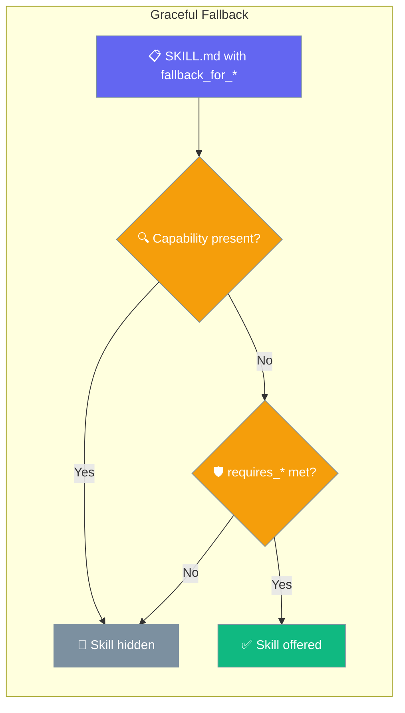
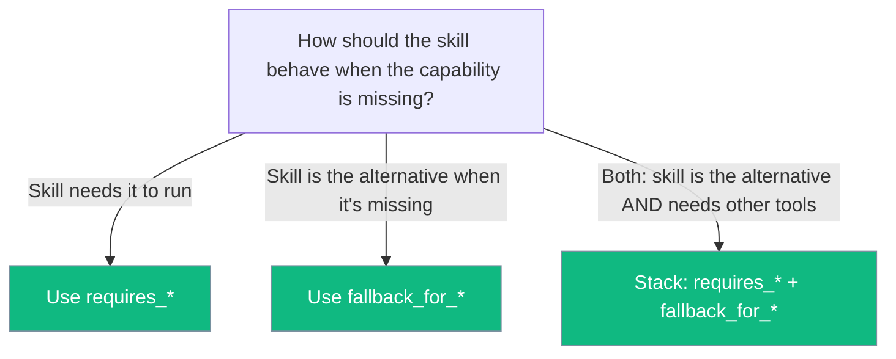

A skill can declare itself a **fallback** for a tool or MCP server — it appears in the agent's skill list only when that capability is absent, so agents with the real tool never see both options.



## Quick Start

<Steps>
<Step title="Agent picks the right path automatically">
```python
from praisonaiagents import Agent
from praisonaiagents.tools import execute_command, search_web

agent = Agent(
    name="Research Assistant",
    instructions="Look things up on the internet.",
    skills=["./skills"],
    tools=[execute_command],   # search_web is NOT registered
)

agent.start("Find the latest Anthropic release notes.")
# → 'web-via-terminal' fallback is offered (search_web absent, execute_command present)

# Register search_web instead and the fallback disappears automatically:
# agent = Agent(..., tools=[search_web])
# → 'web-via-terminal' stays hidden (search_web present → fallback not needed)
```
</Step>

<Step title="Declare a fallback skill in SKILL.md">
```yaml
---
name: web-via-terminal
description: Fetch web content with curl when a dedicated web tool isn't registered.
requires_tools: [execute_command]   # need execute_command to actually run
fallback_for_tools: [search_web]    # only show when 'search_web' is absent
---

# Web-via-terminal instructions
Use `curl -sL <url>` to fetch pages, `curl -I` to inspect headers.
```
</Step>
</Steps>

---

## How It Works

`fallback_for_*` is the **inverse** of `requires_*`. Where `requires_tools: [search_web]` means "I need search_web to run", `fallback_for_tools: [search_web]` means "show me only when search_web is absent".



### Filter sequence

`get_available_skills` applies checks in order:

```
1. requires_* gates      → hide if critical tools/servers missing
2. fallback eligibility  → hide if ANY referenced tool/server is present
3. otherwise             → offer the skill
```

This runs in **all enforcement modes** — not just STRICT — so fallback skills always behave correctly regardless of your enforcement level setting.

---

## Frontmatter Reference

| Frontmatter Key | Aliases | Type | Description |
|---|---|---|---|
| `fallback_for_tools` | `fallback-for-tools` | `list[str]` or string | Tools this skill is a fallback for. Hidden when any listed tool is present. |
| `fallback_for_servers` | `fallback-for-servers` | `list[str]` or string | MCP servers this skill is a fallback for. Hidden when any listed server is present. |

Both **snake_case** and **kebab-case** are accepted, matching the existing `requires_*` convention.

**Value forms** — all of these are equivalent:
```yaml
fallback_for_tools: [web]
fallback_for_tools: "web"
fallback-for-tools: [web, browser]
fallback-for-tools: "web, browser"
```

---

## Common Patterns

### Web tool present → fallback hidden

```yaml
---
name: web-via-terminal
description: Fetch web content with curl when a dedicated web tool isn't registered.
requires_tools: [execute_command]
fallback_for_tools: [search_web]
---
```

```python
from praisonaiagents import Agent
from praisonaiagents.tools import execute_command, search_web

agent = Agent(tools=[search_web], skills=["./skills"])
# → web-via-terminal hidden (search_web is present)

agent = Agent(tools=[execute_command], skills=["./skills"])
# → web-via-terminal offered (search_web absent, execute_command present)
```

### MCP server fallback

```yaml
---
name: notes-via-files
description: Capture notes as plain markdown files when the notes MCP server isn't available.
fallback_for_servers: ["mcp:notes"]
---
```

The skill is offered when `mcp:notes` is absent, hidden when it is connected.

### Stack `requires_*` with `fallback_for_*`

A skill can require one capability **and** be a fallback for another. Both conditions must be satisfied:

```yaml
---
name: db-via-cli
description: Run database queries through the local CLI when no DB MCP server is configured.
requires_tools: [execute_command]       # MUST have execute_command to function
fallback_for_servers: ["mcp:postgres"]  # only show when MCP postgres absent
---
```

```python
# execute_command present + postgres server absent → offered
# execute_command absent                           → hidden (requires_tools fails)
# postgres server present                          → hidden (fallback not needed)
```

---

## Best Practices

<AccordionGroup>

<Accordion title="Inverse of requires_* — same shape, opposite meaning">
`requires_tools: [search_web]` — "I need search_web to run."  
`fallback_for_tools: [search_web]` — "Show me only when search_web is absent."

The two can coexist on the same skill for different capabilities.
</Accordion>

<Accordion title="Filtered at availability time — no budget cost">
Hidden fallback skills never enter the system prompt, never consume context budget, and never compete with the primary capability path.
</Accordion>

<Accordion title="Backward compatible — additive metadata">
Skills without `fallback_for_*` behave exactly as before. Adding the key is safe and non-breaking.
</Accordion>

<Accordion title="Fallback-only skills are treated as having requirements">
A skill with only `fallback_for_*` declared (no `requires_*`) is still treated as having requirements — it won't appear in the skill list when the referenced capability is present. No extra configuration is needed; this works automatically.
</Accordion>

<Accordion title="A fallback that itself needs a missing tool stays hidden">
If your fallback skill declares `requires_tools: [execute_command]` but `execute_command` is absent, the skill stays hidden — even in non-STRICT modes. You'll never see an unusable skill offered to the agent.
</Accordion>

<Accordion title="Don't declare fallback for a capability you also require">
```yaml
# Contradictory — skill will never be offered
requires_tools: [search_web]
fallback_for_tools: [search_web]
```

`requires_tools` hides the skill when `search_web` is absent; `fallback_for_tools` hides it when `search_web` is present. The result is always hidden.
</Accordion>

</AccordionGroup>

---

## Related

<CardGroup cols={2}>
<Card title="Capability Gates" icon="shield-check" href="/docs/features/skill-capability-gates">
Declare and enforce tool, server, and env requirements (`requires_*` gates)
</Card>

<Card title="Agent Skills" icon="puzzle-piece" href="/docs/features/skills">
Learn about the Agent Skills system and how to create skills
</Card>

<Card title="Skill Management" icon="wrench" href="/docs/features/skill-manage">
Manage skills programmatically with the SkillManager API
</Card>

<Card title="Skills vs Tools" icon="scale" href="/docs/features/skills-vs-tools">
Understand when to use skills versus tools for agent capabilities
</Card>
</CardGroup>
