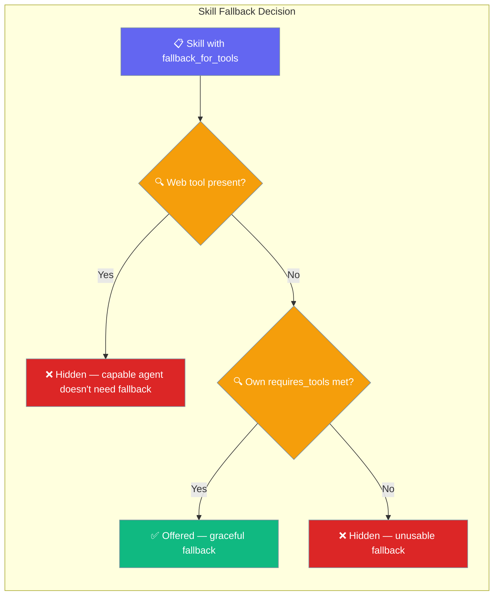
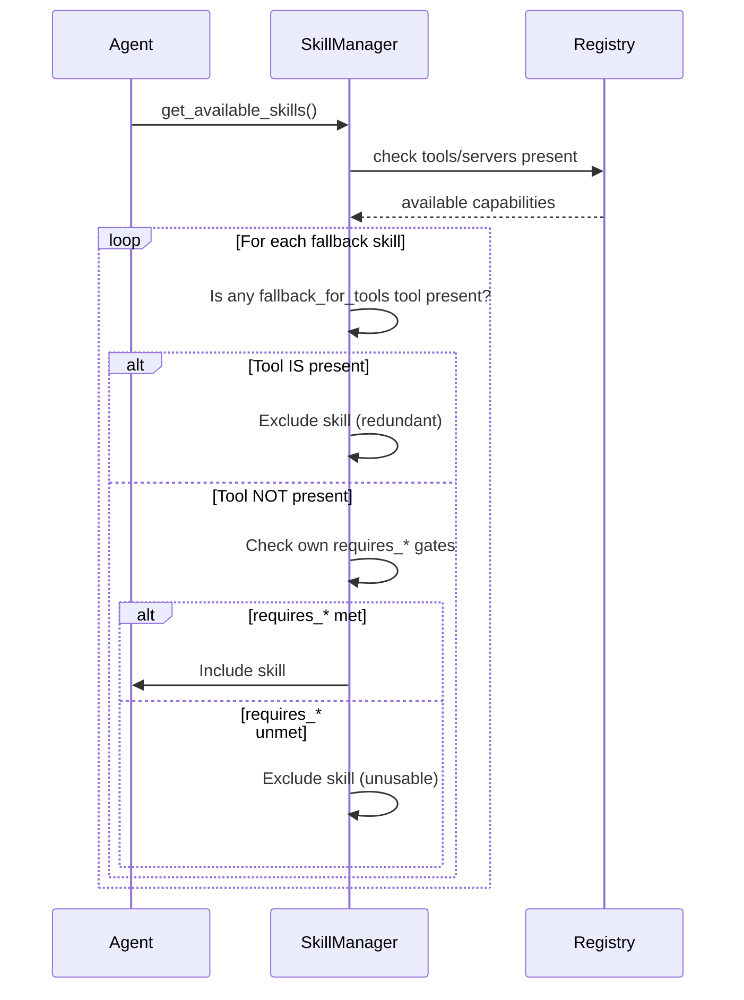

A skill can declare itself a fallback for a tool or server, and it's offered only when that capability is absent.

```python
from praisonaiagents import Agent

agent = Agent(
    name="Researcher",
    instructions="Answer research questions.",
    skills=["./skills/web-via-terminal", "./skills/summarise"],
)
agent.start("Find recent papers on diffusion models.")
```

The fallback declaration lives in the **skill** itself — the agent code doesn't change at all.



## Quick Start

<Steps>
<Step title="Add fallback_for_tools to your SKILL.md">
Create a `SKILL.md` file with the fallback declaration:

```yaml
---
name: web-via-terminal
description: Fetch the web via terminal when no web tool is available.
requires_tools: [terminal]
fallback_for_tools: [web_search, web]
---

# How to fetch the web with curl/wget when no web tool is available

When asked to retrieve a URL, use: curl -sL "<url>"
```

The skill becomes visible only when `web_search` **and** `web` are both absent, and the `terminal` tool is present.
</Step>

<Step title="Use the skill from your Agent">
```python
from praisonaiagents import Agent

agent = Agent(
    name="Researcher",
    instructions="Answer research questions.",
    skills=["./skills/web-via-terminal", "./skills/summarise"],
)

agent.start("Find recent papers on diffusion models.")
```

The agent automatically receives the fallback skill only when it needs it. No code changes required when you add or remove real tools.
</Step>
</Steps>

---

## How It Works



The filter runs in **every enforcement mode** — an unusable fallback is never injected into the prompt regardless of enforcement level.

---

## Decision Table

| Real tool present? | Fallback's own `requires_*` met? | Skill offered? |
|---|---|---|
| ✅ Yes | ✅ Yes | ❌ Hidden — capable agent doesn't need the fallback |
| ✅ Yes | ❌ No | ❌ Hidden |
| ❌ No | ✅ Yes | ✅ Offered — this is the graceful fallback case |
| ❌ No | ❌ No | ❌ Hidden — don't inject an unusable skill |

---

## Frontmatter Reference

| Frontmatter key | Type | Default | Behaviour |
|---|---|---|---|
| `fallback_for_tools` | list of tool names (or single string) | `[]` | Skill is hidden when **any** listed tool is present in the registry. |
| `fallback_for_servers` | list of MCP server names (or single string) | `[]` | Skill is hidden when **any** listed server is present. |
| `fallback-for-tools` | hyphenated alias | — | Identical to `fallback_for_tools`. |
| `fallback-for-servers` | hyphenated alias | — | Identical to `fallback_for_servers`. |
| `requires_tools` | list | `[]` | Composes with fallback — the fallback skill must still satisfy its own gates. |
| `requires_servers` | list | `[]` | Same. |

<Note>
Both underscored (`fallback_for_tools`) and hyphenated (`fallback-for-tools`) forms are accepted and treated identically.
</Note>

---

## Common Patterns

### Web-via-terminal fallback

When no native web tool is available, offer a terminal-based alternative:

```yaml
---
name: web-via-terminal
description: Fetch URLs via curl/wget when no web tool is available.
requires_tools: [terminal]
fallback_for_tools: [web_search, web]
---

# Fetching the web without a web tool

Use: curl -sL "<url>" | head -200
```

### Filesystem-via-shell fallback

When no MCP filesystem server is connected, fall back to shell commands:

```yaml
---
name: filesystem-via-shell
description: Read and write files via shell when no MCP filesystem server is present.
requires_tools: [terminal]
fallback_for_servers: [filesystem, mcp-filesystem]
---

# File operations via shell

Read: cat <path>
Write: echo "<content>" > <path>
List: ls -la <dir>
```

### LLM-only summarise when no scraper

When no scraping tool is available, summarise from context only:

```yaml
---
name: summarise-from-context
description: Summarise content already in context when no scraper tool is available.
fallback_for_tools: [web_scraper, scrape_url]
---

# Summarising without a scraper

Use only the text already provided in the conversation. Do not attempt to fetch URLs.
```

---

## Best Practices

<AccordionGroup>

<Accordion title="Keep fallback instructions tight">
Fallback skills are injected when a real tool is missing. Shorter, focused instructions reduce token usage and avoid confusing the agent.

```yaml
---
name: web-via-terminal
description: Fetch the web via curl when no web tool is present.
requires_tools: [terminal]
fallback_for_tools: [web_search, web]
---

Use: curl -sL "<url>" | head -200
```
</Accordion>

<Accordion title="Always pair fallback_for_tools with requires_tools">
A fallback that can't run is worse than no fallback. Use `requires_tools` to ensure the fallback's own dependencies are met before it's offered.

```yaml
---
name: web-via-terminal
requires_tools: [terminal]           # must have terminal
fallback_for_tools: [web_search]     # only when web_search is absent
---
```

Without `requires_tools: [terminal]`, the skill would be offered even when the terminal tool is also absent — and the agent would try to use instructions it can't execute.
</Accordion>

<Accordion title="One fallback per real tool, not chains">
Avoid creating a chain of fallbacks-of-fallbacks. Pick the simplest fallback and stop there.

```yaml
# Good — one direct fallback
fallback_for_tools: [web_search]

# Avoid — chaining fallbacks adds complexity with minimal gain
# web-via-terminal fallback_for web_search
# web-via-python fallback_for terminal  <-- don't do this
```
</Accordion>

<Accordion title="Test by toggling tools in your agent">
The fastest way to verify your fallback works is to construct an agent with and without the primary tool and check which skills are offered:

```python
from praisonaiagents import Agent

# Agent WITH the real tool — web-via-terminal should be hidden
agent_with_web = Agent(
    name="Researcher",
    instructions="Research assistant.",
    tools=["web_search"],
    skills=["./skills/web-via-terminal"],
)

# Agent WITHOUT the real tool — web-via-terminal should appear
agent_without_web = Agent(
    name="Researcher",
    instructions="Research assistant.",
    skills=["./skills/web-via-terminal"],
)
```
</Accordion>

</AccordionGroup>

---

## Related

<CardGroup cols={2}>
<Card title="Skill Capability Gates" icon="shield-check" href="/docs/features/skill-capability-gates">
The inverse concept — declare what a skill requires to be active
</Card>

<Card title="Agent Skills" icon="puzzle-piece" href="/docs/features/skills">
Learn about the Agent Skills system and how to create SKILL.md files
</Card>

<Card title="Skill Management" icon="wrench" href="/docs/features/skill-manage">
Manage skills programmatically with the SkillManager API
</Card>

<Card title="Doctor CLI" icon="stethoscope" href="/docs/cli/doctor">
Diagnose skill issues with the doctor command
</Card>
</CardGroup>
