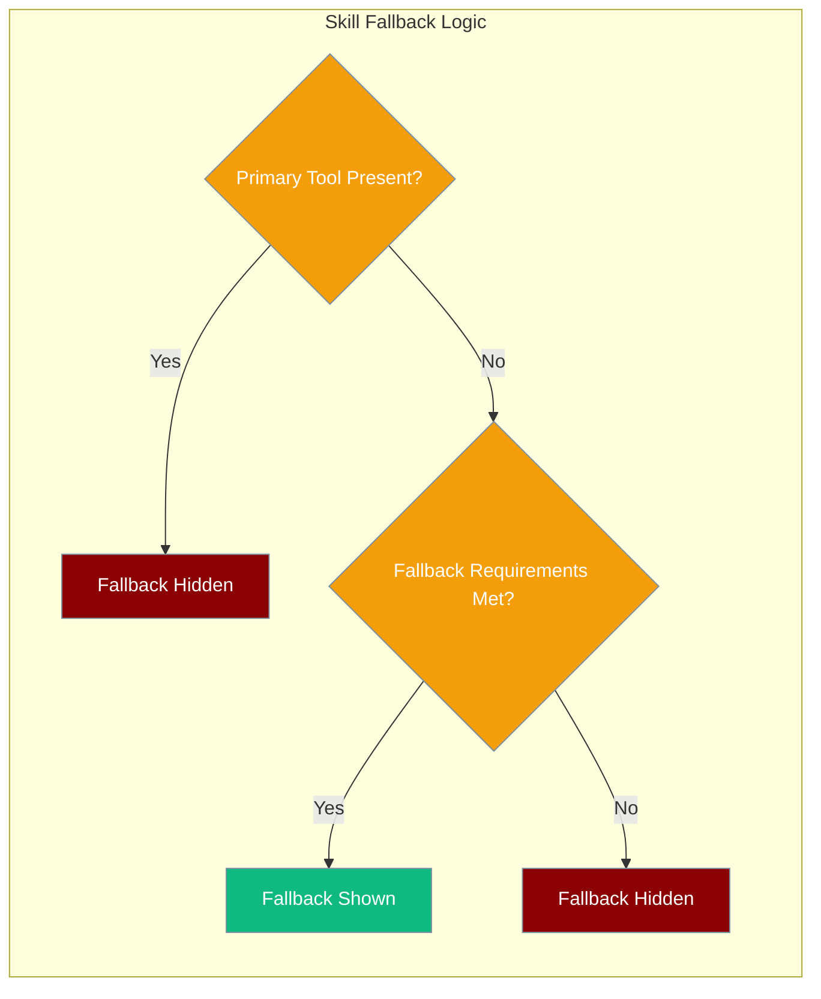
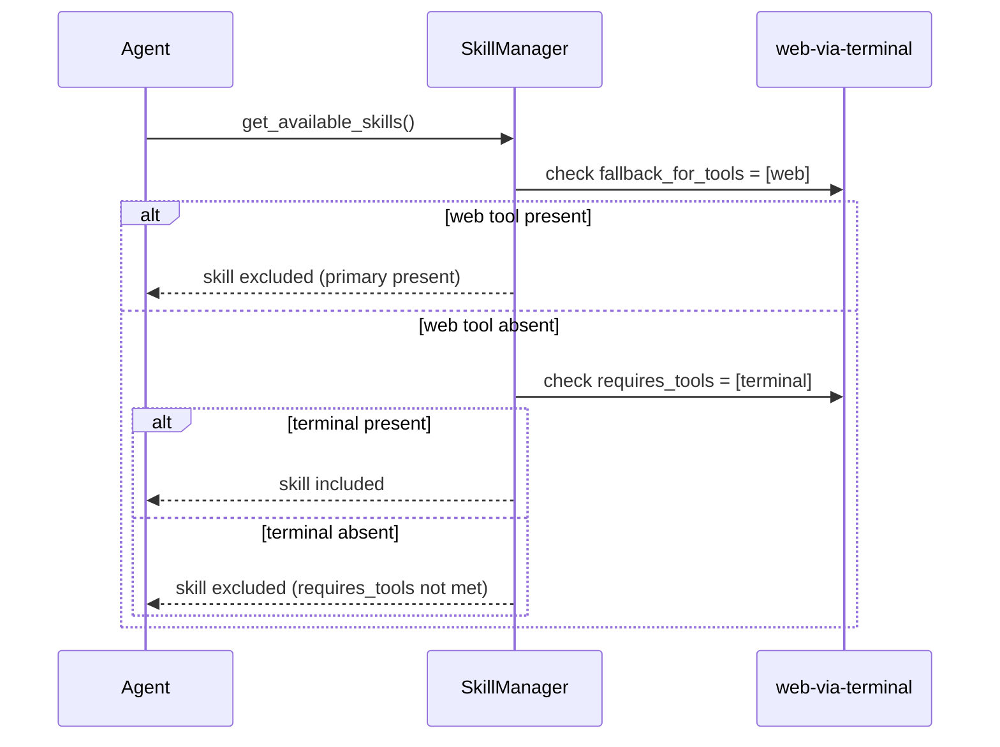

Fallback skills are offered only when a needed tool or MCP server is absent.

```python
from praisonaiagents import Agent

agent = Agent(
    name="Researcher",
    instructions="Answer research questions.",
    skills=["./skills/web-via-terminal", "./skills/summarise"],
)
agent.start("Find recent papers on diffusion models.")
```

The user runs the agent; fallback skills appear in the listing only when required tools or servers are missing.



## Quick Start

<Steps>
<Step title="Declare a fallback in SKILL.md">

Add `fallback_for_tools` or `fallback_for_servers` to the SKILL.md frontmatter:

```yaml
---
name: web-via-terminal
description: Fetch web content using terminal when no web tool is available
requires_tools: [terminal]
fallback_for_tools: [web]
---

# Web via Terminal
When the web tool is absent, use terminal commands like curl to fetch content.
```

The skill appears **only when** the `web` tool is not present, and **only when** `terminal` is available.

</Step>

<Step title="Wire it into an Agent">

```python
from praisonaiagents import Agent

agent = Agent(
    name="Researcher",
    instructions="Find information for the user",
    skills=["./skills/web-via-terminal", "./skills/web-fetch"],
)
agent.start("Look up the latest Python release")
```

- If `web-fetch` provides a `web` tool → `web-via-terminal` is hidden.
- If only `terminal` is available → `web-via-terminal` is offered.

</Step>
</Steps>

---

## How It Works



| Primary tool state | Fallback `requires_*` met? | Skill offered? |
|---|---|---|
| **Present** | Any | No — primary handles it |
| **Absent** | Yes | Yes — fallback steps in |
| **Absent** | No | No — fallback can't run either |

<Note>
The skill's own `requires_tools` / `requires_servers` / `requires_env` gates still apply on top of fallback eligibility. A fallback skill that can't satisfy its own requirements is still excluded.
</Note>

---

## Configuration Options

| Key | Type | Default | Description |
|---|---|---|---|
| `fallback_for_tools` | `list[str]` | `[]` | Skill is offered only when none of these tool names are present. |
| `fallback_for_servers` | `list[str]` | `[]` | Skill is offered only when none of these MCP server names are present. |
| `fallback-for-tools` | `list[str]` | `[]` | Hyphenated alias of `fallback_for_tools`. |
| `fallback-for-servers` | `list[str]` | `[]` | Hyphenated alias of `fallback_for_servers`. |

Both underscore and hyphen forms are accepted. If both are set, the union is used.

---

## Common Patterns

### Web fallback via terminal

When a native `web` tool is absent, let agents use `curl` through the `terminal` tool instead:

```yaml
---
name: web-via-terminal
requires_tools: [terminal]
fallback_for_tools: [web]
---
```

### Local search fallback when no MCP search server is configured

```yaml
---
name: local-grep-search
description: Search local files using grep when no MCP search server is available
requires_tools: [terminal]
fallback_for_servers: [mcp-search-server]
---
```

### Multiple primary tools — fallback hidden unless all are absent

```yaml
---
name: lightweight-pdf-reader
requires_tools: [terminal]
fallback_for_tools: [pdf_read, ocr_extract]
---
```

The fallback is hidden if **any** of `pdf_read` or `ocr_extract` is present.

---

## Best Practices

<AccordionGroup>

<Accordion title="Pair fallback_for_* with requires_*">
A fallback skill that cannot run is still excluded. Always declare the tools the fallback actually needs via `requires_tools` so the skill manager can gate it properly.

```yaml
---
name: web-via-terminal
requires_tools: [terminal]        # needs terminal to run
fallback_for_tools: [web]         # only offered when web is absent
---
```
</Accordion>

<Accordion title="Keep fallback skill outputs self-explanatory">
Fallback skills run in place of a primary capability — their output should be as close as possible to what the primary would produce. Add notes in the skill body describing any known differences.
</Accordion>

<Accordion title="Don't chain fallbacks">
Avoid making a fallback skill declare its own `fallback_for_*` pointing to another fallback skill. The filter logic is applied once during skill discovery and chaining is not resolved automatically.
</Accordion>

<Accordion title="Test with the primary absent and present">
Verify both paths: that the fallback appears when the primary is absent, and that it disappears when the primary is present.

```python
# Without primary tool
agent_no_web = Agent(
    name="Test",
    instructions="Research topics",
    skills=["./skills/web-via-terminal"],  # web tool not loaded
)

# With primary tool loaded — fallback should be hidden
agent_with_web = Agent(
    name="Test",
    instructions="Research topics",
    skills=["./skills/web-via-terminal", "./skills/web-fetch"],
)
```
</Accordion>

</AccordionGroup>

---

## Related

<CardGroup cols={2}>
<Card title="Skill Capability Gates" icon="shield-check" href="/docs/features/skill-capability-gates">
  Declare tool, server, and env requirements — the forward gates that fallbacks complement
</Card>
<Card title="Agent Skills" icon="puzzle-piece" href="/docs/features/skills">
  Overview of the skills system and how to write skills
</Card>
<Card title="Skill Invocation" icon="play" href="/docs/features/skills-invocation">
  How skills are invoked at runtime
</Card>
<Card title="Skill Lifecycle" icon="rotate" href="/docs/features/skill-lifecycle">
  Discover, validate, and activate skills
</Card>
</CardGroup>
