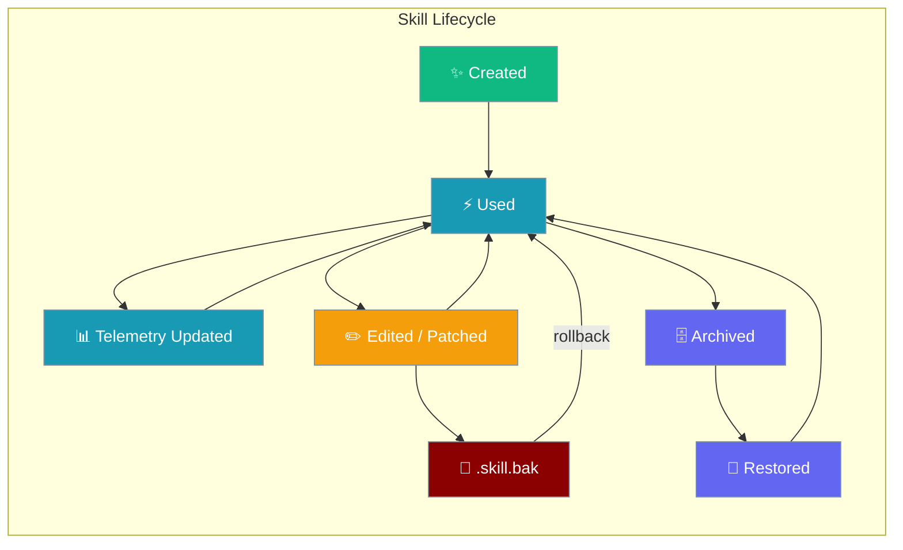
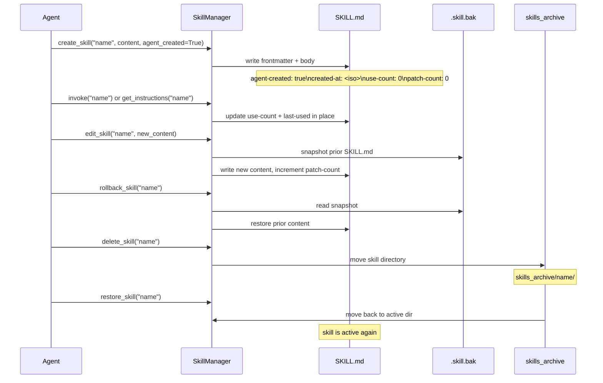

Agent-created skills carry provenance metadata and usage telemetry that lets you track, archive, restore, and roll back skills across their entire lifetime.

```python
from praisonaiagents import Agent

agent = Agent(
    name="Self-Improving Agent",
    instructions="Create skills when you learn something new; archive stale ones.",
    tools=["skill_manage", "skills_list"],
)
agent.start("Learn how to summarise weekly reports, then save that as a skill.")
```



## Quick Start

<Steps>
<Step title="Create a Skill with Provenance">
```python
from praisonaiagents import SkillManager

mgr = SkillManager()
mgr.discover()

# agent_created=True stamps frontmatter with provenance fields
result = mgr.create_skill(
    "csv-analysis",
    "# CSV Analysis\n1. Load with pandas\n2. Clean nulls\n3. Summarise",
    agent_created=True
)
print(result)
# {"success": True, "skill": "csv-analysis", "path": "/path/to/skill"}
```

The resulting `SKILL.md` frontmatter is automatically stamped:
```yaml
---
name: csv-analysis
description: Generated skill
agent-created: true
created-at: "2024-06-24T10:00:00Z"
use-count: 0
last-used: null
patch-count: 0
---
```
</Step>

<Step title="Telemetry Updates on Use">
```python
# Each invoke() or get_instructions() call increments use-count and sets last-used
body = mgr.invoke("csv-analysis", raw_args="sales.csv")

# SKILL.md frontmatter is updated in place:
# use-count: 1
# last-used: "2024-06-24T10:05:00Z"
```
</Step>

<Step title="Recoverable Delete and Restore">
```python
# delete_skill archives by default — the skill is NOT gone
mgr.delete_skill("csv-analysis")
print(mgr.list_archived_skills())  # ["csv-analysis"]

# Bring it back
mgr.restore_skill("csv-analysis")
```
</Step>

<Step title="Rollback a Broken Edit">
```python
# edit_skill and patch_skill save a snapshot before mutating
mgr.edit_skill("csv-analysis", "# CSV Analysis v2\n... broken content ...")

# Undo the last change
result = mgr.rollback_skill("csv-analysis")
print(result)
# {"success": True, "skill": "csv-analysis"}
```
</Step>
</Steps>

---

## How It Works



---

## Frontmatter Fields

Five fields are added to `SKILL.md` frontmatter when `agent_created=True` is passed to `create_skill`, or set manually. The parser accepts both hyphen (`agent-created`) and underscore (`agent_created`) forms.

| Field | Frontmatter Key | Type | Default | Written When |
|-------|----------------|------|---------|--------------|
| `agent_created` | `agent-created` | `bool` | `False` | `create_skill(agent_created=True)` |
| `created_at` | `created-at` | `str` (ISO 8601) | `None` | `create_skill()` call timestamp |
| `use_count` | `use-count` | `int` | `0` | Incremented on each `invoke()` / `get_instructions()` |
| `last_used` | `last-used` | `str` (ISO 8601) | `None` | Set on each `invoke()` / `get_instructions()` |
| `patch_count` | `patch-count` | `int` | `0` | Incremented on each `edit_skill()` / `patch_skill()` |

**Backward-compatible:** Skills without these fields parse fine — all fields default to their zero/`None` values.

**Telemetry only counts successful activations.** If `get_instructions()` returns `None` because the skill failed to activate, `use-count` and `last-used` are **not** updated. A broken skill stays at `use-count: 0`, keeping telemetry trustworthy.

---

## `idle_days` Helper

`SkillProperties.idle_days` returns the number of days since the skill was last meaningfully active.

```python
from praisonaiagents import SkillManager

mgr = SkillManager()
mgr.discover()

skill = mgr.get_skill("csv-analysis")
days = skill.properties.idle_days
# Returns days since last_used, or since created_at if the skill has never been used.
# Returns None when neither last_used nor created_at is set.

if days is not None and days > 30:
    print(f"csv-analysis has been idle for {days:.1f} days — consider archiving")
```

`idle_days` exposes the *data* for lifecycle decisions. The *policy* (what "stale" threshold to apply, when to auto-archive) lives in plugin code, not in core.

---

## Archive / Restore

### Directory Layout

```
~/.praisonai/
├── skills/               # active skills
│   ├── csv-analysis/
│   │   ├── SKILL.md
│   │   └── .skill.bak    # rollback snapshot (after edit/patch)
│   └── weekly-summary/
│       └── SKILL.md
└── skills_archive/       # archived skills (sibling of skills/)
    ├── csv-analysis/
    └── old-formatter.20240624153012/  # collision-suffixed
```

The archive store is always the sibling directory of the first active skills directory (e.g., `<first_skill_dir>/../skills_archive/`).

### Collision Behaviour

If a skill with the same name already exists in `skills_archive/` when archiving, a UTC timestamp suffix is appended: `<name>.<YYYYMMDDHHMMSS>`. This prevents overwriting a previously archived version.

### In-Memory State

`archive_skill()` removes the skill from the in-memory index immediately. After `restore_skill()`, call `discover()` or use the returned path to add it back manually if needed in the same session.

```python
from praisonaiagents import SkillManager

mgr = SkillManager()
mgr.discover()

# Archive
mgr.archive_skill("csv-analysis")
print("csv-analysis" in mgr.skill_names)  # False — removed from index

# Restore
mgr.restore_skill("csv-analysis")
mgr.discover()                             # re-index after restore
print("csv-analysis" in mgr.skill_names)  # True
```

---

## Rollback

`rollback_skill()` is a **single-step undo** of the most recent `edit_skill()` or `patch_skill()` call.


**What saves a snapshot:**
- `edit_skill(name, content)` — always saves prior `SKILL.md`
- `patch_skill(name, old, new)` when `file_path` is `None` or `"SKILL.md"` — saves prior `SKILL.md`

**What does NOT save a snapshot:**
- `patch_skill(name, old, new, file_path="scripts/helper.py")` — modifying a non-SKILL.md file does not create a `.skill.bak`

**Error when no snapshot exists:**
```python
result = mgr.rollback_skill("csv-analysis")
# {"success": False, "error": "No rollback snapshot for skill 'csv-analysis'"}
```

<Warning>
Each new `edit_skill` or `patch_skill` **overwrites** the previous `.skill.bak`. Rollback is single-step only — you cannot roll back through multiple prior versions.
</Warning>

---

## Common Patterns

### Self-Improving Agent Loop

```python
from praisonaiagents import Agent, SkillManager

# Agent creates and improves skills over time
agent = Agent(
    name="Self-Improving Agent",
    instructions="""
    When you learn something new, create a skill for it.
    When a skill becomes outdated, archive it.
    """,
    tools=["skill_manage", "skills_list"]
)

# The agent's skill_manage calls automatically:
# 1. stamp created-at, use-count, patch-count on creation
# 2. increment use-count on each use
# 3. archive (not delete) when retiring a skill
agent.start("Learn how to summarise weekly reports, then use that knowledge.")
```

### Safe Edit-with-Rollback Wrapper

```python
from praisonaiagents import SkillManager

mgr = SkillManager()
mgr.discover()

def safe_edit(skill_name: str, new_content: str) -> bool:
    result = mgr.edit_skill(skill_name, new_content)
    if not result["success"]:
        print(f"Edit failed: {result['error']}")
        return False

    # Verify the skill still activates correctly
    instructions = mgr.get_instructions(skill_name)
    if instructions is None:
        print("Skill broken after edit — rolling back")
        mgr.rollback_skill(skill_name)
        return False

    return True

safe_edit("csv-analysis", "# CSV Analysis v2\nImproved steps...")
```

### Inspect Telemetry from a Curator Script

```python
from praisonaiagents import SkillManager

mgr = SkillManager()
mgr.discover()

STALE_THRESHOLD_DAYS = 30

for skill in mgr.skills:
    props = skill.properties
    idle = props.idle_days

    print(f"{props.name}:")
    print(f"  agent-created : {getattr(props, 'agent_created', False)}")
    print(f"  use-count     : {getattr(props, 'use_count', 0)}")
    print(f"  last-used     : {getattr(props, 'last_used', None)}")
    print(f"  patch-count   : {getattr(props, 'patch_count', 0)}")
    print(f"  idle-days     : {idle}")

    if idle is not None and idle > STALE_THRESHOLD_DAYS:
        print(f"  → STALE: archiving")
        mgr.archive_skill(props.name)
```

---

## Best Practices

<AccordionGroup>
<Accordion title="Trust the Recoverable Default">
`delete_skill()` archives by default. Only pass `hard=True` when you mean it. The archive store lets you recover skills that were accidentally retired.
</Accordion>

<Accordion title="Don't Chain Edits Expecting Multi-Step Undo">
Each `edit_skill` or `patch_skill` overwrites `.skill.bak`. If you need to preserve multiple prior versions, copy `SKILL.md` externally before each edit, or use a version control system for the skills directory.
</Accordion>

<Accordion title="Telemetry Counts Successful Activations Only">
`get_instructions()` returns `None` when a skill fails to activate, and in that case `use-count` and `last-used` are not updated. A skill that is broken will not appear to be active in your telemetry — safe to archive without inflating its apparent usage.
</Accordion>

<Accordion title="Curator Policy Belongs in Plugins">
`idle_days` and the provenance fields expose the *data* needed to make lifecycle decisions. The *policy* — what idle threshold triggers archiving, whether agent-created skills get different treatment — belongs in plugin code or your own scripts, not in application code. This keeps core behaviour predictable.
</Accordion>

<Accordion title="Verify After Restore">
After `restore_skill()`, call `mgr.discover()` (or `mgr.add_skill(path)`) to re-index the skill in the current session. `restore_skill()` moves the directory but does not automatically re-add it to the in-memory index.
</Accordion>
</AccordionGroup>

---

## Related

<CardGroup cols={2}>
<Card title="Skill Manage" icon="wand-magic-sparkles" href="/docs/features/skill-manage">
  Create, edit, patch, archive, and delete skills — full action reference
</Card>
<Card title="Agent Skills" icon="puzzle-piece" href="/docs/features/skills">
  Load specialised knowledge from SKILL.md files
</Card>
</CardGroup>
