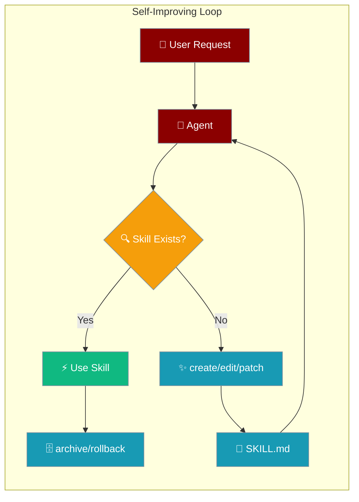
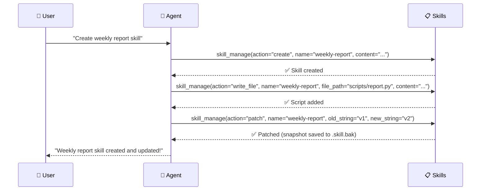

Self-improving skills enable agents to create, edit, and manage their own capabilities dynamically, learning from user interactions and building persistent knowledge.



## Quick Start

<Steps>
<Step title="Enable Skill Management">
```python
from praisonaiagents import Agent

agent = Agent(
    name="Skill Builder",
    instructions="When users teach you something, save it as a skill for next time.",
    tools=["skill_manage", "skills_list", "skill_view"]  # auto-injected in bots
)

agent.start("Create a skill called 'weekly-summary' that summarises the week's work.")
```
</Step>

<Step title="Agent Learns and Improves">
```python
# Agent creates skills automatically from user interactions
# User: "Create a weekly summary skill"
# Agent calls: skill_manage(action="create", name="weekly-summary", content="...")

# Later interaction
# User: "Update the summary to include metrics"
# Agent calls: skill_manage(action="patch", name="weekly-summary", old_string="...", new_string="...")
```
</Step>

<Step title="Archive and Recover Skills">
```python
from praisonaiagents import SkillManager

mgr = SkillManager()
mgr.discover()

# Archive a skill instead of permanently deleting it
mgr.delete_skill("weekly-summary")          # archives by default (recoverable)
mgr.restore_skill("weekly-summary")         # bring it back

# Or use archive/restore directly
mgr.archive_skill("csv-analysis")
archived = mgr.list_archived_skills()       # ["csv-analysis"]
mgr.restore_skill("csv-analysis")
```
</Step>
</Steps>

---

## How It Works



The skill management system provides ten actions for runtime skill manipulation:

| Action | Purpose | Security Constraints |
|--------|---------|---------------------|
| **create** | Create new skills | 100KB SKILL.md limit, name validation |
| **edit** | Replace skill content | Preserves frontmatter, atomic writes |
| **patch** | Targeted find/replace | String matching, traversal protection |
| **delete** | Archive by default (recoverable) | Calls archive; use `hard=True` for permanent removal |
| **write_file** | Add skill resources | 1MB limit, allowed subdirs only |
| **remove_file** | Delete skill files | Containment checks, safe removal |
| **archive** | Move skill to archive store | Collision-safe with timestamp suffix |
| **restore** | Return archived skill to active | Moves back to first skills directory |
| **list_archived** | List archived skills | Returns sorted list of names |
| **rollback** | Undo last edit/patch | Single-step undo via `.skill.bak` |

---

## Configuration Options

### Skill Management Actions

| Action | Required Args | Optional Args | What it does |
|--------|---------------|---------------|--------------|
| `create` | `name`, `content` | `category`, `agent_created` | Create a new skill with SKILL.md body |
| `edit` | `name`, `content` | — | Replace an existing skill's SKILL.md body |
| `patch` | `name`, `old_string`, `new_string` | `file_path`, `replace_all` | Fuzzy find-and-replace within a skill file |
| `delete` | `name` | `hard` | **Archives by default** (recoverable). Pass `hard=True` for permanent removal |
| `write_file` | `name`, `file_path`, `file_content` | — | Add/overwrite a file inside the skill |
| `remove_file` | `name`, `file_path` | — | Delete a file from within the skill |
| `archive` | `name` | — | Move the skill to the recoverable archive store |
| `restore` | `name` | `skill_dir` | Bring an archived skill back into active use |
| `list_archived` | — | — | List names of archived skills |
| `rollback` | `name` | — | Undo the most recent `edit`/`patch` (single-step) |

<Warning>
**Behaviour change in `delete_skill()`:** Without `hard=True`, `delete_skill()` now **archives** the skill instead of permanently removing it. Existing callers without the `hard` kwarg silently get the new safer default.

```python
# Before — permanent removal
mgr.delete_skill("weekly-summary")

# After — archives by default (recoverable)
mgr.delete_skill("weekly-summary")            # same call, now archives
mgr.restore_skill("weekly-summary")           # undo the delete

# Permanent removal (legacy behaviour)
mgr.delete_skill("weekly-summary", hard=True)
```
</Warning>

### Python API Reference

All skill management methods return a consistent response format:

**Success Response:**
```python
{"success": True, "skill": "skill-name", ...}  # Additional fields vary by method
```

**Failure Response:**
```python
{"success": False, "error": "Error message"}
```

**Method Examples:**
```python
from praisonaiagents import SkillManager

mgr = SkillManager()
mgr.discover()

# Create new skills
result = mgr.create_skill("weekly-summary", "# Weekly Summary\nSteps...", category="reporting")
# Returns: {"success": True, "skill": "weekly-summary", "path": "/path/to/skill"}

# Create as agent-authored (stamps provenance in frontmatter)
result = mgr.create_skill("auto-report", "# Auto Report\n...", agent_created=True)
# Frontmatter gains: agent-created: true, created-at: <iso>, use-count: 0, patch-count: 0

# Edit existing skills
result = mgr.edit_skill("weekly-summary", "# Weekly Summary v2\n...")
# Returns: {"success": True, "skill": "weekly-summary"}
# Saves prior SKILL.md to .skill.bak for rollback

# Apply targeted patches
result = mgr.patch_skill("weekly-summary", old_string="v2", new_string="v3")
# Returns: {"success": True, "skill": "weekly-summary", "replacements": 1}
# Saves prior SKILL.md to .skill.bak for rollback

# Manage skill files
result = mgr.write_skill_file("weekly-summary", "scripts/report.py", "print('Weekly report')")
result = mgr.remove_skill_file("weekly-summary", "scripts/report.py")

# Archive a skill (recoverable)
result = mgr.archive_skill("weekly-summary")
# Returns: {"success": True, "skill": "weekly-summary", "archive_path": "..."}

# List archived skills
names = mgr.list_archived_skills()
# Returns: ["old-skill", "weekly-summary"]  (sorted)

# Restore from archive
result = mgr.restore_skill("weekly-summary")
# Returns: {"success": True, "skill": "weekly-summary", "path": "..."}

# Restore to a specific directory
result = mgr.restore_skill("weekly-summary", skill_dir="/custom/skills")

# Rollback last edit or patch
result = mgr.rollback_skill("weekly-summary")
# Returns: {"success": True, "skill": "weekly-summary"}
# Error if no snapshot: {"success": False, "error": "No rollback snapshot for skill 'weekly-summary'"}

# Delete (archives by default)
result = mgr.delete_skill("weekly-summary")
# Returns: {"success": True, "skill": "weekly-summary", "archive_path": "..."}

# Permanent delete (legacy hard-delete)
result = mgr.delete_skill("weekly-summary", hard=True)
# Returns: {"success": True, "skill": "weekly-summary", "path": "..."}
```

### Security Guards

| Guard | Purpose | Implementation |
|-------|---------|----------------|
| **Size Limits** | Prevent resource exhaustion | 100KB SKILL.md, 1MB files |
| **Name Validation** | Secure identifiers | `[a-z0-9][a-z0-9._-]*` pattern, 64 char limit |
| **Path Validation** | Prevent traversal | Block `..`, absolute paths, encoded attacks |
| **Atomic Writes** | Prevent corruption | Temp file + rename operations |
| **Allowed Subdirs** | Restrict file placement | `references/`, `templates/`, `scripts/`, `assets/` only |

---

## Storage Location & Precedence

Skills are stored in directories according to this precedence order (highest to lowest):

1. **Project:** `./.praisonai/skills/` (centralized) — and `./.claude/skills/` for compatibility
2. **Ancestor walk:** any `.praisonai/skills` or `.claude/skills` in parent directories (monorepo support)
3. **User:** `~/.praisonai/skills/`
4. **System (Unix):** `/etc/praison/skills/`

When creating new skills, they are written to the **first existing** directory in this list. If none exist, the system falls back to creating `~/.praisonai/skills/`.

**Archive store:** Archived skills are moved to `<first_skill_dir>/../skills_archive/`. For example, if active skills live in `~/.praisonai/skills/`, the archive store is `~/.praisonai/skills_archive/`. If archiving a skill whose name already exists in the archive, a UTC timestamp suffix is appended (e.g., `weekly-summary.20240624153012`).

<Note>
The current documentation incorrectly states that skills are stored "in `~/.praisonai/skills/` by default". This is only the **fallback** location, not the actual default behavior.
</Note>

---

## Validation Rules

Each skill management operation enforces security constraints:

| Operation | Validation Rules |
|-----------|------------------|
| **create_skill/edit_skill** | Name: `^[a-z0-9][a-z0-9._-]*$`, ≤64 chars<br/>Content: ≤100KB |
| **patch_skill** | Path traversal protection (`..`, absolute paths)<br/>String must exist in target file |
| **write_skill_file** | File size: ≤1MB<br/>Allowed subdirs: `references/`, `templates/`, `scripts/`, `assets/` only<br/>Path traversal protection |
| **remove_skill_file** | Path must be within skill directory<br/>File must exist |
| **delete_skill** | Skill must exist and have valid path; archives by default |
| **rollback_skill** | `.skill.bak` snapshot must exist for the skill |

---

## Common Patterns

### Complete Agent Learning Example

```python
from praisonaiagents import Agent

agent = Agent(
    name="Learning Assistant",
    instructions="When users teach you something, save it as a persistent skill using skill_manage.",
    tools=["skill_manage", "skills_list", "skill_view"]
)

# User teaches the agent
response = agent.start("Here's how to analyze CSV files: load with pandas, check for nulls, then create summary stats")

# Agent automatically calls:
# skill_manage(action="create", name="csv-analysis", content="# CSV Analysis\n1. Load with pandas...")
# Response: {"success": True, "skill": "csv-analysis", "path": "/path/to/skill"}

print("Agent learned and persisted the skill!")
```

### Safe Edit with Rollback

```python
from praisonaiagents import SkillManager

mgr = SkillManager()
mgr.discover()

# Edit a skill (snapshot saved automatically)
result = mgr.edit_skill("csv-analysis", "# CSV Analysis v2\nUpdated steps...")

if result["success"]:
    # If the new version doesn't work out, roll back
    rollback = mgr.rollback_skill("csv-analysis")
    print("Reverted to previous version:", rollback)
```

### Archive Stale Skills

```python
from praisonaiagents import SkillManager

mgr = SkillManager()
mgr.discover()

# Archive skills that are no longer needed (recoverable)
mgr.archive_skill("old-reporting-skill")
mgr.archive_skill("deprecated-formatter")

# See what's archived
print(mgr.list_archived_skills())  # ["deprecated-formatter", "old-reporting-skill"]

# Restore one if needed
mgr.restore_skill("old-reporting-skill")
```

### Skill Evolution

```python
# Agent improves existing skills based on feedback
# User: "The CSV skill should also handle missing headers"
# Agent calls:
# skill_manage(action="patch", name="csv-analysis",
#              old_string="2. Clean nulls",
#              new_string="2. Handle missing headers\n3. Clean nulls")
```

---

## Troubleshooting

<Warning>
**ImportError Fix:** If you see `ImportError: cannot import name 'get_default_skill_directories'`, upgrade `praisonaiagents` — this was fixed in [MervinPraison/PraisonAI#1687](https://github.com/MervinPraison/PraisonAI/pull/1687). The function was renamed from `get_default_skill_directories` to `get_default_skill_dirs`.
</Warning>

---

## Best Practices

<AccordionGroup>
<Accordion title="Use the Recoverable Default">
`delete_skill()` archives rather than permanently removes. Only pass `hard=True` when you explicitly intend permanent destruction. This protects against accidental data loss.
</Accordion>

<Accordion title="Single-Step Undo Only">
`rollback_skill()` undoes only the most recent `edit_skill` or `patch_skill`. Each new mutation overwrites the previous snapshot. If you need multi-step undo, implement versioning externally before calling `edit_skill`.
</Accordion>

<Accordion title="Security-First Design">
All skill operations are workspace-contained and use atomic writes via temp files. Never bypass name validation or path checks. Skills inherit workspace security automatically.
</Accordion>

<Accordion title="Progressive Learning">
Start with simple skills and let agents enhance them through patch operations. This creates more natural learning patterns than full rewrites, and keeps `.skill.bak` snapshots useful for quick rollback.
</Accordion>

<Accordion title="Error Handling">
All skill operations return detailed JSON results with success flags and error messages. Always check `result["success"]` before proceeding.
</Accordion>
</AccordionGroup>

---

## Related

<CardGroup cols={2}>
<Card title="Skill Lifecycle" icon="rotate" href="/docs/features/skill-lifecycle">
  Provenance, telemetry, archive/restore, and rollback for agent-created skills
</Card>
<Card title="Skills (Concepts)" icon="puzzle-piece" href="/docs/concepts/skills">
  Understanding what skills are and how they work
</Card>
<Card title="Workspace" icon="folder-lock" href="/docs/features/workspace">
  How workspace containment secures skill operations
</Card>
<Card title="Skill Capability Gates" icon="shield-check" href="/docs/features/skill-capability-gates">
  Capability requirements and enforcement for skills
</Card>
</CardGroup>
