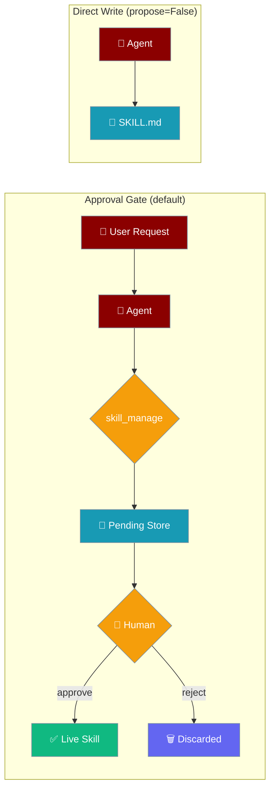
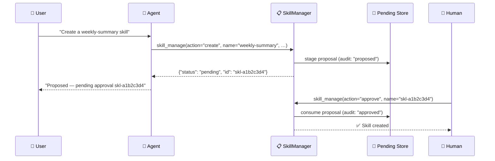
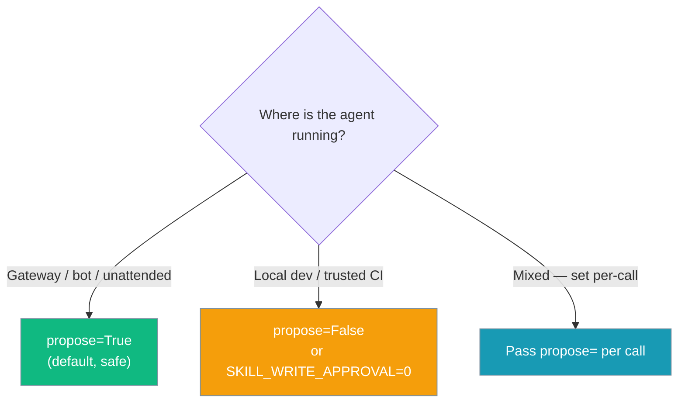

Self-improving skills enable agents to create, edit, and manage their own capabilities dynamically — with mutations staged for human approval before they touch disk.

```python
from praisonaiagents import Agent

agent = Agent(
    name="Skill Builder",
    instructions="When users teach you something, save it as a skill for next time.",
    tools=["skill_manage", "skills_list", "skill_view"],
)
agent.start("Create a skill called 'weekly-summary' that summarises the week's work.")
```

<Tip>
To trigger skill creation **automatically** after every task instead of having the model call `skill_manage` on its own, see [Self-Improving Agents](/docs/features/self-improve).
</Tip>



<Note>
**Safe-by-default since PR #2236.** Every mutation (`create`, `edit`, `patch`, `delete`, `write_file`, `remove_file`) is now **staged for human approval** by default. The agent receives `{"status": "pending", "id": "skl-…"}` instead of writing to disk. Pass `propose=False` to restore direct-write behaviour in trusted/local contexts.
</Note>

## Quick Start

<Steps>
<Step title="Agent proposes a skill (default behaviour)">
```python
from praisonaiagents import Agent

agent = Agent(
    name="Skill Builder",
    instructions="When users teach you something, save it as a skill for next time.",
    tools=["skill_manage", "skills_list", "skill_view"]
)

agent.start("Create a skill called 'weekly-summary' that summarises the week's work.")
# Agent calls skill_manage(action="create", name="weekly-summary", content="...")
# Tool returns: {"status": "pending", "id": "skl-a1b2c3d4"}
# Agent replies: "Proposed — pending approval skl-a1b2c3d4"
```
</Step>

<Step title="Human reviews and approves">
```python
from praisonaiagents import SkillManager

mgr = SkillManager()

# See what's waiting
mgr.list_pending()
# [{'id': 'skl-a1b2c3d4', 'action': 'create', 'name': 'weekly-summary', 'status': 'pending', 'created_at': '...'}]

# Apply the mutation
mgr.approve("skl-a1b2c3d4")
# {"success": True, "skill": "weekly-summary"}

# — or discard it —
mgr.reject("skl-a1b2c3d4")
```
</Step>

<Step title="Direct write (trusted/local contexts only)">
```python
from praisonaiagents import Agent

agent = Agent(
    name="Skill Builder",
    instructions="Save skills immediately when users teach you something.",
    tools=["skill_manage", "skills_list", "skill_view"]
)

# Bypass the approval gate — writes straight to disk
agent.start("Create a skill called 'csv-analysis' … [propose=False]")
```
</Step>

<Step title="Archive and recover skills">
```python
from praisonaiagents import SkillManager

mgr = SkillManager()
mgr.discover()

mgr.delete_skill("weekly-summary")          # archives by default (recoverable)
mgr.restore_skill("weekly-summary")

mgr.archive_skill("csv-analysis")
archived = mgr.list_archived_skills()       # ["csv-analysis"]
mgr.restore_skill("csv-analysis")
```
</Step>
</Steps>

---

## Approval Gate (safe-by-default)

Every mutation is staged by default so a human can review it before it becomes a live skill. The agent sees a `pending` response; you approve or reject via the `SkillManager` API or the `skill_manage` tool.



### When to use `propose=False`



---

## How It Works

The skill management system provides six mutation actions, three approval actions, and four lifecycle actions:

| Action | Purpose | Staged by default? |
|--------|---------|-------------------|
| **create** | Create new skills | ✅ Yes |
| **edit** | Replace skill content | ✅ Yes |
| **patch** | Targeted find/replace | ✅ Yes |
| **delete** | Archive by default (recoverable) | ✅ Yes |
| **write_file** | Add skill resources | ✅ Yes |
| **remove_file** | Delete skill files | ✅ Yes |
| **archive** | Move skill to archive store | ✅ Yes |
| **restore** | Return archived skill to active | ✅ Yes |
| **list_archived** | List archived skills | — (read-only) |
| **rollback** | Undo last edit/patch | ✅ Yes |
| **pending** | List staged mutations | — (read-only) |
| **approve** | Apply a staged mutation | — (approval action) |
| **reject** | Discard a staged mutation | — (approval action) |

---

## Configuration

### Constructor & environment

| Option | Type | Default | Description |
|--------|------|---------|-------------|
| `SkillManager(write_approval=...)` | `bool \| None` | `None` (env-resolved) | Per-instance override for staging policy |
| `SKILL_WRITE_APPROVAL` env var | `str` | `1` (true) | Set to `0`/`false`/`off`/`no`/`disabled` to disable staging by default |
| `SKILL_MAX_PENDING` env var | `int` | `100` | Maximum pending proposals before new ones are rejected |
| `propose` (per call) | `bool \| None` | `None` (inherits) | `True` → stage; `False` → write directly; `None` → use manager default |

**Precedence:** explicit `propose=` arg > `SkillManager(write_approval=...)` > `SKILL_WRITE_APPROVAL` env var > default `True`

```python
import os
os.environ["SKILL_WRITE_APPROVAL"] = "0"   # disable staging globally

from praisonaiagents import SkillManager

# Per-instance override
mgr = SkillManager(write_approval=True)     # always stage, regardless of env

# Per-call override
mgr.create_skill("my-skill", "# content", propose=False)  # write directly this once
```

### Skill management actions

| Action | Required Args | Optional Args | What it does |
|--------|---------------|---------------|--------------|
| `create` | `name`, `content` | `category`, `propose` | Create a new skill (staged by default) |
| `edit` | `name`, `content` | `propose` | Replace an existing skill's SKILL.md body |
| `patch` | `name`, `old_string`, `new_string` | `file_path`, `replace_all`, `propose` | Fuzzy find-and-replace within a skill file |
| `delete` | `name` | `hard`, `propose` | Archives by default; pass `hard=True` for permanent removal |
| `write_file` | `name`, `file_path`, `file_content` | `propose` | Add/overwrite a file inside the skill |
| `remove_file` | `name`, `file_path` | `propose` | Delete a file from within the skill |
| `archive` | `name` | `propose` | Move the skill to the recoverable archive store |
| `restore` | `name` | `skill_dir`, `propose` | Bring an archived skill back into active use |
| `list_archived` | — | — | List names of archived skills |
| `rollback` | `name` | `propose` | Undo the most recent `edit`/`patch` (single-step) |
| `pending` | — | `name` (filter) | Returns list of staged mutations |
| `approve` | `name` (id or skill name) | — | Apply the staged mutation |
| `reject` | `name` (id or skill name) | — | Discard the staged mutation |

---

## Python API Reference

### Response shapes

**Staged (default) — `propose=True`:**
```python
{
    "success": True,
    "status": "pending",
    "id": "skl-a1b2c3d4",   # short id for approve/reject
    "action": "create",
    "skill": "weekly-summary",
}
```

**Direct write — `propose=False`:**
```python
{"success": True, "skill": "weekly-summary", "path": "/path/to/skill"}
```

**Failure (either mode):**
```python
{"success": False, "error": "Error message"}
```

### Mutation methods

```python
from praisonaiagents import SkillManager

mgr = SkillManager()
mgr.discover()

# --- CREATE ---
# Default (staged):
mgr.create_skill("weekly-summary", "# Weekly Summary\nSteps...", category="reporting")
# → {"success": True, "status": "pending", "id": "skl-a1b2c3d4", "action": "create", "skill": "weekly-summary"}

# Direct write (trusted contexts only):
mgr.create_skill("weekly-summary", "# Weekly Summary\nSteps...", category="reporting", propose=False)
# → {"success": True, "skill": "weekly-summary", "path": "/path/to/skill"}

# --- EDIT ---
mgr.edit_skill("weekly-summary", "# Weekly Summary v2\n...")
# → {"success": True, "status": "pending", "id": "skl-b2c3d4e5", "action": "edit", "skill": "weekly-summary"}

mgr.edit_skill("weekly-summary", "# Weekly Summary v2\n...", propose=False)
# → {"success": True, "skill": "weekly-summary"}

# --- PATCH ---
mgr.patch_skill("weekly-summary", old_string="v2", new_string="v3")
# → {"success": True, "status": "pending", "id": "skl-c3d4e5f6", "action": "patch", "skill": "weekly-summary"}

mgr.patch_skill("weekly-summary", old_string="v2", new_string="v3", propose=False)
# → {"success": True, "skill": "weekly-summary", "replacements": 1}

# --- DELETE ---
mgr.delete_skill("weekly-summary")
# → {"success": True, "status": "pending", "id": "skl-d4e5f6g7", "action": "delete", "skill": "weekly-summary"}

mgr.delete_skill("weekly-summary", propose=False)
# → {"success": True, "skill": "weekly-summary", "path": "/path/to/skill"}

# --- WRITE_FILE ---
mgr.write_skill_file("weekly-summary", "scripts/report.py", "print('Weekly report')")
# → {"success": True, "status": "pending", "id": "skl-e5f6g7h8", "action": "write_file", "skill": "weekly-summary"}

mgr.write_skill_file("weekly-summary", "scripts/report.py", "print('Weekly report')", propose=False)
# → {"success": True, "skill": "weekly-summary", "file": "scripts/report.py"}

# --- REMOVE_FILE ---
mgr.remove_skill_file("weekly-summary", "scripts/report.py")
# → {"success": True, "status": "pending", "id": "skl-f6g7h8i9", "action": "remove_file", "skill": "weekly-summary"}

mgr.remove_skill_file("weekly-summary", "scripts/report.py", propose=False)
# → {"success": True, "skill": "weekly-summary", "file": "scripts/report.py"}

# --- ARCHIVE / RESTORE / ROLLBACK ---
mgr.archive_skill("weekly-summary", propose=False)
mgr.list_archived_skills()  # ["weekly-summary"]
mgr.restore_skill("weekly-summary", propose=False)
mgr.rollback_skill("weekly-summary", propose=False)  # undo last edit/patch via .skill.bak
```

### Approval state machine

```python
from praisonaiagents import SkillManager

mgr = SkillManager()

# List pending proposals
pending = mgr.list_pending()
# [{'id': 'skl-a1b2c3d4', 'action': 'create', 'name': 'weekly-summary', 'status': 'pending', 'created_at': '2026-06-24T11:00:00Z'}]

# Approve by ID (preferred) or skill name (most-recent-wins fallback)
mgr.approve("skl-a1b2c3d4")   # by ID
mgr.approve("weekly-summary")  # by skill name

# Reject by ID or skill name
mgr.reject("skl-a1b2c3d4")
mgr.reject("weekly-summary")
```

### `SkillMutatorProtocol` aliases

`SkillManager` conforms to `SkillMutatorProtocol`. Short-form aliases are available alongside the `_skill` methods:

| Alias | Long form |
|-------|-----------|
| `mgr.create(name, content, category=None, propose=None)` | `mgr.create_skill(...)` |
| `mgr.edit(name, content, propose=None)` | `mgr.edit_skill(...)` |
| `mgr.patch(name, old, new, file_path=None, replace_all=False, propose=None)` | `mgr.patch_skill(...)` |
| `mgr.delete(name, propose=None)` | `mgr.delete_skill(...)` |
| `mgr.write_file(name, file_path, file_content, propose=None)` | `mgr.write_skill_file(...)` |
| `mgr.remove_file(name, file_path, propose=None)` | `mgr.remove_skill_file(...)` |

```python
from praisonaiagents import SkillManager

mgr = SkillManager()

# Short-form aliases — same methods as create_skill, edit_skill, etc.
mgr.create("weekly-summary", "# Weekly Summary\nSteps...")
mgr.patch("weekly-summary", old_string="v1", new_string="v2", propose=False)
```

---

## Pending Store & Audit Log

Both artefacts live under the user-owned skills base directory (honouring `PRAISONAI_HOME`):

| Path | Format | Purpose |
|------|--------|---------|
| `<skills_dir>/.pending_skills.json` | JSON map `{id: record}` | Staged mutations awaiting approval |
| `<skills_dir>/.skill_audit.log` | JSON-lines | Append-only audit: `proposed` / `approved` / `approval_failed` / `rejected` events |

**Pending record shape:**
```json
{
  "id": "skl-a1b2c3d4",
  "action": "create",
  "name": "weekly-summary",
  "status": "pending",
  "created_at": "2026-06-24T11:00:00Z",
  "payload": { … }
}
```

**Audit log line:**
```json
{"event": "approved", "timestamp": "2026-06-24T11:05:00Z", "id": "skl-a1b2c3d4", "action": "create", "name": "weekly-summary"}
```

<Note>
`approve` only consumes the pending record and audits "approved" if the apply succeeds. On failure, the record is kept and the audit logs "approval_failed" so you can retry.
</Note>

---

## Storage Location

<Note>
**Base-dir change (PR #2236):** `create_skill` now always writes to the user-owned `get_skills_dir()` (which honours `PRAISONAI_HOME`). Previously it could fall back to an admin-managed location like `/etc/praison/skills`. Set `PRAISONAI_HOME` to control where skills land.
</Note>

Skills are stored in directories according to this precedence order (highest to lowest):

1. **Project:** `./.praisonai/skills/` — and `./.claude/skills/` for compatibility
2. **Ancestor walk:** any `.praisonai/skills` or `.claude/skills` in parent directories
3. **User:** `~/.praisonai/skills/` (or `$PRAISONAI_HOME/skills/`)
4. **System (Unix):** `/etc/praison/skills/`

**Archive store:** Archived skills are moved to `<first_skill_dir>/../skills_archive/`. If a name already exists in the archive, a UTC timestamp suffix is appended (e.g. `weekly-summary.20240624153012`).

---

## Security Guards

| Guard | Purpose | Implementation |
|-------|---------|----------------|
| **Size Limits** | Prevent resource exhaustion | 100KB SKILL.md, 1MB files |
| **Name Validation** | Secure identifiers | `[a-z0-9][a-z0-9._-]*` pattern, 64 char limit |
| **Path Validation** | Prevent traversal | Block `..`, absolute paths, encoded attacks |
| **Atomic Writes** | Prevent corruption | Temp file + rename operations |
| **Allowed Subdirs** | Restrict file placement | `references/`, `templates/`, `scripts/`, `assets/` only |
| **Max Pending** | Prevent accumulation | `SKILL_MAX_PENDING=100` (101st returns error) |

---

## Common Patterns

### Complete approval flow

```python
from praisonaiagents import Agent, SkillManager

# Agent proposes
agent = Agent(
    name="Learning Assistant",
    instructions="When users teach you something, save it as a skill.",
    tools=["skill_manage", "skills_list", "skill_view"]
)

agent.start("Here's how to analyze CSV files: load with pandas, check for nulls, then create summary stats")
# Agent calls: skill_manage(action="create", name="csv-analysis", content="...")
# Returns: {"status": "pending", "id": "skl-a1b2c3d4"}

# Human reviews and approves
mgr = SkillManager()
print(mgr.list_pending())
mgr.approve("skl-a1b2c3d4")
print("Skill is now live!")
```

### Local dev — disable staging

```python
import os
os.environ["SKILL_WRITE_APPROVAL"] = "0"

from praisonaiagents import Agent

agent = Agent(
    name="Dev Agent",
    instructions="Save skills immediately.",
    tools=["skill_manage", "skills_list", "skill_view"]
)

agent.start("Create a skill called 'csv-analysis' …")
# Writes to disk directly — no pending step
```

### Skill evolution with approval

```python
from praisonaiagents import SkillManager

mgr = SkillManager()
mgr.discover()

# Propose a patch — staged
result = mgr.patch_skill("csv-analysis", 
    old_string="2. Check for nulls",
    new_string="2. Handle missing headers\n3. Check for nulls")
print(result["id"])  # skl-…

# Apply it
mgr.approve(result["id"])
```

### Safe edit with rollback

```python
from praisonaiagents import SkillManager

mgr = SkillManager()
mgr.discover()

result = mgr.edit_skill("csv-analysis", "# CSV Analysis v2\nUpdated steps...", propose=False)
if result["success"]:
    rollback = mgr.rollback_skill("csv-analysis", propose=False)
    print("Reverted to previous version:", rollback)
```

### Using the `skill_manage` tool actions directly

```python
from praisonaiagents.tools.skill_tools import skill_manage
import json

# Propose creation
result = json.loads(skill_manage(action="create", name="my-skill", content="# My Skill"))
print(result["id"])  # skl-…

# List pending
pending = json.loads(skill_manage(action="pending", name=None))
print(pending["pending"])

# Approve
json.loads(skill_manage(action="approve", name="skl-a1b2c3d4"))

# Reject
json.loads(skill_manage(action="reject", name="skl-a1b2c3d4"))
```

---

## Troubleshooting

<Warning>
**ImportError Fix:** If you see `ImportError: cannot import name 'get_default_skill_directories'`, upgrade `praisonaiagents` — this was fixed in [MervinPraison/PraisonAI#1687](https://github.com/MervinPraison/PraisonAI/pull/1687). The function was renamed from `get_default_skill_directories` to `get_default_skill_dirs`.
</Warning>

<Warning>
**"max pending reached" error:** You have 100 or more staged mutations. Run `mgr.list_pending()` and approve or reject existing proposals before creating new ones. Raise the limit with `SKILL_MAX_PENDING=200` if needed.
</Warning>

---

## Best Practices

<AccordionGroup>
<Accordion title="Keep propose=True for unattended gateway/bot deployments">
In any unattended context — Slack bots, webhooks, scheduled agents — leave `propose=True` (the default). This ensures no skill mutation reaches disk without a human seeing it first. Set `SKILL_WRITE_APPROVAL=0` only on machines you control and trust.
</Accordion>

<Accordion title="Use SKILL_WRITE_APPROVAL=0 only in trusted local CI/dev">
Direct writes are convenient for rapid iteration in local development or a controlled CI pipeline where you own the environment. Never disable staging for agents exposed to external users or production traffic.
</Accordion>

<Accordion title="Approve by ID, not by name">
`approve("skl-a1b2c3d4")` is exact — it targets one specific proposal. `approve("weekly-summary")` uses a most-recent-wins fallback and can silently target the wrong proposal if multiple are pending for the same skill.
</Accordion>

<Accordion title="Security-First Design">
All skill operations are workspace-contained and use atomic writes via temp files. Never bypass name validation or path checks. Skills inherit workspace security automatically.
</Accordion>

<Accordion title="Error Handling">
All skill operations return detailed JSON results with success flags and error messages. Always check `result["success"]` before proceeding. On approval failure, the pending record is kept — check `mgr.list_pending()` and retry.
</Accordion>
</AccordionGroup>

---

## Related

<CardGroup cols={2}>
<Card title="Skill Lifecycle" icon="rotate" href="/docs/features/skill-lifecycle">
  Provenance, telemetry, archive/restore, and rollback for agent-created skills
</Card>
<Card title="Agent Skills" icon="puzzle-piece" href="/docs/features/skills">
  Load and configure SKILL.md skills on agents
</Card>
<Card title="Workspace" icon="folder-lock" href="/docs/features/workspace">
  How workspace containment secures skill operations
</Card>
<Card title="Skill Capability Gates" icon="shield-check" href="/docs/features/skill-capability-gates">
  Capability requirements and enforcement for skills
</Card>
<Card title="Self-Improving Agents" icon="arrows-spin" href="/docs/features/self-improve">
  Auto-trigger skill_manage after each task with self_improve=True
</Card>
</CardGroup>
