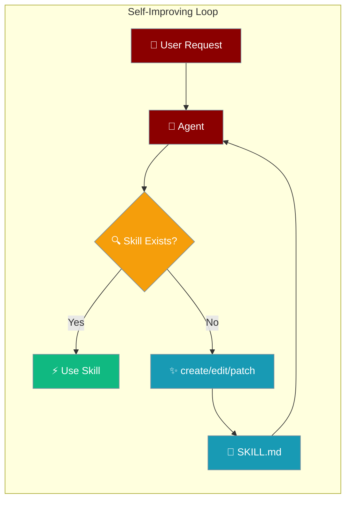
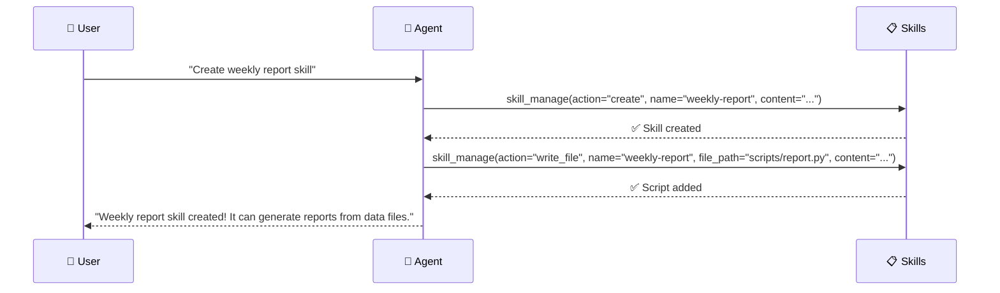

Self-improving skills enable agents to create, edit, and manage their own capabilities dynamically, learning from user interactions and building persistent knowledge.



## Quick Start

<Steps>
<Step title="Enable Skill Management">
```python
from praisonaiagents import Agent

agent = Agent(
    name="Skill Builder",
    instructions="When users teach you something, save it as a skill for next time.",
    tools=["skill_manage", "skills_list", "skill_view"]  # auto-injected in bots
)

agent.start("Create a skill called 'weekly-summary' that summarises the week's work.")
```
</Step>

<Step title="Agent Learns and Improves">
```python
# Agent creates skills automatically from user interactions
# User: "Create a weekly summary skill"
# Agent calls: skill_manage(action="create", name="weekly-summary", content="...")

# Later interaction
# User: "Update the summary to include metrics"
# Agent calls: skill_manage(action="patch", name="weekly-summary", old_string="...", new_string="...")
```
</Step>
</Steps>

---

## How It Works



The skill management system provides six core actions for runtime skill manipulation:

| Action | Purpose | Security Constraints |
|--------|---------|---------------------|
| **create** | Create new skills | 100KB SKILL.md limit, name validation |
| **edit** | Replace skill content | Preserves frontmatter, atomic writes |
| **patch** | Targeted find/replace | String matching, traversal protection |
| **delete** | Remove skills completely | Path validation, atomic removal |
| **write_file** | Add skill resources | 1MB limit, allowed subdirs only |
| **remove_file** | Delete skill files | Containment checks, safe removal |

---

## Configuration Options

### Skill Management Actions

| Action | Required Args | Optional Args | What it does |
|--------|---------------|---------------|--------------|
| `create` | `name`, `content` | `category` | Create a new skill with SKILL.md body |
| `edit` | `name`, `content` | - | Replace an existing skill's SKILL.md body |
| `patch` | `name`, `old_string`, `new_string` | `file_path`, `replace_all` | Fuzzy find-and-replace within a skill file |
| `delete` | `name` | - | Remove a skill entirely |
| `write_file` | `name`, `file_path`, `file_content` | - | Add/overwrite a file inside the skill |
| `remove_file` | `name`, `file_path` | - | Delete a file from within the skill |

### Python API Reference

All skill management methods return a consistent response format:

**Success Response:**
```python
{"success": True, "skill": "skill-name", ...}  # Additional fields vary by method
```

**Failure Response:**
```python
{"success": False, "error": "Error message"}
```

**Method Examples:**
```python
from praisonaiagents import SkillManager

mgr = SkillManager()
mgr.discover()

# Create new skills
result = mgr.create_skill("weekly-summary", "# Weekly Summary\nSteps...", category="reporting")
# Returns: {"success": True, "skill": "weekly-summary", "path": "/path/to/skill"}
# Or: {"success": False, "error": "Invalid skill name"}

# Edit existing skills
result = mgr.edit_skill("weekly-summary", "# Weekly Summary v2\n...")
# Returns: {"success": True, "skill": "weekly-summary"}
# Or: {"success": False, "error": "Skill not found"}

# Apply targeted patches
result = mgr.patch_skill("weekly-summary", old_string="v2", new_string="v3")
# Returns: {"success": True, "skill": "weekly-summary", "replacements": 1}
# Or: {"success": False, "error": "String not found"}

# Manage skill files
result = mgr.write_skill_file("weekly-summary", "scripts/report.py", "print('Weekly report')")
# Returns: {"success": True, "skill": "weekly-summary", "file": "scripts/report.py"}
# Or: {"success": False, "error": "File path must be under: ['references', 'templates', 'scripts', 'assets']"}

result = mgr.remove_skill_file("weekly-summary", "scripts/report.py")
# Returns: {"success": True, "skill": "weekly-summary", "file": "scripts/report.py"}
# Or: {"success": False, "error": "File not found"}

# Delete skills
result = mgr.delete_skill("weekly-summary")
# Returns: {"success": True, "skill": "weekly-summary", "path": "/path/to/skill"}
# Or: {"success": False, "error": "Skill not found"}
```

### Security Guards

| Guard | Purpose | Implementation |
|-------|---------|----------------|
| **Size Limits** | Prevent resource exhaustion | 100KB SKILL.md, 1MB files |
| **Name Validation** | Secure identifiers | `[a-z0-9][a-z0-9._-]*` pattern, 64 char limit |
| **Path Validation** | Prevent traversal | Block `..`, absolute paths, encoded attacks |
| **Atomic Writes** | Prevent corruption | Temp file + rename operations |
| **Allowed Subdirs** | Restrict file placement | `references/`, `templates/`, `scripts/`, `assets/` only |

---

## Storage Location & Precedence

Skills are stored in directories according to this precedence order (highest to lowest):

1. **Project:** `./.praisonai/skills/` (centralized) — and `./.claude/skills/` for compatibility
2. **Ancestor walk:** any `.praisonai/skills` or `.claude/skills` in parent directories (monorepo support)
3. **User:** `~/.praisonai/skills/`
4. **System (Unix):** `/etc/praison/skills/`

When creating new skills, they are written to the **first existing** directory in this list. If none exist, the system falls back to creating `~/.praisonai/skills/`.

<Note>
The current documentation incorrectly states that skills are stored "in `~/.praisonai/skills/` by default". This is only the **fallback** location, not the actual default behavior.
</Note>

---

## Validation Rules

Each skill management operation enforces security constraints:

| Operation | Validation Rules |
|-----------|------------------|
| **create_skill/edit_skill** | Name: `^[a-z0-9][a-z0-9._-]*$`, ≤64 chars<br/>Content: ≤100KB |
| **patch_skill** | Path traversal protection (`..`, absolute paths)<br/>String must exist in target file |
| **write_skill_file** | File size: ≤1MB<br/>Allowed subdirs: `references/`, `templates/`, `scripts/`, `assets/` only<br/>Path traversal protection |
| **remove_skill_file** | Path must be within skill directory<br/>File must exist |
| **delete_skill** | Skill must exist and have valid path |

---

## Common Patterns

### Complete Agent Learning Example

```python
# Real agent-centric example you can copy and run
from praisonaiagents import Agent

agent = Agent(
    name="Learning Assistant",
    instructions="When users teach you something, save it as a persistent skill using skill_manage.",
    tools=["skill_manage", "skills_list", "skill_view"]
)

# User teaches the agent
response = agent.start("Here's how to analyze CSV files: load with pandas, check for nulls, then create summary stats")

# Agent automatically calls:
# skill_manage(action="create", name="csv-analysis", content="# CSV Analysis\n1. Load with pandas...")
# Response: {"success": True, "skill": "csv-analysis", "path": "/path/to/skill"}

print("Agent learned and persisted the skill!")
```

### User Teaching Flow

```python
# Typical interaction where agent learns from user
agent = Agent(
    name="Learning Assistant", 
    instructions="""
    When users teach you something new, save it as a skill.
    Use skill_manage to create persistent knowledge.
    """,
    tools=["skill_manage", "skills_list", "skill_view"]
)

# User: "Here's how to analyze CSV data: load with pandas, clean nulls, then summarize"
# Agent automatically calls:
# skill_manage(action="create", name="csv-analysis", 
#              content="# CSV Analysis\n1. Load with pandas\n2. Clean nulls\n3. Summarize data")
```

### Skill Evolution

```python
# Agent improves existing skills based on feedback
# User: "The CSV skill should also handle missing headers"
# Agent calls:
# skill_manage(action="patch", name="csv-analysis", 
#              old_string="2. Clean nulls", 
#              new_string="2. Handle missing headers\n3. Clean nulls")
```

### Adding Executable Resources

```python
# Agent creates supporting scripts for skills
# skill_manage(action="write_file", name="csv-analysis",
#              file_path="scripts/analyze.py", 
#              file_content="import pandas as pd\n# Analysis script...")
```

---

## Troubleshooting

<Warning>
**ImportError Fix:** If you see `ImportError: cannot import name 'get_default_skill_directories'`, upgrade `praisonaiagents` — this was fixed in [MervinPraison/PraisonAI#1687](https://github.com/MervinPraison/PraisonAI/pull/1687). The function was renamed from `get_default_skill_directories` to `get_default_skill_dirs`.
</Warning>

---

## Best Practices

<AccordionGroup>
<Accordion title="Security-First Design">
All skill operations are workspace-contained and use atomic writes via temp files. Never bypass name validation or path checks. Skills inherit workspace security automatically.
</Accordion>

<Accordion title="Progressive Learning">
Start with simple skills and let agents enhance them through patch operations. This creates more natural learning patterns than full rewrites.
</Accordion>

<Accordion title="Skill Organization">
Use meaningful categories and names. Skills are stored according to directory precedence (see Storage Location above), with clean directory structure per skill.
</Accordion>

<Accordion title="Error Handling">
All skill operations return detailed JSON results with success flags and error messages. Always check `result["success"]` before proceeding.
</Accordion>
</AccordionGroup>

---

## Related

<CardGroup cols={2}>
<Card title="Skills (Concepts)" icon="puzzle-piece" href="/docs/concepts/skills">
  Understanding what skills are and how they work
</Card>
<Card title="Workspace" icon="folder-lock" href="/docs/features/workspace">
  How workspace containment secures skill operations
</Card>
</CardGroup>