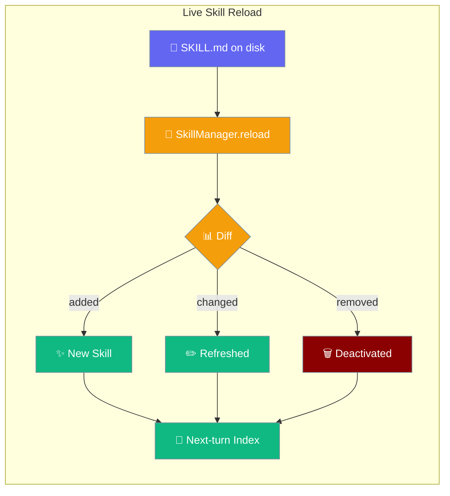
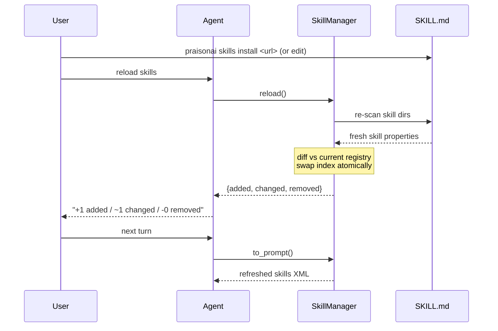
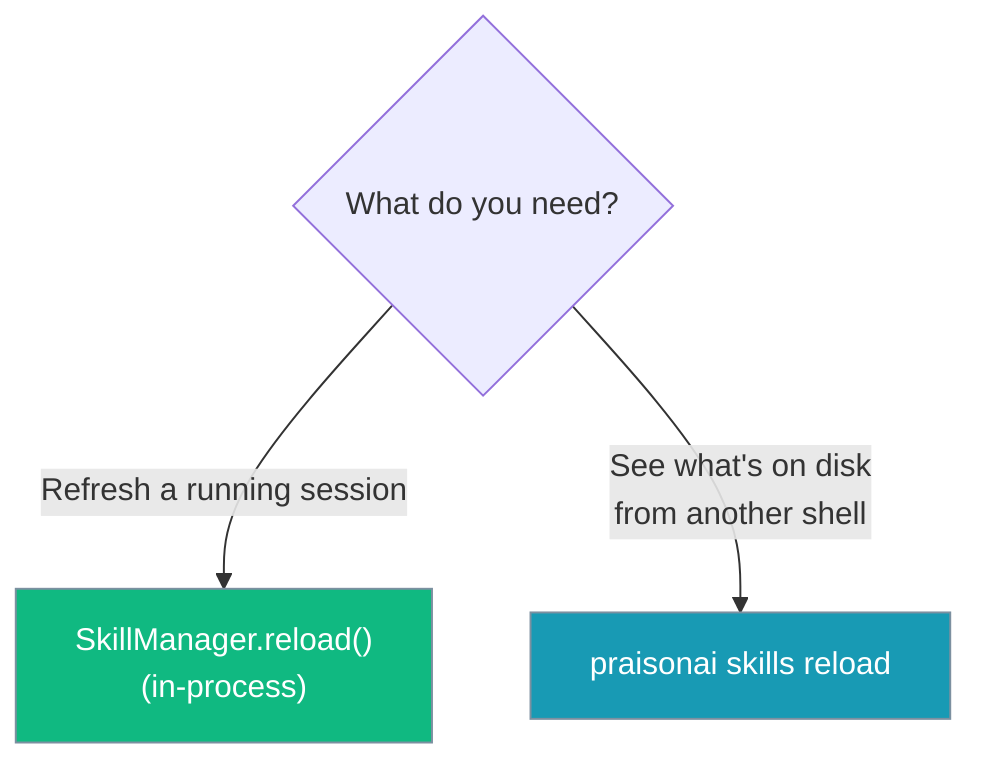

Skill reload refreshes a running agent's skill index so newly installed, edited, or removed skills are available on the next turn — no restart needed.

```python
from praisonaiagents import Agent

agent = Agent(
    name="Support Agent",
    instructions="Use the latest skills to help the user.",
    skills=["*"],
)

# Later, after `praisonai skills install <url>` or editing a SKILL.md on disk:
diff = agent.skill_manager.reload()
# {"added": ["refund-policy"], "changed": ["greeting"], "removed": []}
```



## Quick Start

<Steps>
<Step title="Reload in a live session">
```python
from praisonaiagents import SkillManager

mgr = SkillManager()
mgr.discover(["./skills"], include_defaults=False)

# A skill was installed or edited on disk after discover()…
diff = mgr.reload()
# {"added": ["refund-policy"], "changed": ["greeting"], "removed": []}

print(f"+{len(diff['added'])} / ~{len(diff['changed'])} / -{len(diff['removed'])}")
```
</Step>

<Step title="Scan from another shell">
```bash
# Convenience scan: list the skills discoverable on disk right now
praisonai skills reload

# Scan a specific directory
praisonai skills reload --dirs ./skills
```
```
• greeting
• refund-policy
Skills available: 2
```
</Step>
</Steps>

<Note>
`praisonai skills reload` is a **cross-process scan**, not a live-session refresh — a separate process has no running session to reload. Use it to confirm a `praisonai skills install <url>` or a SKILL.md edit landed on disk. To refresh a running session, call `SkillManager.reload()` **in-process**.
</Note>

---

## How It Works

`reload()` re-scans the same directories the manager last discovered, diffs the fresh scan against the in-memory registry, and swaps the index atomically.



Changes take effect on the **next turn** via `to_prompt()`, never mid-turn — so a reload is prompt-cache-safe.

| Diff key | Meaning | Effect on the index |
|----------|---------|---------------------|
| `added` | A new SKILL.md appeared | Loaded fresh (metadata only) |
| `changed` | An existing skill's SKILL.md changed on disk | Reloaded fresh; stale instructions dropped |
| `removed` | The skill directory disappeared | Dropped and deactivated |

---

## Choosing where to reload from

Pick the live primitive for a running session; pick the CLI to check disk from another shell.



---

## What Reload Guarantees

| Guarantee | Behaviour |
|-----------|-----------|
| **Atomic swap** | The index is replaced in one step; changes appear on the next `to_prompt()` |
| **Sorted diff** | Returns `{"added": [...], "changed": [...], "removed": [...]}` as sorted name lists |
| **Telemetry survives** | Unchanged skills keep their existing `LoadedSkill`, preserving activation and usage counts |
| **Change detection** | Uses the SKILL.md `mtime`; a baseline is captured at load time |
| **Removed skills deactivated** | Cached `instructions` are cleared and the skill is dropped |
| **`add_skill()`-safe** | Skills added out-of-band are preserved and never reported as `removed` |
| **Telemetry writes ignored** | `use-count` / `last-used` / `patch-count` rewrites don't misfire as content changes |
| **No prior `discover()` needed** | `reload()` works even when `discover()` was never called |

---

## Behaviour under edge cases

<AccordionGroup>
<Accordion title="Edit between discover() and the first reload() is caught">
The SKILL.md `mtime` baseline is recorded at load time, so an edit made after `discover()` but before the first `reload()` still shows up as `changed`.

```python
from praisonaiagents import SkillManager

mgr = SkillManager()
mgr.discover(["./skills"], include_defaults=False)

# Edit ./skills/greeting/SKILL.md on disk here…

diff = mgr.reload()
# {"added": [], "changed": ["greeting"], "removed": []}
```
</Accordion>

<Accordion title="Skills added via add_skill() are preserved">
A skill registered out-of-band with `add_skill()` was never part of a discovery scan, so `reload()` leaves it untouched and never lists it under `removed`.

```python
mgr.add_skill("./extra/beta")   # outside the discovered dirs
diff = mgr.reload()
assert "beta" not in diff["removed"]  # preserved
```
</Accordion>

<Accordion title="Telemetry-only rewrites are ignored">
Recording a use rewrites SKILL.md frontmatter, but the manager refreshes its own `mtime` baseline afterwards — so the next `reload()` does not report the skill as `changed`, and the same activated object is kept.

```python
mgr.get_instructions("used")   # bumps use-count on disk
diff = mgr.reload()
assert diff["changed"] == []
```
</Accordion>

<Accordion title="Removed skills are deactivated; unchanged keep activation">
A deleted skill directory is dropped and its cached `instructions` cleared. Unchanged skills keep the same `LoadedSkill` instance, so activation and telemetry carry across the reload.
</Accordion>

<Accordion title="reload() works with no prior discover()">
Calling `reload()` before any explicit `discover()` still returns a valid diff with the three keys — it simply scans the default sources.

```python
mgr = SkillManager()
diff = mgr.reload()
# {"added": [...], "changed": [], "removed": []}
```
</Accordion>
</AccordionGroup>

---

## Common Patterns

### Refresh after a skill install from a bot or gateway

```python
from praisonaiagents import SkillManager

mgr = SkillManager()
mgr.discover(["./skills"], include_defaults=False)

# A gateway handler just ran `praisonai skills install <url>`…
diff = mgr.reload()
if diff["added"]:
    print("New skills live:", ", ".join(diff["added"]))
```

### Watch-and-reload while authoring a skill

```python
import time
from praisonaiagents import SkillManager

mgr = SkillManager()
mgr.discover(["./skills"], include_defaults=False)

while True:
    diff = mgr.reload()
    if any(diff.values()):
        print(f"+{diff['added']} ~{diff['changed']} -{diff['removed']}")
    time.sleep(2)
```

### Reload and confirm a specific skill is live

```python
diff = mgr.reload()
if "refund-policy" in mgr:
    print("refund-policy is now available")
```

---

## Best Practices

<AccordionGroup>
<Accordion title="Call reload() at turn boundaries">
Reload is safe by design — the index swap never takes effect mid-turn — but calling it between turns keeps the mental model simple: the next `to_prompt()` reflects the change.
</Accordion>

<Accordion title="Report the diff to the user">
Surface `{added, changed, removed}` after a reload so people see exactly what moved: `+1 added / ~1 changed / -0 removed`.
</Accordion>

<Accordion title="Reload in-process, not from a subprocess">
`praisonai skills reload` scans disk in its own process and cannot refresh a parent session. To pick up new skills in a running agent, call `SkillManager.reload()` in that same process.
</Accordion>

<Accordion title="Keep skill names stable across edits">
Change detection keys on the skill name and its SKILL.md mtime. Renaming a skill reads as a `removed` + `added` pair and drops its telemetry — prefer editing content over renaming so usage counts survive.
</Accordion>
</AccordionGroup>

---

## Related

<CardGroup cols={2}>
<Card icon="wand-magic-sparkles" href="/features/skill-manage">
  Create, edit, patch, and archive skills
</Card>
<Card icon="rotate" href="/features/skill-lifecycle">
  Provenance, telemetry, archive/restore, rollback
</Card>
<Card icon="puzzle-piece" href="/features/skills">
  Load SKILL.md skills on agents
</Card>
<Card icon="layer-group" href="/features/skill-bundles">
  Group related skills into reusable sets
</Card>
</CardGroup>
