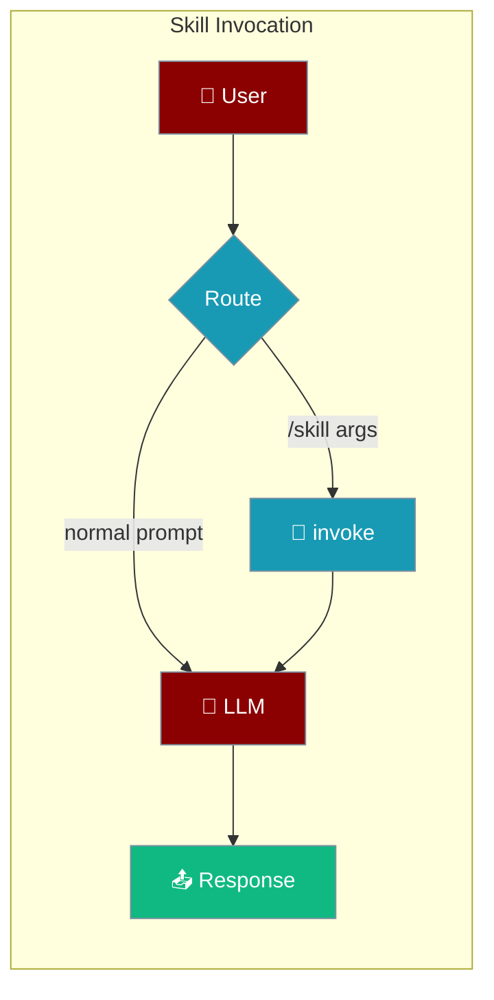
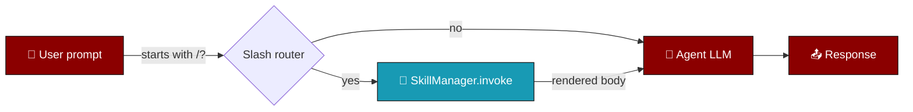

Skills can be invoked three ways: auto-triggered by the LLM from the system-prompt listing, manually via `/skill-name` slash commands, or programmatically through `SkillManager.invoke()`.

```python
from praisonaiagents import Agent

agent = Agent(
    name="assistant",
    skills=["./skills/deploy"],
)
agent.start("/deploy staging prod")
```



## Quick Start

<Steps>
<Step title="Slash command">
```python
from praisonaiagents import Agent

agent = Agent(
    name="assistant",
    skills=["./skills/deploy"],
)
agent.start("/deploy staging prod")
# Renders the skill body with $ARGUMENTS substituted, then continues the turn
```
</Step>

<Step title="Auto-trigger">
```python
from praisonaiagents import Agent

agent = Agent(
    name="assistant",
    skills=["./skills/csv-summary"],
)
agent.start("Summarise this CSV for me")
# LLM sees skill descriptions in the system prompt and activates the matching skill
```
</Step>
</Steps>

---

## How It Works



| Mode | When to use |
|------|-------------|
| **Auto-trigger** | Skill `description` is in the system prompt; the LLM decides when to follow it |
| **Slash command** | User types `/deploy staging`; body is rendered with `$ARGUMENTS` substituted |

<Note>
Skill files are read as UTF-8. Run `praisonai skills validate --path ./my-skill` to catch encoding issues before deploy.
</Note>

---

## Argument Substitution

Inside `SKILL.md` bodies you can reference arguments passed after the skill name:

<Tabs>
  <Tab title="$ARGUMENTS">
    ```markdown
    Deploy $ARGUMENTS now.
    ```
    `/deploy staging prod` becomes `Deploy staging prod now.`
  </Tab>

  <Tab title="Indexed">
    ```markdown
    Migrate $ARGUMENTS[0] from $ARGUMENTS[1] to $ARGUMENTS[2].
    ```
    `/migrate SearchBar React Vue` expands each positional argument.
  </Tab>

  <Tab title="Shorthand">
    ```markdown
    Hello $0, meet $1.
    ```
    `$N` is shorthand for `$ARGUMENTS[N]`. Quotes group tokens:
    `/greet "hello world" friend` sets `$0 = "hello world"`.
  </Tab>

  <Tab title="Context vars">
    ```markdown
    Working inside ${PRAISON_SKILL_DIR}. Session ${PRAISON_SESSION_ID}.
    ```
    `${CLAUDE_SKILL_DIR}` / `${CLAUDE_SESSION_ID}` are supported as aliases so existing Claude Code skills work unchanged.
  </Tab>
</Tabs>

---

## Inline Shell Substitution

<Warning>
Disabled by default. Skills that embed ``!`cmd` `` blocks render as `[shell execution disabled]` until you explicitly opt in.
</Warning>

```python
from praisonaiagents import SkillManager

mgr = SkillManager()
mgr.add_skill("./skills/pr-summary")
rendered = mgr.invoke("pr-summary", raw_args="42", shell_exec=True)
```

<AccordionGroup>
  <Accordion title="Inline backtick form">
    ```markdown
    Current branch: !`git rev-parse --abbrev-ref HEAD`
    ```
  </Accordion>
  <Accordion title="Fenced block form">
    ````markdown
    ```!
    node --version
    npm --version
    ```
    ````
  </Accordion>
</AccordionGroup>

---

## Invocation Policy

<ParamField path="disable-model-invocation" type="boolean" default="false">
  When `true` the skill is **hidden from the system-prompt listing**, so the LLM cannot auto-trigger it. Users can still invoke it via `/skill-name`. Use for side-effecting commands like `/deploy`.
</ParamField>

<ParamField path="user-invocable" type="boolean" default="true">
  When `false` the slash-router ignores the skill. Use for background knowledge you want auto-triggered by the LLM but not exposed as a user command.
</ParamField>

---

## Allowed Tools Pre-approval

<ParamField path="allowed-tools" type="string | list[str]">
  Space-separated string (`Read Grep`) or YAML list. When a user invokes the skill, those tool names are **pre-approved** via the approval registry for the current agent so the LLM can run them without the interactive confirmation prompt.
</ParamField>

---

## Common Patterns

### Programmatic invoke

```python
from praisonaiagents import Agent

agent = Agent(name="assistant", skills=["./skills/deploy"])
rendered = agent.skill_manager.invoke("deploy", raw_args="staging prod")
```

### YAML

```yaml
# agents.yaml
agents:
  assistant:
    role: Helper
    goal: Help the user
    backstory: You are helpful.
    skills:
      - ./skills/deploy
      - ~/.praisonai/skills/csv-summary
```

### CLI

<CodeGroup>
```bash List installed
praisonai skills list
```

```bash Invoke from CLI
praisonai "/deploy staging" --skills ./skills/deploy
```

```bash Install
praisonai skills install https://github.com/acme/my-skill
praisonai skills install ./local-skill --dest ~/.praisonai/skills
```
</CodeGroup>

<Tip>
Set `PRAISONAI_DISABLE_SKILL_TOOLS=1` to stop the agent from auto-injecting `run_skill_script` and `read_file` when skills are configured. Useful for hermetic tests and hosts that want full control over the tool surface.
</Tip>

---

## Precedence

Skills are discovered in this order (first wins on name collision):

<Steps>
  <Step title="Project">`./.praisonai/skills/` or `./.claude/skills/`</Step>
  <Step title="Ancestors">Every `.praisonai/skills` or `.claude/skills` in a parent directory (monorepo support)</Step>
  <Step title="User">`~/.praisonai/skills/`</Step>
  <Step title="System">`/etc/praison/skills/`</Step>
</Steps>

<Info>
Collisions are logged at INFO level so you can see which skill won.
</Info>

---

## Best Practices

<AccordionGroup>
<Accordion title="Use slash commands for side effects">
Set `disable-model-invocation: true` on deploy, restart, or delete skills so the LLM cannot trigger them accidentally — users invoke them explicitly with `/skill-name`.
</Accordion>

<Accordion title="Keep user-invocable false for background knowledge">
Set `user-invocable: false` when a skill should only auto-activate from the system prompt, not appear as a slash command.
</Accordion>

<Accordion title="Opt in to shell blocks deliberately">
Leave `shell_exec=False` (default) in production. Pass `shell_exec=True` only in trusted environments where inline ``!`cmd` `` blocks are required.
</Accordion>

<Accordion title="Validate encoding before deploy">
Save `SKILL.md` as UTF-8. Run `praisonai skills validate --path ./my-skill` to catch Windows encoding issues early.
</Accordion>
</AccordionGroup>

---

## Related

<CardGroup cols={2}>
<Card title="Agent Skills" icon="puzzle-piece" href="/docs/features/skills">
  Author SKILL.md files and configure skills on agents
</Card>
<Card title="Skill Manage" icon="wand-magic-sparkles" href="/docs/features/skill-manage">
  Create, edit, and approve agent-proposed skills
</Card>
<Card title="Approval Protocol" icon="shield-check" href="/docs/features/approval-protocol">
  How `allowed-tools` pre-approval plugs into the approval registry
</Card>
<Card title="Skills Config" icon="gear" href="/docs/configuration/skills-config">
  `SkillsConfig` options for discovery and paths
</Card>
</CardGroup>
