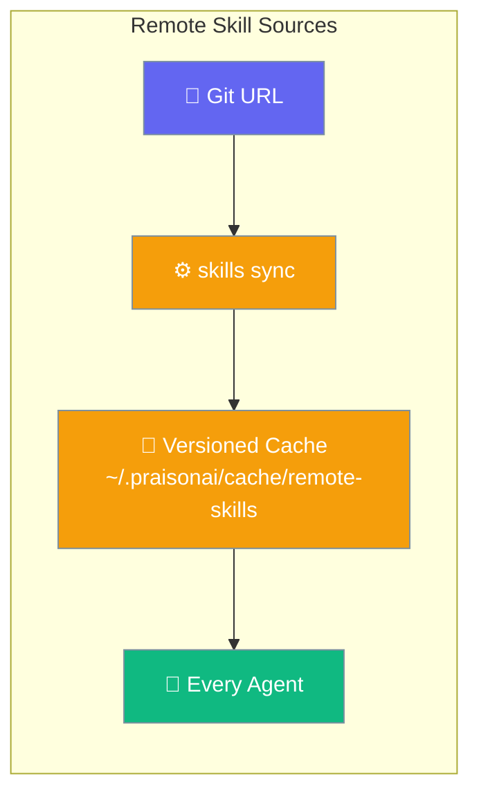
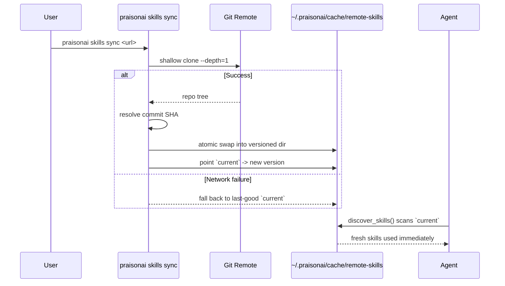
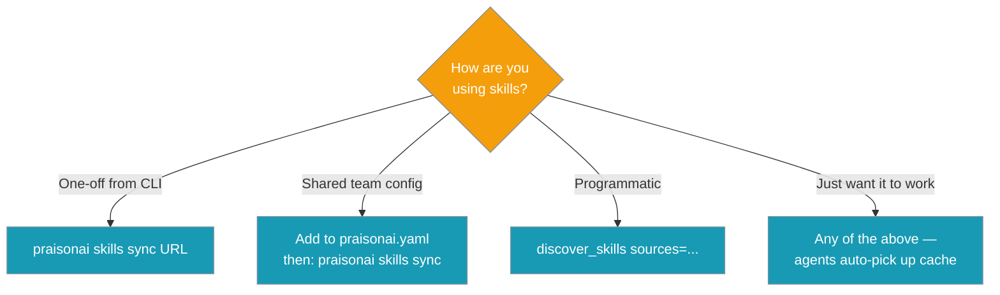
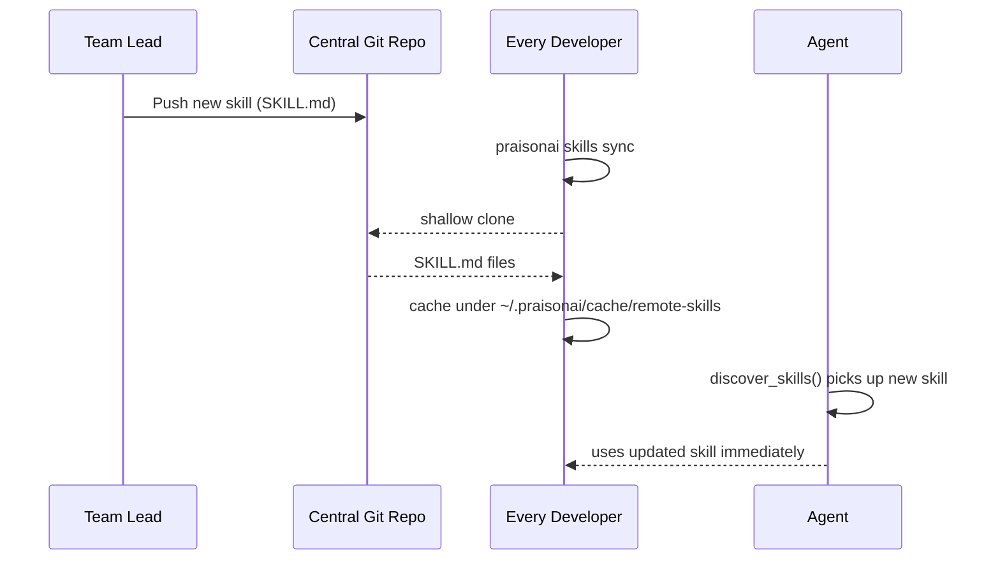

Point agents at a git URL — every project picks up the latest skills without a manual install.



## Quick Start

<Steps>
<Step title="Sync from the CLI">
Pull the latest skills and cache them locally. Every agent on this machine picks them up automatically — no code change needed.

```bash
# Pull the latest and cache it locally
praisonai skills sync https://github.com/acme/team-skills

# Pin to a branch / tag / commit for reproducible builds
praisonai skills sync https://github.com/acme/team-skills --ref v1.2.0
```
</Step>

<Step title="Declare once, sync bare">
Add sources to your project `praisonai.yaml`, then run `sync` with no arguments:

```yaml
skills:
  urls:
    - https://github.com/acme/team-skills
    - url: https://github.com/acme/internal-runbooks
      ref: main
```

```bash
praisonai skills sync
```

`sync` reads `skills.urls` (or the alias `skills.sources`) from the project's `praisonai.yaml`/`praisonai.yml` first, then falls back to the user-global `~/.praisonai/config.yaml`.
</Step>

<Step title="From Python">
Pass a git URL to `sources=` and discovery fetches, caches, and validates it:

```python
from praisonaiagents import Agent
from praisonaiagents.skills import discover_skills

skills = discover_skills(sources=["https://github.com/acme/team-skills"])

agent = Agent(
    name="Reviewer",
    instructions="You review pull requests using our team's shared skills.",
    skills=[str(s.path) for s in skills],
)

agent.start("Review PR #42")
```
</Step>
</Steps>

<Note>
Backward compatible: without `sources=`, `skills.urls`, or an explicit `sync`, nothing changes.
</Note>

---

## How It Works

Sync shallow-clones the repo, resolves the commit, atomically swaps it into a versioned cache, and points `current` at it. If git fails, the last-good `current` alias is returned so agents keep working offline.



| Step | What happens |
|------|--------------|
| Fetch | Shallow git clone into a temp dir |
| Version | Resolved commit SHA becomes the cache version dir |
| Swap | Atomic rename + `current` symlink (falls back to copy on symlink-less filesystems) |
| Prune | Old versioned dirs removed, `current` kept |
| Offline | If clone fails, `current` from the last good sync is used |

---

## Configuration Options

Two YAML shapes are supported — pick either. `skills.sources` is an alias for `skills.urls`.

```yaml
# String form
skills:
  urls:
    - https://github.com/acme/team-skills

# Dict form with ref pinning
skills:
  urls:
    - url: https://github.com/acme/team-skills
      ref: v1.2.0
```

When both project and user config define sources, project entries win and are listed first; duplicates are removed while order is preserved.

**CLI — `praisonai skills sync`:**

| Option | Type | Default | Description |
|--------|------|---------|-------------|
| `URL` (positional) | `str` | *(from config)* | Remote skill source git URL. If omitted, uses `skills.urls` from config. |
| `--ref` / `-r` | `str` | `None` | Pin a branch / tag / commit for reproducible syncs. |

**Python API:**

| Symbol | Signature | Purpose |
|--------|-----------|---------|
| `GitRemoteSkillSource` | `(url: str, ref: Optional[str] = None)` | Default git-backed source implementation |
| `fetch_remote_skill_dirs` | `(sources, cache_dir: Optional[Path] = None) -> List[Path]` | Fetch all sources; returns validated cache dirs |
| `discover_skills` | `(skill_dirs=None, include_defaults=True, sources: Optional[List] = None)` | `sources=` kwarg; remote sources scanned after local dirs |

`sources` items may be a URL `str`, a `{"url": ..., "ref": ...}` dict, or any object with a `.fetch(cache_dir) -> List[Path]` method.

---

## Which entry point should I use?



---

## Team Workflow

This feature shines for teams: one lead pushes a skill, everyone syncs.



---

## Common Patterns

### Pin for reproducible builds

Always pass a ref in CI so builds don't drift onto an upstream commit.

```bash
praisonai skills sync https://github.com/acme/team-skills --ref v1.2.0
```

### Local-wins layering

Put per-project overrides in `./.praisonai/skills/`. The remote cache is lowest precedence, so a local skill with the same name always wins a collision.

### Offline-first

The last-good cache is served automatically on any network failure — no code change needed.

---

## Best Practices

<AccordionGroup>
<Accordion title="Pin refs in CI, float in dev">
Pin `--ref v1.2.0` in CI for reproducible builds; drop the ref in local dev for easy iteration on the latest.
</Accordion>

<Accordion title="Treat remote content as untrusted">
The parser re-validates every synced skill before it reaches a prompt. Don't disable validation, and review the source repo before adding it.
</Accordion>

<Accordion title="One repo, many skills">
A remote repo can hold a single `SKILL.md` at its root (one skill) or many subdirectories each with a `SKILL.md`. Both layouts are handled and de-duplicated by discovery.
</Accordion>

<Accordion title="skills add / install vs skills sync">
`add` and `install` are the same one-shot copy — pick whichever verb reads more naturally (`add` mirrors the familiar `npx skills add <url>`). `sync` keeps a versioned cache and refreshes on demand. Use `sync` for shared team libraries.
</Accordion>
</AccordionGroup>

---

## Related

<CardGroup cols={2}>
<Card title="Skill Invocation" icon="slash" href="/features/skills-invocation">
  How agents actually run a skill — slash commands and argument substitution
</Card>
<Card title="Skills" icon="puzzle-piece" href="/concepts/skills">
  The underlying Skill concept — author and load SKILL.md files
</Card>
</CardGroup>
