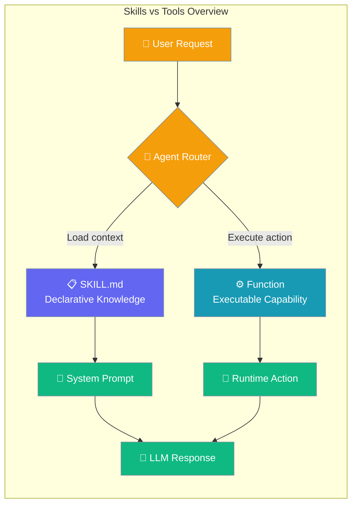
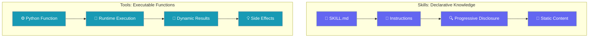
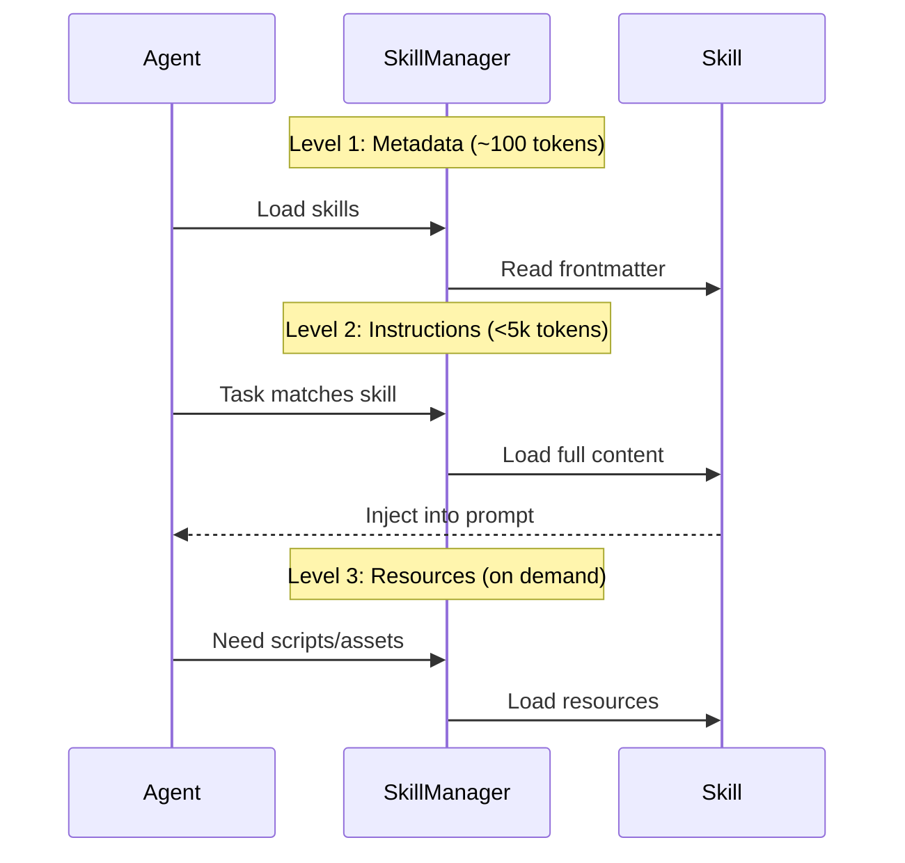
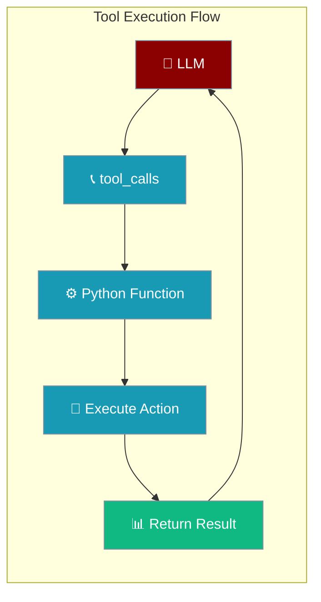
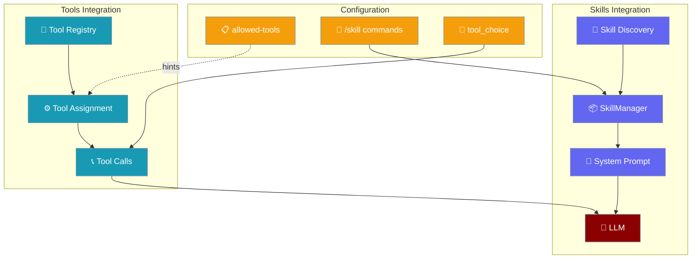
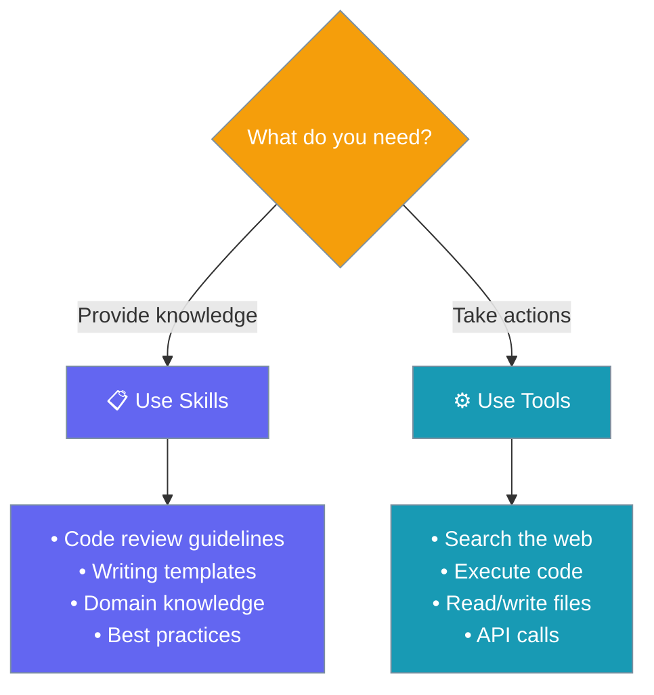

Skills and Tools are two distinct capability systems in PraisonAI that serve different purposes and operate at different levels.

```python
from praisonaiagents import Agent

agent = Agent(
    name="Code Assistant",
    instructions="Review code and scan for vulnerabilities",
    skills=["./skills/code-review"],
    tools=["read_file"],
)
agent.start("Review app.py for security issues")
```



## Quick Start

<Steps>

<Step title="Skills: Load Knowledge">
Create a skill to provide specialized knowledge to agents:

```python
from praisonaiagents import Agent

# Create skill directory with SKILL.md
agent = Agent(
    name="Code Assistant",
    instructions="You help with coding tasks",
    skills=["./code-review-skill"]  # Load declarative knowledge
)

agent.start("Review this Python code for security issues")
```
</Step>

<Step title="Tools: Execute Actions">
Create a tool to perform runtime actions:

```python
from praisonaiagents import Agent

def search_vulnerabilities(code: str) -> str:
    """Search for security vulnerabilities in code."""
    # Tool implementation
    return "Found 3 potential SQL injection vulnerabilities"

agent = Agent(
    name="Security Agent",
    tools=[search_vulnerabilities]  # Add executable function
)

agent.start("Scan this code for vulnerabilities")
```
</Step>

</Steps>

---

## Conceptual Difference



### Comparison Table

| Dimension | Skills | Tools |
|-----------|--------|-------|
| **Artifact** | `SKILL.md` file | Python function |
| **Purpose** | Provide knowledge & context | Execute actions |
| **Invocation** | Load into system prompt | LLM function calls |
| **Timing** | Load time (progressive) | Runtime on-demand |
| **Cost** | Token usage | Execution time |
| **Storage** | File system | Code registry |
| **Safety** | Static allowlists | Runtime validation |
| **Portability** | agentskills.io standard | Framework-specific |

---

## Skills: Declarative Knowledge Packages

Skills are **SKILL.md files** that provide specialized knowledge and instructions to agents without bloating the system prompt.



### Skills in PraisonAI

```python
from praisonaiagents import Agent, SkillsConfig

# Direct skill paths
agent = Agent(
    name="Code Assistant",
    skills=["./skills/code-review", "./skills/testing"]
)

# Directory scanning
agent = Agent(
    name="Assistant",
    skills=SkillsConfig(dirs=["./skills"])  # Auto-discover SKILL.md files
)

# Auto-discovery from default locations:
# 1. ./.praisonai/skills/ (project)
# 2. ~/.praisonai/skills/ (user)
# 3. /etc/praisonai/skills/ (system)
```

### SKILL.md Format

```yaml
---
name: code-review
description: Review code for bugs, security issues, and best practices
allowed-tools: read_file write_file  # Hint for required tools
---

# Code Review Instructions

When reviewing code:
1. Check for security vulnerabilities
2. Identify potential bugs  
3. Suggest improvements
4. Follow language-specific best practices
```

---

## Tools: Executable Functions

Tools are **Python functions** that agents can call to perform actions and interact with external systems.



### Tools in PraisonAI

```python
from praisonaiagents import Agent
from typing import List, Dict

def search_code(pattern: str, directory: str = ".") -> List[Dict]:
    """Search for code patterns in files."""
    # Tool implementation
    return [{"file": "app.py", "line": 42, "match": "vulnerable code"}]

# Assign tools to agents
agent = Agent(
    name="Code Scanner",
    tools=[search_code]  # Executable functions
)

# Tool with built-in capabilities
agent = Agent(
    name="Web Researcher",
    tools=["tavily", "web_search"]  # Built-in tool names
)
```

### Tool Categories

| Category | Examples | Purpose |
|----------|----------|---------|
| **Search** | `tavily`, `web_search`, `exa` | Find information |
| **File Operations** | `read_file`, `write_file`, `list_files` | Manage files |
| **Code Analysis** | `ast_grep_search`, `execute_code` | Analyze code |
| **Data Processing** | `pandas_tools`, `csv_tools` | Process data |
| **System** | `shell_tools`, `execute_command` | System operations |

---

## PraisonAI Integration Paths



### Discovery & Invocation

| Feature | Skills | Tools |
|---------|--------|-------|
| **Discovery** | File system scan | Import registry |
| **Activation** | `/skill` slash commands | Agent assignment |
| **Execution** | Prompt injection | Function calls |
| **Control** | `allowed-tools` hints | `tool_choice` parameter |

### CLI Commands

```bash
# Skills management
praisonai skills list
praisonai skills create --name my-skill
praisonai skills validate --path ./skill

# Tools management  
praisonai tools list
praisonai tools discover
praisonai tools resolve --name web_search
```

---

## When to Use Each



### Use Skills When:

- Providing specialized knowledge
- Sharing best practices
- Template instructions  
- Domain-specific guidance
- Static reference material

### Use Tools When:

- Executing dynamic actions
- Interacting with APIs
- Processing data
- File operations
- Real-time information

---

## Best Practices

<AccordionGroup>

<Accordion title="Skills: Keep Context Focused">
Write skills that provide specific, actionable knowledge. Use progressive disclosure - put essential info in SKILL.md, detailed references in `references/` folder.

```yaml
---
name: api-testing  
description: Test REST APIs for security and functionality
allowed-tools: http_client json_tools
---

# API Testing Guidelines

## Quick Checks
1. Authentication validation
2. Input sanitization  
3. Rate limiting

## Detailed procedures in references/security-checklist.md
```
</Accordion>

<Accordion title="Tools: Design for Reliability">
Create tools with clear interfaces, proper error handling, and type hints. Each tool should have a single responsibility.

```python
def validate_api_endpoint(url: str, method: str = "GET") -> Dict[str, Any]:
    """
    Validate API endpoint for security issues.
    
    Args:
        url: API endpoint URL
        method: HTTP method to test
        
    Returns:
        Dict with validation results
    """
    try:
        # Tool implementation with proper error handling
        return {"status": "valid", "issues": []}
    except Exception as e:
        return {"status": "error", "message": str(e)}
```
</Accordion>

<Accordion title="Security: Validate Inputs & Outputs">
**Skills**: Don't put secrets in SKILL.md files. Use environment variables for sensitive data.

**Tools**: Always validate inputs and sanitize outputs. Return structured results with error handling.

```python
def execute_shell_command(command: str) -> dict:
    """Execute shell command safely."""
    import subprocess
    try:
        result = subprocess.run(command, shell=False, capture_output=True, text=True, timeout=30)
        return {"success": True, "output": result.stdout}
    except Exception as e:
        return {"success": False, "error": str(e)}
```
</Accordion>

</AccordionGroup>

---

## Related

<CardGroup cols={2}>
  <Card title="Agent Skills" icon="puzzle-piece" href="/docs/features/skills">
    Load declarative knowledge from SKILL.md files
  </Card>
  <Card title="Toolsets" icon="wrench" href="/docs/features/toolsets">
    Add callable Python functions as agent tools
  </Card>
</CardGroup>