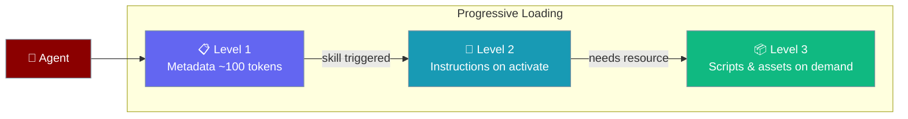
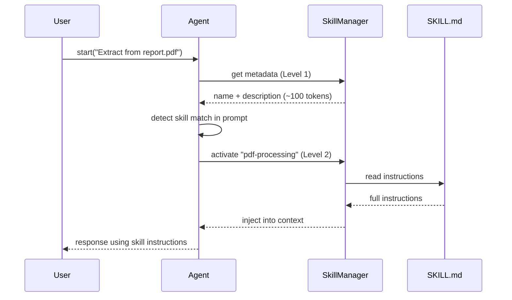

Skills extend agents with specialised knowledge and instructions loaded on demand, keeping context lean until the skill is needed.

```python
from praisonaiagents import Agent

agent = Agent(
    name="PDF Assistant",
    instructions="You are a helpful assistant.",
    skills=["./skills/pdf-processing"],
)
agent.start("Extract the main findings from report.pdf")
```

<Note>
**Agent-created skills are staged for approval by default.** When an agent calls `skill_manage` to create, edit, or delete a skill, the mutation is held in a pending store until a human approves it — disk is not touched. Reading and using existing skills is unaffected. See [Skill Manage](/docs/features/skill-manage) for the full approval gate docs.
</Note>

<Tip>
**Want to group several skills under one name?** See [Skill Bundles](/docs/features/skill-bundles) — a single `@bundle` selector expands to a full set of skills.
</Tip>

<Tip>
**Want to generate a skill from your own repo or docs?** See [Learn a Skill from Sources](/docs/features/learn-skill) — one command turns code/docs/PDFs into a grounded `SKILL.md`.
</Tip>

<Tip>
**Want to group related skills and select them all at once?** Use a [Skill Bundle](/docs/features/skill-bundles) — `skills=["@backend-dev"]` expands to all its member skills automatically.
</Tip>



## Quick Start

<Steps>
<Step title="Simple Usage">
Pass skill directory paths to `skills`:

```python
from praisonaiagents import Agent

agent = Agent(
    name="PDF Assistant",
    instructions="You are a helpful assistant.",
    skills=["./skills/pdf-processing"]
)

result = agent.start("Extract the main findings from report.pdf")
```
</Step>

<Step title="With Configuration">
Use `SkillsConfig` for auto-discovery from multiple directories:

```python
from praisonaiagents import Agent, SkillsConfig

agent = Agent(
    name="Multi-Skill Agent",
    instructions="You are a versatile assistant.",
    skills=SkillsConfig(
        paths=["./skills/pdf-processing"],
        dirs=["./skills"],
        auto_discover=True,
    )
)

result = agent.start("Process the quarterly report")
```
</Step>
</Steps>

---

## How It Works



Skills use three levels of progressive disclosure:

| Level | What Loads | Tokens |
|-------|-----------|--------|
| 1 — Metadata | Name + description (at startup) | ~100 |
| 2 — Instructions | Full `SKILL.md` body (when activated) | <5,000 |
| 3 — Resources | Scripts, references, assets (on demand) | Variable |

---

## SKILL.md Format

Each skill is a directory containing a `SKILL.md` file:

```
pdf-processing/
├── SKILL.md          # Required
├── scripts/          # Optional
├── references/       # Optional
└── assets/           # Optional
```

```markdown
---
name: pdf-processing
description: Process and extract information from PDF documents. Use this skill when the user asks to read, analyze, or extract data from PDF files.
license: Apache-2.0
---

# PDF Processing Skill

## Instructions

1. Verify the PDF file exists
2. Read the PDF content
3. Extract text while preserving structure
```

### Required Fields

| Field | Constraints |
|-------|-------------|
| `name` | 1–64 chars, lowercase, hyphens only, matches directory name |
| `description` | 1–1024 chars — tells the agent when to use this skill |

### Optional Fields

| Field | Description |
|-------|-------------|
| `license` | License identifier (e.g., `Apache-2.0`, `MIT`) |
| `compatibility` | Compatibility notes (max 500 chars) |
| `metadata` | Key-value map for custom properties |
| `allowed-tools` | Space-delimited list of tools the skill requires |

---

## Configuration Options

<Card title="SkillsConfig SDK Reference" icon="code" href="/docs/sdk/reference/python/classes/SkillsConfig">
  Full parameter reference for SkillsConfig
</Card>

**Precedence ladder** — choose the level you need:

```python
# Level 1: List of paths (simplest)
agent = Agent(skills=["./my-skill", "./another-skill"])

# Level 2: SkillsConfig (full control + auto-discovery)
agent = Agent(skills=SkillsConfig(
    paths=["./my-skill"],
    dirs=["~/.praisonai/skills/"],
    auto_discover=True,
))
```

```python
from praisonaiagents import Agent, SkillsConfig

agent = Agent(
    instructions="...",
    skills=SkillsConfig(
        paths=["./my-skill"],
        dirs=["~/.praisonai/skills/"],
        auto_discover=False,
    )
)
```

| Option | Type | Default | Description |
|--------|------|---------|-------------|
| `paths` | `List[str]` | `[]` | Direct skill directory paths to load |
| `dirs` | `List[str]` | `[]` | Directories to scan for skill subdirectories |
| `auto_discover` | `bool` | `False` | Auto-discover from default locations (`~/.praisonai/skills/`, etc.) |

### Input Forms

```python
agent = Agent(skills=["./my-skill"])                    # List of paths
agent = Agent(skills=SkillsConfig(dirs=["./skills"]))   # Config with discovery
```

### Default Discovery Locations

Skills auto-discovered (in order of precedence):
1. `./.praisonai/skills/` or `./.claude/skills/`
2. `~/.praisonai/skills/`
3. `/etc/praison/skills/`

---

## Common Patterns

### Single Skill

```python
from praisonaiagents import Agent

agent = Agent(
    name="Code Reviewer",
    instructions="You are a code review expert.",
    skills=["./skills/code-review"]
)

result = agent.start("Review this Python function for potential bugs")
```

### Multiple Skills from Directory

```python
from praisonaiagents import Agent

agent = Agent(
    name="Multi-Expert",
    instructions="You are an expert assistant.",
    skills=SkillsConfig(dirs=["./company-skills"])
)

result = agent.start("Summarize the latest sales data from report.pdf")
```

### Creating a SKILL.md

```bash
praisonai skills create --name my-skill --description "My custom capability"
```

This creates the directory structure and template `SKILL.md` you can fill in.

---

## Best Practices

<AccordionGroup>
  <Accordion title="Write trigger-aware descriptions">
    The `description` field tells the agent when to activate the skill. Write it as a trigger sentence: "Use this skill when the user asks to process PDF files" — not just "Handles PDFs".
  </Accordion>
  <Accordion title="Keep instructions focused">
    Level 2 instructions inject into the agent's context. Keep them under 5,000 tokens and focused on the specific task — don't repeat general knowledge the LLM already has.
  </Accordion>
  <Accordion title="Put heavy content in resources">
    Reference documentation, example data, and large scripts belong in `references/` or `scripts/` (Level 3). They load only when explicitly needed, keeping context lean.
  </Accordion>
  <Accordion title="Match directory name to skill name">
    The directory name must exactly match the `name` field in `SKILL.md`. Use `praisonai skills validate --path ./my-skill` to catch mismatches before deploying.
  </Accordion>
</AccordionGroup>

---

## Related

<CardGroup cols={2}>
  <Card title="Skill Invocation" icon="slash" href="/docs/features/skills-invocation">
    Slash commands, argument substitution, and invocation policy
  </Card>
  <Card title="Skill Manage" icon="wand-magic-sparkles" href="/docs/features/skill-manage">
    Let agents create and edit skills with human approval
  </Card>
  <Card title="Skills vs Tools" icon="puzzle-piece" href="/docs/features/skills-vs-tools">
    When to use SKILL.md knowledge vs executable tools
  </Card>
  <Card title="Knowledge" icon="book" href="/docs/features/knowledge">
    Give agents access to documents and vector search
  </Card>
</CardGroup>
