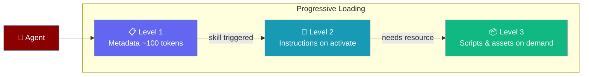
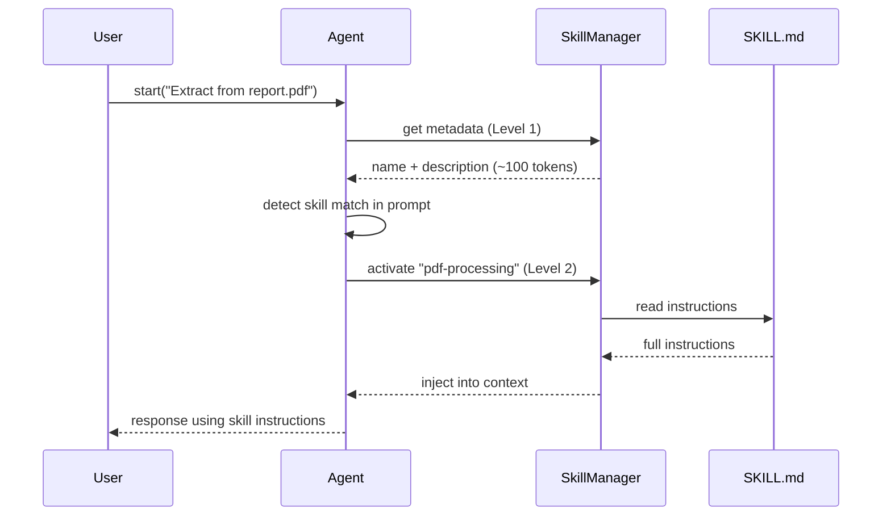
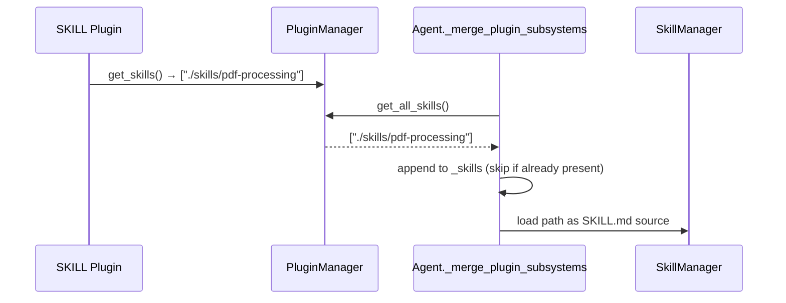

Skills extend agents with specialised knowledge and instructions loaded on demand, keeping context lean until the skill is needed.

```python
from praisonaiagents import Agent

agent = Agent(
    name="PDF Assistant",
    instructions="You are a helpful assistant.",
    skills=["./skills/pdf-processing"],
)
agent.start("Extract the main findings from report.pdf")
```

The user asks about a document; the agent loads the matching skill only when the task needs it.


```mermaid
graph LR
    subgraph "Progressive Loading"
        META["📋 Level 1\nMetadata ~100 tokens"]
        INST["📄 Level 2\nInstructions on activate"]
        RES["📦 Level 3\nScripts & assets on demand"]
    end

    Agent["🤖 Agent"] --> META
    META -->|"skill triggered"| INST
    INST -->|"needs resource"| RES

    classDef agent fill:#8B0000,stroke:#7C90A0,color:#fff
    classDef tool fill:#189AB4,stroke:#7C90A0,color:#fff
    classDef success fill:#10B981,stroke:#7C90A0,color:#fff
    classDef config fill:#6366F1,stroke:#7C90A0,color:#fff

    class Agent agent
    class META config
    class INST tool
    class RES success
```

<Note>
**Agent-created skills are staged for approval by default.** When an agent calls `skill_manage` to create, edit, or delete a skill, the mutation is held in a pending store until a human approves it — disk is not touched. Reading and using existing skills is unaffected. See [Skill Manage](/features/skill-manage) for the full approval gate docs.
</Note>

<Tip>
**Want to group several skills under one name?** See [Skill Bundles](/features/skill-bundles) — a single `@bundle` selector expands to a full set of skills.
</Tip>

<Tip>
**Want to generate a skill from your own repo or docs?** See [Learn a Skill from Sources](/features/learn-skill) — one command turns code/docs/PDFs into a grounded `SKILL.md`.
</Tip>

<Tip>
**Graceful fallback for missing tools?** Use `fallback_for_tools` in a skill's frontmatter to offer the skill only when a real tool is absent. See [Skill Fallback](/features/skill-fallback).
</Tip>

<Tip>
**Distribute skills across a team from a git repo?** See [Remote Skill Sources](/features/skills-remote-sources) — one command syncs a shared skill set into every project's cache.
</Tip>


## Quick Start

<Steps>
<Step title="Simple Usage">
Pass skill directory paths to `skills`:

```python
from praisonaiagents import Agent

agent = Agent(
    name="PDF Assistant",
    instructions="You are a helpful assistant.",
    skills=["./skills/pdf-processing"]
)

result = agent.start("Extract the main findings from report.pdf")
```
</Step>

<Step title="With Configuration">
Use `SkillsConfig` for auto-discovery from multiple directories:

```python
from praisonaiagents import Agent, SkillsConfig

agent = Agent(
    name="Multi-Skill Agent",
    instructions="You are a versatile assistant.",
    skills=SkillsConfig(
        paths=["./skills/pdf-processing"],
        dirs=["./skills"],
        auto_discover=True,
    )
)

result = agent.start("Process the quarterly report")
```
</Step>
</Steps>

---

## How It Works


```mermaid
sequenceDiagram
    participant User
    participant Agent
    participant SkillManager
    participant SKILL.md

    User->>Agent: start("Extract from report.pdf")
    Agent->>SkillManager: get metadata (Level 1)
    SkillManager-->>Agent: name + description (~100 tokens)
    Agent->>Agent: detect skill match in prompt
    Agent->>SkillManager: activate "pdf-processing" (Level 2)
    SkillManager->>SKILL.md: read instructions
    SKILL.md-->>SkillManager: full instructions
    SkillManager-->>Agent: inject into context
    Agent-->>User: response using skill instructions
```

Skills use three levels of progressive disclosure:

| Level | What Loads | Tokens |
|-------|-----------|--------|
| 1 — Metadata | Name + description (at startup) | ~100 |
| 2 — Instructions | Full `SKILL.md` body (when activated) | under 5,000 |
| 3 — Resources | Scripts, references, assets (on demand) | Variable |

---

## SKILL.md Format

Each skill is a directory containing a `SKILL.md` file:

```
pdf-processing/
├── SKILL.md          # Required
├── scripts/          # Optional
├── references/       # Optional
└── assets/           # Optional
```

```markdown
---
name: pdf-processing
description: Process and extract information from PDF documents. Use this skill when the user asks to read, analyze, or extract data from PDF files.
license: Apache-2.0
---

# PDF Processing Skill

## Instructions

1. Verify the PDF file exists
2. Read the PDF content
3. Extract text while preserving structure
```

### Required Fields

| Field | Constraints |
|-------|-------------|
| `name` | 1–64 chars, lowercase, hyphens only, matches directory name |
| `description` | 1–1024 chars — tells the agent when to use this skill |

### Optional Fields

| Field | Description |
|-------|-------------|
| `license` | License identifier (e.g., `Apache-2.0`, `MIT`) |
| `compatibility` | Compatibility notes (max 500 chars) |
| `metadata` | Key-value map for custom properties |
| `allowed-tools` | Space-delimited list of tools the skill requires |

<Note>
**`allowed-tools` grants are scoped to this agent instance.** When an agent activates a skill, the tools listed in `allowed-tools` are auto-approved for **that agent only** — the grant is keyed by a unique per-instance id (not the display name). Two `Agent()` instances that share a `name` (including the default `"Agent"`) never share skill grants.
</Note>

---

## Configuration Options

<Card title="SkillsConfig SDK Reference" icon="code" href="/sdk/reference/praisonaiagents/modules/feature_configs">
  Full parameter reference for SkillsConfig
</Card>

The most common options at a glance:

| Option | Type | Default | Description |
|--------|------|---------|-------------|
| `paths` | `List[str]` | `[]` | Direct skill directory paths to load |
| `dirs` | `List[str]` | `[]` | Directories to scan for skill subdirectories |
| `auto_discover` | `bool` | `False` | Auto-discover from default locations (`~/.praisonai/skills/`, etc.) |

### Default Discovery Locations

Skills auto-discovered (in order of precedence):
1. `./.praisonai/skills/` or `./.claude/skills/`
2. `~/.praisonai/skills/`
3. `~/.praisonai/cache/remote-skills/*/current/` (populated by `praisonai skills sync` — see [Remote Skill Sources](/features/skills-remote-sources))
4. `/etc/praison/skills/`

---

## Common Patterns

### Single Skill

```python
from praisonaiagents import Agent

agent = Agent(
    name="Code Reviewer",
    instructions="You are a code review expert.",
    skills=["./skills/code-review"]
)

result = agent.start("Review this Python function for potential bugs")
```

### Multiple Skills from Directory

```python
from praisonaiagents import Agent

agent = Agent(
    name="Multi-Expert",
    instructions="You are an expert assistant.",
    skills=SkillsConfig(dirs=["./company-skills"])
)

result = agent.start("Summarize the latest sales data from report.pdf")
```

### Creating a SKILL.md

```bash
praisonai skills create --name my-skill --description "My custom capability"
```

This creates the directory structure and template `SKILL.md` you can fill in.

---

## Skills from Plugins

A plugin declared `PluginType.SKILL` that returns filesystem path strings from `get_skills()` has those paths appended to the Agent's `_skills`. `SkillManager` then loads them as real `SKILL.md` sources — the same as user-configured skill dirs.

```python
from praisonaiagents import Agent, Plugin, PluginInfo, PluginType
from praisonaiagents.plugins import get_plugin_manager

class PdfSkillPlugin(Plugin):
    @property
    def info(self):
        return PluginInfo(name="pdf_skill", plugin_type=PluginType.SKILL)
    def get_skills(self):
        return ["./skills/pdf-processing"]   # a dir containing SKILL.md

get_plugin_manager().register(PdfSkillPlugin())
get_plugin_manager().enable("pdf_skill")

agent = Agent(name="PDF Assistant", instructions="You are a helpful assistant.")
# ./skills/pdf-processing is now on agent._skills — no skills= parameter needed.
agent.start("Extract the main findings from report.pdf")
```

On `Agent.__init__`, `_merge_plugin_subsystems()` calls `PluginManager.get_all_skills()` and appends each string path to `self._skills`:


```mermaid
sequenceDiagram
    participant Plugin as SKILL Plugin
    participant Mgr as PluginManager
    participant Merge as Agent._merge_plugin_subsystems
    participant SM as SkillManager

    Plugin->>Mgr: get_skills() → ["./skills/pdf-processing"]
    Merge->>Mgr: get_all_skills()
    Mgr-->>Merge: ["./skills/pdf-processing"]
    Merge->>Merge: append to _skills (skip if already present)
    Merge->>SM: load path as SKILL.md source
```

### Rules

- Entries must be **string** paths to skill directories (each containing `SKILL.md`). Non-string entries (e.g. objects) are **logged and skipped** — `SkillManager.add_skill(path)` resolves each entry via `Path(...)`.
- **Duplicate paths are de-duplicated** on merge (the append checks `if skill not in current`).

| Situation | Behaviour |
|---|---|
| Plugin returns a string path | Appended to `_skills` and loaded by `SkillManager`. |
| Plugin returns a non-string entry | Skipped with a warning. |
| Path already in `_skills` | Silently de-duplicated. |
| Plugin declared `PluginType.HOOK` (not `SKILL`) | Not collected — `get_skills()` output is ignored. |
| Plugin disabled | Not collected — enabled-only iteration under the manager lock. |
| `get_skills()` raises | Warning logged, other plugins keep loading, Agent construction succeeds. |

See [Typed Plugins (Guardrail / Policy / Skill)](/features/plugins#typed-plugins-guardrail--policy--skill) for the full plugin-side reference.

---

## Best Practices

<AccordionGroup>
  <Accordion title="Write trigger-aware descriptions">
    The `description` field tells the agent when to activate the skill. Write it as a trigger sentence: "Use this skill when the user asks to process PDF files" — not just "Handles PDFs".
  </Accordion>
  <Accordion title="Keep instructions focused">
    Level 2 instructions inject into the agent's context. Keep them under 5,000 tokens and focused on the specific task — don't repeat general knowledge the LLM already has.
  </Accordion>
  <Accordion title="Put heavy content in resources">
    Reference documentation, example data, and large scripts belong in `references/` or `scripts/` (Level 3). They load only when explicitly needed, keeping context lean.
  </Accordion>
  <Accordion title="Match directory name to skill name">
    The directory name must exactly match the `name` field in `SKILL.md`. Use `praisonai skills validate --path ./my-skill` to catch mismatches before deploying.
  </Accordion>
</AccordionGroup>

---

## Group Skills into Bundles

Bundle multiple skills into a named set and select them with a single `@name` selector.

```python
from praisonaiagents import Agent

agent = Agent(
    name="Backend Dev",
    instructions="Help with backend engineering tasks.",
    skills=["@backend-dev"],
)
agent.start("Refactor the users table migration.")
```

Create a `bundles/backend-dev.yaml` in your skills directory to define the bundle:

```yaml
name: backend-dev
description: Everything a backend engineer needs
skills:
  - pdf-processing
  - sql-runner
  - repo-search
```

See [Skill Bundles](/features/skill-bundles) for the full guide.

---

## Related

<CardGroup cols={2}>
  <Card title="Skill Bundles" icon="box" href="/features/skill-bundles">
    Group skills into named bundles and select with @name
  </Card>
  <Card title="Skill Invocation" icon="slash" href="/features/skills-invocation">
    Slash commands, argument substitution, and invocation policy
  </Card>
  <Card title="Skill Manage" icon="wand-magic-sparkles" href="/features/skill-manage">
    Let agents create and edit skills with human approval
  </Card>
  <Card title="Skills vs Tools" icon="puzzle-piece" href="/features/skills-vs-tools">
    When to use SKILL.md knowledge vs executable tools
  </Card>
  <Card title="Remote Skill Sources" icon="cloud-arrow-down" href="/features/skills-remote-sources">
    Distribute skills from a git URL that stay synced automatically
  </Card>
  <Card title="Knowledge" icon="book" href="/features/knowledge">
    Give agents access to documents and vector search
  </Card>
</CardGroup>
