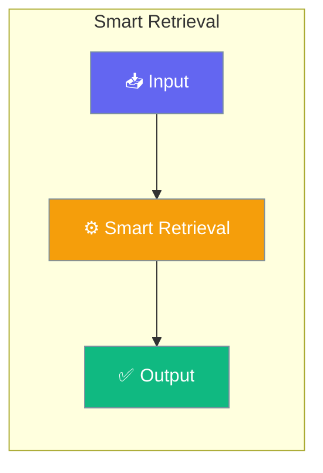

# Smart Retrieval

Smart retrieval combines multiple search techniques for optimal relevance: keyword prefiltering, semantic search, and reranking.




## Overview

The SmartRetriever provides:
- **Hybrid search** combining keyword (BM25) and semantic search
- **Keyword prefiltering** for efficient candidate selection
- **Semantic reranking** for improved relevance
- **Score normalization** across different search methods

## Quick Start


<Steps>
<Step title="Quick Start">
```python
from praisonaiagents.rag import SmartRetriever, RetrievalResult

retriever = SmartRetriever()

# Basic search
results = retriever.search(
    query="What is the API authentication method?",
    top_k=5,
)

for result in results:
    print(f"Score: {result.score:.3f} - {result.text[:100]}...")
```
</Step>
</Steps>


## Best Practices

<AccordionGroup>
  <Accordion title="Start simple">
    Enable the feature with a single parameter before adding configuration. Verify it works, then layer in options.
  </Accordion>
  <Accordion title="Use environment variables for secrets">
    Never hardcode API keys or tokens. Use `os.getenv("KEY_NAME")` to read from environment variables.
  </Accordion>
  <Accordion title="Test with minimal examples first">
    Copy the Quick Start example, run it, then extend it. This confirms your environment is set up correctly.
  </Accordion>
  <Accordion title="Check the logs">
    Set `verbose=True` on your agent to see detailed execution logs when debugging unexpected behavior.
  </Accordion>
</AccordionGroup>

## Related

<CardGroup cols={2}>
  <Card title="Features Overview" icon="grid-2" href="/docs/features">
    Browse all PraisonAI features
  </Card>
  <Card title="Quick Start" icon="rocket" href="/docs/introduction">
    Get started with PraisonAI agents
  </Card>
</CardGroup>
