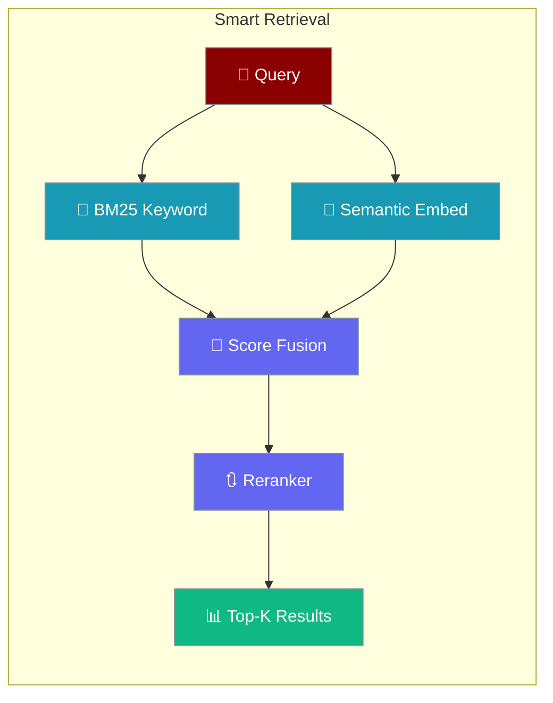
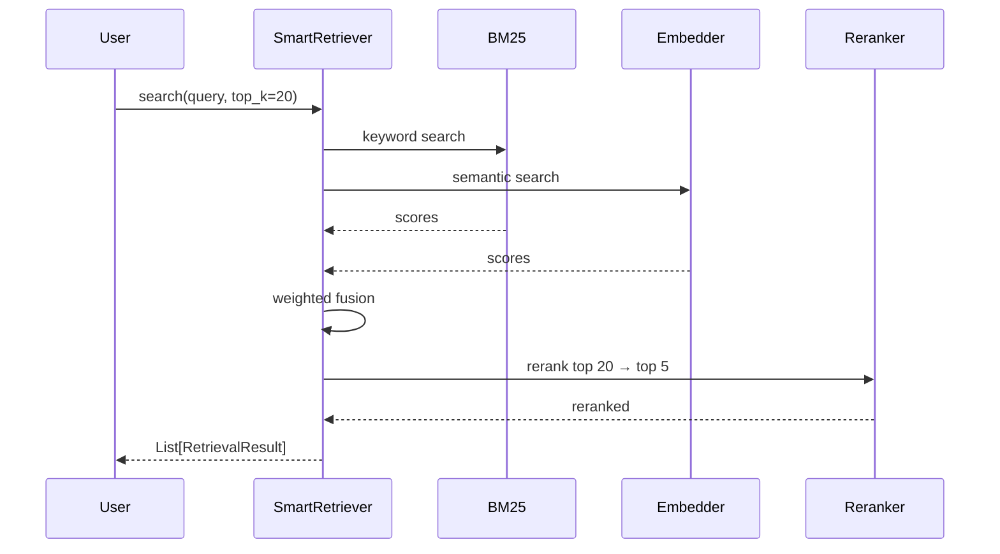

Smart retrieval combines multiple search techniques for optimal relevance: keyword prefiltering, semantic search, and reranking.

## Quick Start

<Steps>
<Step title="Basic semantic search">
```python
from praisonaiagents.rag import SmartRetriever

retriever = SmartRetriever()
results = retriever.search(
    query="What is the API authentication method?",
    top_k=5,
)
for r in results:
    print(f"Score: {r.score:.3f} - {r.text[:100]}...")
```
</Step>

<Step title="Hybrid search with reranking">
```python
retriever = SmartRetriever(use_hybrid=True, use_reranking=True)
initial = retriever.search(query, top_k=20)
reranked = retriever.rerank(query, initial, top_k=5)
```
</Step>
</Steps>

---

## How It Works



---

## Overview

The SmartRetriever provides:
- **Hybrid search** combining keyword (BM25) and semantic search
- **Keyword prefiltering** for efficient candidate selection
- **Semantic reranking** for improved relevance
- **Score normalization** across different search methods

## Hybrid Search

### Combining Keyword and Semantic Search

```python
from praisonaiagents.rag import SmartRetriever

retriever = SmartRetriever(
    use_hybrid=True,
    keyword_weight=0.3,
    semantic_weight=0.7,
)

results = retriever.search(
    query="authentication API key",
    top_k=10,
)
```

### How Hybrid Search Works

1. **Keyword Search (BM25)** - Fast lexical matching
2. **Semantic Search** - Embedding-based similarity
3. **Score Fusion** - Weighted combination of scores
4. **Deduplication** - Remove duplicate results

## Reranking

### Using the Reranker

```python
from praisonaiagents.rag import SmartRetriever, RetrievalResult

retriever = SmartRetriever()

# Initial search with more candidates
initial_results = retriever.search(query, top_k=20)

# Rerank to get best results
reranked = retriever.rerank(
    query=query,
    results=initial_results,
    top_k=5,
)
```

### Custom Reranker

```python
from praisonaiagents.rag import RerankerProtocol, RetrievalResult
from typing import List

class CustomReranker(RerankerProtocol):
    def rerank(
        self,
        query: str,
        results: List[RetrievalResult],
        top_k: int = 5,
    ) -> List[RetrievalResult]:
        # Custom reranking logic
        scored = []
        for result in results:
            # Calculate custom relevance score
            score = self._calculate_relevance(query, result.text)
            scored.append((score, result))
        
        # Sort by score and return top_k
        scored.sort(key=lambda x: x[0], reverse=True)
        return [r for _, r in scored[:top_k]]
    
    def _calculate_relevance(self, query: str, text: str) -> float:
        # Implement custom scoring
        overlap = len(set(query.lower().split()) & set(text.lower().split()))
        return overlap / max(len(query.split()), 1)
```

## Retrieval Results

### RetrievalResult Structure

```python
from dataclasses import dataclass
from typing import Dict, Any

@dataclass
class RetrievalResult:
    text: str
    score: float
    metadata: Dict[str, Any] = None
    source: str = None
    chunk_id: str = None
```

### Working with Results

```python
results = retriever.search(query, top_k=5)

for result in results:
    print(f"Score: {result.score:.3f}")
    print(f"Text: {result.text[:200]}...")
    print(f"Source: {result.metadata.get('source', 'unknown')}")
    print("---")
```

## CLI Usage

```bash
# Basic search
praisonai knowledge search "API authentication"

# Search with reranking
praisonai knowledge search "API authentication" --rerank

# Search with specific top_k
praisonai knowledge search "API authentication" --top-k 10

# Verbose output
praisonai knowledge search "API authentication" --rerank --verbose
```

## Integration with Agents

```python
from praisonaiagents import Agent

agent = Agent(
    name="SmartSearchAgent",
    instructions="Answer questions using the knowledge base.",
    knowledge={
        "sources": ["./docs"],
        "retrieval_k": 10,
        "rerank": True,
        "retrieval_threshold": 0.5,
    }
)

response = agent.chat("How do I authenticate with the API?")
```

## Best Practices

<AccordionGroup>
<Accordion title="Use hybrid search for technical corpora">
Code and API documentation benefit from BM25 keyword matching alongside semantic search. Set `keyword_weight=0.4` for technical content.
</Accordion>

<Accordion title="Enable reranking for quality-critical use cases">
Reranking adds ~100-200ms but significantly improves result ordering. Enable it when precision matters more than latency.
</Accordion>

<Accordion title="Retrieve more candidates before reranking">
Search with `top_k=20`, then rerank to `top_k=5`. More candidates gives the reranker better options to work with.
</Accordion>

<Accordion title="Set min_score to filter noise">
Pass `min_score=0.5` to `search()` to discard low-confidence results before they reach the LLM.
</Accordion>
</AccordionGroup>

---

## Related

<CardGroup cols={2}>
<Card title="Retrieval Strategies" icon="route" href="/features/retrieval-strategies">
  Automatic strategy selection by corpus size
</Card>
<Card title="Quality-Based RAG" icon="star-half-stroke" href="/features/quality-based-rag">
  Multi-dimensional quality scoring for retrieved content
</Card>
</CardGroup>

## API Reference

### SmartRetriever

```python
class SmartRetriever:
    def __init__(
        self,
        use_hybrid: bool = False,
        keyword_weight: float = 0.3,
        semantic_weight: float = 0.7,
        use_reranking: bool = False,
    ):
        """Initialize smart retriever."""
    
    def search(
        self,
        query: str,
        top_k: int = 5,
        min_score: float = 0.0,
    ) -> List[RetrievalResult]:
        """Search for relevant documents."""
    
    def rerank(
        self,
        query: str,
        results: List[RetrievalResult],
        top_k: int = 5,
    ) -> List[RetrievalResult]:
        """Rerank results for improved relevance."""
```

### RetrieverProtocol

```python
class RetrieverProtocol(Protocol):
    def search(
        self,
        query: str,
        top_k: int = 5,
    ) -> List[RetrievalResult]:
        """Search for relevant documents."""
```

### RerankerProtocol

```python
class RerankerProtocol(Protocol):
    def rerank(
        self,
        query: str,
        results: List[RetrievalResult],
        top_k: int = 5,
    ) -> List[RetrievalResult]:
        """Rerank results."""
```
