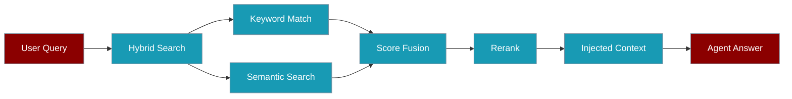

Give agents sharper answers from large knowledge bases by combining keyword matching, semantic search, and reranking.

```python
from praisonaiagents import Agent

agent = Agent(
    name="Research Agent",
    instructions="Answer from the knowledge base.",
    knowledge={"sources": ["docs/"], "retrieval_k": 10, "rerank": True},
)
response = agent.start("How does API authentication work?")
```



## Quick Start

<Steps>
<Step title="Simple Usage">

Enable reranking on the agent's knowledge config:

```python
from praisonaiagents import Agent

agent = Agent(
    name="Research Agent",
    instructions="Answer from the knowledge base.",
    knowledge={"sources": ["docs/"], "retrieval_k": 10, "rerank": True},
)
response = agent.start("How does API authentication work?")
```

</Step>

<Step title="With Configuration">

Use `KnowledgeConfig` for chunking, vector store, and rerank model:

```python
from praisonaiagents import Agent, KnowledgeConfig

agent = Agent(
    name="Research Agent",
    instructions="Answer from the knowledge base.",
    knowledge=KnowledgeConfig(
        sources=["docs/"],
        retrieval_k=10,
        rerank=True,
        rerank_model="cohere/rerank-english-v3.0",
    ),
)
response = agent.start("How does API authentication work?")
```

</Step>
</Steps>

---

## How It Works

| Stage | What it does |
|-------|--------------|
| **Keyword search** | Fast lexical matching (BM25-style) |
| **Semantic search** | Embedding similarity over chunks |
| **Score fusion** | Combines keyword and semantic scores |
| **Reranking** | Re-scores top candidates for relevance |

Strategy selection scales with corpus size — see [Retrieval Strategies](/docs/features/retrieval-strategies).

---

## Advanced: SmartRetriever

For direct control over retrieval strategy and filters, use `SmartRetriever` with a `Knowledge` instance:

```python
from praisonaiagents import Knowledge
from praisonaiagents.rag import SmartRetriever

knowledge = Knowledge(sources=["docs/"])
retriever = SmartRetriever(knowledge=knowledge)

result = retriever.retrieve(
    query="API authentication method",
    strategy="reranked",
    top_k=5,
)

for chunk in result.chunks:
    print(chunk.get("text", "")[:100])
```

---

## CLI Usage

```bash
praisonai knowledge search "API authentication" --rerank --top-k 10
```

---

## Best Practices

<AccordionGroup>
<Accordion title="Enable rerank for large corpora">
Reranking adds latency but improves relevance once you have hundreds of chunks. Start with `rerank=True` when answers feel noisy.
</Accordion>

<Accordion title="Tune retrieval_k before reranking">
Fetch more candidates (`retrieval_k=10–20`) so the reranker has enough to choose from, then let the agent inject the top results.
</Accordion>

<Accordion title="Use hybrid strategies at scale">
For technical docs with exact terms, rely on automatic strategy selection — hybrid and reranked modes combine keyword and semantic signals.
</Accordion>

<Accordion title="Scope by user or agent">
Pass `user_id` or `agent_id` to `SmartRetriever.retrieve()` when isolating knowledge per tenant or sub-agent.
</Accordion>
</AccordionGroup>

---

## Related

<CardGroup cols={2}>
<Card title="Retrieval Strategies" icon="route" href="/docs/features/retrieval-strategies">
  Automatic strategy selection by corpus size
</Card>
<Card title="Retrieval Configuration" icon="magnifying-glass" href="/docs/features/retrieval">
  Configure retrieval behaviour on agents
</Card>
</CardGroup>
