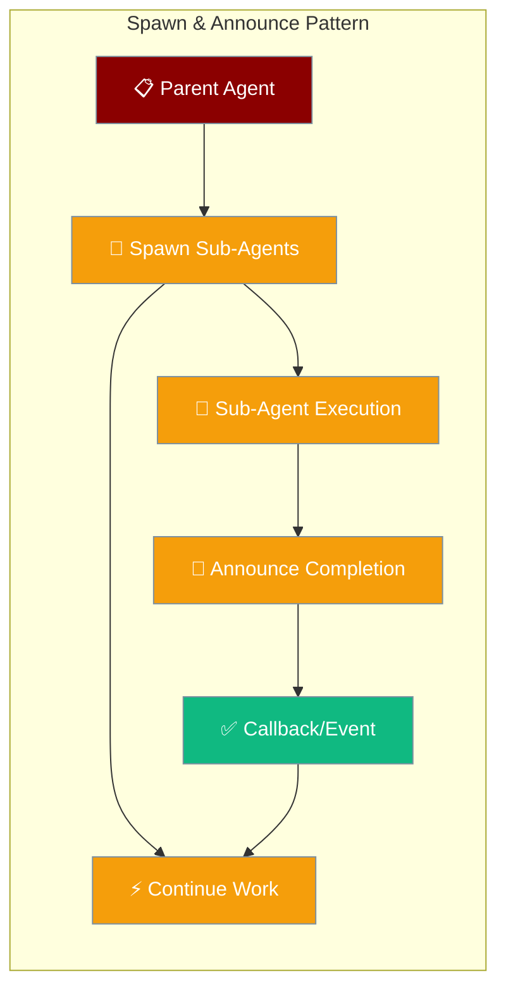
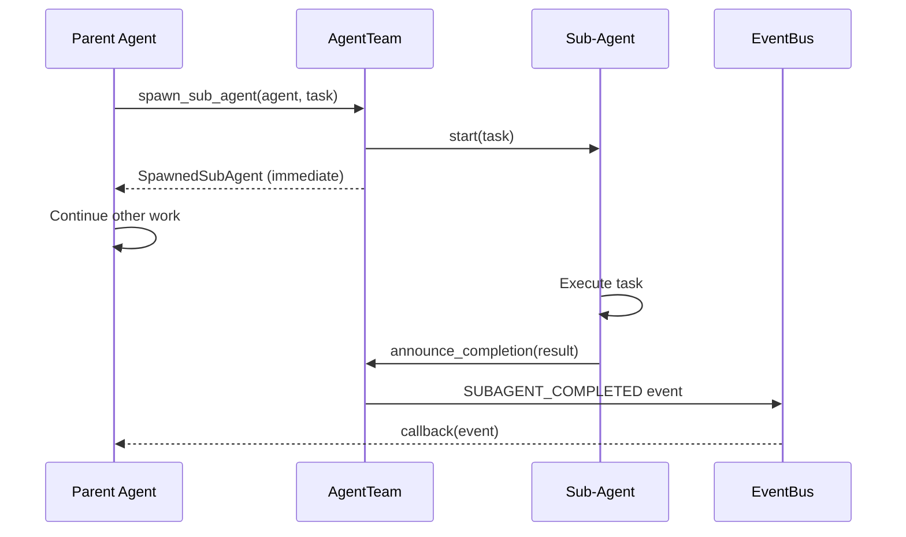
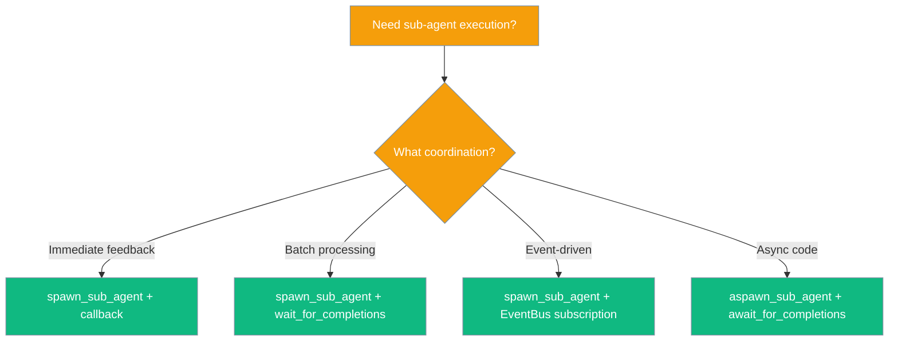

Spawn & Announce lets a parent agent delegate work to sub-agents without blocking — fire tasks in parallel and collect results via callbacks or the event bus.

```python
from praisonaiagents import Agent, AgentTeam, Task

team = AgentTeam(agents=[], name="research_team")

researcher = Agent(name="Researcher", instructions="Research the topic briefly.")
task = Task(description="What is quantum computing?")

team.spawn_sub_agent(researcher, task)
# Parent continues immediately — no blocking
```



## Quick Start

<Steps>
<Step title="Simple Spawn with Callback">
Fire-and-forget pattern with immediate feedback.

```python
from praisonaiagents import Agent, AgentTeam, Task

team = AgentTeam(agents=[], name="my_team")

researcher = Agent(name="Researcher", instructions="Research the topic briefly.")
task = Task(description="What is quantum computing?")

def on_done(event):
    print(f"Sub-agent {event.agent_id} done: {event.result}")

team.spawn_sub_agent(researcher, task, completion_callback=on_done)
# Parent continues immediately — no blocking
```

</Step>

<Step title="Parallel Fan-out Pattern">
Spawn multiple sub-agents, do other work, then collect results.

```python
from praisonaiagents import Agent, AgentTeam, Task

team = AgentTeam(agents=[], name="research_team")

agents = [
    Agent(name="Researcher", instructions="Research briefly."),
    Agent(name="Writer", instructions="Write briefly."),
    Agent(name="Analyst", instructions="Analyze briefly."),
]
tasks = [
    Task(description="Research AI trends"),
    Task(description="Write a tagline about AI"),
    Task(description="List one risk of AI"),
]

for agent, task in zip(agents, tasks):
    team.spawn_sub_agent(agent, task)

# Do other work here while sub-agents run in parallel...

completions = team.wait_for_completions(timeout=60.0)
for c in completions:
    print(c.agent_id, "->", c.result)
```

</Step>
</Steps>

---

## How It Works

The spawn-announce pattern uses an event-driven architecture to coordinate between parent and sub-agents.



| Component | Role |
|-----------|------|
| **Parent Agent** | Spawns sub-agents, continues work non-blocking |
| **Sub-Agent** | Executes task, announces completion when done |
| **AgentTeam** | Orchestrates spawning and event coordination |
| **EventBus** | Delivers completion events to callbacks |

---

## Choosing Your Pattern

Different use cases require different coordination patterns.



---

## Common Patterns

### Fire-and-Forget with Callback

Best for immediate processing of sub-agent results.

```python
from praisonaiagents import Agent, AgentTeam, Task

team = AgentTeam(agents=[], name="callback_team")

def process_result(event):
    if event.success:
        print(f"✅ {event.agent_id}: {event.result}")
    else:
        print(f"❌ {event.agent_id}: {event.error}")

team.spawn_sub_agent(
    Agent(name="Worker", instructions="Answer in one line."),
    Task(description="Say hello."),
    completion_callback=process_result
)
```

### Parallel Fan-out with Join

Scale work across multiple sub-agents, then combine results.

```python
from praisonaiagents import Agent, AgentTeam, Task

team = AgentTeam(agents=[], name="parallel_team")
topics = ["AI", "blockchain", "quantum computing"]

# Spawn all sub-agents
for topic in topics:
    agent = Agent(name=f"{topic}_expert", instructions=f"Expert in {topic}.")
    task = Task(description=f"Explain {topic} in one sentence.")
    team.spawn_sub_agent(agent, task)

# Collect all results
results = team.wait_for_completions(timeout=120.0)
summary = "\n".join([f"• {r.result}" for r in results if r.success])
print("Research Summary:\n" + summary)
```

### Event-Driven Coordination

React to sub-agent events without callbacks.

```python
from praisonaiagents import Agent, AgentTeam, Task
from praisonaiagents.bus import EventBus
from praisonaiagents.bus.event import EventType

bus = EventBus()

def on_subagent_event(event):
    print(f"[{event.type}] {event.data['agent_id']} - {event.data.get('result', 'spawned')}")

bus.subscribe(on_subagent_event, [
    EventType.SUBAGENT_SPAWNED.value,
    EventType.SUBAGENT_COMPLETED.value,
    EventType.SUBAGENT_ERROR.value,
])

team = AgentTeam(agents=[], name="event_team")
team._event_bus = bus  # share bus

team.spawn_sub_agent(
    Agent(name="Worker", instructions="Answer briefly."),
    Task(description="What is 2+2?"),
)
```

---

## Configuration

### spawn_sub_agent Parameters

| Parameter | Type | Default | Description |
|-----------|------|---------|-------------|
| `agent` | `Agent` | required | The agent that will execute the task. |
| `task` | `Task` or `str` | required | Task to run. If it has `.description`, that string is sent to `agent.start()`. |
| `completion_callback` | `Callable[[SubAgentCompletionEvent], Any]` | `None` | Called once the sub-agent finishes. |
| `metadata` | `Dict[str, Any]` | `None` | Free-form metadata stored on the `SpawnedSubAgent`. |

### announce_completion Parameters

| Parameter | Type | Default | Description |
|-----------|------|---------|-------------|
| `agent_id` | `str` | required | ID returned by `spawn_sub_agent`. |
| `task_id` | `str` | required | Task ID from `SpawnedSubAgent.task_id`. |
| `result` | `Any` | required | The sub-agent's output. |
| `success` | `bool` | `True` | Whether the task succeeded. |
| `error` | `Optional[str]` | `None` | Error message if `success=False`. |
| `metadata` | `Dict[str, Any]` | `None` | Free-form metadata on the completion event. |

### wait_for_completions Parameters

| Parameter | Type | Default | Description |
|-----------|------|---------|-------------|
| `timeout` | `Optional[float]` | `None` | Max seconds to wait. `None` = wait forever (not recommended). |
| `agent_ids` | `Optional[List[str]]` | `None` | Specific IDs to wait for. `None` = wait for all currently spawned. |

---

## Async Usage

For async code, use the async variants with proper event-driven waiting.

```python
import asyncio
from praisonaiagents import Agent, AgentTeam, Task

async def main():
    team = AgentTeam(agents=[], name="async_team")
    
    agent = Agent(name="Researcher", instructions="Research briefly.")
    task = Task(description="What is RAG?")

    await team.aspawn_sub_agent(agent, task)
    completions = await team.await_for_completions(timeout=60.0)
    
    print(f"Result: {completions[0].result}")

asyncio.run(main())
```

---

## Best Practices

<AccordionGroup>
<Accordion title="Always Set Timeouts">
Prevent indefinite waiting by setting reasonable timeout values.

```python
# Good: Set timeout to prevent hanging
completions = team.wait_for_completions(timeout=60.0)

# Bad: No timeout - may wait forever
completions = team.wait_for_completions()
```
</Accordion>

<Accordion title="Use Async Variants for Async Code">
Inside `async def` functions, use `aspawn_sub_agent` and `await_for_completions`.

```python
async def process_requests():
    # Good: Async variant
    await team.aspawn_sub_agent(agent, task)
    results = await team.await_for_completions(timeout=30.0)
    
    # Bad: Blocking sync calls in async context
    team.spawn_sub_agent(agent, task)
    results = team.wait_for_completions(timeout=30.0)
```
</Accordion>

<Accordion title="Keep Callbacks Fast">
Completion callbacks should be lightweight to avoid blocking the event loop.

```python
# Good: Fast processing
def quick_callback(event):
    print(f"Done: {event.agent_id}")
    results_queue.put(event.result)

# Bad: Heavy processing in callback
def slow_callback(event):
    heavy_analysis(event.result)  # Blocks other events
    expensive_db_save(event.result)
```
</Accordion>

<Accordion title="Use Metadata for Correlation">
Attach metadata to track spawned sub-agents back to your domain context.

```python
metadata = {"request_id": "req_123", "user_id": "user_456"}
spawned = team.spawn_sub_agent(agent, task, metadata=metadata)

# Later, correlate completion back to request
def on_completion(event):
    request_id = event.metadata.get("request_id")
    notify_user_of_completion(request_id, event.result)
```
</Accordion>
</AccordionGroup>

---

## Related

<CardGroup cols={2}>
<Card title="Subagent Delegation" icon="users" href="/docs/features/subagent-delegation">
Core multi-agent coordination
</Card>
<Card title="Event Bus" icon="broadcast-tower" href="/docs/features/event-bus">
Event-driven architecture
</Card>
</CardGroup>