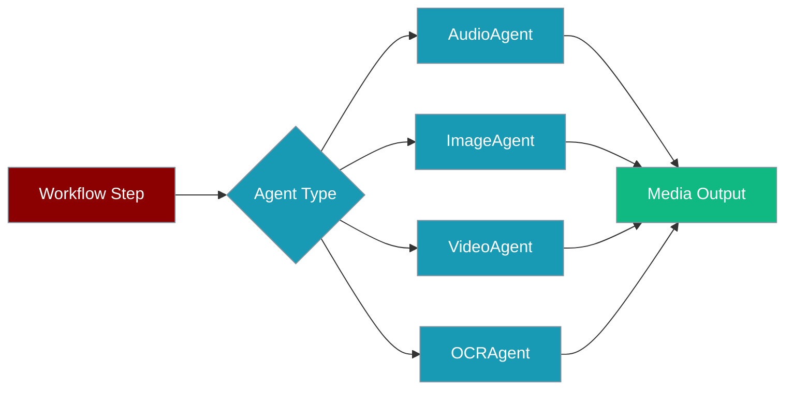

Specialised agents give your workflows domain-specific capabilities — speech, vision, video, and document extraction — from a single `agent:` field in YAML or a few lines of Python.

```python
from praisonaiagents import Agent, ImageAgent

artist = ImageAgent(llm="openai/dall-e-3")
artist.generate("A mountain landscape at sunset", output="sunset.png")
```



## Quick Start

<Steps>
<Step title="Text-to-Speech (YAML)">

```yaml
agents:
  speaker:
    agent: AudioAgent
    llm: openai/tts-1
    role: Text-to-Speech Agent
    goal: Convert text to speech

steps:
  - agent: speaker
    action: speech
    text: "Hello, welcome to PraisonAI!"
    output: "hello.mp3"
```

</Step>

<Step title="Python API">

```python
from praisonaiagents import AudioAgent, ImageAgent, VideoAgent, OCRAgent

audio = AudioAgent(llm="openai/tts-1")
audio.speech("Hello world!", output="hello.mp3")

image = ImageAgent(llm="openai/dall-e-3")
image.generate("A mountain landscape", output="sunset.png")

video = VideoAgent(llm="openai/sora-2")
video.generate("A sunset timelapse", output="timelapse.mp4")

ocr = OCRAgent(llm="mistral/mistral-ocr-latest")
text = ocr.extract("document.pdf")
```

</Step>
</Steps>

---

## Supported Agent Types

| Agent Type | Purpose | Key Methods |
|------------|---------|-------------|
| `AudioAgent` | Text-to-Speech (TTS) and Speech-to-Text (STT) | `speech()`, `transcribe()` |
| `VideoAgent` | Video generation | `generate()` |
| `ImageAgent` | Image generation, editing, variations | `generate()`, `edit()` |
| `OCRAgent` | Text extraction from documents/images | `extract()` |
| `DeepResearchAgent` | Automated research with citations | `research()` |

---

## YAML Examples

### Speech-to-Text

```yaml
agents:
  transcriber:
    agent: AudioAgent
    llm: openai/whisper-1
    role: Transcriber
    goal: Transcribe audio to text

steps:
  - agent: transcriber
    action: transcribe
    input: "recording.mp3"
```

### Document OCR

```yaml
agents:
  reader:
    agent: OCRAgent
    llm: mistral/mistral-ocr-latest
    role: Document Reader
    goal: Extract text from documents

steps:
  - agent: reader
    action: extract
    source: "document.pdf"
```

---

## CLI Usage

```bash
praisonai recipe run ai-text-to-speech --var text="Hello world"
praisonai recipe run ai-speech-to-text --var audio=recording.mp3
praisonai recipe run ai-generate-image --var prompt="A sunset"
praisonai recipe run ai-generate-video --var prompt="A cat playing"
praisonai recipe run ai-document-ocr --var source=document.pdf
```

---

## Best Practices

<AccordionGroup>
<Accordion title="Choose the right model">
Use `tts-1-hd` for higher-quality audio, `dall-e-3` for detailed images, and provider-specific OCR models for scanned PDFs.
</Accordion>

<Accordion title="Set explicit output paths">
Specialised agents produce files — always specify `output` or `source` paths so downstream steps can chain results.
</Accordion>

<Accordion title="Chain with standard agents">
Combine specialised agents with a standard `Agent` for analysis, summarisation, or formatting of media outputs.
</Accordion>

<Accordion title="Pass context between steps">
Use `{{previous_output}}` in YAML workflows to feed transcribed text or extracted content into the next agent step.
</Accordion>
</AccordionGroup>

---

## Related

<CardGroup cols={2}>
<Card title="Multi-Agent Pipelines" icon="diagram-project" href="/docs/features/multi-agent-pipelines">
  Chain specialised agents together
</Card>
<Card title="OCR" icon="file-lines" href="/docs/features/ocr">
  Detailed OCR documentation
</Card>
</CardGroup>
