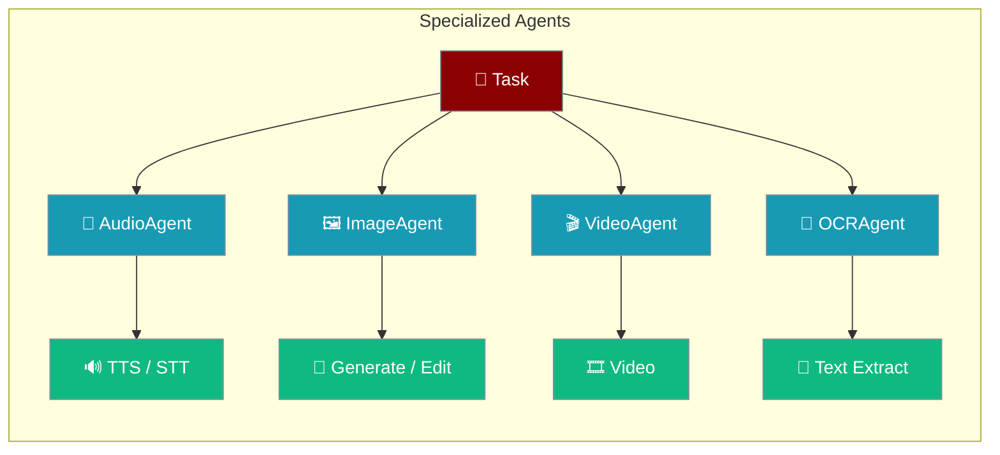
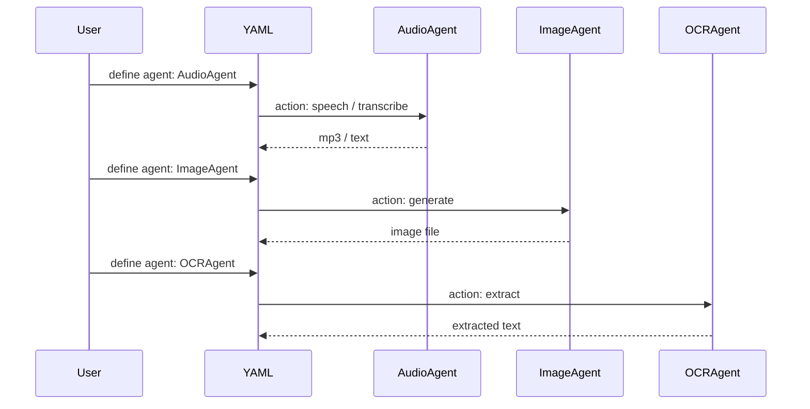

PraisonAI supports specialized agent types that provide domain-specific capabilities for media processing, document handling, and more. These agents can be used in YAML workflows using the simple `agent:` field.

## Supported Agent Types

| Agent Type | Purpose | Key Methods |
|------------|---------|-------------|
| `AudioAgent` | Text-to-Speech (TTS) and Speech-to-Text (STT) | `speech()`, `transcribe()` |
| `VideoAgent` | Video generation | `generate()` |
| `ImageAgent` | Image generation, editing, variations | `generate()`, `edit()` |
| `OCRAgent` | Text extraction from documents/images | `extract()` |
| `DeepResearchAgent` | Automated research with citations | `research()` |

## Quick Start

<Steps>
<Step title="YAML workflow with AudioAgent">
```yaml
agents:
  speaker:
    agent: AudioAgent
    llm: openai/tts-1
    role: Text-to-Speech Agent
    goal: Convert text to speech

steps:
  - agent: speaker
    action: speech
    text: "Hello, welcome to PraisonAI!"
    output: "hello.mp3"
```
</Step>

<Step title="Python API">
```python
from praisonaiagents import AudioAgent, ImageAgent, OCRAgent

audio = AudioAgent(llm="openai/tts-1")
audio.speech("Hello world!", output="hello.mp3")

image = ImageAgent(llm="openai/dall-e-3")
image.generate("A mountain landscape")

ocr = OCRAgent(llm="mistral/mistral-ocr-latest")
text = ocr.extract("document.pdf")
```
</Step>
</Steps>

---

## How It Works



---

## Supported Agent Types

| Agent Type | Purpose | Key Methods |
|------------|---------|-------------|
| `AudioAgent` | Text-to-Speech (TTS) and Speech-to-Text (STT) | `speech()`, `transcribe()` |
| `VideoAgent` | Video generation | `generate()` |
| `ImageAgent` | Image generation, editing, variations | `generate()`, `edit()` |
| `OCRAgent` | Text extraction from documents/images | `extract()` |
| `DeepResearchAgent` | Automated research with citations | `research()` |

### Speech-to-Text (STT)

```yaml
agents:
  transcriber:
    agent: AudioAgent
    llm: openai/whisper-1
    role: Transcriber
    goal: Transcribe audio to text

steps:
  - agent: transcriber
    action: transcribe
    input: "recording.mp3"
```

### Image Generation

```yaml
agents:
  artist:
    agent: ImageAgent
    llm: openai/dall-e-3
    role: Image Creator
    goal: Generate images from prompts

steps:
  - agent: artist
    action: generate
    prompt: "A beautiful sunset over mountains"
    output: "sunset.png"
```

### Video Generation

```yaml
agents:
  director:
    agent: VideoAgent
    llm: openai/sora-2
    role: Video Creator
    goal: Generate videos from prompts

steps:
  - agent: director
    action: generate
    prompt: "A cat playing with yarn"
    output: "cat.mp4"
```

### Document OCR

```yaml
agents:
  reader:
    agent: OCRAgent
    llm: mistral/mistral-ocr-latest
    role: Document Reader
    goal: Extract text from documents

steps:
  - agent: reader
    action: extract
    source: "document.pdf"
```

## Python API

You can also use specialized agents directly in Python:

```python
from praisonaiagents import AudioAgent, ImageAgent, VideoAgent, OCRAgent

# Text-to-Speech
audio = AudioAgent(llm="openai/tts-1")
audio.speech("Hello world!", output="hello.mp3")

# Speech-to-Text
audio = AudioAgent(llm="openai/whisper-1")
text = audio.transcribe("recording.mp3")

# Image Generation
image = ImageAgent(llm="openai/dall-e-3")
result = image.generate("A mountain landscape")

# Video Generation
video = VideoAgent(llm="openai/sora-2")
result = video.generate("A sunset timelapse")

# OCR
ocr = OCRAgent(llm="mistral/mistral-ocr-latest")
text = ocr.extract("document.pdf")
```

## Supported Providers

### AudioAgent (TTS)
- `openai/tts-1` - OpenAI TTS
- `openai/tts-1-hd` - OpenAI TTS HD
- `elevenlabs/eleven_multilingual_v2` - ElevenLabs
- `gemini/gemini-2.5-flash-preview-tts` - Google Gemini

### AudioAgent (STT)
- `openai/whisper-1` - OpenAI Whisper
- `groq/whisper-large-v3` - Groq Whisper
- `deepgram/nova-2` - Deepgram

### ImageAgent
- `openai/dall-e-3` - DALL-E 3
- `openai/dall-e-2` - DALL-E 2
- `vertex_ai/imagen-3.0-generate-001` - Google Imagen

### VideoAgent
- `openai/sora-2` - OpenAI Sora
- `gemini/veo-3.0-generate-preview` - Google Veo
- `runwayml/gen4_turbo` - RunwayML

### OCRAgent
- `mistral/mistral-ocr-latest` - Mistral OCR

## CLI Usage

Use specialized agents via recipes:

```bash
# Text-to-Speech
praisonai recipe run ai-text-to-speech --var text="Hello world"

# Speech-to-Text
praisonai recipe run ai-speech-to-text --var audio=recording.mp3

# Image Generation
praisonai recipe run ai-generate-image --var prompt="A sunset"

# Video Generation
praisonai recipe run ai-generate-video --var prompt="A cat playing"

# Document OCR
praisonai recipe run ai-document-ocr --var source=document.pdf
```

## Best Practices

<AccordionGroup>
<Accordion title="Choose the right model for quality">
Use `tts-1-hd` over `tts-1` when audio fidelity matters. For images, `dall-e-3` produces higher quality than `dall-e-2`.
</Accordion>

<Accordion title="Handle file outputs carefully">
Specialized agents produce files (mp3, png, mp4). Always specify `output:` paths in YAML and ensure the directory is writable before running.
</Accordion>

<Accordion title="Chain with standard agents">
Combine specialized agents with a standard `Agent` for complex workflows — e.g., research with `DeepResearchAgent`, then narrate results with `AudioAgent`.
</Accordion>

<Accordion title="Pass results between agents">
Use `{{previous_output}}` in YAML steps or `ctx.previous_result` in `AgentFlow` to pass the output of one specialized agent into the next step.
</Accordion>
</AccordionGroup>

---

## Related

<CardGroup cols={2}>
<Card title="Audio Agents" icon="music" href="/audio/overview">
  Detailed audio agent documentation for TTS and STT
</Card>
<Card title="Image Agents" icon="image" href="/image/overview">
  Detailed image generation and editing documentation
</Card>
</CardGroup>
