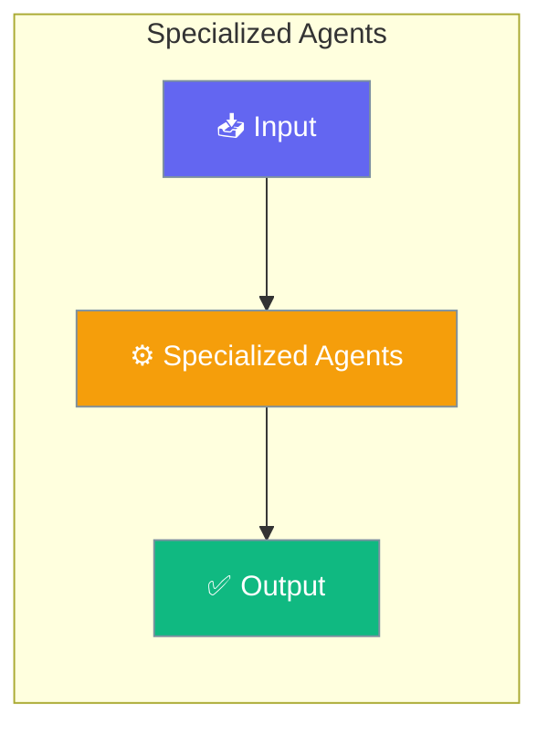

# Specialized Agents

PraisonAI supports specialized agent types that provide domain-specific capabilities for media processing, document handling, and more. These agents can be used in YAML workflows using the simple `agent:` field.




## Supported Agent Types

| Agent Type | Purpose | Key Methods |
|------------|---------|-------------|
| `AudioAgent` | Text-to-Speech (TTS) and Speech-to-Text (STT) | `speech()`, `transcribe()` |
| `VideoAgent` | Video generation | `generate()` |
| `ImageAgent` | Image generation, editing, variations | `generate()`, `edit()` |
| `OCRAgent` | Text extraction from documents/images | `extract()` |
| `DeepResearchAgent` | Automated research with citations | `research()` |

## Quick Start


<Steps>
<Step title="Simple Usage">
### Text-to-Speech (TTS)

```yaml
agents:
  speaker:
    agent: AudioAgent
    llm: openai/tts-1
    role: Text-to-Speech Agent
    goal: Convert text to speech

steps:
  - agent: speaker
    action: speech
    text: "Hello, welcome to PraisonAI!"
    output: "hello.mp3"
```
</Step>

<Step title="With Configuration">
### Speech-to-Text (STT)

```yaml
agents:
  transcriber:
    agent: AudioAgent
    llm: openai/whisper-1
    role: Transcriber
    goal: Transcribe audio to text

steps:
  - agent: transcriber
    action: transcribe
    input: "recording.mp3"
```

### Image Generation

```yaml
agents:
  artist:
    agent: ImageAgent
    llm: openai/dall-e-3
    role: Image Creator
    goal: Generate images from prompts

steps:
  - agent: artist
    action: generate
    prompt: "A beautiful sunset over mountains"
    output: "sunset.png"
```

### Video Generation

```yaml
agents:
  director:
    agent: VideoAgent
    llm: openai/sora-2
    role: Video Creator
    goal: Generate videos from prompts

steps:
  - agent: director
    action: generate
    prompt: "A cat playing with yarn"
    output: "cat.mp4"
```

### Document OCR

```yaml
agents:
  reader:
    agent: OCRAgent
    llm: mistral/mistral-ocr-latest
    role: Document Reader
    goal: Extract text from documents

steps:
  - agent: reader
    action: extract
    source: "document.pdf"
```
</Step>
</Steps>


## Best Practices

<AccordionGroup>
  <Accordion title="Start simple">
    Enable the feature with a single parameter before adding configuration. Verify it works, then layer in options.
  </Accordion>
  <Accordion title="Use environment variables for secrets">
    Never hardcode API keys or tokens. Use `os.getenv("KEY_NAME")` to read from environment variables.
  </Accordion>
  <Accordion title="Test with minimal examples first">
    Copy the Quick Start example, run it, then extend it. This confirms your environment is set up correctly.
  </Accordion>
  <Accordion title="Check the logs">
    Set `verbose=True` on your agent to see detailed execution logs when debugging unexpected behavior.
  </Accordion>
</AccordionGroup>

## Related

<CardGroup cols={2}>
  <Card title="Features Overview" icon="grid-2" href="/docs/features">
    Browse all PraisonAI features
  </Card>
  <Card title="Quick Start" icon="rocket" href="/docs/introduction">
    Get started with PraisonAI agents
  </Card>
</CardGroup>
