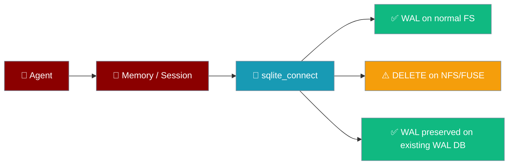
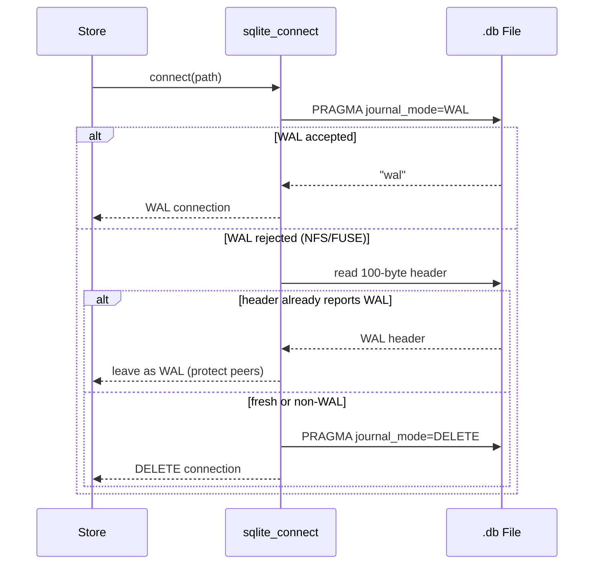
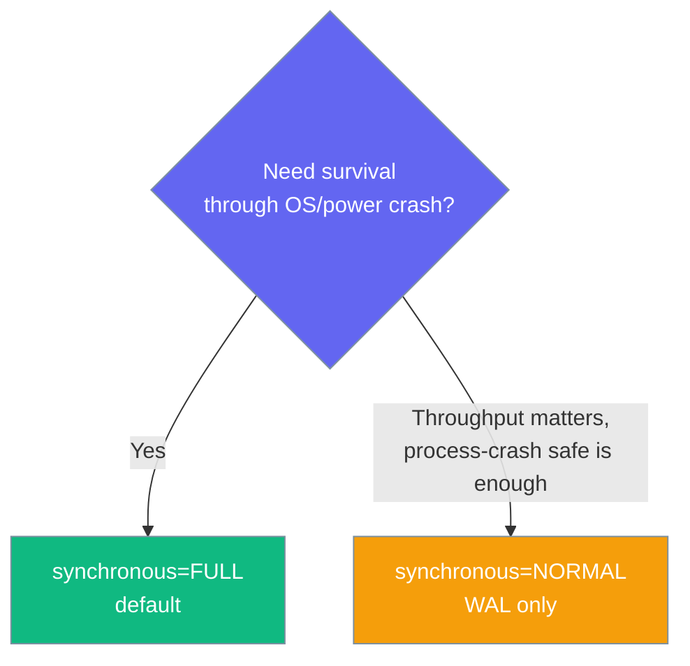

Every SQLite store PraisonAI ships uses a hardened connection factory that keeps agent memory and session data intact even on network and container filesystems, without any user configuration.



An agent running on Docker Desktop, NFS, or a Kubernetes volume keeps its memory without a single line of configuration.

## Quick Start

<Steps>
<Step title="Simple Usage">

Nothing to configure — hardening is automatic for any SQLite-backed store.

```python
from praisonaiagents import Agent

agent = Agent(
    name="Assistant",
    instructions="You are helpful.",
    memory=True,
)
agent.start("Remember my favourite colour is blue")
```

</Step>

<Step title="Custom Store">

Build your own SQLite-backed store with the hardened factory.

```python
from praisonaiagents.storage import sqlite_connect

conn = sqlite_connect("./state.db")  # WAL where supported, DELETE where not
conn.execute("CREATE TABLE IF NOT EXISTS t (x INTEGER)")
```

</Step>
</Steps>

---

## How It Works

The factory tries WAL first, then probes the on-disk header before ever falling back — so a database another connection wrote in WAL is never downgraded.



| Filesystem | Journal mode chosen | Notes |
|---|---|---|
| ext4/APFS/NTFS (local) | `WAL` | Concurrent readers with a writer |
| Docker Desktop (gRPC-FUSE) | `DELETE` (fresh DB) or `WAL` (existing WAL header) | Silent fallback, no corruption |
| NFS/SMB home dir | `DELETE` | Byte-range locking honoured |
| Fly.io / K8s network volume | `DELETE` | No `-shm` sidecar issues |
| `:memory:` | `WAL` | No fallback needed |
| Pre-existing WAL file on hostile FS | `WAL` (preserved) | Never downgraded — peer commits protected |

---

## Configuration Options

The `sqlite_connect` factory forwards unknown keyword arguments to `sqlite3.connect`.

| Option | Type | Default | Description |
|--------|------|---------|-------------|
| `path` | `str \| os.PathLike` | *required* | DB path or `":memory:"` |
| `check_same_thread` | `bool` | `False` | Forwarded to `sqlite3.connect`; core stores share connections under their own lock |
| `isolation_level` | `Optional[str]` | `""` (sqlite3 default) | `None` for autocommit |
| `busy_timeout_ms` | `int` | `5000` | `PRAGMA busy_timeout` in milliseconds |
| `synchronous` | `str` | `"FULL"` | `PRAGMA synchronous`; pass `"NORMAL"` for throughput under WAL |

---

## Common Patterns

Docker / Kubernetes / NFS deployments need no special handling — the default `Agent(memory=True)` already survives them.

```python
from praisonaiagents import Agent

agent = Agent(name="Assistant", instructions="You are helpful.", memory=True)
```

Build a custom SQLite-backed store on top of the same hardening.

```python
from praisonaiagents.storage import sqlite_connect

conn = sqlite_connect("./custom.db", busy_timeout_ms=10000)
```

Favour throughput over the last-transaction durability window with `synchronous="NORMAL"` (safe under WAL against process crashes).

```python
from praisonaiagents.storage import sqlite_connect

conn = sqlite_connect("./fast.db", synchronous="NORMAL")
```

---

## Choosing a `synchronous` Level



---

## Scope

<Note>
The core memory (STM/LTM), session, transcript, and generic `SQLiteBackend` stores use the hardened factory today. The bot/gateway wrapper stores (`_outbox`, `_dlq`, `_ingress`, approval, delivery-control, and kanban) are not wired in yet.
</Note>

---

## Best Practices

<AccordionGroup>
<Accordion title="Let the factory choose the journal mode">
Do not run `PRAGMA journal_mode=WAL` yourself — `sqlite_connect` picks WAL where it works and DELETE where it does not.
</Accordion>
<Accordion title="Keep synchronous=FULL unless you measured a bottleneck">
`FULL` survives an OS or power crash. Switch to `NORMAL` only after profiling shows a durability-vs-throughput trade-off worth making.
</Accordion>
<Accordion title="Use sqlite_connect for custom stores">
For any SQLite-backed store you build, call `sqlite_connect` instead of `sqlite3.connect` to inherit the fallback and durability defaults.
</Accordion>
<Accordion title="Expect DELETE on hostile filesystems">
On Docker Desktop, NFS, or network volumes the on-disk journal mode may be `DELETE`. This is correct behaviour, not a regression, and does not change any API.
</Accordion>
</AccordionGroup>

---

## Related

<CardGroup cols={2}>
<Card title="SQLite Persistence" icon="database" href="/features/persistence-sqlite">
  Local file database for conversations
</Card>
<Card title="SQLite Transcript Store" icon="database" href="/features/sqlite-transcript-store">
  Concurrent gateway session persistence
</Card>
<Card title="Memory" icon="brain" href="/features/memory">
  Short- and long-term agent memory
</Card>
<Card title="Session Store" icon="database" href="/features/session-store">
  Cross-session search and recall
</Card>
</CardGroup>
