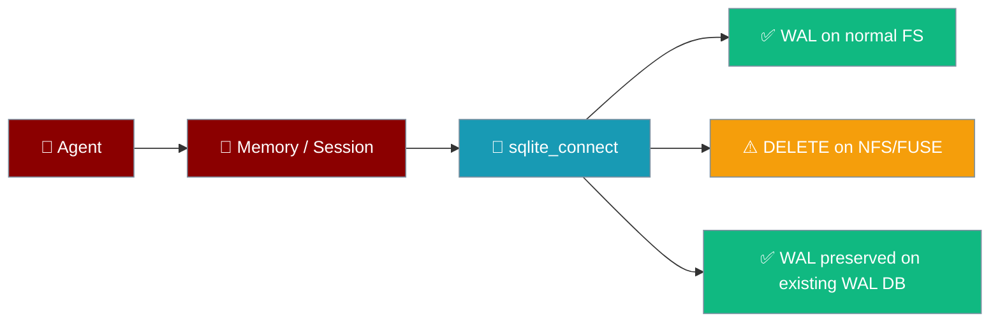
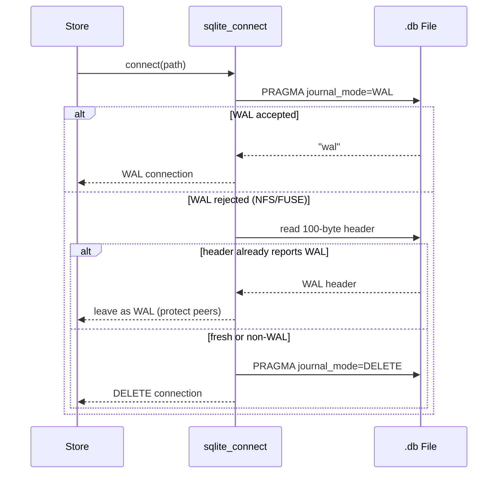
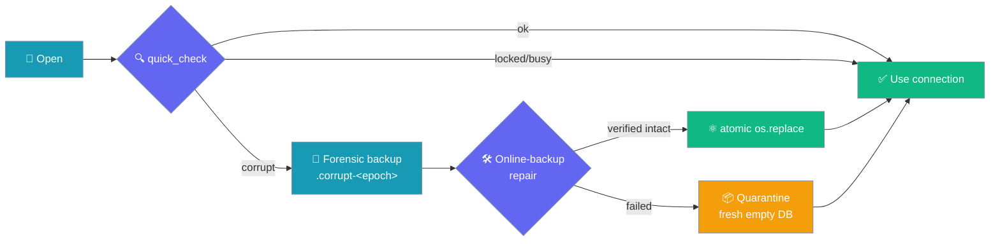
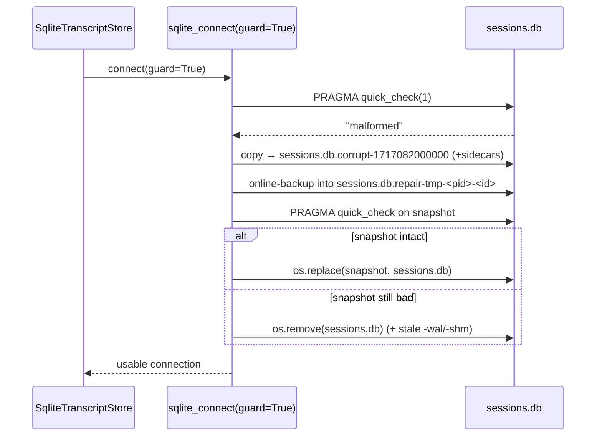
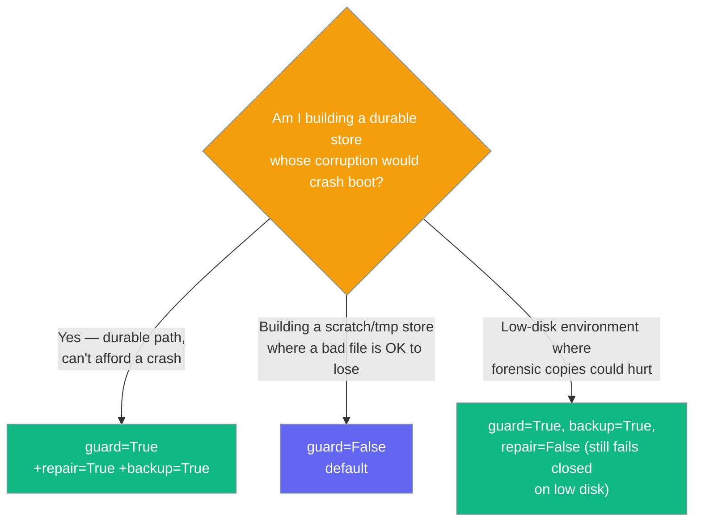
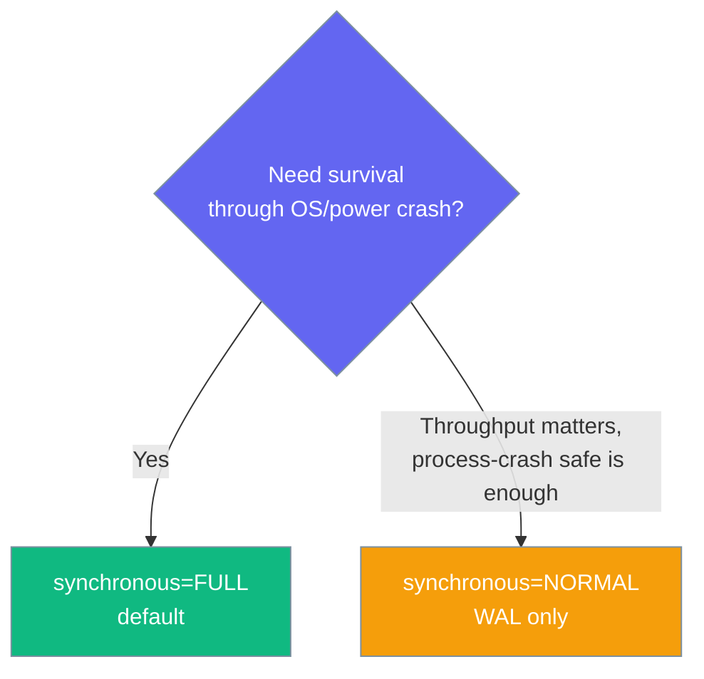

Every SQLite store PraisonAI ships uses a hardened connection factory that keeps agent memory and session data intact even on network and container filesystems, without any user configuration.



An agent running on Docker Desktop, NFS, or a Kubernetes volume keeps its memory without a single line of configuration.

## Quick Start

<Steps>
<Step title="Simple Usage">

Nothing to configure — hardening is automatic for any SQLite-backed store.

```python
from praisonaiagents import Agent

agent = Agent(
    name="Assistant",
    instructions="You are helpful.",
    memory=True,
)
agent.start("Remember my favourite colour is blue")
```

</Step>

<Step title="Custom Store">

Build your own SQLite-backed store with the hardened factory.

```python
from praisonaiagents.storage import sqlite_connect

conn = sqlite_connect("./state.db")  # WAL where supported, DELETE where not
conn.execute("CREATE TABLE IF NOT EXISTS t (x INTEGER)")
```

</Step>
</Steps>

---

## How It Works

The factory tries WAL first, then probes the on-disk header before ever falling back — so a database another connection wrote in WAL is never downgraded.



| Filesystem | Journal mode chosen | Notes |
|---|---|---|
| ext4/APFS/NTFS (local) | `WAL` | Concurrent readers with a writer |
| Docker Desktop (gRPC-FUSE) | `DELETE` (fresh DB) or `WAL` (existing WAL header) | Silent fallback, no corruption |
| NFS/SMB home dir | `DELETE` | Byte-range locking honoured |
| Fly.io / K8s network volume | `DELETE` | No `-shm` sidecar issues |
| `:memory:` | `WAL` | No fallback needed |
| Pre-existing WAL file on hostile FS | `WAL` (preserved) | Never downgraded — peer commits protected |

---

## Integrity Guard

When `guard=True`, the connector runs a cheap `quick_check` on open and — on a malformed file — forensically backs up the bad bytes and attempts a bounded, least-destructive repair before returning a usable connection. `SqliteSessionStore` and `SqliteTranscriptStore` opt in by default so a corrupt `sessions.db` no longer takes the durable path down.



### Corruption on open

A malformed database is detected, backed up, and repaired in place — or quarantined so a fresh empty DB opens instead of crashing.



The guard treats a transient `database is locked` / `database is busy` on the probe as healthy-but-busy — a peer momentarily holding the file is left exactly as-is, with no backup and no repair.

### What lands on disk

| File | When it appears | Purpose | Retention |
|------|-----------------|---------|-----------|
| `<file>.corrupt-<epoch_ms>` (+`-wal`/`-shm`) | On every corruption event with backup capacity | Preserves malformed bytes for forensics | Newest 3 per DB (older pruned) |
| `<file>.repair-tmp-<pid>-<id>` | During a repair attempt only | In-flight snapshot for online-backup rebuild | Deleted on success or failure |
| `<file>.repair` (sidecar ledger) | After a repair attempt | Counts attempts so a permanently-bad file is not re-repaired on every boot | Cleared when a repair succeeds |

The forensic backup **fails closed on low disk** — it needs `2 × file_size + 1 MiB` free, so a corruption event never itself fills the disk. Backups are retention-capped at `_MAX_FORENSIC_BACKUPS = 3` per file, and repairs are bounded at `_MAX_REPAIR_ATTEMPTS = 3` per file (tracked in the `.repair` sidecar) so a boot-loop cannot churn a permanently-bad file. These are internal capacity constants — reason about them, but don't override them.

### Public helpers

`sqlite_quick_check` is a cheap `PRAGMA quick_check(1)` wrapper that returns `False` on any malformed-image / I/O error and re-raises transient lock/busy errors so callers can tell "locked" (leave alone) apart from "corrupt" (back up + repair).

```python
from praisonaiagents.storage import sqlite_quick_check
import sqlite3

conn = sqlite3.connect("./state.db")
if not sqlite_quick_check(conn):
    print("This file failed the structural probe — consider guard=True on connect.")
```

### Should I turn guard on?



---

## Configuration Options

The `sqlite_connect` factory forwards unknown keyword arguments to `sqlite3.connect`.

| Option | Type | Default | Description |
|--------|------|---------|-------------|
| `path` | `str \| os.PathLike` | *required* | DB path or `":memory:"` |
| `check_same_thread` | `bool` | `False` | Forwarded to `sqlite3.connect`; core stores share connections under their own lock |
| `isolation_level` | `Optional[str]` | `""` (sqlite3 default) | `None` for autocommit |
| `busy_timeout_ms` | `int` | `5000` | `PRAGMA busy_timeout` in milliseconds |
| `synchronous` | `str` | `"FULL"` | `PRAGMA synchronous`; pass `"NORMAL"` for throughput under WAL |
| `guard` | `bool` | `False` | Run `quick_check` on open and, on a malformed file, forensically back it up and attempt a bounded least-destructive repair before connecting. Off by default so existing callers are unchanged. |
| `repair` | `bool` | `True` | Attempt an online-backup repair on corruption. Only takes effect when `guard=True`. Bounded by a sidecar attempt-ledger (`<file>.repair`). |
| `backup` | `bool` | `True` | Take a retention-capped, disk-space-aware forensic backup of the malformed file before repair. Only takes effect when `guard=True`. |

---

## Common Patterns

Docker / Kubernetes / NFS deployments need no special handling — the default `Agent(memory=True)` already survives them.

```python
from praisonaiagents import Agent

agent = Agent(name="Assistant", instructions="You are helpful.", memory=True)
```

Build a custom SQLite-backed store on top of the same hardening.

```python
from praisonaiagents.storage import sqlite_connect

conn = sqlite_connect("./custom.db", busy_timeout_ms=10000)
```

Favour throughput over the last-transaction durability window with `synchronous="NORMAL"` (safe under WAL against process crashes).

```python
from praisonaiagents.storage import sqlite_connect

conn = sqlite_connect("./fast.db", synchronous="NORMAL")
```

---

## Choosing a `synchronous` Level



---

## Scope

<Note>
The core memory (STM/LTM), session, transcript, and generic `SQLiteBackend` stores use the hardened factory today. The bot/gateway wrapper stores (`_outbox`, `_dlq`, `_ingress`, approval, delivery-control, and kanban) are not wired in yet.

**Integrity guard (`guard=True`) opt-in:**
- **Guard on**: `SqliteSessionStore` (session index), `SqliteTranscriptStore` (transcript store).
- **Guard off (unchanged)**: `SQLiteBackend`, memory STM, memory LTM, and the wrapper stores in `praisonai-bot/` and `praisonai/persistence`. These can opt in later by passing `guard=True` to `sqlite_connect`.
</Note>

---

## Best Practices

<AccordionGroup>
<Accordion title="Let the factory choose the journal mode">
Do not run `PRAGMA journal_mode=WAL` yourself — `sqlite_connect` picks WAL where it works and DELETE where it does not.
</Accordion>
<Accordion title="Keep synchronous=FULL unless you measured a bottleneck">
`FULL` survives an OS or power crash. Switch to `NORMAL` only after profiling shows a durability-vs-throughput trade-off worth making.
</Accordion>
<Accordion title="Use sqlite_connect for custom stores">
For any SQLite-backed store you build, call `sqlite_connect` instead of `sqlite3.connect` to inherit the fallback and durability defaults.
</Accordion>
<Accordion title="Expect DELETE on hostile filesystems">
On Docker Desktop, NFS, or network volumes the on-disk journal mode may be `DELETE`. This is correct behaviour, not a regression, and does not change any API.
</Accordion>
<Accordion title="Let the guard classify a locked file — it won't back it up">
A transient `database is locked` / `database is busy` on the `quick_check` probe is treated as healthy-but-busy, and the file is left untouched. Only a genuinely malformed image triggers a backup or repair.
</Accordion>
<Accordion title="Never rely on <file>.corrupt-* for a live copy of your data">
Those are forensic snapshots of malformed bytes, not backups. If you need real backups, run `sqlite3 .backup` or your platform's snapshotting.
</Accordion>
<Accordion title="Don't delete <file>.repair yourself">
The ledger caps repair attempts so a permanently-bad file doesn't churn on every boot. Deleting it resets the budget.
</Accordion>
<Accordion title="Turn guard=True on for any custom durable store you build with sqlite_connect">
This is what the shipped session/transcript stores do; anything else that must open reliably should follow.
</Accordion>
</AccordionGroup>

---

## Related

<CardGroup cols={2}>
<Card title="SQLite Persistence" icon="database" href="/features/persistence-sqlite">
  Local file database for conversations
</Card>
<Card title="SQLite Transcript Store" icon="database" href="/features/sqlite-transcript-store">
  Concurrent gateway session persistence
</Card>
<Card title="Memory" icon="brain" href="/features/memory">
  Short- and long-term agent memory
</Card>
<Card title="Session Store" icon="database" href="/features/session-store">
  Cross-session search and recall
</Card>
</CardGroup>
