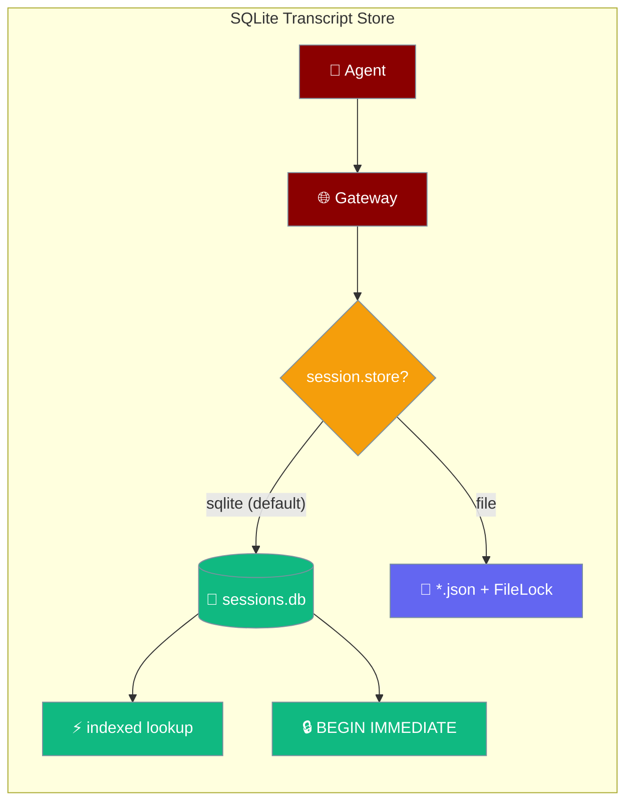
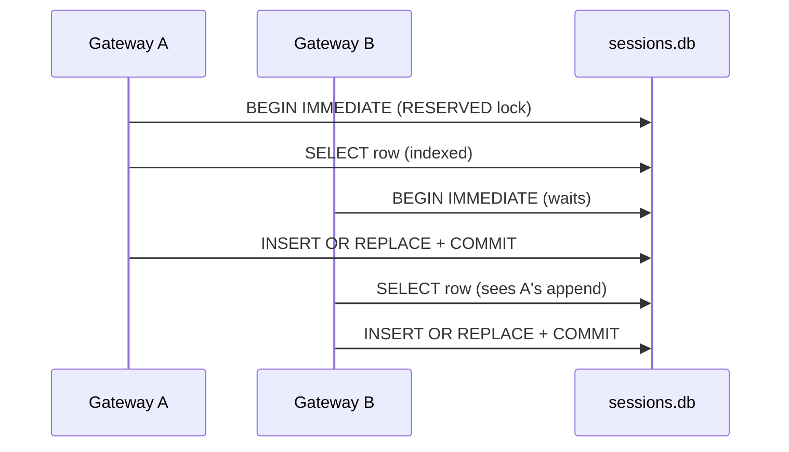
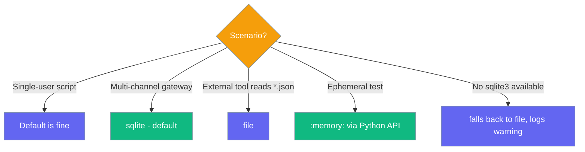

`SqliteTranscriptStore` keeps every gateway session as one row in a WAL SQLite database — the default backend whenever `session.persist` is on.



Nothing changes for a single-user Python `Agent` in a script — session APIs are identical. Only the **gateway** changes: with `session.persist: true`, transcripts now live in one `sessions.db` with concurrent readers and indexed routing instead of per-session JSON files guarded by a `FileLock`.

<Warning>
`SqliteTranscriptStore` (this page) and `SqliteSessionStore` (see [Session Store](/docs/features/session-store)) are **two different types** with two different jobs.

| | `SqliteTranscriptStore` | `SqliteSessionStore` |
|---|---|---|
| **Import** | `from praisonaiagents.session import SqliteTranscriptStore` | `from praisonaiagents.session import SqliteSessionStore` |
| **Extends** | `DefaultSessionStore` | `DefaultSessionStore` |
| **What it changes** | **Persistence** — WAL SQLite, one row per session, transactional writes | **Search** — adds an FTS5 index for cross-session recall |
| **Purpose** | Gateway concurrency (many writers, indexed routing) | Scalable search across thousands of sessions |
| **Where selected** | `session.store: sqlite` (gateway YAML) — **default** | Opt-in via `session_store=SqliteSessionStore(...)` on the Agent |
| **Requires** | Stdlib `sqlite3` only | `sqlite3` **with FTS5 compiled in** |

Choose one — running both against the same DB file is not tested.
</Warning>

## What changed by default

With `session.persist: true`, the gateway now builds `SqliteTranscriptStore` unless you opt out with `session.store: file`.

| Setting | Before | After |
|---------|--------|-------|
| Gateway backend (with `session.persist: true`) | `DefaultSessionStore` (JSON-per-session + `FileLock`) | `SqliteTranscriptStore` (WAL SQLite, one row per session) |
| Layout on disk | `~/.praisonai/sessions/*.json` | `~/.praisonai/sessions/sessions.db` |
| Concurrent-writer safety | Per-file `FileLock` | `BEGIN IMMEDIATE` transaction (RESERVED lock) |
| `list` / `search` / gateway routing | `os.listdir` + JSON-parse-every-file | Indexed `SELECT` |
| Legacy JSON on upgrade | N/A | **One-time auto-import** into `sessions.db` on first open |
| Injected `session_store=…` | Untouched | Untouched — new default only applies when the gateway builds the store |

The change is backward-compatible for API callers (public methods are identical) but visible on disk. External tools pointed at `*.json` files should either read `sessions.db` or set `session.store: file`.

## Quick Start

<Steps>

<Step title="Default (YAML) — SQLite is on">

```yaml
# gateway.yaml
session:
  persist: true
  store: sqlite            # NEW — sqlite (default) | file
  persist_path: ~/.praisonai/sessions/
```

`session.persist: true` is enough — `store: sqlite` is the default. Transcripts land in `~/.praisonai/sessions/sessions.db`.

</Step>

<Step title="Keep the legacy JSON layout">

```yaml
# gateway.yaml
session:
  persist: true
  store: file              # restore pre-#3409 JSON-per-session behaviour
  persist_path: ~/.praisonai/sessions/
```

Use `store: file` when external tooling grep-scans the individual `*.json` transcripts.

</Step>

<Step title="Python embedder using the store directly">

```python
from praisonaiagents import Agent
from praisonaiagents.session import SqliteTranscriptStore

store = SqliteTranscriptStore(db_path="~/.praisonai/sessions/sessions.db")
agent = Agent(name="Assistant", instructions="Be helpful", session_store=store)
```

An injected store always wins over the `session.store` config field.

</Step>

</Steps>

Agent scripts need no changes — the gateway persists sessions for you:

```python
from praisonaiagents import Agent

agent = Agent(name="Assistant", instructions="Be helpful")
# The gateway persists this agent's session via SqliteTranscriptStore
# — no code change, no new imports required in agent scripts.
```

---

## How It Works

Two gateway processes handling the same session serialise inside SQLite, not on a directory scan — the read-modify-write window the old `FileLock` could lose is closed by `BEGIN IMMEDIATE`.



Every read-modify-write (`add_message` and friends) runs its `SELECT` + `INSERT OR REPLACE` inside one `BEGIN IMMEDIATE` transaction, so a second gateway process cannot slip a read between this one's read and its write.

| Behaviour | Detail |
|-----------|--------|
| One-time JSON migration | On first open of a non-`:memory:` DB, any `*.json` transcripts in `session_dir` are imported **once** — only if the DB is empty. Malformed files are skipped; a summary logs at INFO. |
| Cross-process append safety | `BEGIN IMMEDIATE` grabs the RESERVED write lock and holds it to COMMIT, replacing the old cross-process `FileLock`. The process-local lock alone is not sufficient. |
| Search, no FTS5 | `search()` uses an indexed `LIKE` candidate query then reuses the parent's scoring, bookends and lineage-dedup — results match `DefaultSessionStore.search()`. FTS5 is not required. |
| `:memory:` support | `db_path=":memory:"` gives an ephemeral in-process store for tests; the legacy-JSON migration is a no-op. |

---

## Which backend to pick



---

## Configuration Options

**`SqliteTranscriptStore` constructor:**

| Arg | Type | Default | Description |
|-----|------|---------|-------------|
| `session_dir` | `Optional[str]` | inherited | Retained for parent-API compat and to derive a default `db_path`. No JSON files are written here. |
| `db_path` | `Optional[str]` | `<session_dir>/sessions.db` | Path to the SQLite file. `":memory:"` for an ephemeral store; `~` is expanded. |
| `**kwargs` | — | — | Forwarded to `DefaultSessionStore` — `retention`, `active_window`, `max_messages`, `lock_timeout`. |

**`SessionConfig.store` (gateway YAML):**

| Field | Type | Default | Description |
|-------|------|---------|-------------|
| `store` | `"sqlite" \| "file"` | `"sqlite"` | Gateway transcript backend. `"sqlite"` uses `SqliteTranscriptStore`; `"file"` restores `DefaultSessionStore` (JSON-per-session + `FileLock`). |

**Selection rules:**

- `session.persist: false` → no store, regardless of `store:`.
- `session.persist: true` + `store: sqlite` (default) → `SqliteTranscriptStore`.
- `session.persist: true` + `store: file` → `DefaultSessionStore`.
- An injected `session_store=…` always wins — the field only applies when the gateway builds the store itself.
- If `sqlite3` is unavailable, the gateway falls back to the JSON store and logs a warning.

**PRAGMAs applied on first connect** (you don't need to touch these):

| PRAGMA | Value | Why |
|--------|-------|-----|
| `journal_mode` | `WAL` | Readers proceed concurrently with a writer |
| `synchronous` | `NORMAL` | Durability vs. throughput trade — safe with WAL |
| `busy_timeout` | `lock_timeout × 1000` ms | Uses the parent's `lock_timeout` (default 5 s) |

**Schema** (one row per session — inspect with the `sqlite3` CLI if needed):

```sql
CREATE TABLE sessions (
    session_id         TEXT PRIMARY KEY,
    data               TEXT NOT NULL,       -- JSON payload (whole SessionData)
    agent_name         TEXT,
    gateway_session_id TEXT,
    agent_id           TEXT,
    updated_at         TEXT
);
CREATE INDEX idx_sessions_gateway    ON sessions(gateway_session_id);
CREATE INDEX idx_sessions_agent      ON sessions(agent_id);
CREATE INDEX idx_sessions_agent_name ON sessions(agent_name);
CREATE INDEX idx_sessions_updated    ON sessions(updated_at);
```

---

## Common Patterns

**Default gateway config** — SQLite is on with just `persist: true`:

```yaml
session:
  persist: true
```

**Explicit legacy fallback** — for tooling that scans JSON transcripts:

```yaml
session:
  persist: true
  store: file
```

**Custom `db_path` on a shared volume** — WAL + `BEGIN IMMEDIATE` give cross-process append-safety on a real filesystem:

```python
from praisonaiagents.session import SqliteTranscriptStore

store = SqliteTranscriptStore(db_path="/mnt/shared/praisonai/sessions.db")
```

<Warning>
Test network filesystems (NFS) before production — SQLite locking is unreliable on some remote mounts.
</Warning>

<Note>
**Migrating from JSON to SQLite (automatic).** On the first gateway boot after this change, any existing `~/.praisonai/sessions/*.json` transcripts are imported once into the new `sessions.db`. After that, new writes go to the DB; the JSON files remain on disk but are no longer updated. To preserve the exact previous behaviour, set `session.store: file` before the first boot.
</Note>

---

## Best Practices

<AccordionGroup>

<Accordion title="Don't panic when *.json files disappear">
On the first boot after the upgrade, legacy JSON transcripts are imported into `sessions.db` once, then the JSON files stop being written to. Nothing was lost. To keep the JSON layout, set `session.store: file` *before* the first boot.
</Accordion>

<Accordion title="Don't run sqlite3 maintenance while the gateway is up">
WAL + `BEGIN IMMEDIATE` are safe for concurrent gateway writers, but ad-hoc `VACUUM`/`REINDEX` from a separate `sqlite3` process during traffic will fight for the RESERVED lock. Do maintenance in a quiet window.
</Accordion>

<Accordion title="Prefer the config field to injection">
If you set `session.store` in YAML *and* pass `session_store=…`, the injected store wins and the config field is ignored. This is intentional — embedders control lifecycle — but easy to be surprised by. Log the resolved store class on startup.
</Accordion>

<Accordion title="This is not FTS">
`SqliteTranscriptStore.search()` uses `LIKE` — good for hundreds of sessions, not tens of thousands. For scalable cross-session recall, use `SqliteSessionStore` (a different class — see the note above).
</Accordion>

</AccordionGroup>

---

## Related

<CardGroup cols={2}>
  <Card title="Gateway Session Persistence" icon="database" href="/docs/features/gateway-session-persistence">
    The gateway-side view of session persistence
  </Card>
  <Card title="Session Store" icon="database" href="/docs/features/session-store">
    The Session/store API surface and `SqliteSessionStore`
  </Card>
</CardGroup>
