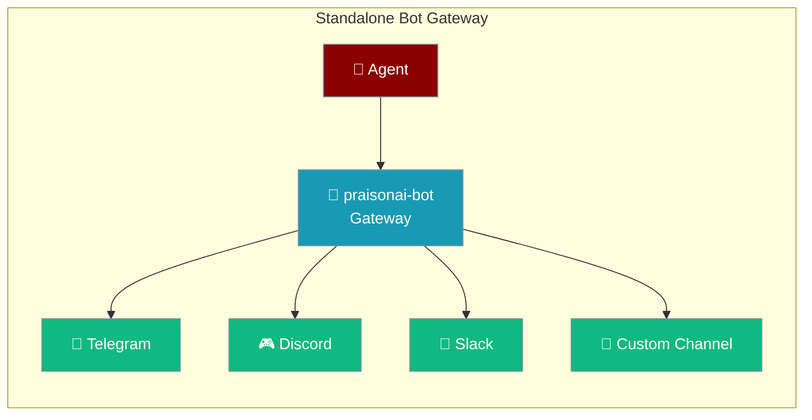
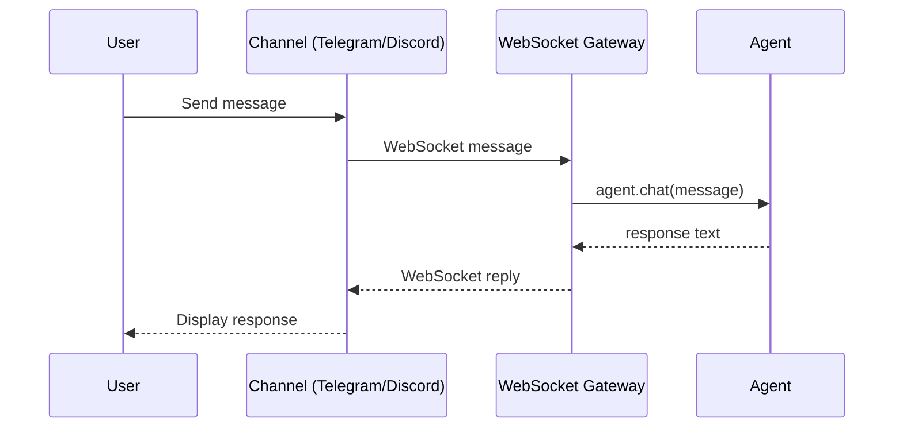

Register any `Agent` on a standalone WebSocket gateway with three imports and one `asyncio.run()`.



## Quick Start

<Steps>
<Step title="Install">
```bash
pip install praisonaiagents "praisonai-bot[gateway]"
```
</Step>

<Step title="Set credentials">
```bash
export OPENAI_API_KEY=your_openai_api_key
```
</Step>

<Step title="Register an agent on the gateway">
```python
import asyncio

from praisonaiagents import Agent
from praisonaiagents import GatewayConfig
from praisonai_bot.gateway import WebSocketGateway

assistant = Agent(name="assistant", instructions="You are a helpful assistant.")

config = GatewayConfig(host="127.0.0.1", port=8765)
gateway = WebSocketGateway(config=config)
gateway.register_agent(assistant, agent_id="assistant")

if __name__ == "__main__":
    print("Gateway: ws://127.0.0.1:8765  health: http://127.0.0.1:8765/health")
    asyncio.run(gateway.start())
```
</Step>

<Step title="Verify the gateway is running">
```bash
curl http://127.0.0.1:8765/health
```
The response confirms the gateway is live with the registered agent.
</Step>
</Steps>

---

## How It Works



The gateway routes messages from any connected channel to the registered agent. The agent never knows which channel the message came from — it just receives text and returns a response.

---

## Configuration Options

### `GatewayConfig` fields

| Field | Type | Default | Description |
|-------|------|---------|-------------|
| `host` | `str` | `"127.0.0.1"` | Host to bind the WebSocket server |
| `port` | `int` | `8765` | Port to listen on |

### `WebSocketGateway.register_agent()` parameters

| Parameter | Type | Default | Description |
|-----------|------|---------|-------------|
| `agent` | `Agent` | required | The agent instance to register |
| `agent_id` | `Optional[str]` | `None` | Custom ID (auto-generated UUID if not provided) |
| `overwrite` | `bool` | `True` | If `False`, raises `ValueError` on duplicate `agent_id` |

**Returns:** The `agent_id` string used for registration.

---

## CLI Equivalent

<Note>
`praisonai-bot gateway start` is the canonical CLI command. When the `praisonai` wrapper is co-installed, `praisonai gateway start` is an alias that delegates to the bot tier.
</Note>

```bash
# Canonical (bot-tier only)
praisonai-bot gateway start --host 127.0.0.1 --port 8765

# Wrapper alias (requires pip install praisonai)
praisonai gateway start --host 127.0.0.1 --port 8765
```

---

## Common Patterns

### Multiple agents on one gateway

```python
import asyncio
from praisonaiagents import Agent
from praisonaiagents import GatewayConfig
from praisonai_bot.gateway import WebSocketGateway

support = Agent(name="support", instructions="Handle customer support tickets.")
sales = Agent(name="sales", instructions="Answer product and pricing questions.")

config = GatewayConfig(host="127.0.0.1", port=8765)
gateway = WebSocketGateway(config=config)
gateway.register_agent(support, agent_id="support")
gateway.register_agent(sales, agent_id="sales")

asyncio.run(gateway.start())
```

### Custom agent ID

```python
from praisonaiagents import Agent
from praisonaiagents import GatewayConfig
from praisonai_bot.gateway import WebSocketGateway

agent = Agent(name="assistant", instructions="You are helpful.")
config = GatewayConfig(host="0.0.0.0", port=8765)
gateway = WebSocketGateway(config=config)

# Returns the registered agent_id
aid = gateway.register_agent(agent, agent_id="my-assistant")
print(f"Registered as: {aid}")
```

---

## Imports: bot-first and wrapper shims

<Tip>
`praisonai_bot.gateway` is the canonical import for the `WebSocketGateway` class. When `praisonai` is installed alongside `praisonai-bot`, `from praisonai.gateway import WebSocketGateway` works as a backward-compatible shim.
</Tip>

```python
# Canonical (bot-tier, no wrapper required)
from praisonai_bot.gateway import WebSocketGateway

# Wrapper shim (requires pip install praisonai)
from praisonai.gateway import WebSocketGateway
```

---

## Best Practices

<AccordionGroup>
<Accordion title="Use agent_id for stable routing">
Assign explicit `agent_id` values. Channel clients connect by agent ID — changing it after deployment disconnects existing sessions.

```python
gateway.register_agent(agent, agent_id="assistant-v2")
```
</Accordion>

<Accordion title="Bind to 0.0.0.0 only on trusted networks">
`host="127.0.0.1"` (loopback) is safe for local development. For production, bind to `0.0.0.0` only behind a reverse proxy with TLS termination.
</Accordion>

<Accordion title="Check /health before routing traffic">
The health endpoint (`http://host:port/health`) returns `200 OK` when the gateway is ready. Use it in your load balancer or process manager health check.
</Accordion>

<Accordion title="Use YAML for declarative configuration">
For multi-agent, multi-channel setups, use the standalone YAML format instead of Python to keep credentials and topology out of code.

See [Standalone Bot YAML](/docs/features/standalone-bot-yaml) for details.
</Accordion>
</AccordionGroup>

---

## Related

<CardGroup cols={2}>
<Card title="Standalone Bot YAML" icon="file-code" href="/docs/features/standalone-bot-yaml">
  Declarative gateway + agent + channels config
</Card>
<Card title="Gateway CLI" icon="tower-broadcast" href="/docs/features/gateway-cli">
  CLI commands for starting and managing the gateway
</Card>
<Card title="BotOS" icon="robot" href="/docs/features/botos">
  Multi-platform bot orchestration
</Card>
<Card title="praisonai-bot SDK" icon="comments" href="/docs/sdk/praisonai-bot/index">
  Full bot-tier SDK reference
</Card>
</CardGroup>
