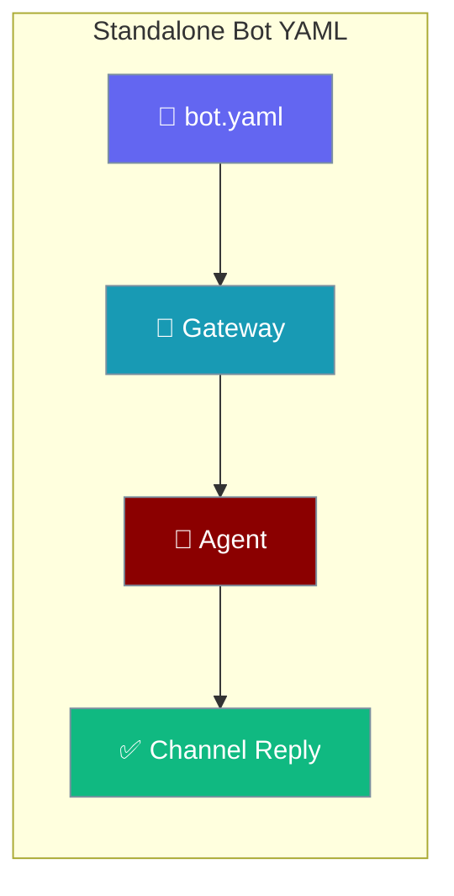
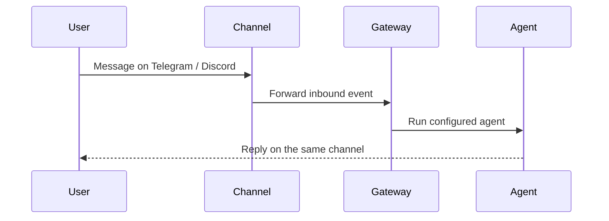
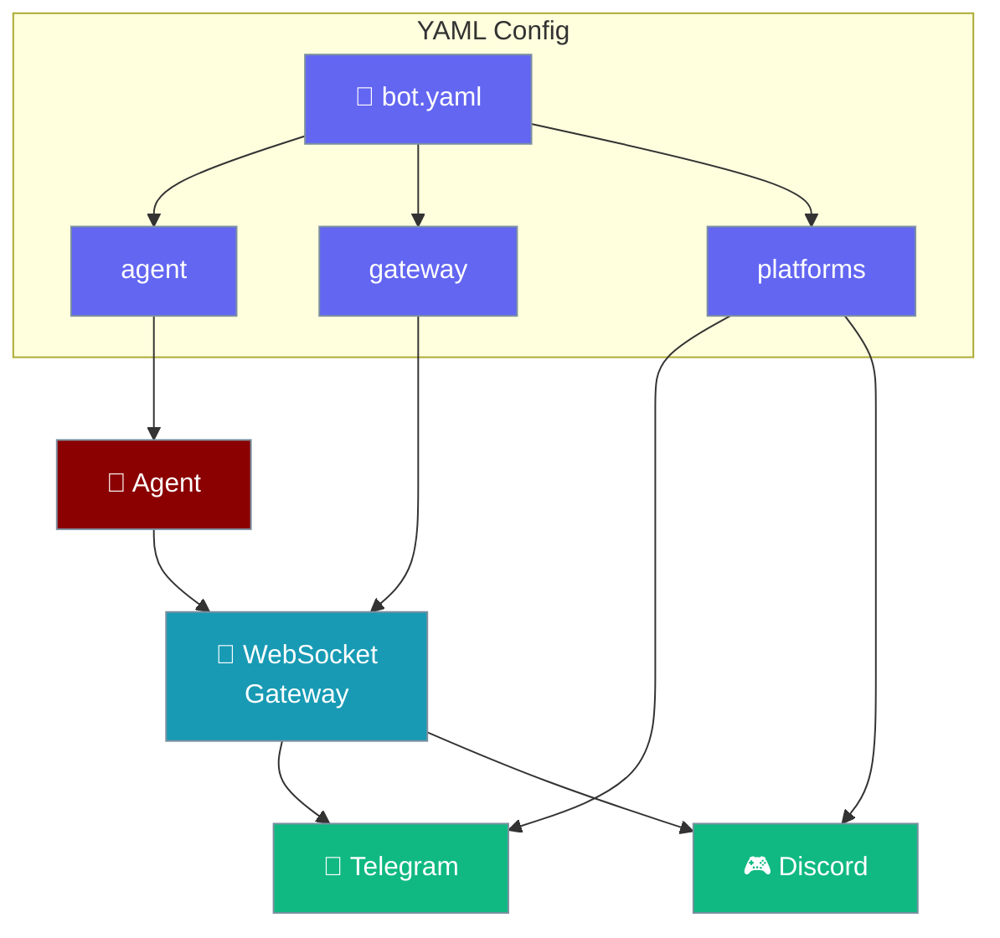
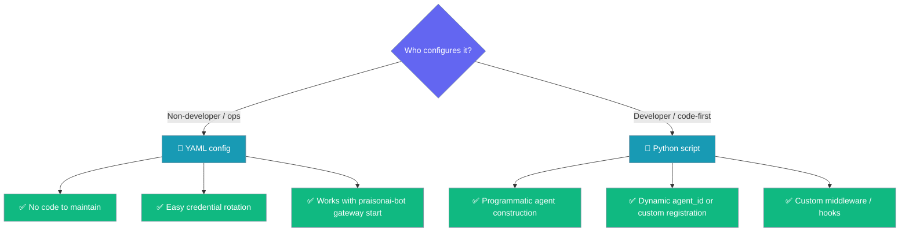

Describe your agent, gateway, and channel platforms in a single YAML file — no Python required.

```python
from praisonaiagents import Agent

agent = Agent(name="bot-agent", instructions="Reply to users across chat channels.")
agent.start("Answer incoming messages from Telegram and Discord.")
```

The user defines a `bot.yaml`; the gateway loads it and connects the agent to every configured channel.



## How It Works



### Config Structure



## Quick Start

<Steps>
<Step title="Install">
```bash
pip install praisonaiagents "praisonai-bot[gateway,bot]"
```
</Step>

<Step title="Set credentials">
```bash
export OPENAI_API_KEY=your_openai_api_key
export TELEGRAM_BOT_TOKEN=your_telegram_token
```
</Step>

<Step title="Create bot.yaml">
```yaml
agent:
  name: assistant
  instructions: You are a helpful assistant.
  llm: gpt-4o-mini

gateway:
  host: 127.0.0.1
  port: 8765

platforms:
  telegram:
    token: ${TELEGRAM_BOT_TOKEN}
```
</Step>

<Step title="Start the gateway with your YAML">
```bash
praisonai-bot gateway start --config bot.yaml
```
The gateway registers the agent and starts all configured channel bots automatically.
</Step>
</Steps>

---

## Config Options Reference

### `agent` section

| Key | Type | Default | Description |
|-----|------|---------|-------------|
| `agent.name` | `str` | required | Agent display name, used as the `agent_id` for gateway routing |
| `agent.instructions` | `str` | required | System prompt / instructions for the agent |
| `agent.llm` | `str` | `"gpt-4o-mini"` | LLM model identifier (e.g. `gpt-4o`, `gpt-4o-mini`) |

### `gateway` section

| Key | Type | Default | Description |
|-----|------|---------|-------------|
| `gateway.host` | `str` | `"127.0.0.1"` | Host to bind the WebSocket server |
| `gateway.port` | `int` | `8765` | Port to listen on |

### `platforms` section

Each key under `platforms` is a platform name. Use `${VAR_NAME}` for environment variable interpolation.

| Key pattern | Type | Description |
|-------------|------|-------------|
| `platforms.<name>.token` | `str` | Bot token for the platform. Supports `${ENV_VAR}` substitution |

**Supported platforms:** `telegram`, `discord`, `slack`, `whatsapp`, and any platform registered via entry points.

### Shell execution keys

Add these per-channel keys to let a bot run shell commands with approval routing.

| Key pattern | Type | Default | Description |
|-------------|------|---------|-------------|
| `<name>.allow_shell` | `bool` | `False` | Opt in shell execution. Injects `execute_command`, lifts the deny-list entry, and appends a permission-grant line to instructions. |
| `<name>.auto_approve_shell` | `bool` | `True` | `True` runs every shell call immediately; `False` wires a human-in-the-loop backend. |
| `<name>.approval_channel` | `str` | `None` | Where the approval prompt is delivered (platform-specific ID). |
| `<name>.approval_users` | `str` \| `list[str]` | `None` | Approver allowlist. Comma-separated string or list. |
| `<name>.approval_mode` | `str` | `None` (= `channel`) | Backend selector: `channel`, `gateway`, `http`, `webhook`. Typos raise `ValueError`. |
| `<name>.approval_webhook_url` | `str` | `None` | HTTPS URL for `approval_mode: webhook`. |
| `<name>.approval_http_host` | `str` | `"127.0.0.1"` | HTTP dashboard host for `approval_mode: http`. |
| `<name>.approval_http_port` | `int` | `8899` | HTTP dashboard port for `approval_mode: http`. |

<Card title="Bot Shell Execution" icon="terminal" href="/docs/features/bot-shell-execution">
  Full routing ladder, per-platform ID resolution, and recipes.
</Card>

---

## Environment Variable Interpolation

Values in the form `${VAR_NAME}` are resolved from the current environment at startup:

```yaml
platforms:
  telegram:
    token: ${TELEGRAM_BOT_TOKEN}   # reads os.environ["TELEGRAM_BOT_TOKEN"]
  discord:
    token: ${DISCORD_BOT_TOKEN}    # reads os.environ["DISCORD_BOT_TOKEN"]
```

Tokens stored in `~/.praisonai/.env` (written by `praisonai-bot onboard`) are loaded automatically before interpolation.

---

## When to Pick YAML vs Python



| Scenario | Use |
|----------|-----|
| Operations team manages tokens | **YAML** — credentials stay out of code |
| Static single-agent setup | **YAML** — fewer moving parts |
| Dynamic agents (created at runtime) | **Python** — full control over `register_agent()` |
| Custom gateway middleware or hooks | **Python** — subclass or extend `WebSocketGateway` |
| Multiple environments (dev / staging / prod) | **YAML** — per-environment files with env vars |

---

## Common Patterns

### Multi-platform setup

```yaml
agent:
  name: assistant
  instructions: You are a helpful assistant.
  llm: gpt-4o-mini

gateway:
  host: 0.0.0.0
  port: 8765

platforms:
  telegram:
    token: ${TELEGRAM_BOT_TOKEN}
  discord:
    token: ${DISCORD_BOT_TOKEN}
  slack:
    token: ${SLACK_BOT_TOKEN}
```

### Custom port from environment

```yaml
gateway:
  host: 0.0.0.0
  port: 9000
```

Or set the `GATEWAY_PORT` environment variable — the CLI reads it automatically when `--port` is not passed.

---

## Best Practices

<AccordionGroup>
<Accordion title="Always use ${...} for tokens">
Never hardcode tokens in YAML. Use environment variables and store them in `~/.praisonai/.env` (written by `praisonai-bot onboard`) or your secrets manager.

```yaml
# Good
platforms:
  telegram:
    token: ${TELEGRAM_BOT_TOKEN}

# Never do this
platforms:
  telegram:
    token: 1234567890:ABCdef...
```
</Accordion>

<Accordion title="Run praisonai-bot gateway doctor before going live">
```bash
praisonai-bot gateway doctor --config bot.yaml
```
This validates every channel token before starting, so a bad token fails fast instead of silently reconnecting. It also prints a credential availability table for `token`, `app_token`, and `verify_token` — including the [secret-reference form](/docs/features/gateway-secret-references) — **without revealing any value**.
</Accordion>

<Accordion title="Use separate YAML files per environment">
Keep `dev.yaml`, `staging.yaml`, and `prod.yaml` — each referencing different environment variables. Pass the right one with `--config`.
</Accordion>
</AccordionGroup>

---

## Related

<CardGroup cols={2}>
<Card title="Standalone Bot Gateway (Python)" icon="server" href="/docs/features/standalone-bot-gateway">
  Python API equivalent — register agents programmatically
</Card>
<Card title="Gateway CLI" icon="tower-broadcast" href="/docs/features/gateway-cli">
  Full list of gateway CLI commands
</Card>
<Card title="BotOS" icon="robot" href="/docs/features/botos">
  Multi-platform bot orchestration
</Card>
<Card title="praisonai-bot SDK" icon="comments" href="/docs/sdk/praisonai-bot/index">
  Full bot-tier SDK reference
</Card>
</CardGroup>
