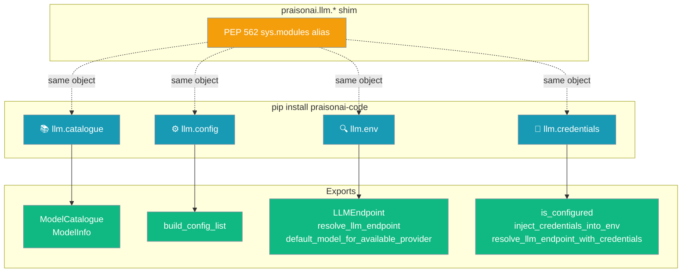
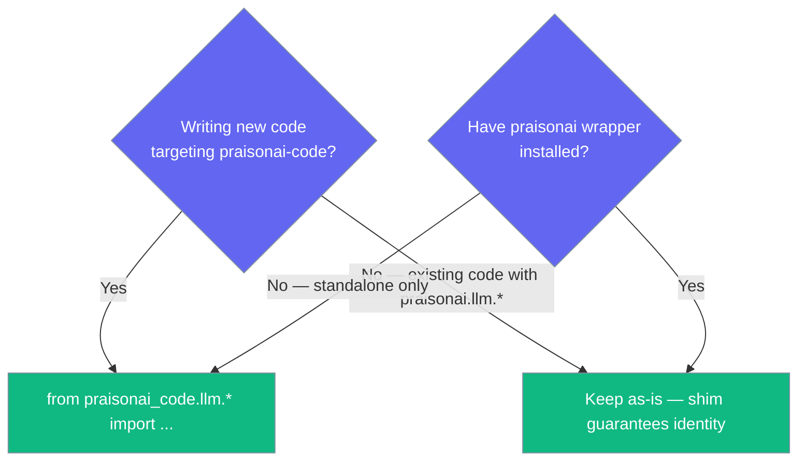

After the C7 milestone, the LLM helpers live in `praisonai-code` — no wrapper import required.

```python
from praisonaiagents import Agent
from praisonai_code.llm.catalogue import ModelCatalogue
from praisonai_code.llm.credentials import is_configured

catalogue = ModelCatalogue()
models = catalogue.list_models(provider="openai")

if is_configured():
    agent = Agent(
        name="LLM Info Agent",
        instructions=f"You have access to {len(models)} OpenAI models.",
    )
    agent.start("Which OpenAI model supports vision and tool calling?")
```

The user asks about models; catalogue and credential helpers from `praisonai-code` answer without wrapper imports.



## Quick Start

<Steps>
<Step title="Simple Usage">

```python
from praisonaiagents import Agent
from praisonai_code.llm.catalogue import ModelCatalogue

catalogue = ModelCatalogue()
models = catalogue.list_models(provider="openai")

agent = Agent(
    name="LLM Info Agent",
    instructions=f"You have access to {len(models)} OpenAI models.",
)
agent.start("Which OpenAI model supports vision and tool calling?")
```

</Step>

<Step title="With Credential Gate">

```python
from praisonaiagents import Agent
from praisonai_code.llm.credentials import is_configured, inject_credentials_into_env

if not is_configured():
    raise SystemExit("Run: praisonai setup  (or set OPENAI_API_KEY)")

inject_credentials_into_env()

agent = Agent(
    name="Secure Agent",
    instructions="You are a helpful assistant.",
)
agent.start("What models are available for my account?")
```

</Step>

<Step title="Discover Available Models">

```python
from praisonai_code.llm.catalogue import ModelCatalogue

catalogue = ModelCatalogue()
models = catalogue.list_models(provider="openai")
print(f"{len(models)} OpenAI models available")
```

</Step>

<Step title="Check Credentials and Resolve Endpoint">

```python
from praisonai_code.llm.credentials import is_configured, inject_credentials_into_env
from praisonai_code.llm.env import resolve_llm_endpoint

if is_configured():
    inject_credentials_into_env()
    ep = resolve_llm_endpoint()
    print(f"Using: {ep.model} at {ep.base_url}")
```

</Step>
</Steps>

---

## The Four Modules

| Module | Public exports | Purpose |
|--------|----------------|---------|
| `praisonai_code.llm.catalogue` | `ModelCatalogue`, `ModelInfo` | Discover and validate LLM models |
| `praisonai_code.llm.config` | `build_config_list` | AutoGen-style `[{model, base_url, api_key, api_type}]` |
| `praisonai_code.llm.env` | `LLMEndpoint`, `resolve_llm_endpoint`, `default_model_for_available_provider` | Resolve which model/endpoint to hit |
| `praisonai_code.llm.credentials` | `is_configured`, `inject_credentials_into_env`, `resolve_llm_endpoint_with_credentials` | Credential gate for CLI startup |

---

## Which Import Path Should I Use?



---

## Backward Compatibility Guarantee

<Note>
All four `praisonai.llm.*` module paths still resolve — a `sys.modules` alias in the wrapper points at `praisonai_code.llm.*`. The unit test `test_c5_backward_compat.py::test_module_identity` asserts:

- `praisonai.llm.catalogue is praisonai_code.llm.catalogue`
- `praisonai.llm.config is praisonai_code.llm.config`
- `praisonai.llm.env is praisonai_code.llm.env`
- `praisonai.llm.credentials is praisonai_code.llm.credentials`

You do not need to migrate existing code — both paths point at the same object.
</Note>

---

## Standalone Smoke Test

This example runs in a venv with only `praisonai-agents` + `praisonai-code` installed (no wrapper):

```python
from praisonai_code.cli.configuration.resolver import ConfigResolver
from praisonai_code._version import get_package_version
from praisonai_code.llm.credentials import is_configured
from praisonai_code.llm.catalogue import ModelCatalogue

assert ModelCatalogue().list_models(provider="openai")   # 132 models
```

---

## Module Reference

### `praisonai_code.llm.catalogue`

```python
from praisonai_code.llm.catalogue import ModelCatalogue, ModelInfo

catalogue = ModelCatalogue(
    cache_dir=None,   # defaults to ~/.praison/cache
    cache_ttl=3600,   # 1 hour
)

# List all models, optionally filter
models = catalogue.list_models(provider="openai", search="gpt-4")

# Get full metadata for one model
info = catalogue.describe_model("gpt-4o")

# Validate a model ID — raises ValueError with suggestions on mismatch
try:
    valid_id = catalogue.validate_model("gpt-4o-mni")
except ValueError as e:
    print(e)  # "Unknown model 'gpt-4o-mni'. Did you mean: gpt-4o-mini, gpt-4o"

# Quick boolean check
ok = catalogue.is_valid_model("gpt-4o")        # True

# Fuzzy suggestions
suggestions = catalogue.get_suggestions("gpt4o")  # ['gpt-4o', 'gpt-4o-mini']
```

Cache file: `~/.praison/cache/models.json` (TTL 3600s). Falls back to 14 curated models (OpenAI 5, Anthropic 3, Google 3, Groq 2, Ollama 1) when litellm is unavailable.

### `praisonai_code.llm.config`

```python
from praisonai_code.llm.config import build_config_list

config = build_config_list(include_api_type=True)
# → [{'model': 'gpt-4o-mini', 'base_url': 'https://api.openai.com/v1',
#     'api_key': 'sk-...', 'api_type': 'openai'}]
```

### `praisonai_code.llm.env`

```python
from praisonai_code.llm.env import (
    LLMEndpoint,
    resolve_llm_endpoint,
    default_model_for_available_provider,
)

ep = resolve_llm_endpoint()
print(ep.model, ep.base_url, ep.api_key)

model = default_model_for_available_provider()
```

### `praisonai_code.llm.credentials`

```python
from praisonai_code.llm.credentials import (
    is_configured,
    inject_credentials_into_env,
    resolve_llm_endpoint_with_credentials,
)

if is_configured():
    inject_credentials_into_env()
    ep = resolve_llm_endpoint_with_credentials()
```

---

## Best Practices

<AccordionGroup>
<Accordion title="Use praisonai_code.llm.* for new standalone scripts">
New scripts that target the `praisonai-code` package should import from `praisonai_code.llm.*` to avoid taking a dependency on the wrapper:

```python
from praisonai_code.llm.catalogue import ModelCatalogue
from praisonai_code.llm.env import resolve_llm_endpoint
```
</Accordion>

<Accordion title="Do not migrate existing praisonai.llm.* imports">
Existing code using `from praisonai.llm.catalogue import ModelCatalogue` works without change — the shim guarantees module identity. Migration has no functional benefit.
</Accordion>

<Accordion title="Check is_configured() before calling agents in CLI scripts">
Use `is_configured()` as a fast gate before running an agent — it checks env vars and the credential store without making any network calls:

```python
from praisonai_code.llm.credentials import is_configured, inject_credentials_into_env

if not is_configured():
    print("Run: praisonai setup  (or set OPENAI_API_KEY)")
    raise SystemExit(1)

inject_credentials_into_env()
```
</Accordion>
</AccordionGroup>

---

## Configuration Options

<Card title="ModelCatalogue Python Reference" icon="code" href="/docs/sdk/reference/python/classes/ModelCatalogue">
  Python configuration options for ModelCatalogue
</Card>
<Card title="LLMEndpoint Python Reference" icon="code" href="/docs/sdk/reference/python/classes/LLMEndpoint">
  Python configuration options for LLMEndpoint
</Card>

---

## Related

<CardGroup cols={2}>
  <Card title="Model Catalogue" icon="microchip" href="/docs/features/models-cli">
    CLI commands for models list, describe, validate
  </Card>
  <Card title="AutoGen Config List" icon="list-tree" href="/docs/features/llm-autogen-config-list">
    Build AutoGen config_list from the resolved endpoint
  </Card>
  <Card title="LLM Endpoint Config" icon="plug" href="/docs/features/llm-endpoint-config">
    Endpoint precedence and provider routing
  </Card>
  <Card title="PraisonAI Code CLI" icon="terminal" href="/docs/features/praisonai-code-cli">
    The standalone CLI runtime these modules power
  </Card>
  <Card title="Package Boundaries (C7.1)" icon="layer-group" href="/docs/sdk/praisonai-code#package-boundaries-c71">
    Three-tier ownership and the `_wrapper_bridge` pattern
  </Card>
</CardGroup>
