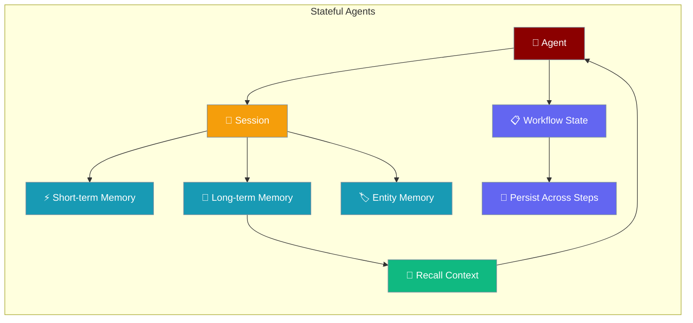
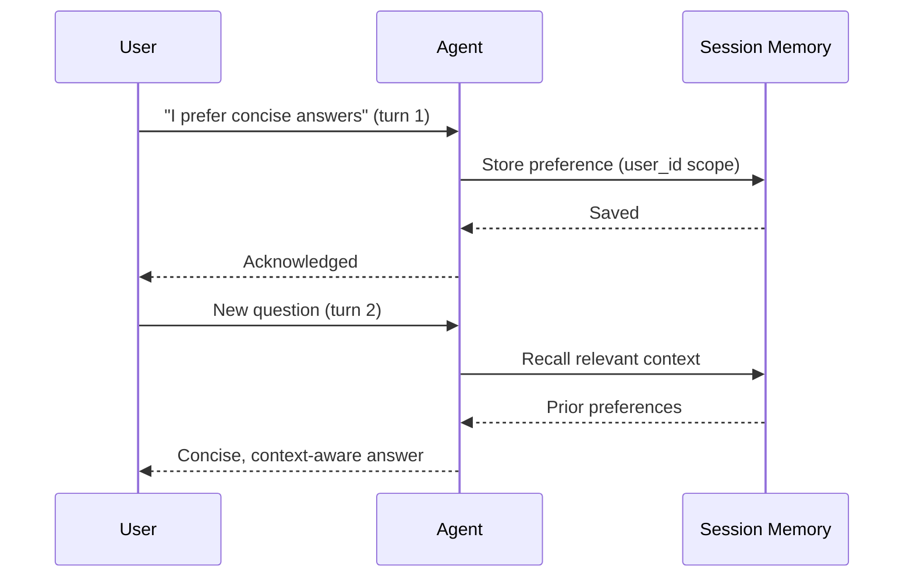

Stateful agents remember conversations, persist workflow state, and recall context across sessions.

```python
from praisonaiagents import Agent

agent = Agent(
    name="Personal Assistant",
    instructions="Remember user preferences and maintain conversation context",
    memory={"user_id": "user_456"},
)
agent.start("I prefer concise answers to technical questions")
```

The user shares preferences; session memory persists them for later turns.



## Quick Start

<Steps>
<Step title="Simple Usage">

Enable memory on an agent with a user scope:

```python
from praisonaiagents import Agent

agent = Agent(
    name="Personal Assistant",
    instructions="Remember user preferences",
    memory={"user_id": "user_456"},
)
agent.start("I prefer concise technical answers")
```

</Step>

<Step title="With Session">

Use `Session` for persistent multi-turn state:

```python
from praisonaiagents import Session

session = Session(session_id="chat_123", memory={"user_id": "user_456"})
agent = session.Agent(
    name="Assistant",
    instructions="You are a helpful assistant",
    memory=True,
)
agent.start("My name is Alice")
session.save_state({"topic": "onboarding"})
```

</Step>
</Steps>

## How It Works



| Phase | What happens |
|---|---|
| 1. Store | The agent saves context to memory, scoped by `user_id` |
| 2. Persist | State survives across turns and sessions |
| 3. Recall | Later turns retrieve relevant memories automatically |

## Core Stateful Capabilities

### Memory System

PraisonAI includes a sophisticated multi-tiered memory system with quality-based filtering:

- **Short-term Memory (STM)**: Ephemeral context for current conversations
- **Long-term Memory (LTM)**: Persistent knowledge with quality-based filtering
- **Entity Memory**: Structured data about named entities and relationships
- **User Memory**: User-specific preferences and interaction history
- **Graph Memory**: Complex relationship storage via Mem0 integration

```python
from praisonaiagents import Agent, Memory

# Initialize memory system with quality scoring
memory_config = {
    "provider": "rag",  # or "mem0" or "none"
    "use_embedding": True,
    "rag_db_path": ".praison/chroma_db"
}

memory = Memory(config=memory_config, verbose=5)

# Create agent with memory
agent = Agent(
    name="Research Assistant",
    role="AI Researcher", 
    memory={"user_id": "user_123"}
)
```

### Session Management

The `Session` class provides a unified API for managing stateful agent interactions:

```python
from praisonaiagents import Session

# Create a persistent session
session = Session(
    session_id="research_session_001", 
    memory={"user_id": "researcher_123"}
)

# Create agents within the session context (new API)
agent = session.Agent(
    name="Data Analyst",
    role="Research Assistant",
    memory=True,
    knowledge=["research_papers.pdf", "data_sources.csv"]
)

# Save session state
session.save_state({
    "research_topic": "AI Safety",
    "documents_processed": 15,
    "analysis_stage": "hypothesis_generation"
})

# Restore state later
previous_state = session.restore_state()
```

### Workflow State Management

PraisonAI supports complex stateful workflows with persistent state across steps:

```python
from praisonaiagents import AgentFlow, WorkflowContext, StepResult

# Create stateful workflow with variables
workflow = AgentFlow(
    steps=[research_step, analysis_step, writing_step],
    variables={
        "total_documents": 100,
        "processed_count": 0,
        "findings": []
    },
    memory=True  # Enable memory with defaults
)

# Steps can update state via variables
def research_step(ctx: WorkflowContext) -> StepResult:
    processed = ctx.variables.get("processed_count", 0) + 1
    return StepResult(
        output="Research complete",
        variables={"processed_count": processed}
    )

# Run workflow
result = workflow.start("Research AI safety")
print(result["variables"])  # Access final state
```

## Advanced Stateful Patterns

### Quality-Based Memory Storage

Memory storage with automatic quality assessment using individual metrics:

```python
# Store with detailed quality metrics
memory.store_long_term(
    text="AI research findings on neural architecture search",
    metadata={"source": "arxiv", "confidence": 0.9},
    completeness=0.95,  # How complete is the information
    relevance=0.88,     # How relevant to the topic
    clarity=0.92,       # How clear and understandable
    accuracy=0.85       # How accurate the information is
)

# Search with quality filtering
results = memory.search_long_term(
    query="neural architecture",
    min_quality=0.8,
    limit=5,
    rerank=True  # Use reranking for better results
)

# Use custom quality weights
custom_weights = {
    "completeness": 0.3,
    "relevance": 0.4, 
    "clarity": 0.2,
    "accuracy": 0.1
}

quality_score = memory.compute_quality_score(
    completeness=0.85,
    relevance=0.90,
    clarity=0.75,
    accuracy=0.95,
    weights=custom_weights
)
```

### Enhanced State Management

```python
# Comprehensive state management methods
workflow = AgentTeam(agents=[...], memory=True)

# Basic operations
workflow.set_state("research_topic", "AI Safety")
workflow.update_state({"phase": "analysis", "progress": 50})

# Advanced operations
workflow.increment_state("task_count", 1, default=0)
workflow.append_to_state("completed_tasks", "research_phase", max_length=10)
workflow.delete_state("temporary_data")

# State queries
has_topic = workflow.has_state("research_topic")
all_state = workflow.get_all_state()

# Session persistence
workflow.save_session_state("research_session_001")
workflow.restore_session_state("research_session_001")
```

### Context Building from Multiple Sources

```python
# Build rich context from memory, knowledge, and state
context = memory.build_context_for_task(
    task_descr="Analyze recent AI safety papers",
    memory={"user_id": "researcher_123"},
    max_items=5
)

# Context includes:
# - Short-term conversation history
# - Relevant long-term memories  
# - Entity relationships
# - User-specific preferences
```

<Tip>
For multi-turn chats on Anthropic or Google, use `build_context_for_task()` with `include_in_output=True` for cache-friendly prompt assembly. See [Prompt Caching](/docs/features/prompt-caching).
</Tip>

### Knowledge Base Integration

```python
from praisonaiagents import Knowledge

# Initialize knowledge system
knowledge_config = {
    "vector_store": {"provider": "chromadb"},
    "graph_store": {"provider": "neo4j", "config": {...}}
}

knowledge = Knowledge(config=knowledge_config)

# Add documents with automatic processing
knowledge.add("research_paper.pdf", memory={"user_id": "user_123"})
knowledge.add("https://arxiv.org/paper/123", memory={"user_id": "user_123"})

# Semantic search with reranking
results = knowledge.search(
    query="transformer attention mechanisms",
    rerank=True,
    memory={"user_id": "user_123"}
)
```

## Advanced Memory Features

### Graph Memory Support

```python
import os

memory_config = {
    "provider": "mem0",
    "config": {
        "api_key": os.getenv("MEM0_API_KEY"),
        "graph_store": {
            "provider": "neo4j",
            "config": {
                "url": os.getenv("NEO4J_URL"),
                "username": os.getenv("NEO4J_USERNAME", "neo4j"),
                "password": os.getenv("NEO4J_PASSWORD"),
            }
        },
        "vector_store": {
            "provider": "qdrant",
            "config": {"host": "localhost", "port": 6333}
        },
        "llm": {
            "provider": "openai",
            "config": {"model": "gpt-4o", "api_key": os.getenv("OPENAI_API_KEY")}
        },
        "embedder": {
            "provider": "openai",
            "config": {"model": "text-embedding-3-small", "api_key": os.getenv("OPENAI_API_KEY")}
        }
    }
}

memory = Memory(config=memory_config)
```

### Quality Metrics and Evaluation

```python
# Automatic quality calculation using LLM
quality_metrics = memory.calculate_quality_metrics(
    output="Generated research summary...",
    expected_output="Expected comprehensive analysis...",
    llm="gpt-4o"
)

# Store with calculated quality
memory.store_quality(
    text="Research findings...",
    quality_score=0.85,
    task_id="task_001",
    metrics=quality_metrics,
    memory_type="long"
)

# Search with quality thresholds
high_quality_results = memory.search_with_quality(
    query="AI safety research",
    min_quality=0.8,
    memory_type="long"
)
```

## Session API Updates

### Current Session Methods

```python
# Create session
session = Session(session_id="demo_001", memory={"user_id": "user_123"})

# New Agent creation method (recommended)
agent = session.Agent(
    name="Assistant",
    role="Helper",
    memory=True,
    instructions="Remember user preferences"
)

# Session state management
session.set_state("preference", "brief_responses")
session.save_state({"conversation_style": "technical"})

# Memory operations
session.add_memory("User prefers technical explanations", memory_type="long")
session.search_memory("preferences", memory_type="long")

# Context building
context = session.get_context("machine learning concepts")
```

## Configuration Examples

### Basic Stateful Agent

```python
from praisonaiagents import Agent

agent = Agent(
    name="Personal Assistant",
    role="Helpful AI Assistant",
    instructions="Remember user preferences and maintain conversation context",
    memory={"user_id": "user_456"}  # Enable memory with user isolation
)

response = agent.start("I like concise answers to technical questions")
# Memory automatically stores this preference with quality scoring
```

### Advanced Memory Configuration

```python
memory_config = {
    "provider": "rag",
    "use_embedding": True,
    "rag_db_path": ".praison/memory_db",
    "short_db": ".praison/short_term.db",
    "long_db": ".praison/long_term.db"
}

agent = Agent(
    name="Research Agent",
    role="AI Researcher",
    memory={"user_id": "researcher_001"}
)
```

### Complex Workflow with State

```python
def research_tool(topic: str, num_sources: int = 5):
    """Tool that updates workflow state"""
    # Tool implementation...
    return {"findings": [...], "confidence": 0.85}

# Define conditional workflow with state-based routing
research_task = Task(
    name="research", 
    description="Research the topic using available tools",
    tools=[research_tool]
)

analysis_task = Task(
    name="analyze",
    description="Analyze findings if sufficient data available"
)

# Create workflow with state management via variables
from praisonaiagents import AgentFlow, WorkflowContext, StepResult

def research_step(ctx: WorkflowContext) -> StepResult:
    topic = ctx.variables.get("research_topic", "AI")
    # Use researcher agent
    result = researcher.start(f"Research {topic}")
    return StepResult(output=result, variables={"tasks_completed": 1})

def analyze_step(ctx: WorkflowContext) -> StepResult:
    result = analyzer.start(f"Analyze: {ctx.previous_result}")
    return StepResult(output=result)

workflow = AgentFlow(
    steps=[research_step, analyze_step],
    variables={
        "research_topic": "AI Safety",
        "target_papers": 50,
        "tasks_completed": 0
    },
    memory=True  # Enable memory with defaults
)

result = workflow.start("Start research")
```

## Best Practices

<AccordionGroup>
  <Accordion title="Use Session IDs for Multi-User Apps">
    Always pass a unique `session_id` per user. This isolates state and memory between different users in multi-tenant applications.
  </Accordion>
  <Accordion title="Choose the Right Memory Backend">
    Use `"rag"` for local embeddings, `"mem0"` for cloud-based memory with semantic search, and `"none"` when you only need workflow state without semantic retrieval.
  </Accordion>
  <Accordion title="Save State After Key Events">
    Call `session.save_state()` after significant workflow milestones, not after every message. This reduces I/O and keeps state snapshots meaningful.
  </Accordion>
  <Accordion title="Set Quality Thresholds">
    Configure `quality_threshold` on memory to automatically filter out low-quality interactions from long-term memory, keeping retrieval fast and relevant.
  </Accordion>
</AccordionGroup>

## Related

<CardGroup cols={2}>
  <Card title="Sessions" icon="clock-rotate-left" href="/docs/features/sessions">
    Session management and persistence
  </Card>
  <Card title="Memory Advanced Search" icon="magnifying-glass-plus" href="/docs/features/memory-advanced-search">
    Reranking and relevance filtering for memory retrieval
  </Card>
</CardGroup>