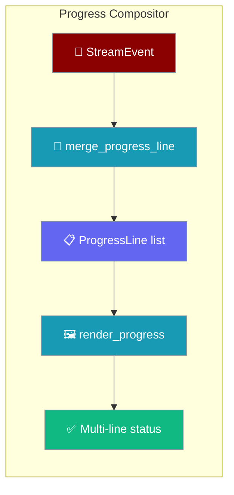
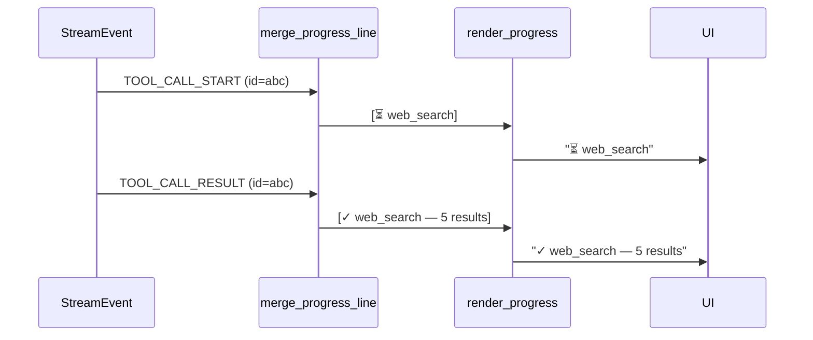

The progress compositor folds an agent's typed `StreamEvent` stream into a bounded, multi-line status view you can render in any transport — bots today, TUI or web tomorrow.



The compositor is pure stdlib — zero third-party dependencies, deterministic, and side-effect free. Every call returns a new list; the input is never mutated. The same three exports power the bot [`progress_style="feed"`](/docs/features/bot-streaming-replies#progress-feed-style) view.

## Quick Start

<Steps>
<Step title="Fold events into lines">

```python
from praisonaiagents.streaming import merge_progress_line, render_progress

lines = []
for event in agent_events:          # any typed StreamEvent stream
    lines = merge_progress_line(lines, event)

print(render_progress(lines))
```

</Step>

<Step title="Wire it into your own callback">

```python
from praisonaiagents import Agent
from praisonaiagents.streaming import (
    ProgressLine, merge_progress_line, render_progress,
)

lines: list[ProgressLine] = []

def my_callback(event) -> None:
    global lines
    lines = merge_progress_line(lines, event)
    print("\033[2J\033[H" + render_progress(lines, max_lines=6))

agent = Agent(name="research-assistant", instructions="Research and summarise.")
agent.stream_emitter.add_callback(my_callback)
agent.start("Research quantum computing")
```

Any typed `StreamEvent` stream — even one you produce yourself — folds into the same bounded view.

</Step>
</Steps>

---

## How It Works

A start event and its matching finish event share one correlation id, so `merge_progress_line` updates the existing line instead of appending a duplicate.



Each event type maps to a line kind and state:

| StreamEventType | Rendered kind | Rendered state |
|-----------------|---------------|----------------|
| `TOOL_CALL_START`, `DELTA_TOOL_CALL` | `tool` | `running` (⏳) |
| `TOOL_CALL_END`, `TOOL_CALL_RESULT` | `tool` | `done` (✓) |
| `TOOL_PROGRESS` | `command-output` | `running` (⏳) |
| `ERROR` | `tool` | `error` (✗) |
| anything else | — | no-op (returns the input list unchanged) |

---

## Configuration Options

`render_progress` bounds the output for edit-in-place delivery.

| Option | Type | Default | Description |
|--------|------|---------|-------------|
| `max_lines` | `int` | `8` | Trailing rolling window — only the last N lines are shown |
| `max_line_chars` | `int` | `120` | Per-line character cap including the glyph prefix; words are truncated at a boundary with an ellipsis |

Each `ProgressLine` carries the state for a single step.

| Field | Type | Default | Description |
|-------|------|---------|-------------|
| `id` | `str` | — | Correlation key (tool call id, plan step id, approval id) |
| `kind` | `str` | — | `"tool"`, `"plan"`, `"approval"`, or `"command-output"` |
| `text` | `str` | — | Human-readable status text |
| `state` | `str` | `"running"` | `"running"`, `"done"`, or `"error"` |

---

## State machine rules

Terminal states are sticky, so the feed never lies about an outcome.

- **Error takes precedence** — once a line is `error` (`✗`) it stays `error`, even if a later `done` event arrives for the same id.
- **Done is not downgraded** — a late `running` event never resets a completed `done` (`✓`) line back to `running`.
- **Non-progress events are no-ops** — events outside the mapping table return the input list unchanged, so unrelated stream traffic never adds noise.

---

## Common Patterns

Build a live TUI panel straight from the agent's event emitter.

```python
from praisonaiagents import Agent
from praisonaiagents.streaming import merge_progress_line, render_progress

agent = Agent(name="assistant", instructions="Use tools and summarise.")
lines = []

def render_panel(event):
    global lines
    lines = merge_progress_line(lines, event)
    print("\033[2J\033[H" + render_progress(lines, max_lines=10))

agent.stream_emitter.add_callback(render_panel)
agent.start("Compare three databases")
```

Feed the compositor from your own event source — plan steps, approvals, or command output all fold in the same way, since `merge_progress_line` only cares about the event's type and correlation id.

Override the glyphs by wrapping `render_progress` with a renderer that walks each `ProgressLine.state`.

```python
from praisonaiagents.streaming import ProgressLine

GLYPHS = {"running": "•", "done": "[OK]", "error": "[X]"}

def render_ascii(lines: list[ProgressLine]) -> str:
    return "\n".join(f"{GLYPHS.get(l.state, '•')} {l.text}" for l in lines[-8:])
```

---

## Best Practices

<AccordionGroup>
<Accordion title="Keep the input list and re-assign the return value">
`merge_progress_line` returns a new list and never mutates its input. Always re-assign — `lines = merge_progress_line(lines, event)` — so your view reflects the fold.
</Accordion>

<Accordion title="Bound the window for edit-in-place transports">
Message-based channels crop long text. Pass a small `max_lines` (`4`–`8`) to `render_progress` so the newest steps stay visible while older ones scroll off.
</Accordion>

<Accordion title="Rely on stable correlation ids">
A tool's start and finish events share one id (from `tool_call.id` / `metadata.id`, falling back to `tool:<name>`), so updates rewrite the same line. You do not need to de-duplicate events yourself.
</Accordion>

<Accordion title="Let the compositor own terminal states">
Don't post-process `error → done`. The compositor already guarantees a sticky terminal state, so your renderer can trust `ProgressLine.state` as-is.
</Accordion>
</AccordionGroup>

---

## Related

<CardGroup cols={2}>
<Card title="Bot Streaming Replies" icon="message-pen" href="/docs/features/bot-streaming-replies">
  Enable the feed style on Telegram, Slack, and Discord
</Card>
<Card title="Streaming Tool Events" icon="wrench" href="/docs/features/streaming-tool-events">
  The typed StreamEvents the compositor folds
</Card>
<Card title="Tool Progress Streaming" icon="gauge" href="/docs/features/tool-progress-streaming">
  Emit mid-tool progress updates into the stream
</Card>
</CardGroup>
