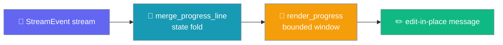
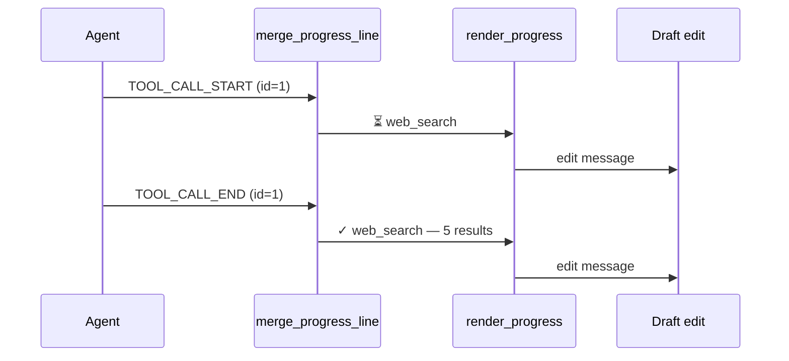

Replace the single overwritten tool line with a bounded, multi-line rolling status feed.

```text
# Before — one overwritten line, looks frozen on long runs
🤔 Running web_search...

# After (progress_style="feed") — stable, in-place rolling feed
✓ web_search — 5 results
⏳ fetch_url
⏳ write_file — report.md
```



The compositor is a pure transform: `⏳` running, `✓` done, `✗` error.

## Quick Start

<Steps>
<Step title="Turn it on for a bot">
Set `progress_style: feed` under a channel's `streaming` block in your bot YAML:

```yaml
channels:
  telegram:
    token: ${TELEGRAM_BOT_TOKEN}
    streaming:
      mode: progress
      progress_style: feed
```
</Step>

<Step title="Tune the window">
Cap how many lines and characters the feed shows:

```yaml
channels:
  telegram:
    token: ${TELEGRAM_BOT_TOKEN}
    streaming:
      mode: progress
      progress_style: feed
      progress_max_lines: 8
      progress_max_line_chars: 120
```
</Step>

<Step title="Build your own renderer">
The core compositor is pure and reusable — fold events, then render:

```python
from praisonaiagents.streaming import ProgressLine, merge_progress_line, render_progress

lines = []
for event in agent_events:
    lines = merge_progress_line(lines, event)

print(render_progress(lines, max_lines=8, max_line_chars=120))
```
</Step>
</Steps>

---

## How It Works

Events fold by correlation id, so the same tool's line advances in place from running to done or error.



The same correlation id updates the same line in place. Terminal states are sticky: once a line is `error` (or `done`), a late `running` event never downgrades it back.

---

## Configuration Options

The `streaming` block accepts these keys per channel. Defaults preserve today's single-line behaviour exactly.

| Option | Type | Default | Description |
|--------|------|---------|-------------|
| `progress_style` | `"line" \| "feed"` | `"line"` | Legacy overwritten line vs. new multi-line feed. |
| `progress_max_lines` | `int` | `8` | Trailing lines shown in feed style. |
| `progress_max_line_chars` | `int` | `120` | Per-line cap; word-aware truncation. |

The core `render_progress` function takes the same limits as keyword arguments `max_lines` and `max_line_chars`.

---

## State Semantics

Each event type maps a line to a state and glyph.

| Event type | Line state | Glyph |
|------------|-----------|-------|
| `TOOL_CALL_START` / `DELTA_TOOL_CALL` | `running` | `⏳` |
| `TOOL_CALL_END` / `TOOL_CALL_RESULT` | `done` | `✓` |
| `TOOL_PROGRESS` | `running` (command-output kind) | `⏳` |
| `ERROR` | `error` (terminal, sticks) | `✗` |

A `ProgressLine` carries `id`, `kind` (`tool`, `plan`, `approval`, or `command-output`), `text`, and `state` (`running`, `done`, or `error`).

<Note>
The default `progress_style="line"` is byte-identical to today's behaviour. The feed is fully opt-in — nothing changes until you set `progress_style: feed`.
</Note>

---

## Best Practices

<AccordionGroup>
<Accordion title="Use feed for long multi-tool turns">
The rolling feed shines when a turn calls several tools. Short single-tool turns are fine with the default `line` style.
</Accordion>

<Accordion title="Keep max_lines small on chat platforms">
Chat platforms rate-limit message edits. A small `progress_max_lines` keeps the rendered feed compact and edit-friendly.
</Accordion>

<Accordion title="Log errors even though the feed shows them">
The feed renders `✗` for errors, but keep your own error logging — the feed is a bounded rolling view, not a durable audit trail.
</Accordion>

<Accordion title="Reuse the pure compositor anywhere">
`merge_progress_line` and `render_progress` are pure and dependency-free, so you can render progress in a TUI, web UI, or tests without any transport.
</Accordion>
</AccordionGroup>

---

## Related

<CardGroup cols={2}>
<Card title="Streaming" icon="cpu" href="/docs/features/streaming">
  Streaming responses from agents
</Card>
<Card title="Streaming Tool Events" icon="bolt" href="/docs/features/streaming-tool-events">
  Typed tool-call events during streaming
</Card>
<Card title="Tool Progress Streaming" icon="gauge" href="/docs/features/tool-progress-streaming">
  Emit mid-tool progress updates
</Card>
<Card title="Run Stream Events" icon="list" href="/docs/features/run-stream-events">
  Consuming the run event stream
</Card>
</CardGroup>
