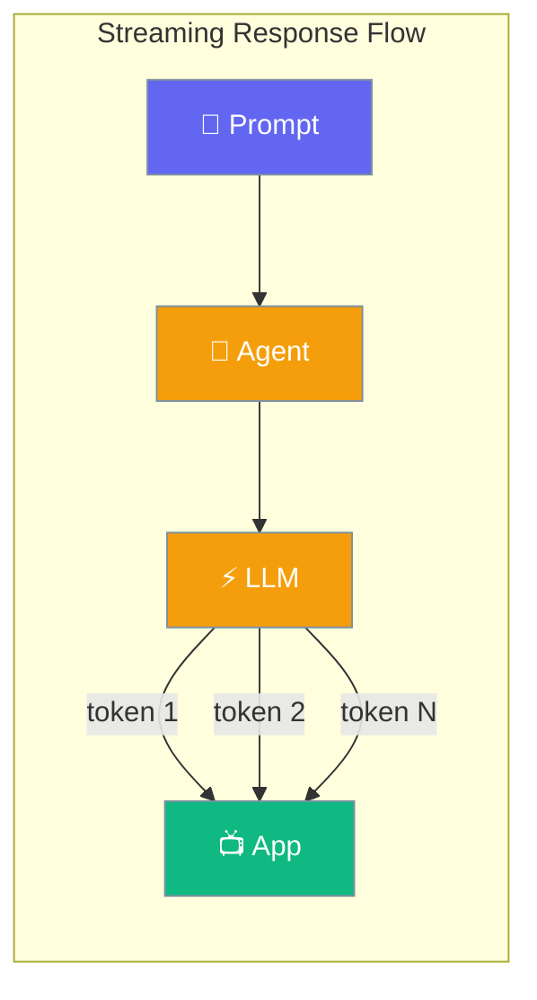
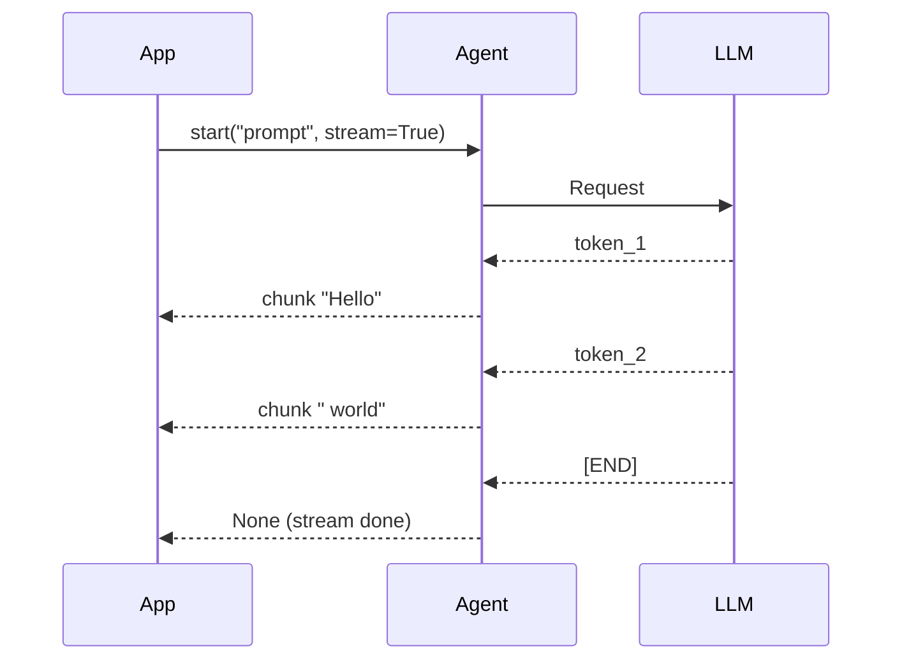

Stream AI responses as they're generated — tokens arrive one at a time instead of waiting for the full response.



## Quick Start

<Steps>
<Step title="Auto-Detect (Recommended)">
```python
from praisonaiagents import Agent

agent = Agent(instructions="You are a helpful assistant")
agent.start("Write a short story about a robot")
```

The SDK auto-detects streaming support and falls back silently when unsupported.
</Step>

<Step title="Force Streaming">
```python
from praisonaiagents import Agent

agent = Agent(instructions="You are a helpful assistant")

for chunk in agent.start("Explain quantum computing", stream=True):
    print(chunk, end="", flush=True)
```
</Step>

<Step title="Async Streaming">
```python
import asyncio
from praisonaiagents import Agent

async def main():
    agent = Agent(instructions="You are a helpful assistant")
    result = await agent.astart("Write a haiku", stream=True)
    print(result)

asyncio.run(main())
```
</Step>
</Steps>

---

## How It Works



Tokens flow from the LLM through the agent to your application as they are generated. No buffering — your UI can display progress immediately.

---

## Configuration Options

<Card title="Streaming API Reference" icon="code" href="/docs/features/streaming">
  Full streaming reference — methods, events, metrics, and error handling
</Card>

### Streaming Methods

| Method | Streams | Display | Best For |
|--------|---------|---------|----------|
| `start()` | Auto | Auto | Recommended — works everywhere |
| `start(stream=True)` | Yes | Auto | Force streaming |
| `iter_stream()` | Always | No | App integration, custom UI |
| `astart(stream=True)` | Yes | Auto | Async workflows |
| `run()` | No | No | Batch processing |

---

## Common Patterns

### App Integration with `iter_stream()`

```python
from praisonaiagents import Agent

agent = Agent(instructions="You are a helpful assistant")

full_response = ""
for chunk in agent.iter_stream("Write a poem about the ocean"):
    full_response += chunk
    # Send to WebSocket, SSE, or custom UI

print(full_response)
```

### FastAPI SSE Endpoint

```python
from fastapi import FastAPI
from fastapi.responses import StreamingResponse
from praisonaiagents import Agent

app = FastAPI()

@app.get("/stream")
async def stream_response(prompt: str):
    agent = Agent(instructions="You are a helpful assistant")

    def generate():
        for chunk in agent.iter_stream(prompt):
            yield f"data: {chunk}\n\n"
        yield "data: [DONE]\n\n"

    return StreamingResponse(generate(), media_type="text/event-stream")
```

### Handle Stream Errors

```python
from praisonaiagents import Agent

agent = Agent(instructions="You are a helpful assistant")

full = ""
for chunk in agent.iter_stream("Summarise the latest AI research"):
    full += chunk
    print(chunk, end="", flush=True)

if "[Error:" in full and "ref:" in full:
    print("\n⚠️ Error detected — check logs for correlation ID")
```

---

## Best Practices

<AccordionGroup>
<Accordion title="Let the SDK pick the streaming mode">
Omit the `stream` argument — the SDK tries streaming first and falls back gracefully when unsupported. Only override when you have a specific reason.
</Accordion>

<Accordion title="Use iter_stream() for app integration">
`iter_stream()` yields raw chunks with zero display overhead — perfect for piping into FastAPI, WebSocket servers, or custom UIs.
</Accordion>

<Accordion title="Monitor Time To First Token (TTFT)">
High TTFT indicates model or network latency. The model must process your prompt before generating the first token. Use `StreamMetrics` to track and optimise.

```python
from praisonaiagents import Agent
from praisonaiagents.streaming import StreamMetrics, StreamEvent, StreamEventType

metrics = StreamMetrics()

def on_event(event: StreamEvent):
    metrics.update_from_event(event)

agent = Agent(instructions="You are helpful")
agent.stream_emitter.add_callback(on_event)
agent.start("Tell me a fact", stream=True)

print(metrics.format_summary())
```
</Accordion>

<Accordion title="Handle mid-stream errors">
When a tool call follow-up fails, the SDK emits a sentinel string ending with `(ref: followup-...)`. Check for this in `iter_stream()` consumers and surface the correlation ID in your logs.
</Accordion>
</AccordionGroup>

---

## Related

<CardGroup cols={2}>
<Card title="Streaming (Full Reference)" icon="bolt" href="/docs/features/streaming">
  StreamEvent protocol, metrics, CLI usage, and troubleshooting
</Card>
<Card title="Streaming Tool Events" icon="wrench" href="/docs/features/streaming-tool-events">
  Live tool call progress during streaming
</Card>
</CardGroup>
