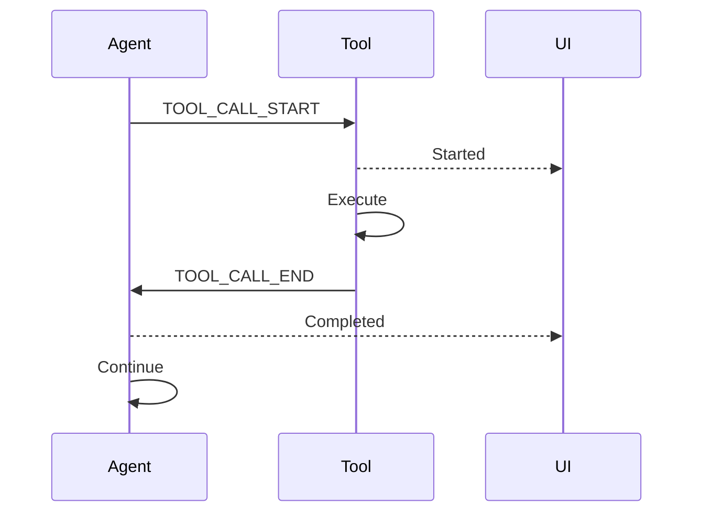

Track tool execution in real time with streaming events — use `TOOL_CALL_END` as the completion marker for UI spinners and progress bars.

```python
from praisonaiagents import Agent
from praisonaiagents.streaming import StreamEventType

agent = Agent(name="Assistant")

def on_stream_event(event):
    if event.type == StreamEventType.TOOL_CALL_END:
        print(f"Tool '{event.tool_call['name']}' completed")

agent.stream_emitter.add_callback(on_stream_event)
agent.start("Use the search tool to find information about Python")
```

The user runs a tool-heavy prompt; streaming events mark when each tool finishes.



## Quick Start

<Steps>
<Step title="Subscribe to Tool Events">

Listen for tool execution completion events:

```python
from praisonaiagents import Agent
from praisonaiagents.streaming import StreamEvent, StreamEventType

agent = Agent(name="Assistant")

def on_stream_event(event):
    if event.type == StreamEventType.TOOL_CALL_END:
        print(f"Tool '{event.tool_call['name']}' completed")
        print(f"Duration: {event.metadata.get('duration_ms')}ms")

agent.stream_emitter.add_callback(on_stream_event)
agent.start("Use the search tool to find information about Python")
```

</Step>

<Step title="UI Integration">

Use tool events for progress indicators in your UI:

```python
class ToolProgressUI:
    def __init__(self):
        self.active_tools = {}
    
    def handle_stream_event(self, event):
        if event.type == StreamEventType.TOOL_CALL_START:
            self.active_tools[event.tool_call['id']] = {
                'name': event.tool_call['name'],
                'status': 'running'
            }
            self.update_progress_ui()
            
        elif event.type == StreamEventType.TOOL_CALL_END:
            tool_id = event.tool_call['id']
            if tool_id in self.active_tools:
                self.active_tools[tool_id]['status'] = 'completed'
                self.update_progress_ui()
```

</Step>
</Steps>

---

## Tool Event Types

### TOOL_CALL_START

Emitted when tool execution begins with parsed arguments:

```python
{
    "type": "tool_call_start",
    "timestamp": 1704153600.123,
    "tool_call": {
        "id": "tc_abc123",
        "name": "search_web", 
        "arguments": {"query": "Python tutorials"}
    },
    "metadata": {
        "agent_name": "Assistant"
    }
}
```

### TOOL_CALL_END

**The stream end marker** - signals tool execution completion:

```python
{
    "type": "tool_call_end",
    "timestamp": 1704153602.456,
    "tool_call": {
        "id": "tc_abc123",
        "name": "search_web",
        "result": "Found 10 results about Python tutorials"
    },
    "metadata": {
        "duration_ms": 2333.0,
        "success": True
    }
}
```

### TOOL_CALL_RESULT

Final tool output after execution:

```python
{
    "type": "tool_call_result", 
    "timestamp": 1704153602.460,
    "tool_call": {
        "id": "tc_abc123",
        "name": "search_web",
        "result": "Formatted search results..."
    }
}
```

---

## Event Flow Sequence

```mermaid
graph TD
    A[Agent Receives Tool Call] --> B[TOOL_CALL_START]
    B --> C[Tool Execution]
    C --> D[TOOL_CALL_END]
    D --> E[TOOL_CALL_RESULT]
    E --> F[Agent Continues]
    
    classDef start fill:#189AB4,stroke:#7C90A0,color:#fff
    classDef process fill:#F59E0B,stroke:#7C90A0,color:#fff
    classDef end fill:#10B981,stroke:#7C90A0,color:#fff
    classDef continue fill:#6366F1,stroke:#7C90A0,color:#fff
    
    class A,B start
    class C,D process
    class E end
    class F continue
```

**Key Marker:** `TOOL_CALL_END` is the **completion signal** for UI consumers. Use this to:

- Hide loading spinners
- Show completion checkmarks
- Enable follow-up actions
- Update progress bars

---

## Multiple Tool Handling

When agents use multiple tools simultaneously:

```python
class MultiToolTracker:
    def __init__(self):
        self.tools = {}
    
    def handle_event(self, event):
        if event.type == StreamEventType.TOOL_CALL_START:
            self.tools[event.tool_call['id']] = {
                'name': event.tool_call['name'],
                'start_time': event.timestamp,
                'status': 'running'
            }
            
        elif event.type == StreamEventType.TOOL_CALL_END:
            tool_id = event.tool_call['id']
            if tool_id in self.tools:
                self.tools[tool_id].update({
                    'end_time': event.timestamp,
                    'status': 'completed',
                    'duration': event.metadata.get('duration_ms', 0)
                })
                self.on_tool_completed(tool_id)
    
    def on_tool_completed(self, tool_id):
        tool = self.tools[tool_id]
        print(f"✅ {tool['name']} completed in {tool['duration']}ms")
```

---

## Error Handling

Tools can fail during execution:

```python
def handle_tool_events(event):
    if event.type == StreamEventType.TOOL_CALL_END:
        success = event.metadata.get('success', True)
        
        if success:
            print(f"✅ Tool {event.tool_call['name']} succeeded")
        else:
            error = event.metadata.get('error', 'Unknown error')
            print(f"❌ Tool {event.tool_call['name']} failed: {error}")
            
    elif event.type == StreamEventType.ERROR:
        if 'tool_call' in event.metadata:
            print(f"🚨 Tool execution error: {event.content}")
```

---

## UI Integration Patterns

### React Component

```jsx
function ToolProgress({ agent }) {
  const [tools, setTools] = useState({});
  
  useEffect(() => {
    const handleEvent = (event) => {
      if (event.type === 'tool_call_start') {
        setTools(prev => ({
          ...prev,
          [event.tool_call.id]: {
            name: event.tool_call.name,
            status: 'running'
          }
        }));
      } else if (event.type === 'tool_call_end') {
        setTools(prev => ({
          ...prev, 
          [event.tool_call.id]: {
            ...prev[event.tool_call.id],
            status: 'completed'
          }
        }));
      }
    };
    
    agent.stream_emitter.add_callback(handleEvent);
    return () => agent.stream_emitter.remove_callback(handleEvent);
  }, [agent]);
  
  return (
    <div className="tool-progress">
      {Object.values(tools).map(tool => (
        <div key={tool.id} className={`tool ${tool.status}`}>
          {tool.status === 'running' && <Spinner />}
          {tool.status === 'completed' && <CheckIcon />}
          {tool.name}
        </div>
      ))}
    </div>
  );
}
```

### Terminal Progress

```python
import time
from rich.console import Console
from rich.progress import Progress, SpinnerColumn, TextColumn

console = Console()

class TerminalToolProgress:
    def __init__(self):
        self.progress = Progress(
            SpinnerColumn(),
            TextColumn("[bold blue]{task.description}"),
            console=console
        )
        self.tasks = {}
        self.progress.start()
    
    def handle_event(self, event):
        if event.type == StreamEventType.TOOL_CALL_START:
            task_id = self.progress.add_task(
                f"Running {event.tool_call['name']}", 
                total=None
            )
            self.tasks[event.tool_call['id']] = task_id
            
        elif event.type == StreamEventType.TOOL_CALL_END:
            tool_id = event.tool_call['id']
            if tool_id in self.tasks:
                task_id = self.tasks[tool_id]
                self.progress.update(
                    task_id,
                    description=f"✅ {event.tool_call['name']} completed",
                    completed=True
                )
                del self.tasks[tool_id]
```

---

## Best Practices

<AccordionGroup>

<Accordion title="Use TOOL_CALL_END as the completion signal">
Don't rely on `TOOL_CALL_RESULT` for completion detection. `TOOL_CALL_END` is the definitive marker:

```python
# Good - reliable completion detection
if event.type == StreamEventType.TOOL_CALL_END:
    mark_tool_completed(event.tool_call['id'])

# Avoid - TOOL_CALL_RESULT may not always fire
if event.type == StreamEventType.TOOL_CALL_RESULT:
    mark_tool_completed(event.tool_call['id'])
```
</Accordion>

<Accordion title="Handle tool ID mapping">
Track tool calls by their unique IDs, not just names:

```python
# Tools may have same name but different IDs
tool_tracker = {}

def handle_event(event):
    tool_id = event.tool_call['id']  # Always use ID
    tool_name = event.tool_call['name']
    
    if event.type == StreamEventType.TOOL_CALL_START:
        tool_tracker[tool_id] = {'name': tool_name, 'start': time.time()}
```
</Accordion>

<Accordion title="Gracefully handle missing events">
Network issues may cause missed events. Implement timeouts:

```python
import time

class RobustToolTracker:
    def __init__(self, timeout=30):
        self.tools = {}
        self.timeout = timeout
    
    def cleanup_stale_tools(self):
        now = time.time()
        stale = [
            tool_id for tool_id, tool in self.tools.items()
            if tool['status'] == 'running' 
            and now - tool['start_time'] > self.timeout
        ]
        for tool_id in stale:
            self.tools[tool_id]['status'] = 'timeout'
            self.on_tool_timeout(tool_id)
```
</Accordion>

</AccordionGroup>

---

## Event Data Reference

### TOOL_CALL_START Event

| Field | Type | Description |
|-------|------|-------------|
| `type` | `string` | Always `"tool_call_start"` |
| `timestamp` | `float` | High-precision timestamp |
| `tool_call.id` | `string` | Unique tool call identifier |
| `tool_call.name` | `string` | Tool function name |
| `tool_call.arguments` | `dict` | Parsed tool arguments |

### TOOL_CALL_END Event  

| Field | Type | Description |
|-------|------|-------------|
| `type` | `string` | Always `"tool_call_end"` |
| `timestamp` | `float` | High-precision timestamp |
| `tool_call.id` | `string` | Tool call identifier |
| `tool_call.name` | `string` | Tool function name |
| `metadata.duration_ms` | `float` | Execution duration in milliseconds |
| `metadata.success` | `bool` | Whether execution succeeded |
| `metadata.error` | `string` | Error message if failed |

### TOOL_PROGRESS Event

`TOOL_PROGRESS` events carry incremental output emitted by a tool while it runs — before it returns a result. Tools call `emit_tool_progress()` to surface partial output without changing their signature.

| Field | Type | Description |
|-------|------|-------------|
| `type` | `string` | Always `"tool_progress"` |
| `timestamp` | `float` | High-precision timestamp |
| `content` | `string \| None` | Partial text output chunk (e.g. a stdout line) |
| `metadata.progress` | `float \| None` | Completion fraction 0.0–1.0 |
| `metadata.stream` | `string \| None` | Optional stream tag, e.g. `"stderr"` |

```python
from praisonaiagents.streaming.events import StreamEvent, StreamEventType, emit_tool_progress

def on_event(event: StreamEvent) -> None:
    if event.type == StreamEventType.TOOL_PROGRESS:
        pct = (event.metadata or {}).get("progress")
        line = event.content or ""
        print(f"[{pct:.0%}] {line}" if pct is not None else line)
```

See [Tool Progress Streaming](/docs/features/tool-progress-streaming) for the full guide.


### STREAM_UNAVAILABLE Event

The agent or model adapter emits `STREAM_UNAVAILABLE` when token streaming cannot run in the current configuration — for example when a provider falls back to a non-streaming response instead of failing silently. Treat it as an observable fallback signal for UIs and loggers.

| Field | Type | Description |
|-------|------|-------------|
| `type` | `string` | Always `"stream_unavailable"` |
| `timestamp` | `float` | High-precision timestamp |
| `error` | `string` | Human-readable summary (often `Streaming unavailable: …`) |
| `metadata.reason` | `string` | Provider-specific reason code or message |

```python
from praisonaiagents.streaming import StreamEventType

def on_event(event):
    if event.type == StreamEventType.STREAM_UNAVAILABLE:
        reason = (event.metadata or {}).get("reason") or event.error
        print(f"Streaming fallback: {reason}")
        # Continue with non-streaming UI or wait for DELTA_TEXT / final result
```

---

## Related

<CardGroup cols={2}>
<Card title="Agent Streaming" icon="stream" href="/docs/features/streaming">
  Core streaming concepts
</Card>
<Card title="Tool Progress Streaming" icon="gauge" href="/docs/features/tool-progress-streaming">
  Stream incremental output from inside running tools
</Card>
<Card title="Tool Development" icon="wrench" href="/docs/tools/custom">
  Creating custom tools
</Card>
</CardGroup>