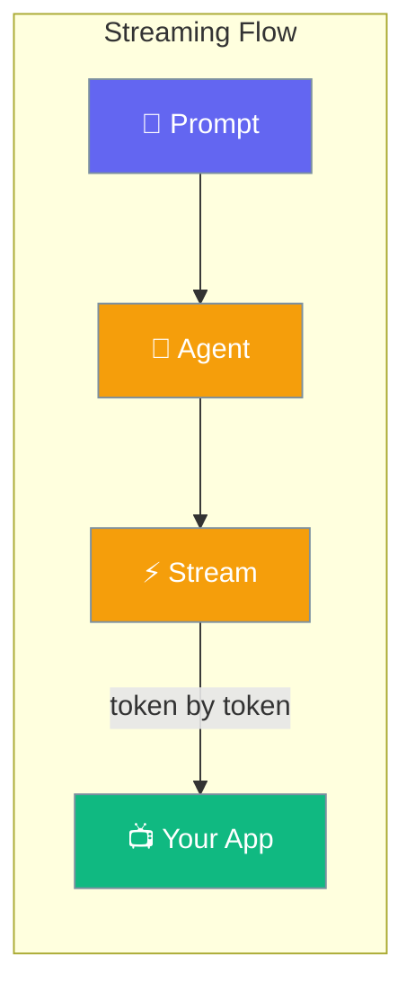
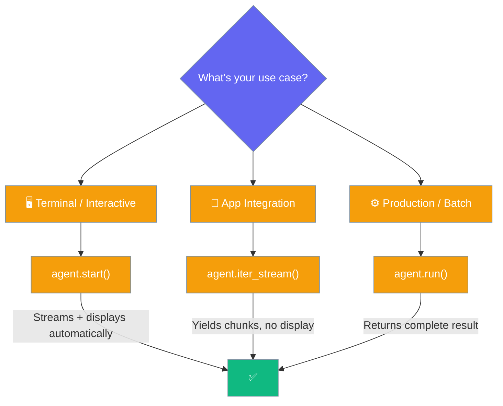
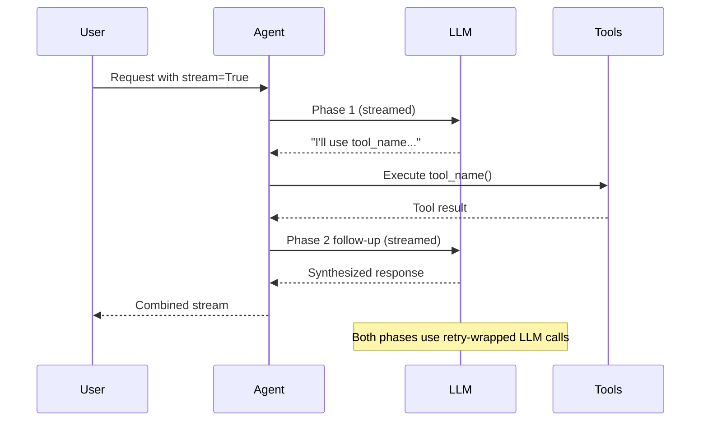
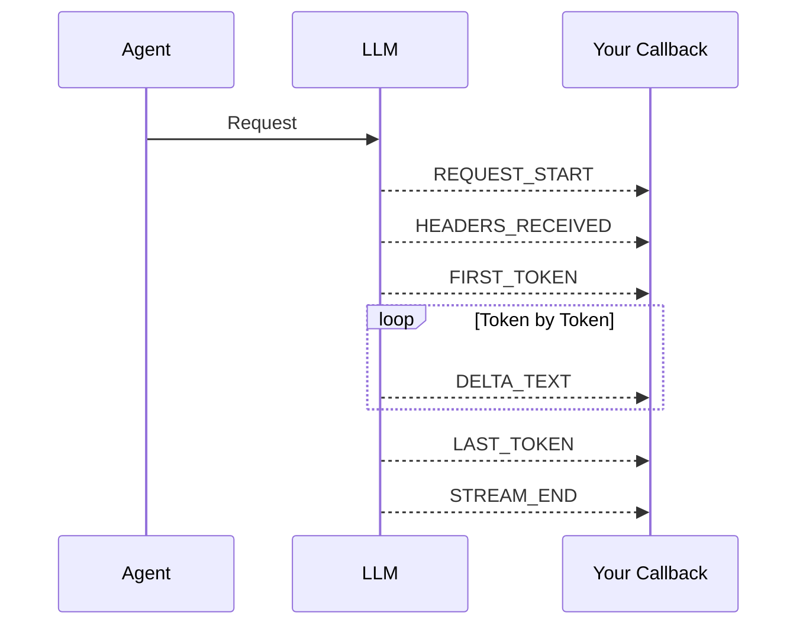

Stream AI responses token-by-token as they're generated, instead of waiting for the complete response.

```python
from praisonaiagents import Agent

agent = Agent(instructions="You are a helpful assistant")

for chunk in agent.start("Explain streaming in one sentence", stream=True):
    print(chunk, end="", flush=True)
```

The user sends a prompt; tokens stream back incrementally instead of waiting for the full reply.



## Quick Start

<Steps>
<Step title="Install">
```bash
pip install praisonaiagents
```
</Step>

<Step title="Auto-detect (Default)">
```python
from praisonaiagents import Agent

agent = Agent(instructions="You are a helpful assistant")
# No stream= argument — the SDK auto-detects what the provider supports
agent.start("Write a short story")
```

By default the SDK tries streaming first and silently falls back to non-streaming if your provider's sync client doesn't support it — multi-agent workflows on providers like Deepseek now Just Work.
</Step>

<Step title="Force Streaming">
```python
from praisonaiagents import Agent

agent = Agent(instructions="You are a helpful assistant")

for chunk in agent.start("Write a short story", stream=True):
    print(chunk, end="", flush=True)
```
</Step>
</Steps>

---

## Choosing the Right Method



| Method | Streams | Display | Best For |
|--------|---------|---------|----------|
| `start()` (auto-detect) | 🎯 Auto | ✅ Auto | **Recommended** — works everywhere |
| `start(stream=True)` | ✅ Yes | ✅ Auto | Force streaming, interactive chat |
| `iter_stream()` | ✅ Always | ❌ No | App integration, custom UIs |
| `run()` | ❌ No | ❌ No | Production, batch processing |
| `chat(stream=True)` | Configurable | Configurable | Low-level control |

---

## Common Patterns

### Terminal Streaming

```python
from praisonaiagents import Agent

agent = Agent(instructions="You are a helpful assistant")

# Tokens appear as they arrive
for chunk in agent.start("Explain quantum computing", stream=True):
    print(chunk, end="", flush=True)
```

### App Integration with `iter_stream()`

Best for integrating into your own application — yields raw chunks with no display overhead.

```python
from praisonaiagents import Agent

agent = Agent(instructions="You are a helpful assistant")

full_response = ""
for chunk in agent.iter_stream("Write a haiku"):
    full_response += chunk
    # Send to your UI, WebSocket, or processing pipeline

print(full_response)
```

The interactive CLI (`praisonai chat` / `praisonai code`) consumes `iter_stream()` directly since [PR #2906](https://github.com/MervinPraison/PraisonAI/pull/2906) — every token you see in the terminal is a real model delta, not a post-hoc word replay. If the provider does not stream, the CLI falls back to a single non-streamed `chat()` call and prints the completed answer as one block. See [Interactive TUI](/docs/cli/interactive-tui#streaming).

### Streaming with Callbacks

Hook into every streaming event for fine-grained control.

```python
from praisonaiagents import Agent
from praisonaiagents.streaming import StreamEvent, StreamEventType

def on_event(event: StreamEvent):
    if event.type == StreamEventType.DELTA_TEXT:
        print(event.content, end="", flush=True)
    elif event.type == StreamEventType.FIRST_TOKEN:
        print("⚡ First token received!")
    elif event.type == StreamEventType.STREAM_END:
        print("\n✅ Done!")

agent = Agent(instructions="You are a helpful assistant")
agent.stream_emitter.add_callback(on_event)
agent.start("Tell me a joke", stream=True)
```

### FastAPI SSE Integration

Pipe streaming tokens directly to a web client using Server-Sent Events.

```python
from fastapi import FastAPI
from fastapi.responses import StreamingResponse
from praisonaiagents import Agent

app = FastAPI()

@app.get("/stream")
async def stream_response(prompt: str):
    agent = Agent(instructions="You are a helpful assistant")
    
    def generate():
        for chunk in agent.iter_stream(prompt):
            yield f"data: {chunk}\n\n"
        yield "data: [DONE]\n\n"
    
    return StreamingResponse(generate(), media_type="text/event-stream")
```

### Async Streaming

```python
import asyncio
from praisonaiagents import Agent

async def main():
    agent = Agent(instructions="You are a helpful assistant")
    result = await agent.astart("Write a poem", stream=True)
    print(result)

asyncio.run(main())
```

---

## Streaming with Tools

When your agent uses tools, streaming happens in two phases: the initial response that decides to call tools, and a follow-up response that synthesizes the tool results.

Tools can also emit incremental progress while they run using `emit_tool_progress()` — these arrive as `TOOL_PROGRESS` events in your stream callback before the tool returns its result. See [Tool Progress Streaming](/docs/features/tool-progress-streaming).



```python
from praisonaiagents import Agent, tool

@tool
def get_weather(city: str) -> str:
    """Get weather for a city."""
    return f"Weather in {city}: 72°F, sunny"

agent = Agent(
    instructions="You are a weather assistant",
    tools=[get_weather]
)

for chunk in agent.start("What's the weather in Paris?", stream=True):
    print(chunk, end="", flush=True)
```

Both phases go through the same retry-wrapped LLM path, so transient rate-limit or network errors are retried automatically without any caller intervention.

---

## Error Handling in the Stream

If the LLM call fails after retries, the stream ends with a visible error sentence instead of silently dropping.

You may receive this exact sentinel string:

```
[Error: Failed to generate final response after tool execution (ref: followup-1713957912345). Please retry. If it continues, try reducing prompt size.]
```

| Part | Meaning |
|------|---------|
| `ref: followup-<timestamp>` | Correlation ID logged server-side — share this when reporting issues |
| `Please retry` | Retries already ran internally; another attempt may succeed if the root cause was transient |
| `reducing prompt size` | Common root cause is context-length or provider capacity errors |

Detect the error sentinel in your stream consumer:

```python
from praisonaiagents import Agent

agent = Agent(instructions="You are a helpful assistant", tools=[...])

full = ""
for chunk in agent.iter_stream("Research and summarize quantum computing"):
    full += chunk
    print(chunk, end="", flush=True)

if "[Error:" in full and "ref:" in full:
    # Surface ref to your logs / retry externally
    print(f"\n⚠️ Error detected, check logs for correlation ID")
```

<Note>
The **initial** LLM call and the **follow-up** LLM call (after tool execution) now share the same retry and rate-limiting behavior — users no longer need to add their own retry wrapper around streaming + tools.
</Note>

---

## StreamEvent Protocol

Every streaming chunk emits a `StreamEvent` with full context.



| Event | When |
|-------|------|
| `REQUEST_START` | Before API call |
| `HEADERS_RECEIVED` | HTTP 200 arrives |
| `FIRST_TOKEN` | First content delta (TTFT marker) |
| `DELTA_TEXT` | Each text chunk |
| `DELTA_TOOL_CALL` | Tool call streaming |
| `RETRY` | Before a retry wait, on rate-limit / transient-error backoff |
| `LAST_TOKEN` | Final content delta |
| `STREAM_END` | Stream completed |

---

## Reacting to Retries

When the agent hits a rate limit or transient error, it emits a `RETRY` event **before** it waits, then retries. The signal fires on both the sync and async retry loops, and reaches both `add_callback(sync_fn)` and `add_async_callback(async_fn)` consumers. Emission is guarded so there is zero overhead when nothing is listening.

```mermaid
sequenceDiagram
    participant Agent
    participant LLM
    participant Emitter as StreamEmitter
    participant Sync as sync callback<br/>(add_callback)
    participant Async as async callback<br/>(add_async_callback)

    Agent->>LLM: async request
    LLM-->>Agent: 429 rate-limit
    Agent->>Agent: honour retry-after
    Agent->>Emitter: emit_async RETRY (attempt, max_attempts, delay, reason)
    Emitter-->>Sync: RETRY (via emit)
    Emitter-->>Async: RETRY (via emit_async)
    Agent->>LLM: retry

    classDef agent fill:#8B0000,stroke:#7C90A0,color:#fff
    classDef llm fill:#189AB4,stroke:#7C90A0,color:#fff
    classDef emit fill:#F59E0B,stroke:#7C90A0,color:#fff
    classDef consumer fill:#10B981,stroke:#7C90A0,color:#fff

    class Agent agent
    class LLM llm
    class Emitter emit
    class Sync,Async consumer
```

The `RETRY` event carries its details in `event.metadata`:

| Field | Type | Description |
|-------|------|-------------|
| `attempt` | `int` | The retry attempt about to run |
| `max_attempts` | `int` | Total attempts allowed |
| `delay` | `float` | Seconds the agent will wait before retrying |
| `reason` | `str` | Why the retry fired (e.g. `rate_limit`) |

<Tabs>
<Tab title="Sync callback">
```python
from praisonaiagents import Agent
from praisonaiagents.streaming import StreamEvent, StreamEventType

def on_event(event: StreamEvent):
    if event.type == StreamEventType.RETRY:
        m = event.metadata or {}
        print(
            f"Retrying in {m['delay']:.1f}s "
            f"(attempt {m['attempt']}/{m['max_attempts']}) — {m['reason']}"
        )

agent = Agent(instructions="Answer concisely.")
agent.stream_emitter.add_callback(on_event)
agent.start("Summarise the news")
```
</Tab>

<Tab title="Async callback">
The recommended shape for streaming UIs, TUIs, WebSocket bridges, and bot connectors.

```python
import asyncio
from praisonaiagents import Agent
from praisonaiagents.streaming import StreamEvent, StreamEventType

async def on_event(event: StreamEvent):
    if event.type == StreamEventType.RETRY:
        m = event.metadata or {}
        await broadcast_status(
            f"Retrying in {m['delay']:.1f}s "
            f"(attempt {m['attempt']}/{m['max_attempts']}) — {m['reason']}"
        )

async def main():
    agent = Agent(instructions="Answer concisely.")
    agent.stream_emitter.add_async_callback(on_event)
    await agent.astart("Summarise the news")

asyncio.run(main())
```
</Tab>
</Tabs>

<Note>
`RETRY` events reach every registered callback, sync or async. You can mix `add_callback(fn)` and `add_async_callback(afn)` on the same emitter — both fire for every retry. Requires PraisonAI 2026-07-23 or later ([PR #3325](https://github.com/MervinPraison/PraisonAI/pull/3325)); earlier versions dispatched async retries via the sync path only and skipped async-only consumers.
</Note>

<Note>
Same signal, two consumers — the [`ON_RETRY` hook](/docs/features/agent-retry) is for programmatic control, while the `RETRY` stream event feeds live UIs and `stream-json` pipelines. The [`run.retry` NDJSON event](/docs/features/run-stream-events) is the CLI-facing form of this same event.
</Note>

---

## Metrics

Track Time To First Token (TTFT) and throughput.

```python
from praisonaiagents import Agent
from praisonaiagents.streaming import StreamEvent, StreamEventType, StreamMetrics

metrics = StreamMetrics()

def on_event(event: StreamEvent):
    metrics.update_from_event(event)
    if event.type == StreamEventType.DELTA_TEXT:
        print(event.content, end="", flush=True)

agent = Agent(instructions="You are a helpful assistant")
agent.stream_emitter.add_callback(on_event)
agent.start("Explain AI briefly", stream=True)

print(metrics.format_summary())
# Output: TTFT: 245ms | Stream: 1200ms | Total: 1445ms | Tokens: 150 (125.0/s)
```

| Metric | Description |
|--------|-------------|
| **TTFT** | Time from request to first token (provider latency) |
| **Stream Duration** | From first to last token |
| **Total Time** | End-to-end request time |
| **Tokens/s** | Token generation rate |

---

## Key Concepts

### Time To First Token (TTFT)

```
Request → [TTFT] → First Token → [Streaming] → Last Token → Done
```

TTFT is the time before the first token arrives. This is provider latency — the model must process your prompt before generating. Streaming does NOT reduce TTFT, but it shows progress immediately.

### Streaming vs Non-Streaming

| Mode | Behavior | Use Case |
|------|----------|-----------|
| `stream=None` (default) | Try streaming, fall back to non-streaming if unsupported | **Recommended** — works across all providers |
| `stream=True` | Force streaming (errors on sync adapters that don't support it) | When you definitely want tokens |
| `stream=False` | Force non-streaming | Batch jobs, structured output, sync providers |
| **Multi-agent** `output=None` (default) | `stream=True` — auto streaming | Default streaming behavior |
| **Multi-agent** `output="verbose"` / `"minimal"` | `stream=True` by default | Display with streaming |
| **Multi-agent** `output=MultiAgentOutputConfig(stream=False)` | Disable streaming for all team agents | Opt-out for sync-only providers |

<Note>
**Sync vs Async Adapters**: Async methods (`achat`, `astart`, `_execute_unified_achat_completion`) still default to `stream=True` because async adapters universally support streaming. Sync methods (`chat`, `start`, `run`) use the new smart-fallback default. Some adapters (e.g., sync OpenAI/Deepseek adapter) currently do NOT support sync streaming and will trigger the fallback.

Multi-agent teams (`AgentTeam`, `PraisonAIAgents`) default to `stream=True` for `"verbose"` and `"minimal"` presets. Use `output=MultiAgentOutputConfig(stream=False)` or `output=["verbose", {"stream": False}]` to opt out for sync-only providers.
</Note>

---

## CLI Usage

```bash
# Stream responses in terminal
praisonai chat --stream "Tell me a joke"

# With verbose output
praisonai chat --stream --verbose "Explain quantum computing"
```

---

## Best Practices

<AccordionGroup>
  <Accordion title="Let the SDK pick streaming mode">
    Omit the `stream` argument (or pass `stream=None`) and the SDK will choose streaming where supported and silently fall back where it isn't. Only override when you have a specific reason.
  </Accordion>
  
  <Accordion title="Use iter_stream() for app integration">
    `iter_stream()` yields raw chunks with zero display overhead — ideal for piping into FastAPI, WebSocket, or custom UIs.
  </Accordion>
  
  <Accordion title="Use start(stream=True) for terminal">
    `start()` handles display automatically. Pass `stream=True` for real-time token output in interactive sessions.
  </Accordion>
  
  <Accordion title="Monitor TTFT for performance">
    High TTFT indicates model or network issues. Use `StreamMetrics` to track and optimize.
  </Accordion>
  
  <Accordion title="Handle errors in callbacks">
    Two layers of error handling. Callback exceptions are still caught by the emitter to avoid breaking the stream — log them inside your callback. LLM call failures, however, are now retried automatically and, on persistent failure, surface as a visible `[Error: ... (ref: ...)]` sentence at the end of the stream — check for this sentinel when consuming `iter_stream()`.
  </Accordion>
</AccordionGroup>

---

## Troubleshooting

### "Streaming seems to buffer before showing anything"

This is TTFT, not buffering. The model is generating the first token. Check:
- Model complexity (larger models have higher TTFT)
- Prompt length (longer prompts take longer to process)
- Network latency to the API

### "Tokens appear in chunks, not one at a time"

Normal. Providers may batch tokens for efficiency.

### "Stream ends with `[Error: Failed to generate final response after tool execution (ref: followup-...)]`"

The follow-up LLM call (the one that synthesizes tool results into a final answer) failed after the built-in retries. Common causes:
- Persistent rate limit — pair streaming with a [Rate Limiter](/docs/features/rate-limiter) at higher RPM, or back off the caller.
- Context-length overflow — reduce conversation history or tool-result size.
- Provider outage — include the `ref:` ID when reporting. The internal log line (`ref=..., model=..., error=...`) makes it searchable.

### "Streaming is not supported in sync OpenAIAdapter" / Deepseek multi-agent crash

Fixed with single-agent smart-fallback in PR #1734. For multi-agent teams that use sync-only providers, explicitly disable streaming with `output=["verbose", {"stream": False}]` or similar. See [Multi-Agent Output](/docs/features/multi-agent-output) for configuration options.

---

## Related

<CardGroup cols={2}>
  <Card title="Bot Streaming Replies" icon="message-pen" href="/docs/features/bot-streaming-replies">
    Live draft replies on messaging platforms using streaming events
  </Card>
  <Card title="Multi-Agent Output" icon="users-rectangle" href="/docs/features/multi-agent-output">
    Configure streaming and display for agent teams
  </Card>
  <Card title="Output & Display" icon="display" href="/docs/features/display-system">
    Single-agent output formatting options
  </Card>
  <Card title="Async" icon="clock" href="/docs/features/async">
    Async agent execution
  </Card>
  <Card title="Rate Limiter" icon="gauge" href="/docs/features/rate-limiter">
    Control request rates across initial and follow-up LLM calls
  </Card>
</CardGroup>
