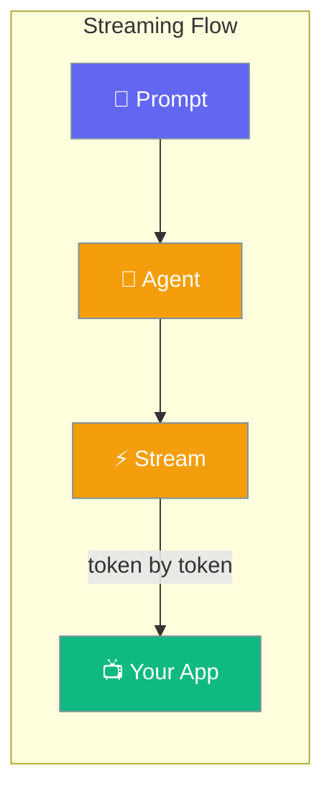
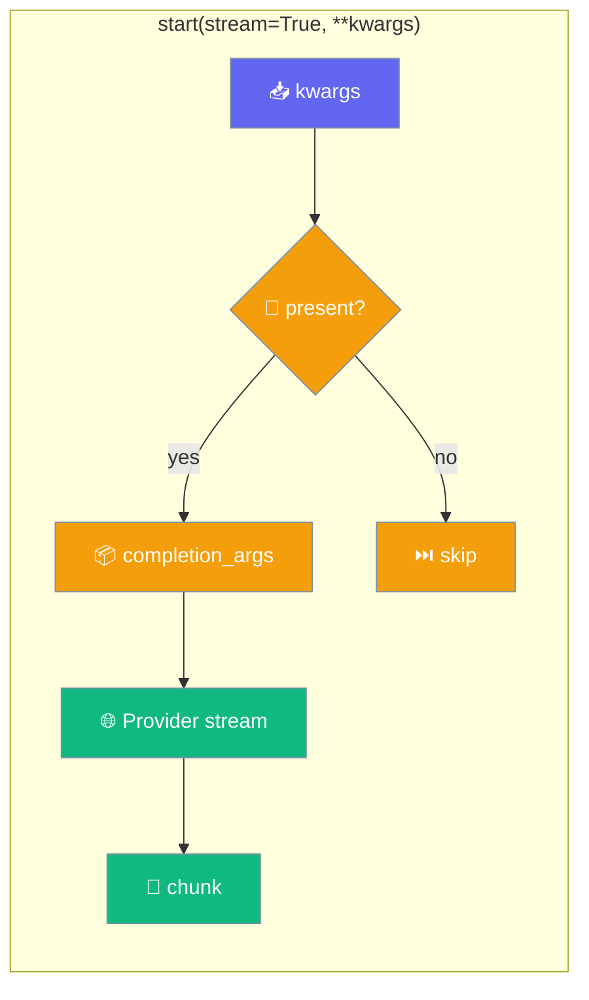
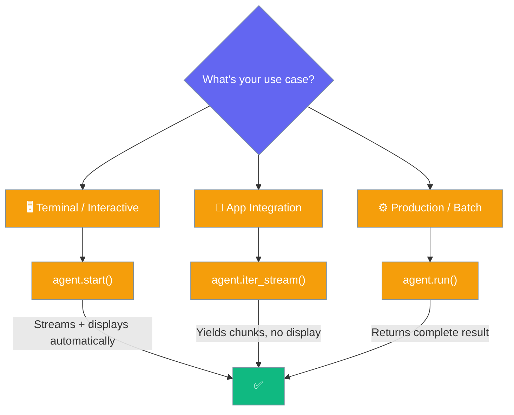
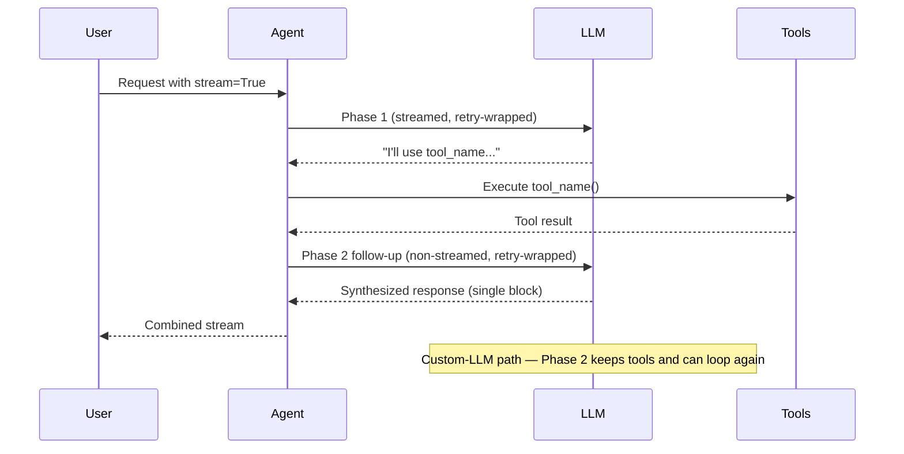
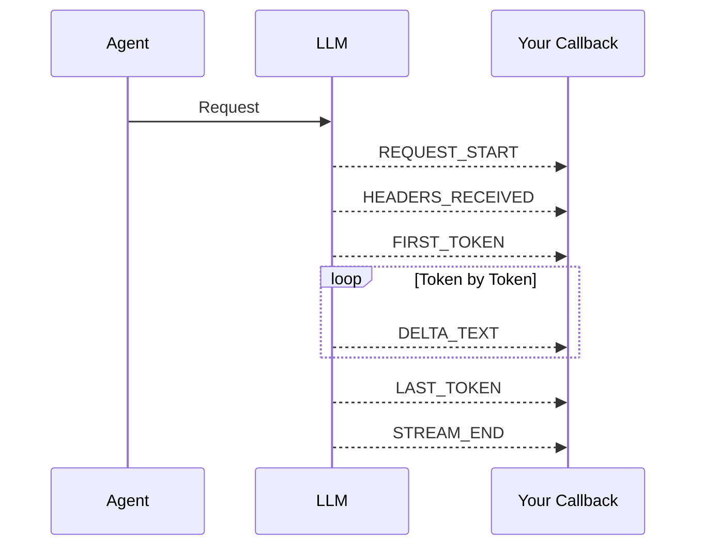
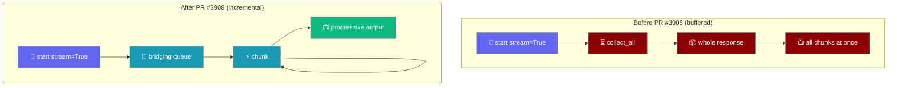

Stream AI responses token-by-token as they're generated, instead of waiting for the complete response.

```python
from praisonaiagents import Agent

agent = Agent(instructions="You are a helpful assistant")

for chunk in agent.start("Explain streaming in one sentence", stream=True):
    print(chunk, end="", flush=True)
```

The user sends a prompt; tokens stream back incrementally instead of waiting for the full reply.


```mermaid
graph LR
    subgraph "Streaming Flow"
        A[💬 Prompt] --> B[🤖 Agent]
        B --> C[⚡ Stream]
        C --> |token by token| D[📺 Your App]
    end
    
    classDef input fill:#6366F1,stroke:#7C90A0,color:#fff
    classDef agent fill:#F59E0B,stroke:#7C90A0,color:#fff
    classDef output fill:#10B981,stroke:#7C90A0,color:#fff
    
    class A input
    class B,C agent
    class D output
```

## Quick Start

<Steps>
<Step title="Install">
```bash
pip install praisonaiagents
```
</Step>

<Step title="Auto-detect (Default)">
```python
from praisonaiagents import Agent

agent = Agent(instructions="You are a helpful assistant")
# No stream= argument — the SDK auto-detects what the provider supports
agent.start("Write a short story")
```

By default the SDK tries streaming first and silently falls back to non-streaming if your provider's sync client doesn't support it — multi-agent workflows on providers like Deepseek now Just Work. Sampling knobs you pass (`max_tokens`, `top_p`, `temperature`) are honoured whether the streaming attempt or the fallback runs, and if streaming raises the SDK surfaces the original cause on the error's `__cause__` — you won't lose the real error to a fallback `TypeError`.
</Step>

<Step title="Force Streaming">
```python
from praisonaiagents import Agent

agent = Agent(instructions="You are a helpful assistant")

for chunk in agent.start("Write a short story", stream=True):
    print(chunk, end="", flush=True)
```
</Step>

<Step title="Shape the output while streaming">
Pass sampling knobs to `start()` the same way you would to a non-streaming call.

```python
from praisonaiagents import Agent

agent = Agent(instructions="You are a helpful assistant")

for chunk in agent.start(
    "Write a haiku",
    stream=True,
    max_tokens=64,
    top_p=0.9,
    temperature=0.7,
):
    print(chunk, end="", flush=True)
```
</Step>

<Step title="Control reasoning effort while streaming">
A reasoning model honours `reasoning_effort` on the streaming path too.

```python
from praisonaiagents import Agent

agent = Agent(instructions="Solve tricky problems step by step.", llm="o4-mini")

for chunk in agent.start(
    "Design a load balancer for a spiky workload.",
    stream=True,
    reasoning_effort="high",
):
    print(chunk, end="", flush=True)
```
</Step>
</Steps>

---

## Sampling knobs on the streaming path

`start(stream=True)` forwards `temperature`, `max_tokens`, `top_p`, and `reasoning_effort` straight to the provider stream.


```mermaid
graph LR
    subgraph "start(stream=True, **kwargs)"
        K[📥 kwargs] --> F{🔧 present?}
        F -->|yes| A[📦 completion_args]
        F -->|no| S[⏭️ skip]
        A --> P[🌐 Provider stream]
        P --> C[💬 chunk]
    end
    classDef in fill:#6366F1,stroke:#7C90A0,color:#fff
    classDef mid fill:#F59E0B,stroke:#7C90A0,color:#fff
    classDef out fill:#10B981,stroke:#7C90A0,color:#fff
    class K in
    class F,A,S mid
    class P,C out
```

| Parameter | Type | Default when omitted | Notes |
|---|---|---|---|
| `temperature` | `float` | `1.0` (always sent) | Existing behaviour — already reached the wire. |
| `max_tokens` | `int` | *absent from payload* | Present-only: unset → the provider chooses. Now honoured on the streaming path. |
| `top_p` | `float` (0–1) | *absent from payload* | Present-only: unset → the provider chooses. Now honoured on the streaming path. |
| `reasoning_effort` | `str` (`"off"`/`"minimal"`/`"low"`/`"medium"`/`"high"`) | *absent from payload* | Present-only: unset, `"off"`, or a non-reasoning model → the provider chooses. Routed through the same `resolve_reasoning_params` helper the non-streaming path uses — a reasoning model gets a native `reasoning_effort` kwarg, an extended-thinking model gets its `thinking` budget inside `extra_body`, everything else is untouched. Honoured on **both** streaming branches (custom-LLM and native sync-OpenAI). Falls back to `getattr(agent, 'reasoning_effort', None)` when not passed. Tool follow-up turns inherit it. See [Reasoning Effort](/features/reasoning-effort). Fixed in [PR #4780](https://github.com/MervinPraison/PraisonAI/pull/4780). |

<Note>
Leave a key out and it never reaches the provider — the provider's own default applies. This is not the same as sending `0` or `1`.
</Note>

<Note>
**Reasoning-effort precedence.** The call kwarg wins; when it's absent the agent attribute (`Agent(reasoning_effort=...)`) is used. Pass `reasoning_effort="off"` on a single call to short-circuit an agent-wide default for that turn.

**Tool follow-ups inherit it.** `_start_stream_impl` copies `completion_args` into the Phase-2 follow-up after tools, so the reasoning knob is carried into the synthesised-answer turn too — no extra work required.
</Note>

<Note>
**Extended-thinking models on the native OpenAI streaming path.** For Anthropic Claude 3.7+ / Gemini 2.5+ named over an OpenAI-compatible endpoint, `resolve_reasoning_params` returns `{"thinking": {...}}`. The raw OpenAI SDK rejects unknown top-level kwargs with `TypeError`, so the SDK routes the `thinking` budget through `extra_body`. `reasoning_effort` itself is a native OpenAI SDK keyword and stays top-level.
</Note>

**Agent-attribute fallback** — set the level once at construction and every streamed turn honours it.

```python
from praisonaiagents import Agent

# Attribute is used when the call kwarg isn't passed.
agent = Agent(instructions="Reason carefully.", llm="o4-mini", reasoning_effort="high")

for chunk in agent.start("Design a load balancer for a spiky workload.", stream=True):
    print(chunk, end="", flush=True)
```

<Tip>
Keep `max_tokens` small for interactive UIs to bound latency and cost.
</Tip>

---

## What happens when streaming fails

Streaming can fail mid-flight — a context-length overflow, a provider hiccup, a sync adapter that refuses to stream — and when it does, `start(stream=True)` and `iter_stream()` fall back to a single non-streaming `chat()` call so your caller still gets an answer.

```mermaid
sequenceDiagram
    participant U as Your code
    participant S as start(stream=True)
    participant SC as streaming client
    participant C as chat() fallback
    participant P as provider

    U->>S: start("...", stream=True, max_tokens=5)
    S->>SC: streamed request
    SC-->>S: RuntimeError("context too long")
    S->>S: strip stream=True<br/>keep only kwargs chat() accepts
    S->>C: chat("...", ...filtered kwargs..., stream=False)
    C->>P: non-streamed request
    P-->>C: full answer
    C-->>S: answer
    S-->>U: yielded as one block

    Note over S,C: If chat() also raises,<br/>the raised exception's __cause__<br/>is the original streaming error.

    classDef user fill:#6366F1,stroke:#7C90A0,color:#fff
    classDef process fill:#F59E0B,stroke:#7C90A0,color:#fff
    classDef client fill:#189AB4,stroke:#7C90A0,color:#fff
    classDef agent fill:#8B0000,stroke:#7C90A0,color:#fff
    classDef provider fill:#10B981,stroke:#7C90A0,color:#fff

    class U user
    class S process
    class SC client
    class C agent
    class P provider
```

The fallback contract:

| Behaviour | What the SDK does |
|---|---|
| `stream=True` in kwargs | Stripped — fallback is always non-streaming. |
| `max_tokens`, `top_p`, and anything else the concrete `chat()` doesn't declare | Filtered out via `inspect.signature(self.chat)` so `chat()` never raises `TypeError`. Subclasses that declare `**kwargs` receive everything. |
| The original streaming exception | Preserved as `exc.__cause__` on any raised fallback error. |
| Double fallback | Prevented — the fallback method sets `_praisonai_stream_fallback_exhausted = True` on any raised exception, and the outer `except` in `_start_stream_impl` re-raises rather than running the fallback a second time. |

### Internal helpers

One private helper on `ChatMixin` implements the contract above and is what the regression tests drive directly.

| Helper | Role |
|---|---|
| `ChatMixin._stream_fallback_chat(prompt, kwargs, streaming_error)` | Introspects `inspect.signature(self.chat)` to keep only the kwargs the concrete `chat()` declares, always forces `stream=False`, then calls `self.chat(prompt, ...)`. On fallback failure it re-raises `from streaming_error` and sets `_praisonai_stream_fallback_exhausted = True` on the raised exception. Subclasses whose `chat()` declares `**kwargs` receive everything. |

This is internal — do not import it from application code. It is named here so debug traces are readable and so subclasses that override `chat()` know that adding parameters to the override signature automatically opts those parameters into the fallback.

Debugging a failed fallback:

```python
from praisonaiagents import Agent

agent = Agent(instructions="You are a helpful assistant")

try:
    for chunk in agent.start("Very long prompt...", stream=True, max_tokens=5):
        print(chunk, end="", flush=True)
except Exception as e:
    # The fallback error itself
    print(f"Fallback failed: {e!r}")
    # The real streaming cause — pre-#4731 this was None
    print(f"Original streaming error: {e.__cause__!r}")
```

<Note>
Before PraisonAI PRs [#4731](https://github.com/MervinPraison/PraisonAI/pull/4731) and [#4734](https://github.com/MervinPraison/PraisonAI/pull/4734) (issue [#4719](https://github.com/MervinPraison/PraisonAI/issues/4719)) the fallback forwarded `start()`'s raw kwargs unchanged, so `stream=True` reached the sync adapter and `max_tokens` raised `TypeError` before any request was made. Callers on the desktop (which passes `max_tokens` on every turn) saw the `TypeError` with the original streaming error buried two `__context__` levels deep. Since these PRs, the fallback filters kwargs, forces `stream=False`, chains the original cause via `raise ... from streaming_error`, and marks the raised exception exhausted so the outer handler does not run the fallback again. The executable spec lives in `src/praisonai-agents/tests/test_streaming_fallback_kwargs.py`.
</Note>

---

## Choosing the Right Method


```mermaid
graph TB
    Q{"What's your use case?"} --> T[🖥️ Terminal / Interactive]
    Q --> A[📱 App Integration]
    Q --> P[⚙️ Production / Batch]
    
    T --> S["agent.start()"]
    A --> I["agent.iter_stream()"]
    P --> R["agent.run()"]
    
    S --> |"Streams + displays automatically"| Done[✅]
    I --> |"Yields chunks, no display"| Done
    R --> |"Returns complete result"| Done
    
    classDef question fill:#6366F1,stroke:#7C90A0,color:#fff
    classDef method fill:#F59E0B,stroke:#7C90A0,color:#fff
    classDef done fill:#10B981,stroke:#7C90A0,color:#fff
    
    class Q question
    class T,A,P,S,I,R method
    class Done done
```

| Method | Streams | Display | Best For |
|--------|---------|---------|----------|
| `start()` (auto-detect) | 🎯 Auto | ✅ Auto | **Recommended** — works everywhere |
| `start(stream=True)` | ✅ Yes | ✅ Auto | Force streaming, interactive chat — accepts `temperature`, `max_tokens`, `top_p`, `reasoning_effort` |
| `iter_stream()` | ✅ Always | ❌ No | App integration, custom UIs |
| `run()` | ❌ No | ❌ No | Production, batch processing |
| `chat(stream=True)` | Configurable | Configurable | Low-level control |

---

## Common Patterns

### Terminal Streaming

```python
from praisonaiagents import Agent

agent = Agent(instructions="You are a helpful assistant")

# Tokens appear as they arrive
for chunk in agent.start("Explain quantum computing", stream=True):
    print(chunk, end="", flush=True)
```

### App Integration with `iter_stream()`

Best for integrating into your own application — yields raw chunks with no display overhead.

```python
from praisonaiagents import Agent

agent = Agent(instructions="You are a helpful assistant")

full_response = ""
for chunk in agent.iter_stream("Write a haiku"):
    full_response += chunk
    # Send to your UI, WebSocket, or processing pipeline

print(full_response)
```

The interactive CLI (`praisonai chat` / `praisonai code`) consumes `iter_stream()` directly since [PR #2906](https://github.com/MervinPraison/PraisonAI/pull/2906) — every token you see in the terminal is a real model delta, not a post-hoc word replay. If the provider does not stream, the CLI falls back to a single non-streamed `chat()` call and prints the completed answer as one block. See [Interactive TUI](/docs/cli/interactive-tui#streaming).

### Streaming with Callbacks

Hook into every streaming event for fine-grained control.

```python
from praisonaiagents import Agent
from praisonaiagents.streaming import StreamEvent, StreamEventType

def on_event(event: StreamEvent):
    if event.type == StreamEventType.DELTA_TEXT:
        print(event.content, end="", flush=True)
    elif event.type == StreamEventType.FIRST_TOKEN:
        print("⚡ First token received!")
    elif event.type == StreamEventType.STREAM_END:
        print("\n✅ Done!")

agent = Agent(instructions="You are a helpful assistant")
agent.stream_emitter.add_callback(on_event)
agent.start("Tell me a joke", stream=True)
```

<Note>
For higher-level "a tool ran" telemetry — rather than token-level `StreamEvent`s — the [`tool_call` display callback](/features/display-callbacks#streaming-coverage) is the right entry point. It fires on the streaming path too (since PR #4735), carrying `tool_name`, `tool_input`, `tool_output`, `elapsed_time`, and `success`.
</Note>

### FastAPI SSE Integration

Pipe streaming tokens directly to a web client using Server-Sent Events.

```python
from fastapi import FastAPI
from fastapi.responses import StreamingResponse
from praisonaiagents import Agent

app = FastAPI()

@app.get("/stream")
async def stream_response(prompt: str):
    agent = Agent(instructions="You are a helpful assistant")
    
    def generate():
        for chunk in agent.iter_stream(prompt):
            yield f"data: {chunk}\n\n"
        yield "data: [DONE]\n\n"
    
    return StreamingResponse(generate(), media_type="text/event-stream")
```

### Async Streaming

```python
import asyncio
from praisonaiagents import Agent

async def main():
    agent = Agent(instructions="You are a helpful assistant")
    result = await agent.astart("Write a poem", stream=True)
    print(result)

asyncio.run(main())
```

---

## Streaming with Tools

When your agent uses tools, streaming happens in two phases: the initial response that decides to call tools, and a follow-up response that synthesizes the tool results.

Tools can also emit incremental progress while they run using `emit_tool_progress()` — these arrive as `TOOL_PROGRESS` events in your stream callback before the tool returns its result. See [Tool Progress Streaming](/features/tool-progress-streaming).

<Note>
Ollama doesn't reliably stream tool calls. When your agent uses Ollama and has tools, PraisonAI automatically disables streaming for that turn (`OllamaAdapter.supports_streaming_with_tools()` returns `False`) and falls back to the non-streaming path. Regular streaming without tools works normally.

LM Studio, vLLM, and llama.cpp stream tool calls correctly — the `LocalOpenAIAdapter` deliberately does **not** disable streaming for them.
</Note>

<Note>
**Where the two-phase flow lives.** The follow-up completion after tools is issued by the custom-LLM streaming path (`praisonaiagents/llm/llm.py::get_response_stream`), which most providers route through. The follow-up **keeps** `tools` available and is fetched non-streamed, then yielded as a single block — so the model can call another tool if it needs to. This is not bounded to a single round.
</Note>

<Note>
**Fixed in PraisonAI PR [#4757](https://github.com/MervinPraison/PraisonAI/pull/4757).** Before #4757, `get_response_stream` called an undefined `_create_tool_message`. The first tool result raised `AttributeError`, was silently swallowed by a broad `except Exception`, and the run fell through to a non-streaming branch that discarded `tool_calls` — so **every tool turn under `stream=True` produced an empty answer**. Providers whose `_supports_streaming_tools()` returns `False` — **Anthropic, Gemini and Ollama** — took that broken branch on every tools turn. Since #4757, `_create_tool_message` is a real method and the non-streaming fallback runs a bounded tool loop that actually executes tools and asks the model again with the results.
</Note>

<Warning>
This fix is scoped to the custom-LLM path (`llm.py::get_response_stream`). The native sync-OpenAI streaming path (`agent/chat_mixin.py::_start_stream_impl`) is a **separate** path that PR #4757 does not touch: it does **not** yet issue a follow-up completion after a tool runs — the streamed generator ends once tool results are appended to chat history. If you rely on `start(stream=True)` with tools on the sync OpenAI adapter and see no synthesized answer, use the non-streaming path (`chat()` / `start()` without `stream=True`) for that turn.
</Warning>

### The non-streaming fallback loop

Providers that cannot stream with tools run a bounded, non-streamed tool loop under the hood.

Any provider whose `_supports_streaming_tools()` returns `False` takes this path — currently **Anthropic** (`anthropic/claude-sonnet-4-20250514`), **Gemini** (`gemini/gemini-2.0-flash`), and **Ollama** (`ollama/llama3.2`).

```mermaid
sequenceDiagram
    participant U as User
    participant S as get_response_stream
    participant M as Model (non-streamed)
    participant T as Tool

    U->>S: start(stream=True) with tools
    Note over S: provider does not stream with tools<br/>(Anthropic / Gemini / Ollama)

    loop bounded by max_iter and max_tool_calls_per_turn
        S->>M: request (tools=..., stream=False)
        M-->>S: tool_calls (+ optional prose)
        S-->>U: yield prose (if any)
        S->>T: execute each tool_call
        T-->>S: result (or error → reported to model)
        S->>S: append tool results to messages
    end

    M-->>S: final answer (no tool_calls)
    S-->>U: yield final answer

    classDef user fill:#6366F1,stroke:#7C90A0,color:#fff
    classDef stream fill:#8B0000,stroke:#7C90A0,color:#fff
    classDef model fill:#F59E0B,stroke:#7C90A0,color:#fff
    classDef tool fill:#189AB4,stroke:#7C90A0,color:#fff

    class U user
    class S stream
    class M model
    class T tool
```

What the fallback does now:

1. Issues a non-streamed request with `tools=` still attached.
2. If the response has no `tool_calls`, yields whatever prose is there and stops.
3. If it has `tool_calls`, records the assistant turn (with `tool_calls` for OpenAI-shaped providers, plain content for Ollama), yields any accompanying prose, then executes each tool.
4. A failing tool is reported to the model as `{"error": "..."}` rather than aborting the run.
5. Loops back and asks the model again with the tool-result messages appended.

Prose emitted alongside tool calls is still yielded to the caller. `_create_tool_message` — now a real method — mirrors the non-streaming loop's formatting, including Ollama's natural-language variant.

| Parameter | Default | Bounds |
|---|---|---|
| `max_iterations` | falls back to `Agent(max_iter=...)` | How many model round trips the fallback makes |
| `max_tool_calls_per_turn` | `10` | Tool calls per model turn; when reached, the batch is truncated and a warning is logged |

#### Tool activity telemetry

Streaming UIs now see every tool call through the [`tool_call` display callback](/features/display-callbacks#streaming-coverage).

Register a `tool_call` handler and it fires on the streaming path with `tool_name`, `tool_input`, `tool_output`, `elapsed_time`, and `success` — the same kwargs as the non-streaming path.

```python
from praisonaiagents import Agent, register_display_callback

def on_tool_call(tool_name=None, tool_input=None, success=None, **kwargs):
    print(f"🔧 {tool_name}({tool_input}) — {'ok' if success else 'failed'}")

register_display_callback("tool_call", on_tool_call)

agent = Agent(instructions="You are a weather assistant", tools=[get_weather])

for chunk in agent.start("What's the weather in Paris?", stream=True):
    print(chunk, end="", flush=True)
```

<Note>
Before PraisonAI PR [#4735](https://github.com/MervinPraison/PraisonAI/pull/4735) (issue [#4716](https://github.com/MervinPraison/PraisonAI/issues/4716)), the `tool_call` display callback fired only on the non-streaming path — a tool could run under `stream=True` with its result reaching the model, yet a streaming UI saw no tool activity at all. Since #4735 the callback fires on both sync-OpenAI (`chat_mixin.py::_start_stream_impl`) and custom-LLM (`llm.py::get_response_stream`) streaming paths.
</Note>


```mermaid
sequenceDiagram
    participant U as User
    participant A as Agent  
    participant L as LLM
    participant T as Tools
    
    U->>A: Request with stream=True
    A->>L: Phase 1 (streamed, retry-wrapped)
    L-->>A: "I'll use tool_name..."
    A->>T: Execute tool_name()
    T-->>A: Tool result
    A->>L: Phase 2 follow-up (non-streamed, retry-wrapped)
    L-->>A: Synthesized response (single block)
    A-->>U: Combined stream
    
    Note over L: Custom-LLM path — Phase 2 keeps tools and can loop again
```

The Phase 2 follow-up is fetched with `stream=False` and yielded as one block — it is **not** a token stream. It carries the accumulated `messages` (system prompt, user turn, the assistant tool-call message, and the tool-result messages) and **keeps** `tools`, so the model may call another tool rather than being forced to answer.

```python
from praisonaiagents import Agent, tool

@tool
def get_weather(city: str) -> str:
    """Get weather for a city."""
    return f"Weather in {city}: 72°F, sunny"

agent = Agent(
    instructions="You are a weather assistant",
    tools=[get_weather]
)

for chunk in agent.start("What's the weather in Paris?", stream=True):
    print(chunk, end="", flush=True)
```

On the custom-LLM path both phases go through the same `_completion_with_retry` wrapper, so transient rate-limit or network errors are retried automatically without any caller intervention. If every retry is exhausted on the follow-up, the stream ends with the error sentinel documented below rather than dropping silently.

---

## Streaming with long histories

Context management runs on the streaming path exactly like it does on the non-streaming path — on **both** streaming branches.

If your agent has a ContextManager configured (auto-enabled when the agent has tools; see [Context Management Overview](/features/context-overview)), long chat histories are compacted before the streamed request is sent — same budget, same strategy, same behaviour as `chat()`.

```mermaid
sequenceDiagram
    participant U as User
    participant A as Agent
    participant CM as ContextManager
    participant L as LLM

    U->>A: start(prompt, stream=True)
    A->>A: _build_messages
    alt context_manager present
        A->>CM: _apply_context_management(messages, system_prompt, tools)
        CM-->>A: optimized messages
    end
    A->>L: streamed request (bounded)
    L-->>A: token
    A-->>U: token
    L-->>A: token
    A-->>U: token

    classDef user fill:#10B981,stroke:#7C90A0,color:#fff
    classDef agent fill:#8B0000,stroke:#7C90A0,color:#fff
    classDef cm fill:#189AB4,stroke:#7C90A0,color:#fff
    classDef llm fill:#F59E0B,stroke:#7C90A0,color:#fff

    class U user
    class A agent
    class CM cm
    class L llm
```

The same flow now runs on **both** streaming branches — the OpenAI-client branch and the custom-LLM branch. Which one your agent takes is decided by the routing flag `_using_custom_llm`, not the vendor.

### Which streaming branch does my agent use?

Two branches feed the streaming path, and they are chosen by `_using_custom_llm`:

| Your agent uses | Branch | Compaction |
|---|---|---|
| `llm="gpt-4o"` (default OpenAI, no `openai/` prefix) | OpenAI-client branch | ✅ Runs (since #4729) |
| `llm="openai/gpt-4o-mini"` (routed via litellm prefix) | Custom-LLM branch | ✅ Runs (since #4753) |
| `llm="ollama/…"`, `llm="anthropic/…"`, `llm="bedrock/…"`, `llm="vertex_ai/…"`, `llm="openrouter/…"` | Custom-LLM branch | ✅ Runs (since #4753) |
| Any agent passing a custom `llm_instance` | Custom-LLM branch | ✅ Runs (since #4753) |

The trigger is the routing flag, not the vendor — `llm="openai/gpt-4o-mini"` takes the custom-LLM branch too. Before PR #4753 the custom-LLM rows were ❌: compaction was silently skipped, and long conversations were sent to the provider in full.

<Warning>
**You were affected if** you created an agent with `llm="…"` **and** `tools=[…]` on the pre-#4753 code path — the ContextManager auto-enables when tools are present, yet the custom-LLM branch streamed the full uncompacted history. Against a 128k-token model an 801-message history was sent whole (~1.7M tokens, certain rejection); after #4753 the same history compacts before streaming.
</Warning>

<Note>
**How this fix arrived, in two PRs.**

Before PraisonAI PR [#4729](https://github.com/MervinPraison/PraisonAI/pull/4729)
(issue [#4714](https://github.com/MervinPraison/PraisonAI/issues/4714)),
streaming bypassed compaction entirely: long-running streamed chats hit the
provider's context-length limit. #4729 added compaction to `_start_stream_impl`,
but only inside the OpenAI-client branch.

Every agent routed through the custom-LLM branch — `llm="openai/gpt-4o-mini"`,
`llm="ollama/…"`, `llm="anthropic/…"`, and any other routed provider — still
streamed the entire history uncompacted. The trigger is the routing flag
`_using_custom_llm`, not the vendor.

[PR #4753](https://github.com/MervinPraison/PraisonAI/pull/4753) closes that
second branch. Since #4753, `start(stream=True)` / `iter_stream()` and
`chat()` / `start()` behave identically for context management on **all**
providers — the same budget, strategy, and behaviour as `chat()`.

There is no configuration to enable this — it inherits from your existing
`context=` / `Agent(tools=[...])` setup.
</Note>

```python
from praisonaiagents import Agent

def search(query: str) -> str:
    """A sample tool."""
    return f"Results for {query}"

# context_manager auto-enabled because tools are present
agent = Agent(instructions="You are a helpful assistant", tools=[search])

# Chat history can grow indefinitely across calls — compaction now
# runs on both entry points.
for _ in range(500):
    agent.chat("Ask a long-running question...")

# Streaming path now compacts before sending, same as non-streaming.
for chunk in agent.start("What did we discuss?", stream=True):
    print(chunk, end="", flush=True)
```

<Note>
The system prompt is embedded as `messages[0]`. The streaming path splits it out so the token ledger accounts for it, then reattaches it after optimization — no user-visible change to prompt structure.
</Note>

**When you don't have context management** (`Agent(context=False)`, or an agent with no tools and no explicit `context=True`), streaming and non-streaming both send the raw history — as before. The `self.context_manager` guard skips the whole step, so there is **zero overhead** when context management is disabled.

---

## Error Handling in the Stream

If the follow-up LLM call fails after retries, the stream ends with a visible error sentence instead of silently dropping. This sentinel is emitted from the custom-LLM streaming path (`praisonaiagents/llm/llm.py::get_response_stream`) — the native sync-OpenAI path does not currently emit it.

You may receive this exact sentinel string:

```
[Error: Failed to generate final response after tool execution (ref: followup-1713957912345). Please retry. If it continues, try reducing prompt size.]
```

| Part | Meaning |
|------|---------|
| `ref: followup-<timestamp>` | Correlation ID logged server-side — share this when reporting issues |
| `Please retry` | Retries already ran internally; another attempt may succeed if the root cause was transient |
| `reducing prompt size` | Common root cause is context-length or provider capacity errors |

Detect the error sentinel in your stream consumer:

```python
from praisonaiagents import Agent

agent = Agent(instructions="You are a helpful assistant", tools=[...])

full = ""
for chunk in agent.iter_stream("Research and summarize quantum computing"):
    full += chunk
    print(chunk, end="", flush=True)

if "[Error:" in full and "ref:" in full:
    # Surface ref to your logs / retry externally
    print(f"\n⚠️ Error detected, check logs for correlation ID")
```

<Note>
The **initial** LLM call and the **follow-up** LLM call (after tool execution) now share the same retry and rate-limiting behavior — users no longer need to add their own retry wrapper around streaming + tools.
</Note>

---

## StreamEvent Protocol

Every streaming chunk emits a `StreamEvent` with full context.


```mermaid
sequenceDiagram
    participant A as Agent
    participant L as LLM
    participant C as Your Callback
    
    A->>L: Request
    L-->>C: REQUEST_START
    L-->>C: HEADERS_RECEIVED
    L-->>C: FIRST_TOKEN
    loop Token by Token
        L-->>C: DELTA_TEXT
    end
    L-->>C: LAST_TOKEN
    L-->>C: STREAM_END
```

| Event | When |
|-------|------|
| `REQUEST_START` | Before API call |
| `HEADERS_RECEIVED` | HTTP 200 arrives |
| `FIRST_TOKEN` | First content delta (TTFT marker) |
| `DELTA_TEXT` | Each text chunk |
| `DELTA_TOOL_CALL` | Tool call streaming |
| `TODO_UPDATED` | Todo list mutated; full ordered list in `metadata["todos"]` |
| `RETRY` | Before a retry wait, on rate-limit / transient-error backoff |
| `MODEL_FALLBACK` | Primary model unavailable; the turn continues on a backup from `fallback_models`. Metadata: `from_model`, `to_model`, `reason_category`, `fallback_index`. |
| `LAST_TOKEN` | Final content delta |
| `STREAM_END` | Stream completed |

`TODO_UPDATED` fires on every `todo_add` / `todo_update` — subscribe to render a live checklist. See [Live Todo Streaming](/features/todo-live-streaming).

`MODEL_FALLBACK` fires the moment the runtime swaps models. Subscribe to render a "switched to backup" notice, or pair it with the [`HookEvent.MODEL_FALLBACK` hook](/features/hook-events#model_fallback) for programmatic reactions. See [Model Fallback → Observing the Switch](/features/model-fallback#observing-the-switch).

---

## Reacting to Retries

When the agent hits a rate limit or transient error, it emits a `RETRY` event **before** it waits, then retries. The signal fires on both the sync and async retry loops, and reaches both `add_callback(sync_fn)` and `add_async_callback(async_fn)` consumers. Emission is guarded so there is zero overhead when nothing is listening.

```mermaid
sequenceDiagram
    participant Agent
    participant LLM
    participant Emitter as StreamEmitter
    participant Sync as sync callback<br/>(add_callback)
    participant Async as async callback<br/>(add_async_callback)

    Agent->>LLM: async request
    LLM-->>Agent: 429 rate-limit
    Agent->>Agent: honour retry-after
    Agent->>Emitter: emit_async RETRY (attempt, max_attempts, delay, reason)
    Emitter-->>Sync: RETRY (via emit)
    Emitter-->>Async: RETRY (via emit_async)
    Agent->>LLM: retry

    classDef agent fill:#8B0000,stroke:#7C90A0,color:#fff
    classDef llm fill:#189AB4,stroke:#7C90A0,color:#fff
    classDef emit fill:#F59E0B,stroke:#7C90A0,color:#fff
    classDef consumer fill:#10B981,stroke:#7C90A0,color:#fff

    class Agent agent
    class LLM llm
    class Emitter emit
    class Sync,Async consumer
```

The `RETRY` event carries its details in `event.metadata`:

| Field | Type | Description |
|-------|------|-------------|
| `attempt` | `int` | The retry attempt about to run |
| `max_attempts` | `int` | Total attempts allowed |
| `delay` | `float` | Seconds the agent will wait before retrying |
| `reason` | `str` | Why the retry fired (e.g. `rate_limit`) |

<Tabs>
<Tab title="Sync callback">
```python
from praisonaiagents import Agent
from praisonaiagents.streaming import StreamEvent, StreamEventType

def on_event(event: StreamEvent):
    if event.type == StreamEventType.RETRY:
        m = event.metadata or {}
        print(
            f"Retrying in {m['delay']:.1f}s "
            f"(attempt {m['attempt']}/{m['max_attempts']}) — {m['reason']}"
        )

agent = Agent(instructions="Answer concisely.")
agent.stream_emitter.add_callback(on_event)
agent.start("Summarise the news")
```
</Tab>

<Tab title="Async callback">
The recommended shape for streaming UIs, TUIs, WebSocket bridges, and bot connectors.

```python
import asyncio
from praisonaiagents import Agent
from praisonaiagents.streaming import StreamEvent, StreamEventType

async def on_event(event: StreamEvent):
    if event.type == StreamEventType.RETRY:
        m = event.metadata or {}
        await broadcast_status(
            f"Retrying in {m['delay']:.1f}s "
            f"(attempt {m['attempt']}/{m['max_attempts']}) — {m['reason']}"
        )

async def main():
    agent = Agent(instructions="Answer concisely.")
    agent.stream_emitter.add_async_callback(on_event)
    await agent.astart("Summarise the news")

asyncio.run(main())
```
</Tab>
</Tabs>

<Note>
`RETRY` events reach every registered callback, sync or async. You can mix `add_callback(fn)` and `add_async_callback(afn)` on the same emitter — both fire for every retry. Requires PraisonAI 2026-07-23 or later ([PR #3325](https://github.com/MervinPraison/PraisonAI/pull/3325)); earlier versions dispatched async retries via the sync path only and skipped async-only consumers.
</Note>

<Note>
Same signal, two consumers — the [`ON_RETRY` hook](/features/agent-retry) is for programmatic control, while the `RETRY` stream event feeds live UIs and `stream-json` pipelines. The [`run.retry` NDJSON event](/features/run-stream-events) is the CLI-facing form of this same event.
</Note>

---

## Token usage on the streaming path

Streamed calls now record real prompt and completion tokens, not zeros.

Before [PraisonAI PR #4819](https://github.com/MervinPraison/PraisonAI/pull/4819), the Chat Completions streaming path's `choices` guard swallowed the trailing usage-only chunk, and the Responses API streaming path never inspected the `response.completed` event — so `CompletionUsage(0, 0, 0)` reached your metrics collector on every streamed turn. Since #4819:

- `process_stream_chunks` reads the usage chunk before the `choices` guard, and `process_stream_response` requests `stream_options={"include_usage": True}` on every streamed call (a caller-supplied `stream_options` is respected).
- `_stream_responses_api` / `_stream_responses_api_async` capture the final response from `response.completed` and hand it to `_track_token_usage`; the sync path also fires the `llm_end` display callback (`tokens_in`, `tokens_out`, `latency_ms`).

| Behaviour | Chat Completions | Responses API (sync) | Responses API (async) |
|---|---|---|---|
| `usage` captured on every call | ✅ | ✅ | ✅ |
| `_track_token_usage(...)` invoked | ✅ | ✅ | ✅ |
| `llm_end` display callback fires | (existing, unchanged) | ✅ | ❌ (mirrors non-stream async, which also skips it) |

<Note>
If you set `stream_options` yourself (for example to opt out of the usage chunk), the SDK respects your choice and does not clobber it. Otherwise `{"include_usage": True}` is the default.
</Note>

Token counters populate even for a purely streamed call — no callbacks, no `_emit`:

```python
from praisonaiagents import Agent
from praisonaiagents.streaming import StreamEvent, StreamEventType, StreamMetrics

metrics = StreamMetrics()

def on_event(event: StreamEvent):
    metrics.update_from_event(event)

agent = Agent(instructions="You are a helpful assistant")
agent.stream_emitter.add_callback(on_event)

for chunk in agent.start("Explain AI briefly", stream=True):
    print(chunk, end="", flush=True)

print(metrics.format_summary())
# tokens_in / tokens_out are now non-zero on a streamed turn
```

The [`llm_end` display callback](/features/display-callbacks) now fires on the Responses API streaming path (sync) too, carrying the same `tokens_in` / `tokens_out` / `latency_ms` fields as the non-streaming path.

---

## Metrics

Track Time To First Token (TTFT) and throughput. Token counters `tokens_in` / `tokens_out` are now accurate on the streaming path (see [Token usage on the streaming path](#token-usage-on-the-streaming-path)).

```python
from praisonaiagents import Agent
from praisonaiagents.streaming import StreamEvent, StreamEventType, StreamMetrics

metrics = StreamMetrics()

def on_event(event: StreamEvent):
    metrics.update_from_event(event)
    if event.type == StreamEventType.DELTA_TEXT:
        print(event.content, end="", flush=True)

agent = Agent(instructions="You are a helpful assistant")
agent.stream_emitter.add_callback(on_event)
agent.start("Explain AI briefly", stream=True)

print(metrics.format_summary())
# Output: TTFT: 245ms | Stream: 1200ms | Total: 1445ms | Tokens: 150 (125.0/s)
```

| Metric | Description |
|--------|-------------|
| **TTFT** | Time from request to first token (provider latency) |
| **Stream Duration** | From first to last token |
| **Total Time** | End-to-end request time |
| **Tokens/s** | Token generation rate |

---

## Key Concepts

### Time To First Token (TTFT)

```
Request → [TTFT] → First Token → [Streaming] → Last Token → Done
```

TTFT is the time before the first token arrives. This is provider latency — the model must process your prompt before generating. Streaming does NOT reduce TTFT, but it shows progress immediately.

### Streaming vs Non-Streaming

| Mode | Behavior | Use Case |
|------|----------|-----------|
| `stream=None` (default) | Try streaming, fall back to non-streaming if unsupported | **Recommended** — works across all providers |
| `stream=True` | Force streaming (errors on sync adapters that don't support it) | When you definitely want tokens |
| `stream=False` | Force non-streaming | Batch jobs, structured output, sync providers |
| **Multi-agent** `output=None` (default) | `stream=True` — auto streaming | Default streaming behavior |
| **Multi-agent** `output="verbose"` / `"minimal"` | `stream=True` by default | Display with streaming |
| **Multi-agent** `output=MultiAgentOutputConfig(stream=False)` | Disable streaming for all team agents | Opt-out for sync-only providers |

<Note>
**Sync vs Async Adapters**: Async methods (`achat`, `astart`, `_execute_unified_achat_completion`) still default to `stream=True` because async adapters universally support streaming. Sync methods (`chat`, `start`, `run`) use the new smart-fallback default. Some adapters (e.g., sync OpenAI/Deepseek adapter) currently do NOT support sync streaming and will trigger the fallback.

Multi-agent teams (`AgentTeam`, `PraisonAIAgents`) default to `stream=True` for `"verbose"` and `"minimal"` presets. Use `output=MultiAgentOutputConfig(stream=False)` or `output=["verbose", {"stream": False}]` to opt out for sync-only providers.
</Note>

---

## Streaming and guardrails

Streaming splits guardrail handling: **input guardrails run**, **output guardrails do not**.

### Input guardrails — enforced on streaming (since PR #4462)

Since [PraisonAI PR #4462](https://github.com/MervinPraison/PraisonAI/pull/4462), `iter_stream()` and `start(stream=True)` validate the prompt before the first token is yielded — the full prompt is known up front, so input validation gates the stream exactly like `chat()`. A blocked prompt yields the single chunk `[Input blocked by guardrail: <reason>]` and stops; the durable-run record is never opened.

### Output guardrails — bypassed on streaming

Output guardrails validate the **full** response before it is returned to the caller. Token-level streaming yields tokens as the model produces them — there is no full response to validate until streaming completes, and buffering tokens until then would break the streaming contract.

Since [PraisonAI PR #3632](https://github.com/MervinPraison/PraisonAI/pull/3632), the SDK emits a clear warning as soon as streaming begins on an agent with an output guardrail attached:

```python
from praisonaiagents import Agent

agent = Agent(
    name="Writer",
    instructions="Write product copy",
    guardrails="Must be professional and under 200 words",
)

# Emits: WARNING Agent Writer: output guardrail is not applied to streamed
# responses (iter_stream / stream=True). Use chat() for guardrail-validated output.
for chunk in agent.iter_stream("Announce our new espresso machine"):
    print(chunk, end="", flush=True)

# Same warning is emitted here — both entry points share one streaming generator.
for chunk in agent.start("Announce our new espresso machine", stream=True):
    print(chunk, end="", flush=True)
```

| Method | Input guardrail | Output guardrail | Use when |
|---|---|---|---|
| `chat()` / `achat()` / `start()` non-stream | ✅ | ✅ | Need full-response validation |
| `iter_stream()` / `start(stream=True)` | ✅ (since PR #4462) | 🚫 (warning logged) | Live token stream, input still gated |

<Warning>
If your production path relies on **output** guardrail validation, do not consume streamed output as if it were validated. Grep for `output guardrail is not applied to streamed responses` in your logs after upgrading — every match is a caller that thought streaming was validated when it wasn't. Input guardrails are unaffected: they run on streaming too.
</Warning>

See [Guardrails → Streaming and guardrails](/features/guardrails#streaming-and-guardrails) for the guardrail-side view.

---

## Managed-backend streaming (`backend=`)

When `Agent(backend=<ManagedBackendProtocol>)` is used, `start(stream=True)` delegates to `backend.stream(prompt)` and yields each chunk as the backend emits it — even from ordinary sync code with no running event loop.

Prior to PraisonAI PR [#3908](https://github.com/MervinPraison/PraisonAI/pull/3908), the sync ("no running event loop") branch buffered internally, so the generator yielded only after the whole response was produced; since #3908 it is truly incremental, mirroring the running-loop branch.

```python
from praisonaiagents import Agent

agent = Agent(name="assistant", backend=my_managed_backend)

for chunk in agent.start("Write a 2000-word report.", stream=True):
    print(chunk, end="", flush=True)   # text appears progressively — no full-response wait
```


```mermaid
graph TB
    subgraph "Before PR #3908 (buffered)"
        A1[💬 start stream=True] --> B1[⏳ collect_all]
        B1 --> C1[📦 whole response]
        C1 --> D1[📺 all chunks at once]
    end
    subgraph "After PR #3908 (incremental)"
        A2[💬 start stream=True] --> B2[🌉 bridging queue]
        B2 --> C2[⚡ chunk]
        C2 --> D2[📺 progressive output]
        C2 --> C2
    end

    classDef bad fill:#8B0000,stroke:#7C90A0,color:#fff
    classDef good fill:#10B981,stroke:#7C90A0,color:#fff
    classDef flow fill:#189AB4,stroke:#7C90A0,color:#fff
    classDef input fill:#6366F1,stroke:#7C90A0,color:#fff

    class A1,A2 input
    class B1,C1 bad
    class B2,C2 flow
    class D1 bad
    class D2 good
```

<Note>
Closing the generator early signals the producer to stop. The internal queue is bounded (`maxsize=64`), so an abandoned consumer applies back-pressure instead of leaking memory, and the producer thread is a daemon — a stalled backend cannot block interpreter shutdown.
</Note>

This path streams like any other `start(stream=True)` call — see [Choosing the Right Method](#choosing-the-right-method) and [Managed Runtime Protocol](/features/managed-runtime-protocol) for the backend contract.

---

## CLI Usage

```bash
# Stream responses in terminal
praisonai chat --stream "Tell me a joke"

# With verbose output
praisonai chat --stream --verbose "Explain quantum computing"
```

---

## Best Practices

<AccordionGroup>
  <Accordion title="Let the SDK pick streaming mode">
    Omit the `stream` argument (or pass `stream=None`) and the SDK will choose streaming where supported and silently fall back where it isn't. Only override when you have a specific reason.
  </Accordion>
  
  <Accordion title="Use iter_stream() for app integration">
    `iter_stream()` yields raw chunks with zero display overhead — ideal for piping into FastAPI, WebSocket, or custom UIs.
  </Accordion>
  
  <Accordion title="Use start(stream=True) for terminal">
    `start()` handles display automatically. Pass `stream=True` for real-time token output in interactive sessions.
  </Accordion>
  
  <Accordion title="Monitor TTFT for performance">
    High TTFT indicates model or network issues. Use `StreamMetrics` to track and optimize.
  </Accordion>
  
  <Accordion title="Handle errors in callbacks">
    Two layers of error handling. Callback exceptions are still caught by the emitter to avoid breaking the stream — log them inside your callback. LLM call failures, however, are now retried automatically and, on persistent failure, surface as a visible `[Error: ... (ref: ...)]` sentence at the end of the stream — check for this sentinel when consuming `iter_stream()`.
  </Accordion>

  <Accordion title="Streaming is safe for input guardrails, not output guardrails">
    **Input** guardrails **do** run on `iter_stream()` and `start(stream=True)` (since PR #4462) — a blocked prompt yields `[Input blocked by guardrail: ...]` and stops. So streaming is safe if you only need to block bad prompts. **Output** guardrails are still bypassed on streaming — the SDK logs a warning when one is combined with streaming. Use `chat()` (or the non-streaming path of `start()` / `astart()`) when you need validated output. See [Streaming and guardrails](#streaming-and-guardrails).
  </Accordion>

  <Accordion title="Anthropic, Gemini and Ollama don't natively stream with tools">
    These providers do not natively stream with tools. `start(stream=True)` still works, but under the hood the tool loop runs non-streamed and each model turn's answer is yielded as one block. Since PR [#4757](https://github.com/MervinPraison/PraisonAI/pull/4757), tool calls on this path actually execute — earlier versions silently produced an empty stream. `max_iterations` (falls back to `Agent(max_iter=...)`) bounds how many round trips the fallback makes, and `max_tool_calls_per_turn` bounds tool calls per model turn. See [The non-streaming fallback loop](#the-non-streaming-fallback-loop).
  </Accordion>
</AccordionGroup>

---

## Troubleshooting

### "Streaming seems to buffer before showing anything"

This is TTFT, not buffering. The model is generating the first token. Check:
- Model complexity (larger models have higher TTFT)
- Prompt length (longer prompts take longer to process)
- Network latency to the API

### "Tokens appear in chunks, not one at a time"

Normal. Providers may batch tokens for efficiency.

### "Stream ends with `[Error: Failed to generate final response after tool execution (ref: followup-...)]`"

The follow-up LLM call (the one that synthesizes tool results into a final answer) failed after the built-in retries. Common causes:
- Persistent rate limit — pair streaming with a [Rate Limiter](/features/rate-limiter) at higher RPM, or back off the caller.
- Context-length overflow — reduce conversation history or tool-result size.
- Provider outage — include the `ref:` ID when reporting. The internal log line (`ref=..., model=..., error=...`) makes it searchable.

### "Streaming with tools returns nothing on Anthropic / Gemini / Ollama"

Fixed in PraisonAI PR [#4757](https://github.com/MervinPraison/PraisonAI/pull/4757). If you are on an older version, upgrade — earlier versions called an undefined method inside a swallowed exception and dropped every tool call. The failure symptom was a `Streaming failed with unexpected error` log line followed by an empty response. See [The non-streaming fallback loop](#the-non-streaming-fallback-loop).

### "Streaming is not supported in sync OpenAIAdapter" / Deepseek multi-agent crash

Fixed with single-agent smart-fallback in PR #1734. Since [PR #4731](https://github.com/MervinPraison/PraisonAI/pull/4731) the fallback filters kwargs (`max_tokens`, `top_p`, and anything else `chat()` doesn't declare) and chains the original streaming exception via `raise ... from streaming_error`; [PR #4734](https://github.com/MervinPraison/PraisonAI/pull/4734) factored the whole fallback into `ChatMixin._stream_fallback_chat` (signature-driven, so it is robust to future `chat()` changes) and added the `_praisonai_stream_fallback_exhausted` sentinel so the outer handler does not run the fallback twice. If you were previously catching `TypeError: chat() got an unexpected keyword argument 'max_tokens'` as a proxy for "streaming failed", switch to inspecting `exc.__cause__` instead — the real cause is now preserved. For multi-agent teams that use sync-only providers, explicitly disable streaming with `output=["verbose", {"stream": False}]` or similar. See [Multi-Agent Output](/features/multi-agent-output) for configuration options.

### Routed Claude / Gemini crash on the async path

Routed Claude and Gemini models (Bedrock / Vertex AI / OpenRouter prefixes) now stream correctly on the async path. Older versions misdetected them as OpenAI and crashed. Provider detection now resolves `bedrock/anthropic.*`, `vertex_ai/claude-*`, `openrouter/anthropic/*` to Anthropic and `vertex_ai/gemini-*` to Gemini, handing each to the correct streaming adapter. See [Routed model provider detection](/models#routed-model-provider-detection).

---

## Related

<CardGroup cols={2}>
  <Card title="Bot Streaming Replies" icon="message-pen" href="/features/bot-streaming-replies">
    Live draft replies on messaging platforms using streaming events
  </Card>
  <Card title="Multi-Agent Output" icon="users-rectangle" href="/features/multi-agent-output">
    Configure streaming and display for agent teams
  </Card>
  <Card title="Output & Display" icon="display" href="/features/display-system">
    Single-agent output formatting options
  </Card>
  <Card title="Async" icon="clock" href="/features/async">
    Async agent execution
  </Card>
  <Card title="Rate Limiter" icon="gauge" href="/features/rate-limiter">
    Control request rates across initial and follow-up LLM calls
  </Card>
  <Card title="Guardrails" icon="shield-halved" href="/features/guardrails#streaming-and-guardrails">
    How streaming gates input guardrails but bypasses output guardrails
  </Card>
  <Card title="Live Todo Streaming" icon="bars-progress" href="/features/todo-live-streaming">
    Render a live agent checklist from `TODO_UPDATED` events
  </Card>
  <Card title="Managed Runtime Protocol" icon="cloud" href="/features/managed-runtime-protocol">
    `backend=` streams each chunk incrementally from sync code
  </Card>
  <Card title="Context Compaction" icon="compress" href="/features/context-compaction">
    Compaction runs on the streaming path too — same as `chat()`
  </Card>
  <Card title="Display Callbacks" icon="display" href="/features/display-callbacks#streaming-coverage">
    `tool_call` fires on the streaming path — tool telemetry for live UIs
  </Card>
  <Card title="Reasoning Effort" icon="brain" href="/features/reasoning-effort#streaming">
    `reasoning_effort` reaches the provider on both streaming branches
  </Card>
</CardGroup>
