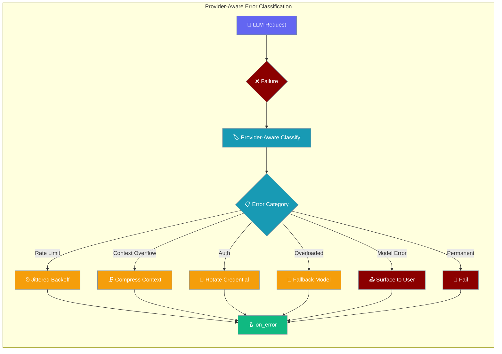
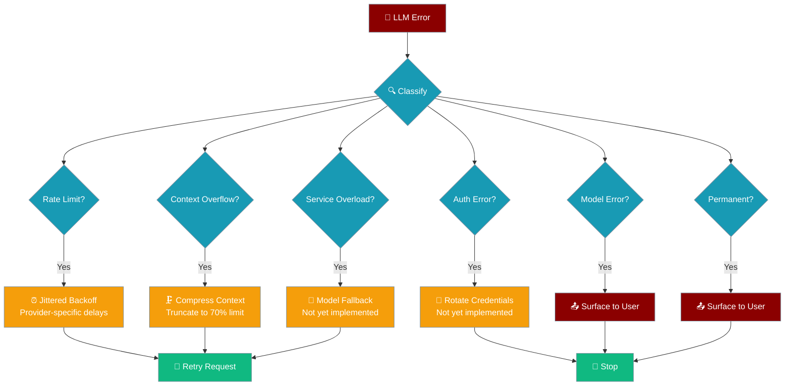
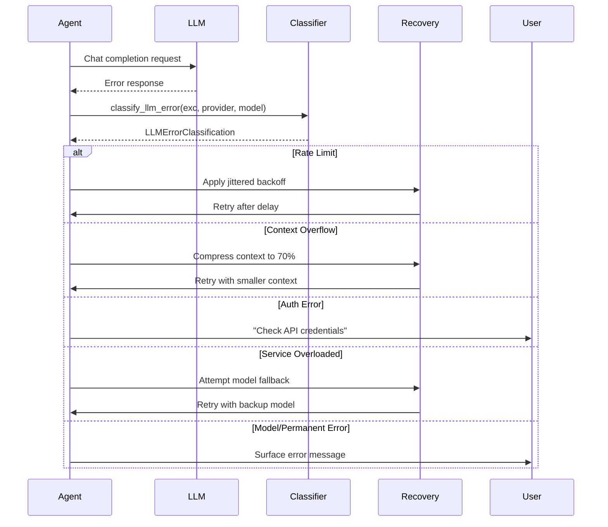

LLM failures use provider-aware error classification with structured recovery routing, enabling intelligent retry policies, context compression, credential rotation, and model fallback strategies.

<Note>
LLM errors now also carry typed `AgentErrorKind` classifications for more precise error handling. See [LLM Error Classification](/features/llm-error-classification) for the complete taxonomy and failover decision system.
</Note>



## Quick Start

<Steps>
<Step title="Simple Agent with Structured Errors">
```python
from praisonaiagents import Agent

agent = Agent(
    name="Error Handler",
    instructions="Process user requests with automatic error recovery",
    on_error=lambda error: print(f"Error: {error.context['user_message']}")
)

result = agent.start("Hello world")
```
</Step>

<Step title="Advanced Error Classification">
```python
from praisonaiagents import Agent
from praisonaiagents.llm.error_classifier import classify_llm_error

def handle_structured_error(error):
    """Handle errors with structured classification"""
    category = error.context.get("error_category", "unknown")
    user_msg = error.context.get("user_message", "Unknown error")
    
    print(f"Category: {category}")
    print(f"Message: {user_msg}")
    
    if category == "rate_limit":
        print("Rate limit hit - will retry with backoff")
    elif category == "context_overflow":
        print("Context too large - will compress and retry")
    elif category == "auth":
        print("Authentication failed - check API keys")

agent = Agent(
    name="Advanced Handler",
    instructions="Process requests with detailed error handling",
    on_error=handle_structured_error
)
```
</Step>
</Steps>

---

## Error Categories

The new classifier recognizes seven distinct error categories with specific recovery actions:

| Category | Error Type | Recovery Action | Retryable |
|----------|------------|-----------------|----------|
| `rate_limit` | Too many requests | Jittered backoff with provider-specific delays | ✅ |
| `context_overflow` | Input exceeds model limits | Compress context to 70% of limit | ✅ |
| `auth` | Invalid API credentials | Credential rotation (not yet implemented) | ❌ |
| `overloaded` | Service temporarily unavailable | Model fallback + jittered backoff | ✅ |
| `model_error` | Malformed request/parameters | Surface to user for correction | ❌ |
| `permanent` | Unrecoverable error | Surface to user | ❌ |
| `unknown` | Unclassified error | Default retry with backoff | ✅ |

---

## LLMErrorClassification Structure

The new structured classification provides detailed recovery routing information:

| Field | Type | Description |
|-------|------|-------------|
| `error_category` | `str` | One of: rate_limit, context_overflow, auth, overloaded, model_error, permanent, unknown |
| `is_retryable` | `bool` | Whether retry is safe |
| `should_compress_context` | `bool` | If True, compress messages then retry |
| `should_rotate_credential` | `bool` | If True, credentials should be rotated |
| `should_fallback_model` | `bool` | If True, switch to alternate model |
| `backoff_seconds` | `float` | Wait before retry (jittered) |
| `user_message` | `str` | Friendly explanation for the end user |

```python
from praisonaiagents.llm.error_classifier import classify_llm_error

classification = classify_llm_error(
    exc,                  # The exception
    provider="openai",    # "openai" | "anthropic" | "azure"
    model="gpt-4",
    prompt_tokens=0,      # optional
    context_length=0,     # optional
    retry_depth=0,        # optional
)

print(f"Category: {classification.error_category}")
print(f"Should compress: {classification.should_compress_context}")
print(f"Backoff time: {classification.backoff_seconds}")
```

---

## Provider-Aware Backoff

Different providers have different rate limiting patterns, so the classifier uses provider-specific base delays:

| Provider | Rate Limit Base Delay | Service Unavailable Delay |
|----------|----------------------|---------------------------|
| `openai` | 60 seconds | 15 seconds |
| `anthropic` | 20 seconds | 15 seconds |
| `azure` | 45 seconds | 15 seconds |
| Default | 30 seconds | 15 seconds |

Backoff times include ±50% jitter to prevent thundering herd problems when multiple agents hit rate limits simultaneously.

---

## Recovery Actions



---

## Jittered Backoff

The retry system uses exponential backoff with ±50% jitter to avoid thundering herd problems:

```mermaid
graph TB
    subgraph "Backoff Calculation"
        Attempt[Attempt Number] --> Exponential[base × 2^(attempt-1)]
        Exponential --> Cap[Cap at maximum]
        Cap --> Jitter[Add ±50% jitter]
        Jitter --> Result[Final delay]
    end
    
    subgraph "Example Delays"
        A1[Attempt 1<br/>~2.5-7.5s] 
        A2[Attempt 2<br/>~5.0-15.0s]
        A3[Attempt 3<br/>~10.0-30.0s]
    end
    
    classDef formula fill:#6366F1,stroke:#7C90A0,color:#fff
    classDef example fill:#F59E0B,stroke:#7C90A0,color:#fff
    
    class Attempt,Exponential,Cap,Jitter,Result formula
    class A1,A2,A3 example
```

```python
from praisonaiagents.llm.retry_utils import jittered_backoff

# Calculate delay with jitter
delay = jittered_backoff(attempt=1, base=5.0, cap=120.0)  # ~2.5-7.5 seconds
delay = jittered_backoff(attempt=2, base=5.0, cap=120.0)  # ~5.0-15.0 seconds
delay = jittered_backoff(attempt=3, base=5.0, cap=120.0)  # ~10.0-30.0 seconds
```

---

## Advanced Classification Usage

For users who want direct access to the classifier:

```python
from praisonaiagents.llm.error_classifier import classify_llm_error
from praisonaiagents.llm.retry_utils import calculate_backoff_with_retry_after

def custom_retry_loop(exc, provider="openai", model="gpt-4"):
    """Custom retry logic using structured classification"""
    classification = classify_llm_error(
        exc,
        provider=provider,
        model=model,
        retry_depth=0
    )
    
    print(f"Error category: {classification.error_category}")
    print(f"User message: {classification.user_message}")
    
    if not classification.is_retryable:
        print("Error is not retryable")
        return False
    
    if classification.should_compress_context:
        print("Context compression needed")
        # Implement context compression logic
        
    if classification.should_fallback_model:
        print("Model fallback suggested")
        # Implement model fallback logic
        
    if classification.backoff_seconds > 0:
        print(f"Waiting {classification.backoff_seconds:.1f} seconds...")
        import time
        time.sleep(classification.backoff_seconds)
    
    return True  # Proceed with retry
```

---

## How It Works



## Async Support

Structured error classification works with both sync and async agents:

```python
import asyncio
from praisonaiagents import Agent

async def async_error_example():
    agent = Agent(
        name="Async Agent",
        instructions="Process requests asynchronously",
        on_error=lambda error: print(f"Async error: {error.context['error_category']}")
    )
    
    result = await agent.astart("Hello async world")
    return result

# The same structured classification applies to async flows
# Rate limiting, context compression, and other recovery actions
# are handled automatically with asyncio.sleep for delays
```

---

## Typed Error Classification (AgentErrorKind)

LLM errors are automatically classified into typed `AgentErrorKind` categories for precise handling. For the complete system, see [LLM Error Classification](/docs/features/llm-error-classification).

### Quick Reference
- **Retryable**: `rate_limit`, `overloaded`, `idle_timeout`, `auth`
- **Non-retryable**: `auth_permanent`, `model_not_found`, `format_error`, `context_overflow`, `billing`
- **Limited retry**: `unknown`, `empty_response`

### Legacy Support
The simple two-bucket classification (retryable/non-retryable) remains available for backward compatibility, but typed categories provide much more control.

---

## LLMError Structure

The `LLMError` class provides structured error information:

| Field | Type | Description |
|-------|------|-------------|
| `message` | `str` | Error description |
| `model_name` | `str` | LLM model that failed |
| `agent_id` | `str` | Agent identifier |
| `session_id` | `str` | Session identifier |
| `is_retryable` | `bool` | Whether error can be retried |
| `error_category` | `AgentErrorKind` | Typed classification — see [LLM Error Classification](/docs/features/llm-error-classification) |

---

## Error Context

The `on_error` handler receives enhanced context information:

```python
def enhanced_error_handler(error):
    """Access structured error information"""
    context = error.context
    
    # New structured fields
    category = context.get("error_category", "unknown")
    user_message = context.get("user_message", "")
    
    # Original fields still available
    model = error.model_name
    agent_id = error.agent_id
    retryable = error.is_retryable
    
    print(f"Category: {category}")
    print(f"Model: {model}")
    print(f"User-friendly message: {user_message}")
    print(f"Can retry: {retryable}")

agent = Agent(
    name="Enhanced Error Agent",
    instructions="Process with enhanced error context",
    on_error=enhanced_error_handler
)
```

---

## Retry Depth Limits

The system limits retry depth to prevent infinite loops:

- **Maximum retry depth**: 2 attempts
- **Context compression**: Triggered on `context_overflow` category
- **Bounded recovery**: After 2 failed retries, errors become non-retryable

```python
# Retry behavior:
# 1st failure: Classify and retry with recovery action
# 2nd failure: Classify and retry with recovery action  
# 3rd failure: Mark as non-retryable and surface to user
```

---

## Unimplemented Recovery Actions

Some recovery actions are planned but not yet implemented in the core system:

<Note>
**Credential Rotation**: When `should_rotate_credential=True`, the user message includes "Credential rotation is not yet implemented". Users must handle credential management manually.

**Model Fallback**: When `should_fallback_model=True`, the user message includes "Model fallback is not yet implemented". Users can implement custom fallback logic in their `on_error` handlers.
</Note>

## Migration from Binary Classification

If you were previously checking `error.is_retryable` only, you can now access richer classification:

**Before (binary classification):**
```python
def simple_handler(error):
    if error.is_retryable:
        print("Will retry")
    else:
        print("Won't retry")
```

**After (structured classification):**
```python
def structured_handler(error):
    category = error.context.get("error_category", "unknown")
    user_msg = error.context.get("user_message", "")
    
    # Still works
    if error.is_retryable:
        print(f"Will retry ({category}): {user_msg}")
    else:
        print(f"Won't retry ({category}): {user_msg}")
```

**Typed Error Categories (New):**
```python
from praisonaiagents.errors import LLMError

try:
    response = agent._chat_completion(messages)
except LLMError as e:
    # Use typed categories instead of string parsing
    if e.error_category == "billing":
        handle_quota_exceeded()
    elif e.error_category == "auth_permanent":
        handle_invalid_api_key()
    elif e.error_category == "rate_limit":
        # Auto-retry handles this
        raise
```

---

## Best Practices

<AccordionGroup>
<Accordion title="Read error_category Instead of Regex Matching">
Use the structured `error_category` field instead of pattern matching on error messages:

```python
def smart_error_handler(error):
    """Handle errors using structured categories"""
    category = error.context.get("error_category", "unknown")
    
    # Better: Use structured category
    if category == "rate_limit":
        print("Rate limit detected - will retry with provider-specific backoff")
    elif category == "context_overflow":
        print("Context too large - will compress and retry")
    elif category == "auth":
        print("Authentication failed - check credentials")
    
    # Avoid: Pattern matching on error message
    # if "rate limit" in error.message.lower():
    #     ...
```
</Accordion>

<Accordion title="Monitor Structured Error Categories">
Track error patterns using the new categorical data:

```python
error_counts = {
    "rate_limit": 0,
    "context_overflow": 0, 
    "auth": 0,
    "overloaded": 0,
    "model_error": 0,
    "permanent": 0,
    "unknown": 0
}

def track_structured_errors(error):
    category = error.context.get("error_category", "unknown")
    error_counts[category] += 1
    
    # Send structured metrics to monitoring
    send_metric(f"llm.error.{category}", 1, {
        "provider": error.context.get("provider", "unknown"),
        "model": error.model_name
    })
```
</Accordion>

<Accordion title="Implement Custom Recovery Logic">
Build on the structured classification for advanced recovery:

```python
def advanced_recovery_handler(error):
    category = error.context.get("error_category", "unknown")
    user_msg = error.context.get("user_message", "")
    
    if category == "auth":
        # Custom credential rotation
        print("Attempting credential rotation...")
        rotate_api_keys()
    
    elif category == "overloaded":
        # Custom model fallback
        print("Primary model overloaded, switching to backup...")
        switch_to_backup_model()
    
    elif category == "context_overflow":
        # Log compression metrics
        log_compression_event(error.context.get("prompt_tokens", 0))
    
    print(f"User message: {user_msg}")
```
</Accordion>

<Accordion title="Provider-Specific Error Handling">
Customize handling based on the LLM provider:

```python
def provider_aware_handler(error):
    category = error.context.get("error_category", "unknown")
    provider = error.context.get("provider", "unknown")
    
    if category == "rate_limit":
        if provider == "openai":
            print("OpenAI rate limit - 60s base delay with jitter")
        elif provider == "anthropic":
            print("Anthropic rate limit - 20s base delay with jitter")
        elif provider == "azure":
            print("Azure rate limit - 45s base delay with jitter")
    
    elif category == "overloaded" and provider == "anthropic":
        print("Anthropic service overloaded - consider Claude alternatives")
```
</Accordion>
</AccordionGroup>

---

## Related

<CardGroup cols={2}>
<Card title="LLM Error Classification" icon="circle-alert" href="/features/llm-error-classification">
  Typed error categories and failover decisions
</Card>
<Card title="Task Retry Policy" icon="rotate-ccw" href="/features/task-retry-policy">
  Configure task-level retry behavior and policies
</Card>
<Card title="Hooks" icon="webhook" href="/features/hooks">
  Agent lifecycle hooks and events
</Card>
<Card title="Model Failover" icon="arrows-rotate" href="/features/model-failover">
  Cross-provider failover with FailoverManager
</Card>
</CardGroup>