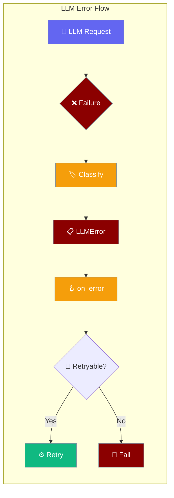
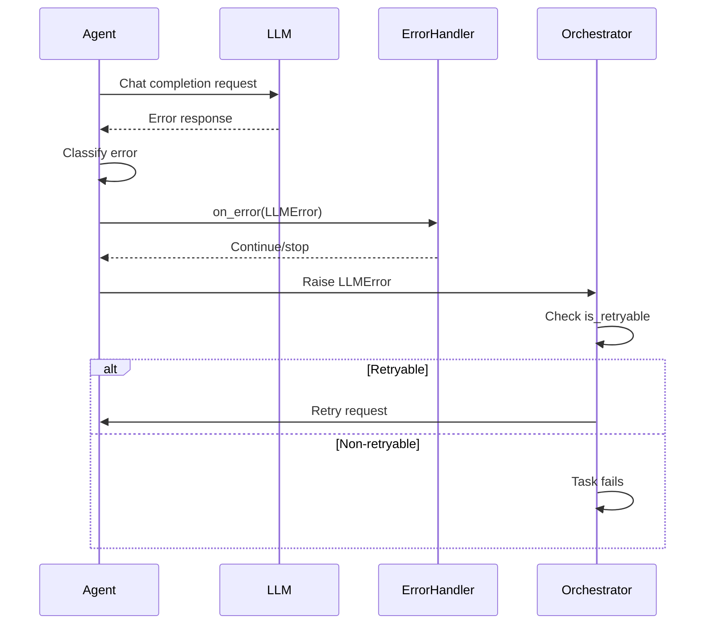

LLM failures are now raised as structured `LLMError` exceptions instead of returning `None`, enabling proper error handling and retry policies.

<Note>
LLM errors now also carry typed `AgentErrorKind` classifications for more precise error handling. See [LLM Error Classification](/features/llm-error-classification) for the complete taxonomy and failover decision system.
</Note>



## Quick Start

<Steps>
<Step title="Handle LLM Errors">
```python
from praisonaiagents import Agent
from praisonaiagents.errors import LLMError

agent = Agent(
    name="Error Handler",
    instructions="Process user requests",
    on_error=lambda error: print(f"LLM failed: {error.message}")
)

try:
    result = agent.start("Hello world")
except LLMError as e:
    if e.is_retryable:
        print(f"Can retry: {e.message}")
    else:
        print(f"Fatal error: {e.message}")
```
</Step>

<Step title="Custom Error Classification">
```python
from praisonaiagents import Agent

def handle_llm_error(error):
    """Custom error handler with context logging"""
    print(f"Model: {error.model_name}")
    print(f"Agent: {error.agent_id}")
    print(f"Session: {error.session_id}")
    print(f"Retryable: {error.is_retryable}")

agent = Agent(
    name="Custom Handler",
    instructions="Process requests",
    on_error=handle_llm_error
)
```
</Step>
</Steps>

---

## How It Works



| Component | Purpose |
|-----------|---------|
| **LLMError** | Structured exception with retry classification |
| **on_error Hook** | Intercept errors before propagation |
| **is_retryable** | Boolean flag for orchestration decisions |
| **Context Overflow** | Recursive depth limit of 2 |

---

## Error Classification

LLM errors are automatically classified into typed `AgentErrorKind` categories for precise handling. For the complete system, see [LLM Error Classification](/features/llm-error-classification).

### Quick Reference
- **Retryable**: `rate_limit`, `overloaded`, `idle_timeout`, `auth`
- **Non-retryable**: `auth_permanent`, `model_not_found`, `format_error`, `context_overflow`, `billing`
- **Limited retry**: `unknown`, `empty_response`

### Legacy Support
The simple two-bucket classification (retryable/non-retryable) remains available for backward compatibility, but typed categories provide much more control.

---

## LLMError Structure

The `LLMError` class provides structured error information:

| Field | Type | Description |
|-------|------|-------------|
| `message` | `str` | Error description |
| `model_name` | `str` | LLM model that failed |
| `agent_id` | `str` | Agent identifier |
| `session_id` | `str` | Session identifier |
| `is_retryable` | `bool` | Whether error can be retried |
| `error_category` | `AgentErrorKind` | Typed classification — see [Error Classification](/features/llm-error-classification) |

```python
from praisonaiagents.errors import LLMError

# Error structure
error = LLMError(
    message="Rate limit exceeded",
    model_name="gpt-4",
    agent_id="research_agent",
    is_retryable=True,
    session_id="session_123"
)
```

---

## Context Overflow Protection

LLM context overflow triggers automatic retry with truncated messages, limited to depth 2:

```python
# Automatic context management
agent = Agent(
    name="Long Context Agent",
    instructions="Process very long inputs"
)

# Automatically handles context overflow:
# 1. First overflow: truncate and retry
# 2. Second overflow: truncate and retry  
# 3. Third overflow: raise LLMError with is_retryable=False
```

---

## Migration Guide

**Before (returned None):**
```python
response = agent._chat_completion(messages)
if response is None:
    # Handle failure
    print("LLM call failed")
```

**After (raises LLMError):**
```python
try:
    response = agent._chat_completion(messages)
except LLMError as e:
    if e.is_retryable:
        # Orchestration will retry
        raise
    else:
        # Handle fatal error
        print(f"Fatal: {e.message}")
```

**Typed Error Categories (New):**
```python
from praisonaiagents.errors import LLMError

try:
    response = agent._chat_completion(messages)
except LLMError as e:
    # Use typed categories instead of string parsing
    if e.error_category == "billing":
        handle_quota_exceeded()
    elif e.error_category == "auth_permanent":
        handle_invalid_api_key()
    elif e.error_category == "rate_limit":
        # Auto-retry handles this
        raise
```

---

## Best Practices

<AccordionGroup>
<Accordion title="Use on_error for Logging">
Implement the `on_error` hook to log errors without interrupting the retry flow:

```python
def log_llm_errors(error):
    """Log errors for debugging without stopping retries"""
    import logging
    logging.error(f"LLM Error: {error.message} (retryable: {error.is_retryable})")

agent = Agent(on_error=log_llm_errors)
```
</Accordion>

<Accordion title="Handle Authentication Separately">
Authentication errors are non-retryable and need immediate attention:

```python
def handle_auth_errors(error):
    if "401" in error.message or "invalid_api_key" in error.message:
        print("Check your API key configuration")
        # Could trigger key rotation logic here
```
</Accordion>

<Accordion title="Monitor Error Patterns">
Track error patterns to identify systemic issues:

```python
error_counts = {"rate_limit": 0, "auth": 0, "network": 0}

def track_errors(error):
    if "rate limit" in error.message.lower():
        error_counts["rate_limit"] += 1
    elif "401" in error.message:
        error_counts["auth"] += 1
    # Send to monitoring system
```
</Accordion>

<Accordion title="Graceful Degradation">
Use error information to implement graceful degradation:

```python
def fallback_handler(error):
    if error.model_name == "gpt-4" and error.is_retryable:
        # Could switch to backup model
        print("Switching to backup model")
```
</Accordion>
</AccordionGroup>

---

## Related

<CardGroup cols={2}>
<Card title="LLM Error Classification" icon="circle-alert" href="/features/llm-error-classification">
  Typed error categories and failover decisions
</Card>
<Card title="Task Retry Policy" icon="rotate-ccw" href="/features/task-retry-policy">
  Configure task-level retry behavior
</Card>
<Card title="Hooks" icon="webhook" href="/features/hooks">
  Agent lifecycle hooks and events
</Card>
<Card title="Model Failover" icon="arrows-rotate" href="/features/model-failover">
  Cross-provider failover with FailoverManager
</Card>
</CardGroup>