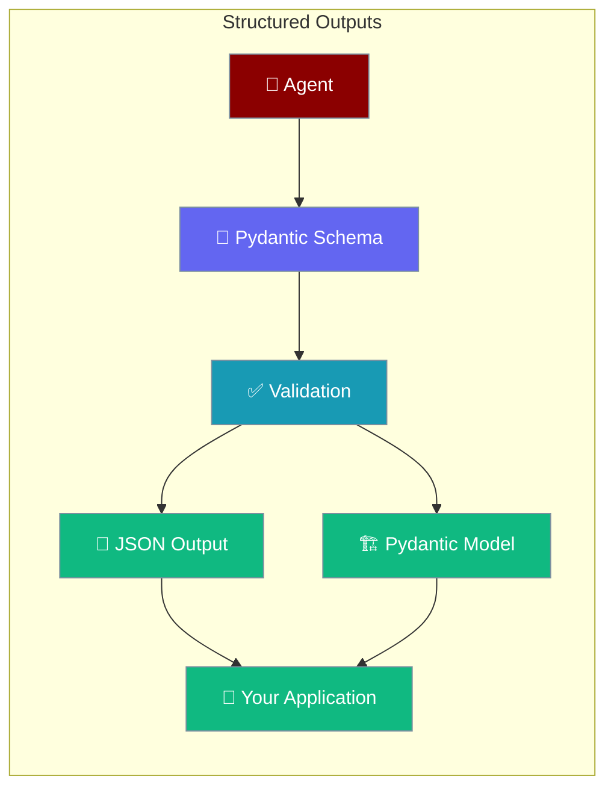

Structured outputs give agents predictable, validated data — ideal for APIs, dashboards, and downstream automation.

```python
from praisonaiagents import Agent
from pydantic import BaseModel

class TopicList(BaseModel):
    topics: list[str]

agent = Agent(name="TopicAgent", llm="gpt-4o-mini")
result = agent.chat("List 3 AI topics", output_pydantic=TopicList)
print(result.topics)
```

The user asks for structured data; the agent returns validated Pydantic output for downstream code.



## Quick Start

<Steps>
<Step title="Simple Usage">

Define a Pydantic model and pass it to `output_pydantic`:

```python
from praisonaiagents import Agent
from pydantic import BaseModel

class AnalysisReport(BaseModel):
    title: str
    findings: str
    summary: str

agent = Agent(
    name="Analyst",
    instructions="Return concise structured analysis.",
)

result = agent.chat(
    "Summarise recent AI agent trends",
    output_pydantic=AnalysisReport,
)
print(result.title, result.summary)
```

</Step>

<Step title="Multi-Agent Task">

Use `Task` with `output_pydantic` inside an `AgentTeam`:

```python
from praisonaiagents import Agent, Task, AgentTeam
from pydantic import BaseModel

class ResearchReport(BaseModel):
    topic: str
    findings: str
    sources: list[str]

researcher = Agent(
    name="Researcher",
    instructions="Research and return structured findings.",
)

task = Task(
    description="Research quantum computing developments",
    expected_output="Structured research report",
    agent=researcher,
    output_pydantic=ResearchReport,
)

team = AgentTeam(agents=[researcher], tasks=[task], process="sequential")
result = team.start()
print(result.pydantic.topic)
```

</Step>
</Steps>

---

## Native Structured Output

PraisonAI auto-detects models that support native `response_format` with JSON schema (GPT-4o, Claude 3.5, Gemini 2.0). Unsupported models fall back to prompt injection.

```python
from praisonaiagents import Agent
from pydantic import BaseModel

class TopicList(BaseModel):
    topics: list[str]

# Auto-detect (default)
agent = Agent(name="TopicAgent", llm="gpt-4o-mini")
result = agent.chat("List 3 AI topics", output_pydantic=TopicList)

# Force native mode
agent = Agent(name="TopicAgent", llm="custom-model", native_structured_output=True)

# Disable native — use text injection fallback
agent = Agent(name="TopicAgent", llm="gpt-4o-mini", native_structured_output=False)
```

| Option | Type | Default | Description |
|--------|------|---------|-------------|
| `output_pydantic` | `BaseModel` | `None` | Return a validated Pydantic object |
| `output_json` | `BaseModel` | `None` | Return structured JSON (same schema) |
| `native_structured_output` | `bool` | auto | Force native `response_format` on/off |

---

## YAML Configuration

```yaml
framework: praisonai
process: sequential
agents:
  analyst:
    instructions: Expert in data analysis.
    goal: Provide structured insights
    role: Data Analyst
    tasks:
      analysis_task:
        description: Analyse recent AI developments.
        expected_output: Structured analysis report.
        output_structure:
          type: pydantic
          model:
            title: str
            findings: str
            summary: str
```

Run with `praisonai agents.yaml`.

---

## Best Practices

<AccordionGroup>
<Accordion title="Keep models small and explicit">
Define only the fields you need. Smaller schemas validate faster and reduce model confusion.
</Accordion>

<Accordion title="Prefer output_pydantic for Python apps">
Use `output_pydantic` when you want a typed object; use `output_json` when you only need serialisable dicts.
</Accordion>

<Accordion title="Let native mode auto-detect">
Leave `native_structured_output` unset unless you know your model needs forcing — the SDK picks the cleanest path.
</Accordion>

<Accordion title="Validate failures in verbose mode">
Enable verbose output while tuning schemas so validation errors show which field failed.
</Accordion>
</AccordionGroup>

---

## Related

<CardGroup cols={2}>
  <Card title="Structured LLM Errors" icon="circle-alert" href="/docs/features/structured-llm-errors">
    Handle validation and LLM failures gracefully
  </Card>
  <Card title="Output & Display" icon="display" href="/docs/features/display-system">
    Format and present agent responses
  </Card>
  <Card title="Agent Teams" icon="users" href="/docs/features/agent-team">
    Multi-agent workflows with structured tasks
  </Card>
  <Card title="Tasks" icon="list-check" href="/docs/features/tasks">
    Task configuration and output options
  </Card>
</CardGroup>
