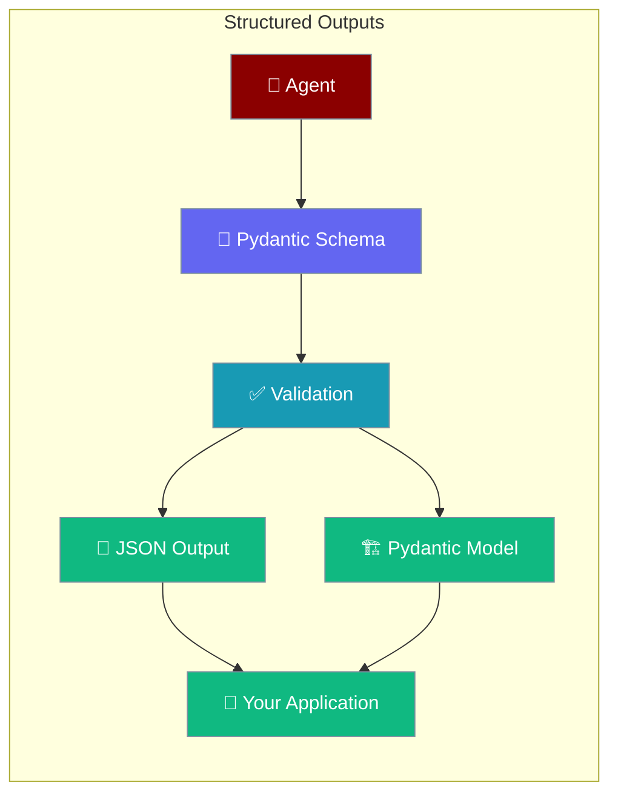
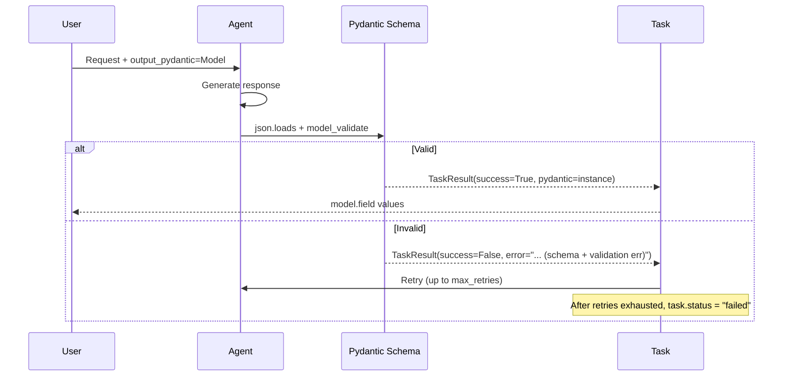
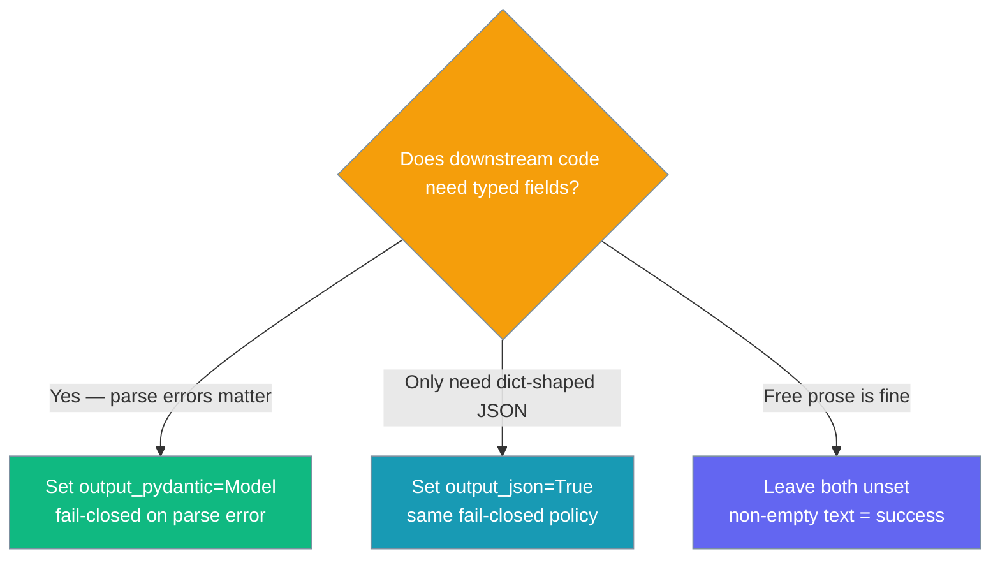

Structured outputs give agents predictable, validated data. When a Task sets `output_pydantic` or `output_json`, PraisonAI **fails the task** if the model can't produce a value matching the schema — no silent `None`.

```python
from praisonaiagents import Agent
from pydantic import BaseModel

class TopicList(BaseModel):
    topics: list[str]

agent = Agent(name="TopicAgent", llm="gpt-4o-mini")
result = agent.chat("List 3 AI topics", output_pydantic=TopicList)
print(result.topics)
```

The user asks for structured data; the agent returns validated Pydantic output for downstream code.


```mermaid
graph LR
    subgraph "Structured Outputs"
        Agent[🤖 Agent] --> Schema[📐 Pydantic Schema]
        Schema --> Validate[✅ Validation]
        Validate --> JSON[📄 JSON Output]
        Validate --> Model[🏗️ Pydantic Model]
        JSON --> App[📱 Your Application]
        Model --> App
    end

    classDef agent fill:#8B0000,stroke:#7C90A0,color:#fff
    classDef schema fill:#189AB4,stroke:#7C90A0,color:#fff
    classDef validate fill:#6366F1,stroke:#7C90A0,color:#fff
    classDef result fill:#10B981,stroke:#7C90A0,color:#fff

    class Agent agent
    class Schema validate
    class Validate schema
    class JSON,Model,App result
```

## Quick Start

<Steps>
<Step title="Simple Usage">

Define a Pydantic model and pass it to `output_pydantic`:

```python
from praisonaiagents import Agent
from pydantic import BaseModel

class AnalysisReport(BaseModel):
    title: str
    findings: str
    summary: str

agent = Agent(
    name="Analyst",
    instructions="Return concise structured analysis.",
)

result = agent.chat(
    "Summarise recent AI agent trends",
    output_pydantic=AnalysisReport,
)
print(result.title, result.summary)
```

</Step>

<Step title="Multi-Agent Task">

Use `Task` with `output_pydantic` inside an `AgentTeam`:

```python
from praisonaiagents import Agent, Task, AgentTeam
from pydantic import BaseModel

class ResearchReport(BaseModel):
    topic: str
    findings: str
    sources: list[str]

researcher = Agent(
    name="Researcher",
    instructions="Research and return structured findings.",
)

task = Task(
    description="Research quantum computing developments",
    expected_output="Structured research report",
    agent=researcher,
    output_pydantic=ResearchReport,
)

team = AgentTeam(agents=[researcher], tasks=[task], process="sequential")
result = team.start()
print(result.pydantic.topic)
```

</Step>
</Steps>

---

## How It Works


```mermaid
sequenceDiagram
    participant User
    participant Agent
    participant Schema as Pydantic Schema
    participant Task

    User->>Agent: Request + output_pydantic=Model
    Agent->>Agent: Generate response
    Agent->>Schema: json.loads + model_validate
    alt Valid
        Schema-->>Task: TaskResult(success=True, pydantic=instance)
        Task-->>User: model.field values
    else Invalid
        Schema-->>Task: TaskResult(success=False, error="... (schema + validation err)")
        Task->>Agent: Retry (up to max_retries)
        Note over Task: After retries exhausted, task.status = "failed"
    end
```

| Phase | What happens |
|---|---|
| 1. Request | You pass a Pydantic model to `output_pydantic` |
| 2. Generate | The agent produces a response |
| 3. Validate | The response is parsed and checked against your schema |
| 4. Return | On success a typed object flows back; on failure the task retries then fails |

---

## Failure Handling

Structured tasks fail-closed — `success` is `False` and `error` carries the schema name plus the parse error when the model can't match your schema.

```python
from praisonaiagents import Agent, Task, AgentTeam
from pydantic import BaseModel

class Fact(BaseModel):
    title: str
    detail: str

agent = Agent(name="F", llm="gpt-4o-mini")

task = Task(
    description="Give one fact about the ocean",
    agent=agent,
    output_pydantic=Fact,
    max_retries=2,     # optional — see Task Retry Policy
)

team = AgentTeam(agents=[agent], tasks=[task])
team.start()

# Success — pydantic is guaranteed populated
if task.result.success:
    print(task.result.pydantic.title)
else:
    print("Failed:", task.result.error)   # includes schema name + validation error
    print("Raw text was:", task.result.raw)   # kept for debugging
```

| Case | `success` | `pydantic` / `json_dict` | `error` | `raw` |
|------|-----------|--------------------------|---------|-------|
| Model returns valid JSON matching schema | `True` | populated instance | `None` | JSON text |
| Model returns invalid / freeform prose | `False` | `None` | Schema name + parse error | Preserved for debugging |
| Model returns valid falsey JSON (`{}`, `[]`, `false`, `0`) with `output_json` | `True` | the falsey value | `None` | JSON text |
| No structured output requested + non-empty prose | `True` | n/a | `None` | prose |

<Note>
When structured output was requested but the model returned prose, the completion checker marks the task incomplete and the existing `max_retries` loop retries the task. See [Task Retry Policy](/features/task-retry-policy).
</Note>

Pick the option that matches what your downstream code needs:


```mermaid
graph TB
    Q{Does downstream code need typed fields?} -->|Yes — parse errors matter| S[Set output_pydantic=Model<br/>fail-closed on parse error]
    Q -->|Only need dict-shaped JSON| J[Set output_json=True<br/>same fail-closed policy]
    Q -->|Free prose is fine| R[Leave both unset<br/>non-empty text = success]

    classDef q fill:#F59E0B,stroke:#7C90A0,color:#fff
    classDef s fill:#10B981,stroke:#7C90A0,color:#fff
    classDef j fill:#189AB4,stroke:#7C90A0,color:#fff
    classDef r fill:#6366F1,stroke:#7C90A0,color:#fff
    class Q q
    class S s
    class J j
    class R r
```

---

## Native Structured Output

PraisonAI auto-detects models that support native `response_format` with JSON schema (GPT-4o, Claude 3.5, Gemini 2.0). Unsupported models fall back to prompt injection.

```python
from praisonaiagents import Agent
from pydantic import BaseModel

class TopicList(BaseModel):
    topics: list[str]

# Auto-detect (default)
agent = Agent(name="TopicAgent", llm="gpt-4o-mini")
result = agent.chat("List 3 AI topics", output_pydantic=TopicList)

# Force native mode
agent = Agent(name="TopicAgent", llm="custom-model", native_structured_output=True)

# Disable native — use text injection fallback
agent = Agent(name="TopicAgent", llm="gpt-4o-mini", native_structured_output=False)
```

| Option | Type | Default | Description |
|--------|------|---------|-------------|
| `output_pydantic` | `BaseModel` | `None` | Return a validated Pydantic object |
| `output_json` | `bool` / `BaseModel` | `None` | Return structured JSON; task fails if not parseable |
| `native_structured_output` | `bool` | auto | Force native `response_format` on/off |

---

## YAML Configuration

```yaml
framework: praisonai
process: sequential
agents:
  analyst:
    instructions: Expert in data analysis.
    goal: Provide structured insights
    role: Data Analyst
    tasks:
      analysis_task:
        description: Analyse recent AI developments.
        expected_output: Structured analysis report.
        output_structure:
          type: pydantic
          model:
            title: str
            findings: str
            summary: str
```

Run with `praisonai agents.yaml`.

---

## Best Practices

<AccordionGroup>
<Accordion title="Keep models small and explicit">
Define only the fields you need. Smaller schemas validate faster and reduce model confusion.
</Accordion>

<Accordion title="Prefer output_pydantic for Python apps">
Use `output_pydantic` when you want a typed object; use `output_json` when you only need serialisable dicts.
</Accordion>

<Accordion title="Let native mode auto-detect">
Leave `native_structured_output` unset unless you know your model needs forcing — the SDK picks the cleanest path.
</Accordion>

<Accordion title="Check task.result.success for structured tasks">
`pydantic` is guaranteed populated on success. On failure, read `task.result.error` for the schema name plus validation error, and `task.result.raw` for the model text that failed.
</Accordion>

<Accordion title="Use max_retries for flaky models">
Soft models may need a couple of retries to hit the schema. Combine `output_pydantic` with `Task(max_retries=2)` from [Task Retry Policy](/features/task-retry-policy).
</Accordion>
</AccordionGroup>

---

## Related

<CardGroup cols={2}>
  <Card title="Structured LLM Errors" icon="circle-alert" href="/features/structured-llm-errors">
    Handle validation and LLM failures gracefully
  </Card>
  <Card title="Output & Display" icon="display" href="/features/display-system">
    Format and present agent responses
  </Card>
  <Card title="Agent Teams" icon="users" href="/features/agents">
    Multi-agent workflows with structured tasks
  </Card>
  <Card title="Tasks" icon="list-check" href="/features/agent-create">
    Task configuration and output options
  </Card>
  <Card title="Task Retry Policy" icon="rotate-ccw" href="/features/task-retry-policy">
    Retry a task with exponential backoff on structured-output failure
  </Card>
</CardGroup>
