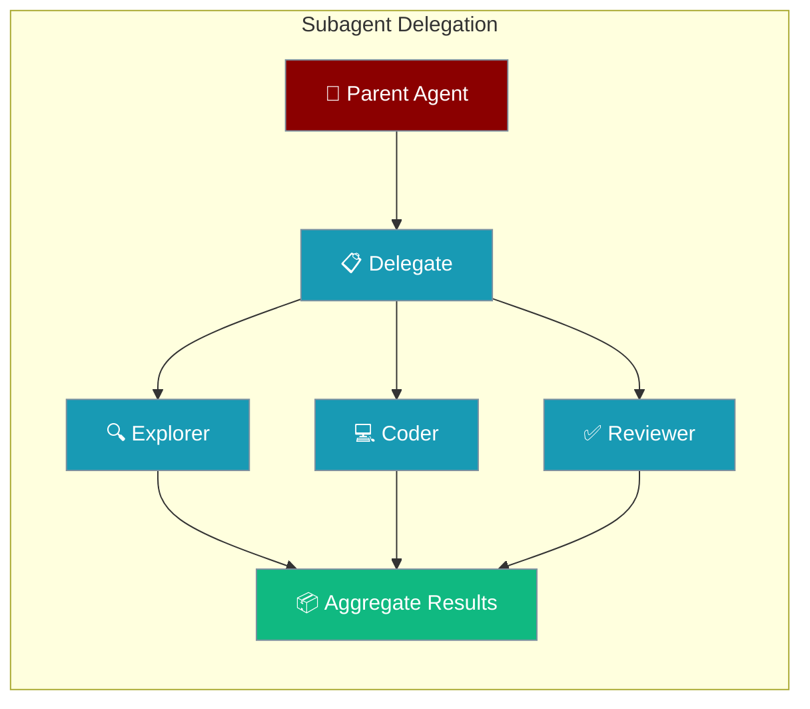
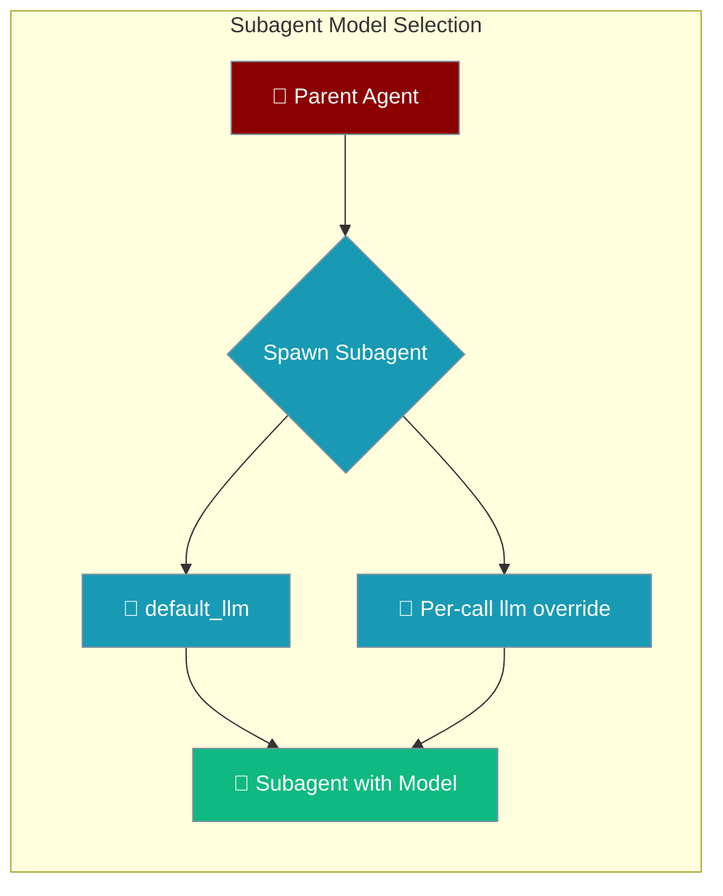

Subagent delegation lets a parent agent spawn specialised workers with scoped permissions, timeouts, and parallel execution.

```python
from praisonaiagents import Agent
from praisonaiagents.tools.subagent_tool import create_subagent_tool

coordinator = Agent(
    name="Coordinator",
    instructions="Delegate read-only exploration to subagents.",
    tools=[create_subagent_tool(
        default_permission_mode="plan",
        allowed_agents=["explorer"],
    )],
)

coordinator.start("Find where authentication is implemented")
```

The user asks the coordinator; delegated subagents explore with scoped permissions.



```mermaid
graph LR
    subgraph "Subagent Delegation"
        P[🤖 Parent Agent] --> D[📋 Delegate]
        D --> E[🔍 Explorer]
        D --> C[💻 Coder]
        D --> R[✅ Reviewer]
        E --> A[📦 Aggregate Results]
        C --> A
        R --> A
    end

    classDef agent fill:#8B0000,stroke:#7C90A0,color:#fff
    classDef process fill:#189AB4,stroke:#7C90A0,color:#fff
    classDef result fill:#10B981,stroke:#7C90A0,color:#fff

    class P agent
    class D,E,C,R process
    class A result
```

<Note>
For agent-to-agent routing inside a conversation, prefer [Handoffs](/docs/features/handoffs). Use the subagent tool or delegator when you need programmatic spawn control, background jobs, or parallel fan-out.
</Note>

## Quick Start

<Steps>
<Step title="Subagent Tool on an Agent">

Attach `create_subagent_tool` so the parent can spawn workers:

```python
from praisonaiagents import Agent
from praisonaiagents.tools.subagent_tool import create_subagent_tool

agent = Agent(
    name="Lead",
    instructions="Delegate exploration tasks to subagents.",
    tools=[create_subagent_tool(default_permission_mode="plan")],
)

agent.start("Explore the auth module read-only")
```

</Step>

<Step title="Programmatic Delegator">

For direct async control, use `SubagentDelegator`:

```python
from praisonaiagents.agents.delegator import SubagentDelegator, DelegationConfig
import asyncio

delegator = SubagentDelegator(config=DelegationConfig(max_concurrent_subagents=3))

async def run():
    result = await delegator.delegate(
        agent_name="explorer",
        objective="Find authentication-related files",
        context={"workspace": "/path/to/project"},
    )
    print(result.result if result.success else result.error)

asyncio.run(run())
```

</Step>
</Steps>

---

## Built-in Agent Profiles

| Agent | Mode | Description |
|-------|------|-------------|
| `general` | Primary | General-purpose coding assistant |
| `coder` | All | Focused code implementation |
| `planner` | Subagent | Task planning and decomposition |
| `reviewer` | Subagent | Code review and quality |
| `explorer` | Subagent | Read-only codebase investigation |
| `debugger` | Subagent | Debugging and troubleshooting |

```python
agents = delegator.get_available_agents()
desc = delegator.get_agent_description("explorer")
```

---

## Parallel Delegation

```python
results = await delegator.delegate_parallel([
    ("explorer", "Find authentication files"),
    ("explorer", "Find database models"),
    ("explorer", "Find API endpoints"),
])
```

With per-task context:

```python
results = await delegator.delegate_parallel([
    ("explorer", "Find auth files", {"workspace": "/project"}),
    ("reviewer", "Review security", {"files": ["auth.py"]}),
])
```

---

## Configuration Options

| Option | Type | Default | Description |
|--------|------|---------|-------------|
| `max_concurrent_subagents` | `int` | `3` | Max subagents running at once |
| `max_total_subagents` | `int` | `10` | Max total spawned |
| `default_timeout_seconds` | `float` | `300.0` | Default task timeout |
| `max_timeout_seconds` | `float` | `600.0` | Maximum allowed timeout |
| `max_steps_per_subagent` | `int` | `50` | Max steps per subagent |
| `max_tokens_per_subagent` | `int` | `50000` | Max tokens per subagent |
| `inherit_permissions` | `bool` | `True` | Inherit from parent |
| `allow_nested_delegation` | `bool` | `False` | Allow subagents to delegate |
| `auto_cancel_on_parent_cancel` | `bool` | `True` | Cancel children when parent stops |
| `collect_results` | `bool` | `True` | Aggregate results |

```python
from praisonaiagents.agents.delegator import DelegationConfig

config = DelegationConfig(
    max_concurrent_subagents=3,
    max_total_subagents=10,
    default_timeout_seconds=300.0,
    allow_nested_delegation=False,
)
```

---

## Model and Permission Modes


```mermaid
graph LR
    subgraph "Subagent Model Selection"
        A[🤖 Parent Agent] --> B{Spawn Subagent}
        B --> C[📝 default_llm]
        B --> D[🔄 Per-call llm override]
        C --> E[🧠 Subagent with Model]
        D --> E
    end

    classDef agent fill:#8B0000,stroke:#7C90A0,color:#fff
    classDef config fill:#189AB4,stroke:#7C90A0,color:#fff
    classDef result fill:#10B981,stroke:#7C90A0,color:#fff

    class A agent
    class B,C,D config
    class E result
```

| Mode | Description |
|------|-------------|
| `default` | Standard permission checking |
| `accept_edits` | Auto-accept file edits |
| `dont_ask` | Auto-deny prompts |
| `bypass_permissions` | Skip all checks (dangerous) |
| `plan` | Read-only exploration mode |

See [Subagent Tool](/docs/features/subagent-tool) for `create_subagent_tool` parameters and background mode.

---

## Task Management

```python
# Cancel specific task or all running tasks
await delegator.cancel_task(task_id)
await delegator.cancel_all()

# Status and stats
status = delegator.get_task_status(task_id)
running = delegator.get_running_tasks()
stats = delegator.get_stats()
```

---

## Convenience Function

```python
from praisonaiagents.agents.delegator import delegate_to_agent

result = await delegate_to_agent(
    agent_name="explorer",
    objective="Find all Python files",
    context={"workspace": "/project"},
    timeout_seconds=60,
)
```

---

## Best Practices

<AccordionGroup>
<Accordion title="Match agent profiles to the task">
Use `explorer` for read-only scans, `coder` for implementation, and `reviewer` for quality checks.
</Accordion>

<Accordion title="Set timeouts on long tasks">
Prevent runaway subagents with `default_timeout_seconds` or per-call overrides.
</Accordion>

<Accordion title="Limit concurrency">
Keep `max_concurrent_subagents` low to avoid overwhelming APIs or local resources.
</Accordion>

<Accordion title="Prefer plan mode for exploration">
Use `permission_mode="plan"` when subagents should not modify files.
</Accordion>
</AccordionGroup>

---

## Related

<CardGroup cols={2}>
  <Card title="Subagent Tool" icon="robot" href="/docs/features/subagent-tool">
    Spawn subagents from a parent agent's tool list
  </Card>
  <Card title="Spawn & Announce" icon="rocket" href="/docs/features/spawn-announce">
    Non-blocking parallel sub-agent orchestration
  </Card>
  <Card title="Agent Profiles" icon="id-card" href="/docs/features/agent-profiles">
    Built-in profile definitions
  </Card>
  <Card title="Handoffs" icon="hand-holding-hand" href="/docs/features/handoffs">
    Conversation-based agent routing
  </Card>
</CardGroup>
