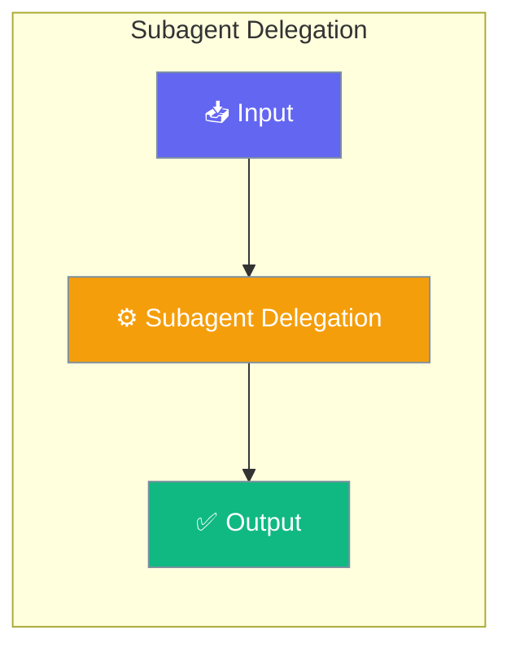

The Subagent Delegator provides primitives for spawning subagents with scoped permissions and context, enabling complex multi-agent workflows.


```mermaid
graph LR
    subgraph "Subagent Delegation"
        A[📥 Input] --> B[⚙️ Subagent Delegation]
        B --> C[✅ Output]
    end

    classDef input fill:#6366F1,stroke:#7C90A0,color:#fff
    classDef process fill:#F59E0B,stroke:#7C90A0,color:#fff
    classDef output fill:#10B981,stroke:#7C90A0,color:#fff

    class A input
    class B process
    class C output
```


## Overview

Subagent delegation allows a primary agent to:
- Spawn specialized subagents for specific tasks
- Control concurrency and resource limits
- Scope permissions per subagent
- Collect and aggregate results

## Quick Start


<Steps>
<Step title="Simple Usage">
```python
from praisonaiagents import Agent

# Quick Start
agent = Agent(instructions="You are a helpful assistant")
agent.start("Hello!")
```
</Step>

<Step title="With Configuration">
```python
from praisonaiagents.agents.delegator import SubagentDelegator, DelegationConfig
import asyncio

# Create delegator
config = DelegationConfig(
    max_concurrent_subagents=3,
    max_total_subagents=10,
    default_timeout_seconds=300
)
delegator = SubagentDelegator(config=config)

# Delegate a task
async def run():
    result = await delegator.delegate(
        agent_name="explorer",
        objective="Find all authentication-related files",
        context={"workspace": "/path/to/project"}
    )
    
    if result.success:
        print(f"Result: {result.result}")
    else:
        print(f"Error: {result.error}")

asyncio.run(run())
```
</Step>
</Steps>


## Best Practices

<AccordionGroup>
  <Accordion title="Start simple">
    Enable the feature with a single parameter before adding configuration. Verify it works, then layer in options.
  </Accordion>
  <Accordion title="Use environment variables for secrets">
    Never hardcode API keys or tokens. Use `os.getenv("KEY_NAME")` to read from environment variables.
  </Accordion>
  <Accordion title="Test with minimal examples first">
    Copy the Quick Start example, run it, then extend it. This confirms your environment is set up correctly.
  </Accordion>
  <Accordion title="Check the logs">
    Set `verbose=True` on your agent to see detailed execution logs when debugging unexpected behavior.
  </Accordion>
</AccordionGroup>

## Related

<CardGroup cols={2}>
  <Card title="Features Overview" icon="grid-2" href="/docs/features">
    Browse all PraisonAI features
  </Card>
  <Card title="Quick Start" icon="rocket" href="/docs/introduction">
    Get started with PraisonAI agents
  </Card>
</CardGroup>
