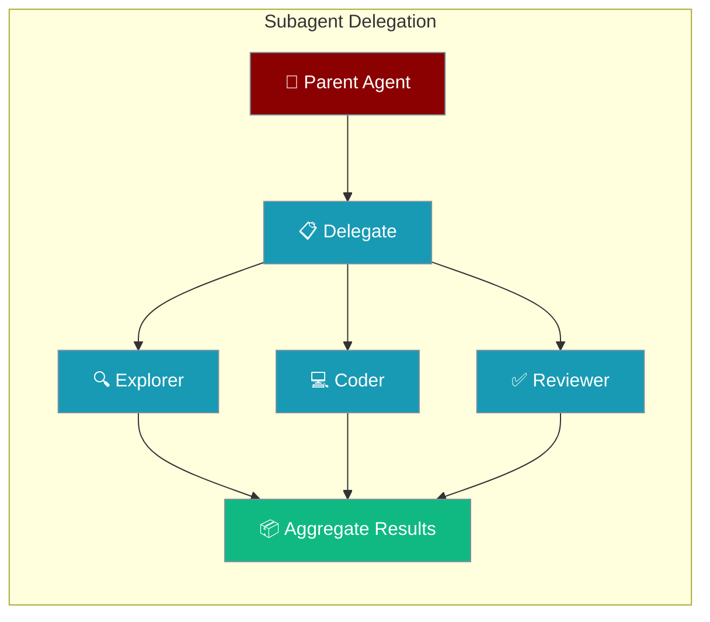
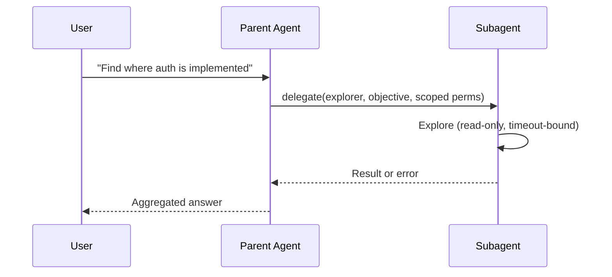
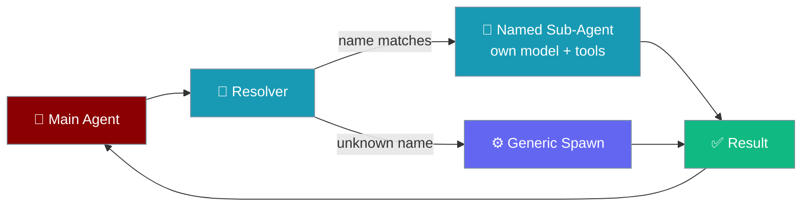
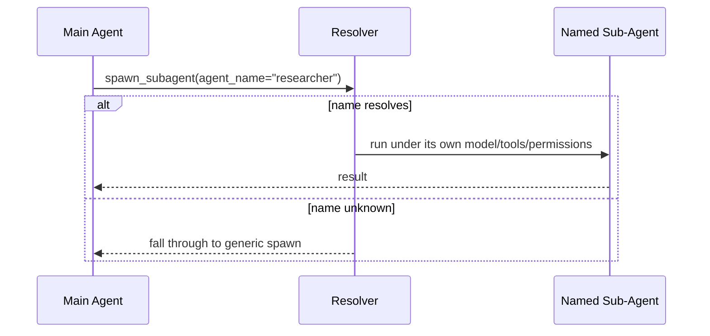
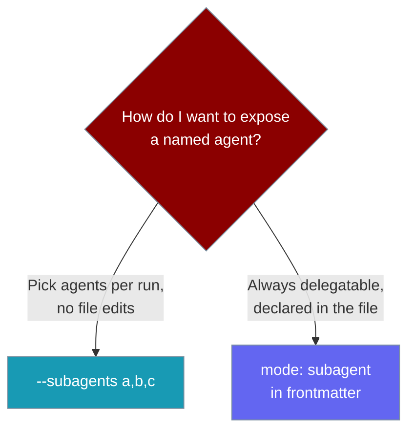
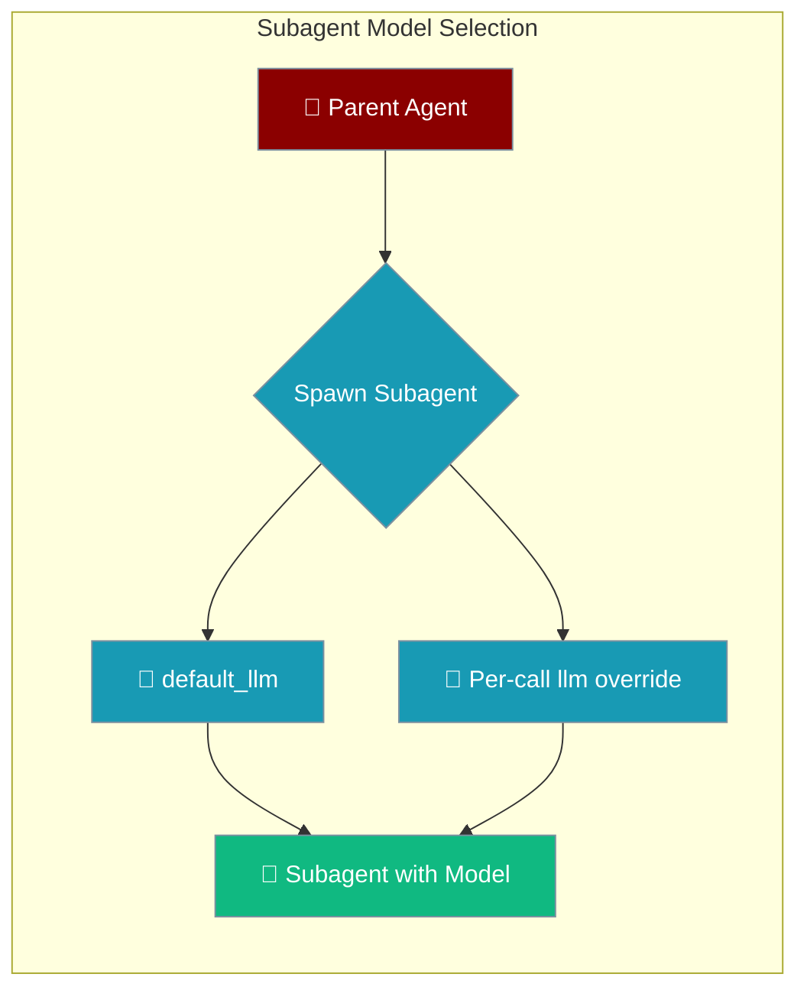

Subagent delegation lets a parent agent spawn specialised workers with scoped permissions, timeouts, and parallel execution.

```python
from praisonaiagents import Agent
from praisonaiagents.tools.subagent_tool import create_subagent_tool

coordinator = Agent(
    name="Coordinator",
    instructions="Delegate read-only exploration to subagents.",
    tools=[create_subagent_tool(
        default_permission_mode="plan",
        allowed_agents=["explorer"],
    )],
)

coordinator.start("Find where authentication is implemented")
```

The user asks the coordinator; delegated subagents explore with scoped permissions.

<Note>
For delegating to your own named agents defined in `.praisonai/agents/*.md` — by name, mid-run, with no Python — see [Named Agent Delegation](/features/named-agent-delegation).
</Note>

<Note>
For a **single one-line tool** an agent can call inside a prompt — no factory, no config — see the [Delegate Task Tool](/features/delegate-task). Reach for `parallel_handoffs` or `create_subagent_tool` (this page and [Subagent Tool](/features/subagent-tool)) when you need parallel fan-out, background execution, or full model / permission control.
</Note>



```mermaid
graph LR
    subgraph "Subagent Delegation"
        P[🤖 Parent Agent] --> D[📋 Delegate]
        D --> E[🔍 Explorer]
        D --> C[💻 Coder]
        D --> R[✅ Reviewer]
        E --> A[📦 Aggregate Results]
        C --> A
        R --> A
    end

    classDef agent fill:#8B0000,stroke:#7C90A0,color:#fff
    classDef process fill:#189AB4,stroke:#7C90A0,color:#fff
    classDef result fill:#10B981,stroke:#7C90A0,color:#fff

    class P agent
    class D,E,C,R process
    class A result
```

<Note>
For agent-to-agent routing inside a conversation, prefer [Handoffs](/features/handoffs). Use the subagent tool when you need programmatic spawn control, background jobs, or full model / permission control; use `parallel_handoffs` for async fan-out.
</Note>

## Quick Start

<Steps>
<Step title="Subagent Tool on an Agent">

Attach `create_subagent_tool` so the parent can spawn workers:

```python
from praisonaiagents import Agent
from praisonaiagents.tools.subagent_tool import create_subagent_tool

agent = Agent(
    name="Lead",
    instructions="Delegate exploration tasks to subagents.",
    tools=[create_subagent_tool(default_permission_mode="plan")],
)

agent.start("Explore the auth module read-only")
```

</Step>

<Step title="Programmatic Handoffs">

For direct async control, fan work out to focused agents with `parallel_handoffs`:

```python
from praisonaiagents import Agent, parallel_handoffs
import asyncio

lead = Agent(name="Lead", instructions="Coordinate exploration.")
explorer = Agent(name="Explorer", instructions="Investigate the codebase read-only.")

async def run():
    results = await parallel_handoffs(
        source=lead,
        targets=[
            (explorer, "Find authentication-related files"),
            (explorer, "Find database models"),
        ],
        max_concurrent=3,
    )
    for r in results:
        print(r.response if r.success else r.error)

asyncio.run(run())
```

For a single target, use `lead.handoff_to_async(explorer, "Find auth files")`.

</Step>
</Steps>

---

## How It Works


```mermaid
sequenceDiagram
    participant User
    participant Parent as Parent Agent
    participant Sub as Subagent

    User->>Parent: "Find where auth is implemented"
    Parent->>Sub: delegate(explorer, objective, scoped perms)
    Sub->>Sub: Explore (read-only, timeout-bound)
    Sub-->>Parent: Result or error
    Parent-->>User: Aggregated answer
```

| Phase | What happens |
|---|---|
| 1. Delegate | The parent spawns a subagent with a scoped permission mode |
| 2. Execute | The subagent runs within its timeout and step limits |
| 3. Aggregate | Results flow back to the parent for a final answer |

---

## Named Delegation from the CLI (`--subagents`)

A running agent can delegate sub-tasks to **your own named agents** in `.praisonai/agents/*.md` — by name, mid-run, with no Python. Each delegated agent runs the sub-task under **its own** model, tools, and permissions.


```mermaid
graph LR
    M[🤖 Main Agent]:::agent --> R[🔁 Resolver]:::process
    R -->|name matches| N[👤 Named Sub-Agent<br/>own model + tools]:::process
    R -->|unknown name| G[⚙️ Generic Spawn]:::config
    N --> A[✅ Result]:::result
    G --> A
    A --> M

    classDef agent fill:#8B0000,stroke:#7C90A0,color:#fff
    classDef process fill:#189AB4,stroke:#7C90A0,color:#fff
    classDef config fill:#6366F1,stroke:#7C90A0,color:#fff
    classDef result fill:#10B981,stroke:#7C90A0,color:#fff
```

<Steps>
<Step title="Create two named agents">

Add a `description:` in each file's frontmatter so the model knows what the agent is for. `.praisonai/agents/researcher.md`:

```markdown
---
description: Researches a topic and gathers sources
model: gpt-4o-mini
---
You are a focused researcher. Gather accurate, sourced findings.
```

`.praisonai/agents/writer.md`:

```markdown
---
description: Writes a concise summary from research notes
model: gpt-4o
---
You turn research notes into a clear, concise summary.
```

</Step>

<Step title="Allow-list them at run time">

```bash
praisonai run "Research X and write a summary" --subagents researcher,writer
```

The main agent can now call `spawn_subagent(agent_name="researcher", ...)` and the resolver runs your `researcher` agent under its own definition.

</Step>
</Steps>

### Two ways to expose a named agent

<Tabs>
<Tab title="Allow-list flag (--subagents)">

Opt any discovered agent in from the CLI without editing it:

```bash
praisonai run "<task>" --subagents researcher,writer
```

The allow-list takes precedence over the frontmatter marker.

</Tab>
<Tab title="Frontmatter marker (mode: subagent)">

Mark an agent as delegatable in its own file — no flag needed:

```markdown
---
mode: subagent
description: Reviews a diff for security issues
---
You review diffs and report security concerns only.
```

`mode: subagent` is a **marker only** — it is not a permission mode and does not restrict the agent.

</Tab>
</Tabs>

### How resolution works


```mermaid
sequenceDiagram
    participant Main as Main Agent
    participant Res as Resolver
    participant Named as Named Sub-Agent

    Main->>Res: spawn_subagent(agent_name="researcher")
    alt name resolves
        Res->>Named: run under its own model/tools/permissions
        Named-->>Main: result
    else name unknown
        Res-->>Main: fall through to generic spawn
    end
```

When the target name is unknown, the resolver returns nothing and the tool falls through to the existing generic-spawn behaviour — so a typo never breaks the run.

### `--subagents` vs `mode: subagent`


```mermaid
graph TB
    Q{How do I want to expose<br/>a named agent?}:::agent
    Q -->|Pick agents per run,<br/>no file edits| F["--subagents a,b,c"]:::process
    Q -->|Always delegatable,<br/>declared in the file| M["mode: subagent<br/>in frontmatter"]:::config

    classDef agent fill:#8B0000,stroke:#7C90A0,color:#fff
    classDef process fill:#189AB4,stroke:#7C90A0,color:#fff
    classDef config fill:#6366F1,stroke:#7C90A0,color:#fff
```

<Note>
**Backward compatible.** With no `--subagents` allow-list **and** no `mode: subagent` marker, no named resolver is wired and delegation behaves exactly as before — identical generic-spawn behaviour (`agent_resolver=None`).
</Note>

<Note>
`--subagents` applies when running a custom agent (for example `praisonai run "<task>" --agent path/to/agent.md`). Named agents are discovered from `~/.praisonai/agents/` and every `.praisonai/agents/` up to the repo root.
</Note>

---

## Built-in Agent Profiles

| Agent | Mode | Description |
|-------|------|-------------|
| `general` | Primary | General-purpose coding assistant |
| `coder` | All | Focused code implementation |
| `planner` | Subagent | Task planning and decomposition |
| `reviewer` | Subagent | Code review and quality |
| `explorer` | Subagent | Read-only codebase investigation |
| `debugger` | Subagent | Debugging and troubleshooting |

```python
from praisonaiagents.agents.profiles import list_profiles, get_profile

profiles = list_profiles()
explorer = get_profile("explorer")
print(explorer.description)
```

---

## Parallel Delegation

Fan work out to multiple agents at once with `parallel_handoffs` — each `(agent, prompt)` tuple runs concurrently:

```python
from praisonaiagents import Agent, parallel_handoffs

lead = Agent(name="Lead", instructions="Coordinate exploration.")
explorer = Agent(name="Explorer", instructions="Investigate the codebase.")

results = await parallel_handoffs(
    source=lead,
    targets=[
        (explorer, "Find authentication files"),
        (explorer, "Find database models"),
        (explorer, "Find API endpoints"),
    ],
    max_concurrent=3,
)
```

Route each prompt to a different specialist by passing different agents:

```python
reviewer = Agent(name="Reviewer", instructions="Review security.")

results = await parallel_handoffs(
    source=lead,
    targets=[
        (explorer, "Find auth files"),
        (reviewer, "Review security of auth.py"),
    ],
)
```

---

## Configuration Options

Parallel fan-out is tuned with `HandoffConfig`. The knobs you reach for most:

| Option | Type | Default | Description |
|--------|------|---------|-------------|
| `max_concurrent` | `int` | `5` | Max handoffs running at once |
| `timeout_seconds` | `float` | `300.0` | Timeout per handoff |
| `allow_parallel` | `bool` | `False` | Must be `True` to run via `parallel_handoffs` when passing a config |
| `max_depth` | `int` | `10` | Maximum handoff chain depth |
| `context_policy` | `ContextPolicy` | `SUMMARY` | How much history each target sees |

```python
from praisonaiagents import parallel_handoffs, HandoffConfig

config = HandoffConfig(
    max_concurrent=3,
    timeout_seconds=300.0,
    allow_parallel=True,
)

results = await parallel_handoffs(source=lead, targets=targets, config=config)
```

<Note>
`max_concurrent` passed directly to `parallel_handoffs` overrides the value in `HandoffConfig`. See the full option list in the [HandoffConfig reference](/sdk/reference/praisonaiagents/classes/HandoffConfig).
</Note>

---

## Model and Permission Modes


```mermaid
graph LR
    subgraph "Subagent Model Selection"
        A[🤖 Parent Agent] --> B{Spawn Subagent}
        B --> C[📝 default_llm]
        B --> D[🔄 Per-call llm override]
        C --> E[🧠 Subagent with Model]
        D --> E
    end

    classDef agent fill:#8B0000,stroke:#7C90A0,color:#fff
    classDef config fill:#189AB4,stroke:#7C90A0,color:#fff
    classDef result fill:#10B981,stroke:#7C90A0,color:#fff

    class A agent
    class B,C,D config
    class E result
```

| Mode | Description |
|------|-------------|
| `default` | Standard permission checking |
| `accept_edits` | Auto-accept file edits |
| `dont_ask` | Auto-deny prompts |
| `bypass_permissions` | Skip all checks (dangerous) |
| `plan` | Read-only exploration mode |

See [Subagent Tool](/features/subagent-tool) for `create_subagent_tool` parameters and background mode.

---

## Cancellation

A single async handoff is a coroutine — wrap it in your own `asyncio.Task` and `.cancel()` it to stop it early:

```python
import asyncio
from praisonaiagents import Agent

lead = Agent(name="Lead", instructions="Coordinate work.")
explorer = Agent(name="Explorer", instructions="Investigate.")

task = asyncio.create_task(lead.handoff_to_async(explorer, "Scan the whole repo"))
# ...later, if it runs too long:
task.cancel()
```

For fan-out, `parallel_handoffs` bounds each target with `timeout_seconds` from `HandoffConfig`; cancel the outer task to stop the whole batch.

---

## Best Practices

<AccordionGroup>
<Accordion title="Match agent profiles to the task">
Use `explorer` for read-only scans, `coder` for implementation, and `reviewer` for quality checks.
</Accordion>

<Accordion title="Set timeouts on long tasks">
Prevent runaway handoffs with `HandoffConfig(timeout_seconds=...)`.
</Accordion>

<Accordion title="Limit concurrency">
Keep `max_concurrent` low to avoid overwhelming APIs or local resources.
</Accordion>

<Accordion title="Prefer plan mode for exploration">
Use `permission_mode="plan"` when subagents should not modify files.
</Accordion>
</AccordionGroup>

---

## Delegating to Your Named Agents

Beyond the built-in profiles, a running agent can delegate to your own named agents in `.praisonai/agents/*.md` — picked by name, each running under its own model, tools, and permissions. Mark an agent with `mode: subagent` or opt agents in per run with `praisonai run --subagents a,b,c`.

```bash
praisonai run --agent lead --subagents researcher,reviewer "Draft and review a brief on X"
```

The dedicated [Named Agent Delegation](/features/named-agent-delegation) page owns this topic in full.

## Related

<CardGroup cols={2}>
  <Card title="Named Subagents" icon="users" href="/features/named-subagents">
    Delegate to your own named agents by name — one Markdown file each
  </Card>
  <Card title="Subagent Tool" icon="robot" href="/features/subagent-tool">
    Spawn subagents from a parent agent's tool list
  </Card>
  <Card title="Spawn & Announce" icon="rocket" href="/features/spawn-announce">
    Non-blocking parallel sub-agent orchestration
  </Card>
  <Card title="Agent Profiles" icon="id-card" href="/features/agent-profiles">
    Built-in profile definitions
  </Card>
  <Card title="Handoffs" icon="hand-holding-hand" href="/features/handoffs">
    Conversation-based agent routing
  </Card>
</CardGroup>
