The Subagent Delegator provides primitives for spawning subagents with scoped permissions and context, enabling complex multi-agent workflows.

## Overview

Subagent delegation allows a primary agent to:
- Spawn specialized subagents for specific tasks
- Control concurrency and resource limits
- Scope permissions per subagent
- Collect and aggregate results

## Quick Start

```python
from praisonaiagents import Agent

# Quick Start
agent = Agent(instructions="You are a helpful assistant")
agent.start("Hello!")
```

```python
from praisonaiagents.agents.delegator import SubagentDelegator, DelegationConfig
import asyncio

# Create delegator
config = DelegationConfig(
    max_concurrent_subagents=3,
    max_total_subagents=10,
    default_timeout_seconds=300
)
delegator = SubagentDelegator(config=config)

# Delegate a task
async def run():
    result = await delegator.delegate(
        agent_name="explorer",
        objective="Find all authentication-related files",
        context={"workspace": "/path/to/project"}
    )
    
    if result.success:
        print(f"Result: {result.result}")
    else:
        print(f"Error: {result.error}")

asyncio.run(run())
```

## Available Agents

Get list of available agents for delegation:

```python
agents = delegator.get_available_agents()
# ['explorer', 'coder', 'planner', 'reviewer', 'debugger']

# Get description
desc = delegator.get_agent_description("explorer")
print(desc)
# "Fast read-only agent for codebase investigation..."
```

## Built-in Agent Profiles

| Agent | Mode | Description |
|-------|------|-------------|
| `general` | Primary | General-purpose coding assistant |
| `coder` | All | Focused code implementation |
| `planner` | Subagent | Task planning and decomposition |
| `reviewer` | Subagent | Code review and quality |
| `explorer` | Subagent | Read-only codebase investigation |
| `debugger` | Subagent | Debugging and troubleshooting |

## Explorer Agent

The explorer agent is a specialized read-only agent for codebase investigation:

```python
result = await delegator.delegate(
    agent_name="explorer",
    objective="Find where authentication is implemented",
    context={
        "workspace": "/path/to/project",
        "thoroughness": "very thorough"
    }
)
```

The explorer agent:
- Uses only read-only tools (read_file, grep, glob, list_files)
- Cannot modify files or execute commands
- Provides structured reports with file locations and insights

## Parallel Delegation

Delegate multiple tasks in parallel:

```python
results = await delegator.delegate_parallel([
    ("explorer", "Find authentication files"),
    ("explorer", "Find database models"),
    ("explorer", "Find API endpoints"),
])

for result in results:
    print(f"{result.agent_name}: {result.success}")
```

With context:

```python
results = await delegator.delegate_parallel([
    ("explorer", "Find auth files", {"workspace": "/project"}),
    ("reviewer", "Review security", {"files": ["auth.py"]}),
])
```

## Configuration

```python
from praisonaiagents.agents.delegator import DelegationConfig

config = DelegationConfig(
    # Concurrency limits
    max_concurrent_subagents=3,    # Max running at once
    max_total_subagents=10,        # Max total spawned
    
    # Timeouts
    default_timeout_seconds=300.0, # Default timeout
    max_timeout_seconds=600.0,     # Maximum allowed timeout
    
    # Resource limits
    max_steps_per_subagent=50,     # Max steps per subagent
    max_tokens_per_subagent=50000, # Max tokens per subagent
    
    # Permissions
    inherit_permissions=True,      # Inherit from parent
    allow_nested_delegation=False, # Allow subagents to delegate
    
    # Behavior
    auto_cancel_on_parent_cancel=True,
    collect_results=True,
)
```

## Task Management

### Cancel a Task

```python
# Cancel specific task
success = await delegator.cancel_task(task_id)

# Cancel all running tasks
cancelled_count = await delegator.cancel_all()
```

### Check Task Status

```python
status = delegator.get_task_status(task_id)
# DelegationStatus.RUNNING, COMPLETED, FAILED, etc.

# Get all running tasks
running = delegator.get_running_tasks()
```

### Statistics

```python
stats = delegator.get_stats()
print(f"Total tasks: {stats['total_tasks']}")
print(f"Running: {stats['running_tasks']}")
print(f"Status counts: {stats['status_counts']}")
```

## Model Selection

Specify which LLM model subagents should use:

```mermaid
graph LR
    subgraph "Subagent Model Selection"
        A[🤖 Parent Agent] --> B{Spawn Subagent}
        B --> C[📝 default_llm]
        B --> D[🔄 Per-call llm override]
        C --> E[🧠 Subagent with Model]
        D --> E
    end
    
    classDef agent fill:#8B0000,stroke:#7C90A0,color:#fff
    classDef config fill:#189AB4,stroke:#7C90A0,color:#fff
    classDef result fill:#10B981,stroke:#7C90A0,color:#fff
    
    class A agent
    class B,C,D config
    class E result
```



```python
from praisonaiagents.tools.subagent_tool import create_subagent_tool

# Set default model for all subagents
tool = create_subagent_tool(
    default_llm="gpt-4o-mini"
)

# Or override per-call
func = tool["function"]
result = func(
    task="Analyze the codebase",
    llm="gpt-4o"  # Override for this specific call
)
```

## Permission Modes

Control subagent permissions with permission modes:

```python
from praisonaiagents.tools.subagent_tool import create_subagent_tool

# Set default permission mode
tool = create_subagent_tool(
    default_permission_mode="plan"  # Read-only exploration
)

# Or override per-call
func = tool["function"]
result = func(
    task="Explore the auth module",
    permission_mode="plan"  # Read-only for this task
)
```

| Mode | Description |
|------|-------------|
| `default` | Standard permission checking |
| `accept_edits` | Auto-accept file edits |
| `dont_ask` | Auto-deny prompts |
| `bypass_permissions` | Skip all checks (dangerous) |
| `plan` | Read-only exploration mode |

## Custom Agent Factory

Provide a custom agent factory for more control:

```python
from praisonaiagents import Agent

def my_agent_factory(agent_name: str, llm: str = None) -> Agent:
    if agent_name == "explorer":
        return Agent(
            name="explorer",
            instructions="You are a codebase explorer...",
            tools=[read_file, grep, glob],
            llm=llm or "gpt-4o-mini"
        )
    # ... other agents

delegator = SubagentDelegator(
    config=config,
    agent_factory=my_agent_factory
)
```

## Callbacks

Register callbacks for task completion:

```python
def on_task_complete(result):
    print(f"Task {result.task_id} completed")
    print(f"Agent: {result.agent_name}")
    print(f"Success: {result.success}")
    print(f"Duration: {result.duration_seconds}s")

delegator = SubagentDelegator(
    config=config,
    on_task_complete=on_task_complete
)
```

## Convenience Function

Quick delegation without creating a delegator:

```python
from praisonaiagents.agents.delegator import delegate_to_agent

result = await delegate_to_agent(
    agent_name="explorer",
    objective="Find all Python files",
    context={"workspace": "/project"},
    timeout_seconds=60
)
```

## Best Practices

1. **Use appropriate agents** - Match agent capabilities to task requirements
2. **Set timeouts** - Prevent runaway subagents
3. **Limit concurrency** - Don't overwhelm resources
4. **Scope permissions** - Use read-only agents when possible
5. **Handle failures** - Check `result.success` and handle errors

## Related

- [Escalation Pipeline](/docs/features/escalation-pipeline)
- [Agent Profiles](/docs/features/agent-profiles)
- [Autonomy Modes](/docs/features/autonomy-mode)
