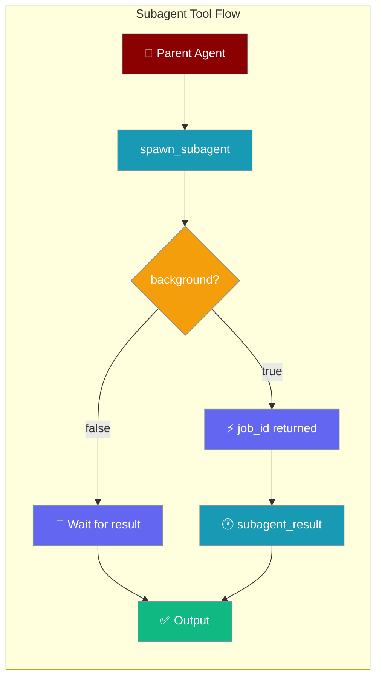
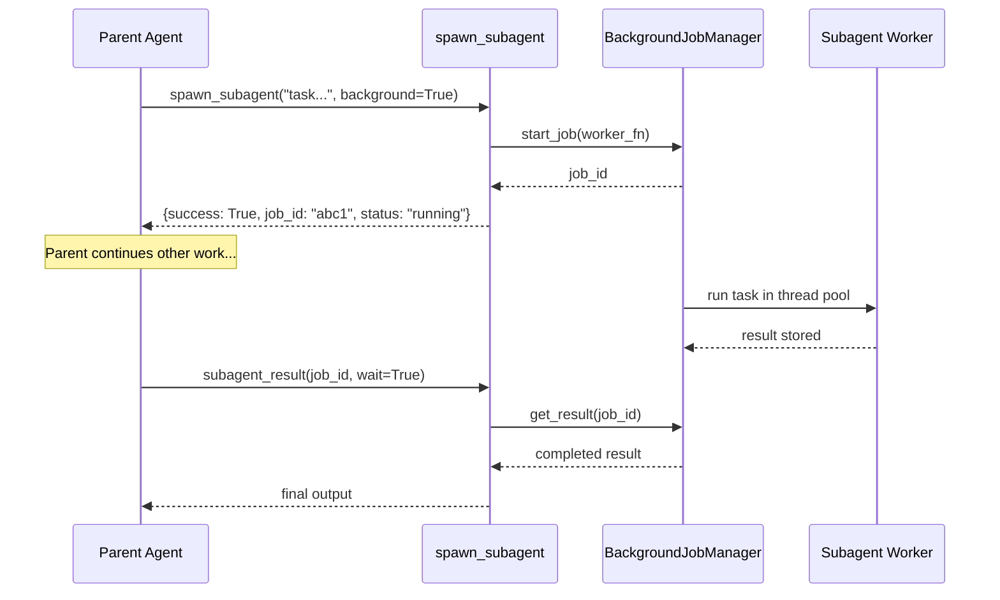
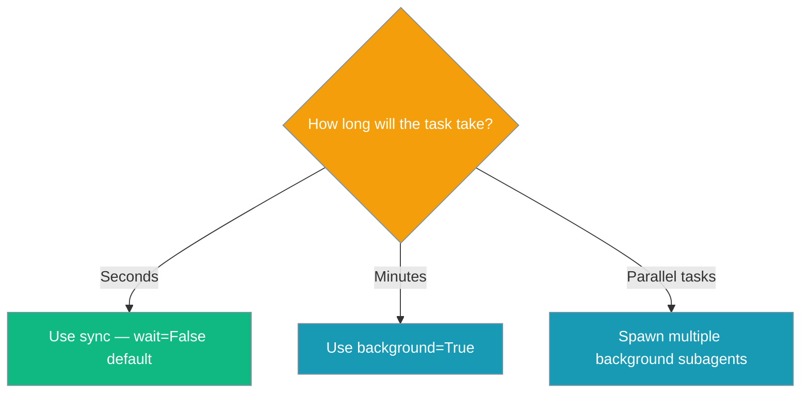

The Subagent Tool enables agents to spawn specialized subagents for specific tasks, with full control over model selection, permission modes, and whether to wait for the result or continue immediately.


```mermaid
graph LR
    subgraph "Subagent Tool Flow"
        A[🤖 Parent Agent] --> B[spawn_subagent]
        B --> C{background?}
        C -->|false| D[🔄 Wait for result]
        C -->|true| E[⚡ job_id returned]
        D --> F[✅ Output]
        E --> G[🕐 subagent_result]
        G --> F
    end
    
    classDef agent fill:#8B0000,stroke:#7C90A0,color:#fff
    classDef tool fill:#189AB4,stroke:#7C90A0,color:#fff
    classDef decision fill:#F59E0B,stroke:#7C90A0,color:#fff
    classDef result fill:#10B981,stroke:#7C90A0,color:#fff
    classDef config fill:#6366F1,stroke:#7C90A0,color:#fff
    
    class A agent
    class B,G tool
    class C decision
    class D,E config
    class F result
```

## Quick Start

<Steps>

<Step title="Spawn a subagent (synchronous)">
```python
from praisonaiagents import Agent
from praisonaiagents.tools.subagent_tool import create_subagent_tool

tool = create_subagent_tool()
func = tool["function"]

result = func(task="Analyze the authentication module")

if result["success"]:
    print(result["output"])
```
</Step>

<Step title="Spawn a background subagent (fire-and-forget)">
```python
from praisonaiagents import Agent

researcher = Agent(name="Researcher", instructions="Research the topic deeply.")

result = researcher.spawn_subagent(
    "Read these 20 PDFs and summarise findings",
    background=True,
)
job_id = result["job_id"]

print(f"Job started: {job_id}")
```
</Step>

<Step title="Poll or wait for the background result">
```python
status = researcher.subagent_result(job_id)

final = researcher.subagent_result(job_id, wait=True)
```
</Step>

</Steps>

---

## Background Mode

Background mode lets a parent agent fire off a long-running subagent and immediately continue with other work. The subagent runs on the shared `BackgroundJobManager` thread pool.


```mermaid
sequenceDiagram
    participant P as Parent Agent
    participant SM as spawn_subagent
    participant JM as BackgroundJobManager
    participant SA as Subagent Worker

    P->>SM: spawn_subagent("task...", background=True)
    SM->>JM: start_job(worker_fn)
    JM-->>SM: job_id
    SM-->>P: {success: True, job_id: "abc1", status: "running"}
    Note over P: Parent continues other work...
    JM->>SA: run task in thread pool
    SA-->>JM: result stored
    P->>SM: subagent_result(job_id, wait=True)
    SM->>JM: get_result(job_id)
    JM-->>SM: completed result
    SM-->>P: final output
```

### When to use sync vs background


```mermaid
graph TB
    Q{How long will the task take?}
    Q -->|Seconds| Sync[Use sync — wait=False default]
    Q -->|Minutes| BG[Use background=True]
    Q -->|Parallel tasks| Multi[Spawn multiple background subagents]
    
    classDef decision fill:#F59E0B,stroke:#7C90A0,color:#fff
    classDef sync fill:#10B981,stroke:#7C90A0,color:#fff
    classDef bg fill:#189AB4,stroke:#7C90A0,color:#fff
    
    class Q decision
    class Sync sync
    class BG,Multi bg
```

---

## Configuration Options

### `create_subagent_tool` parameters

```python
from praisonaiagents.tools.subagent_tool import create_subagent_tool

tool = create_subagent_tool(
    agent_factory=my_factory,
    allowed_agents=["explorer", "reviewer"],
    max_depth=3,
    default_llm="gpt-4o-mini",
    default_permission_mode="plan"
)
```

| Parameter | Type | Default | Description |
|-----------|------|---------|-------------|
| `agent_factory` | `Callable` | `None` | Custom function to create agents |
| `allowed_agents` | `List[str]` | `None` | Restrict which agent types can be spawned |
| `max_depth` | `int` | `3` | Maximum subagent nesting depth |
| `default_llm` | `str` | `None` | Default LLM model for subagents |
| `default_permission_mode` | `str` | `None` | Default permission mode |

### Spawn parameters

```python
result = func(
    task="Your task description",
    agent_name="explorer",
    context="Additional context",
    tools=["read_file", "search"],
    llm="gpt-4o",
    permission_mode="plan",
    background=False,
)
```

| Parameter | Type | Default | Description |
|-----------|------|----------|-------------|
| `task` | `str` | — | Task description for the subagent |
| `agent_name` | `str` | `None` | Specific agent type to use |
| `context` | `str` | `None` | Additional context for the task |
| `tools` | `List[str]` | `None` | Tools to give the subagent |
| `llm` | `str` | `None` | LLM model override |
| `permission_mode` | `str` | `None` | Permission mode override |
| `background` | `bool` | `False` | When `True`, enqueue on `BackgroundJobManager` and return `job_id` immediately |

### `subagent_result` companion tool

| Parameter | Type | Default | Description |
|-----------|------|---------|-------------|
| `job_id` | `str` | — | Job ID returned by `spawn_subagent(background=True)` |
| `wait` | `bool` | `False` | If `True`, block until the job completes. Unknown `job_id` returns a clean error dict |

---

## Background Job Statuses

| Status | Meaning |
|--------|---------|
| `pending` | Queued, not yet started |
| `running` | Worker thread is active |
| `completed` | Finished successfully |
| `failed` | Worker threw an exception |
| `cancelled` | Cancelled before starting |

---

## Common Patterns

### Parallel research across multiple sources

```python
from praisonaiagents import Agent

agent = Agent(name="Coordinator", instructions="Coordinate research tasks.")

jobs = []
for source in ["PDFs", "web articles", "database records"]:
    r = agent.spawn_subagent(f"Research {source}", background=True)
    jobs.append(r["job_id"])

results = [agent.subagent_result(j, wait=True) for j in jobs]
```

### Read-only exploration

```python
tool = create_subagent_tool(default_permission_mode="plan")
func = tool["function"]

result = func(task="Explore the codebase and summarise the architecture")
```

### With model and permission mode

```python
tool = create_subagent_tool(
    default_llm="gpt-4o-mini",
    default_permission_mode="plan"
)

func = tool["function"]
result = func(
    task="Explore the codebase",
    llm="gpt-4o",
    permission_mode="plan"
)
```

---

## Model Selection

Model selection priority:
1. **Per-call `llm` parameter** — Highest priority
2. **`default_llm` from tool creation** — Fallback
3. **Agent's default model** — Final fallback

---

## Permission Modes

| Mode | Description |
|------|-------------|
| `default` | Normal permission checking |
| `accept_edits` | Auto-accept file edits |
| `dont_ask` | Auto-deny all prompts |
| `bypass_permissions` | Skip all checks |
| `plan` | Read-only exploration mode |

---

## Result Structure

### Synchronous result

```python
{
    "success": True,
    "output": "Analysis results...",
    "agent_name": "subagent",
    "task": "Analyze code",
    "llm": "gpt-4o-mini",
    "permission_mode": "plan"
}
```

### Background spawn result

```python
{
    "success": True,
    "job_id": "abc1ef23",
    "status": "running"
}
```

### Error response

```python
{
    "success": False,
    "error": "Error message",
    "output": None
}
```

---

## Best Practices

<AccordionGroup>

<Accordion title="Use background mode for long-running tasks">
If a subagent task will take more than a few seconds — fetching many files, calling slow APIs, or running analysis — use `background=True` so the parent agent can continue other work.
</Accordion>

<Accordion title="Use appropriate models">
Use smaller models like `gpt-4o-mini` for simple tasks and larger models for complex analysis. Set `default_llm` at tool creation and override per-call only when needed.
</Accordion>

<Accordion title="Set permission modes explicitly">
Always set `permission_mode="plan"` for exploration tasks to prevent accidental modifications. Only use `accept_edits` or `bypass_permissions` when you intend writes.
</Accordion>

<Accordion title="Limit allowed agents">
Restrict `allowed_agents` to only the agent types needed for your use case. This prevents unexpected agent creation.
</Accordion>

<Accordion title="Check success before reading output">
Always check `result["success"]` before accessing `result["output"]`. Background jobs can fail on the worker thread — `subagent_result(job_id, wait=True)` returns a clean error dict on failure.
</Accordion>

</AccordionGroup>

---

## Related

<CardGroup cols={2}>
  <Card title="Subagent Delegation" icon="users" href="/docs/features/subagent-delegation">
    Advanced subagent management patterns
  </Card>
  <Card title="Permission Modes" icon="shield-check" href="/docs/features/permission-modes">
    Permission mode details and configuration
  </Card>
  <Card title="Background Tasks" icon="clock" href="/docs/features/background-tasks">
    Long-running background task management
  </Card>
  <Card title="Async Jobs" icon="list-check" href="/docs/features/async-jobs">
    Async job scheduling and monitoring
  </Card>
</CardGroup>
