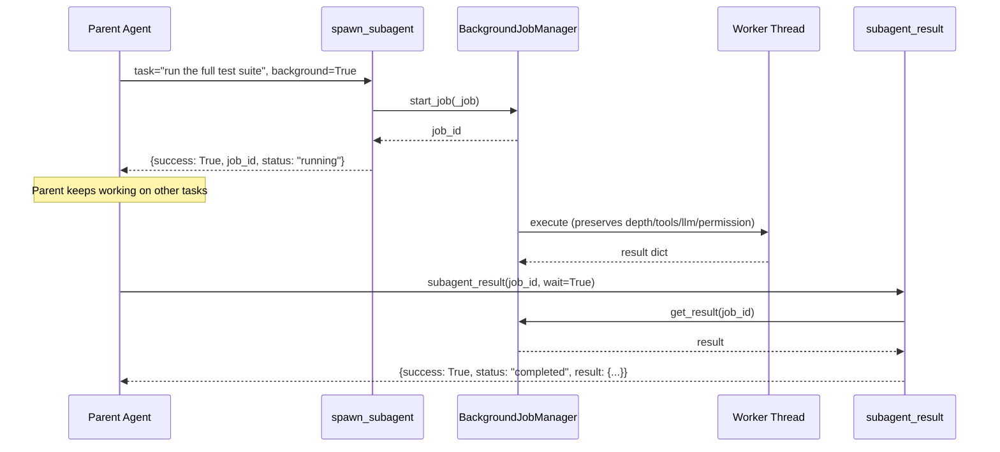
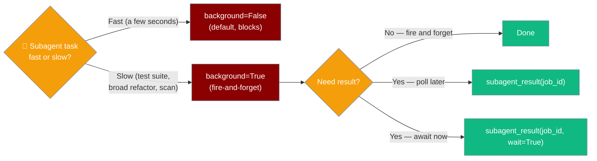
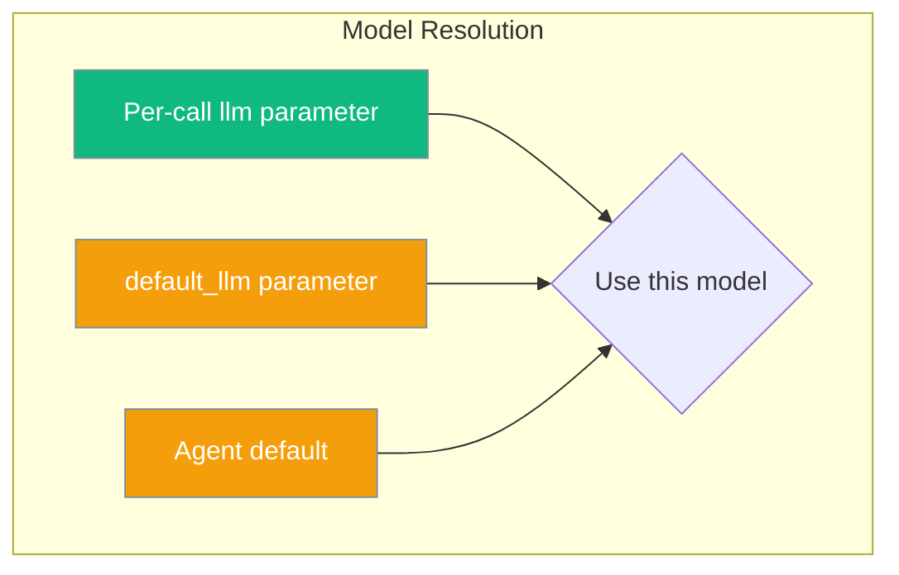

The Subagent Tool lets a parent agent spawn specialised subagents for specific tasks — synchronously, or in the **background** so the parent keeps working and collects the result later.


```mermaid
sequenceDiagram
    participant Parent as Parent Agent
    participant Spawn as spawn_subagent
    participant Mgr as BackgroundJobManager
    participant Worker as Worker Thread
    participant Result as subagent_result

    Parent->>Spawn: task="run the full test suite", background=True
    Spawn->>Mgr: start_job(_job)
    Mgr-->>Spawn: job_id
    Spawn-->>Parent: {success: True, job_id, status: "running"}
    Note over Parent: Parent keeps working on other tasks
    Mgr->>Worker: execute (preserves depth/tools/llm/permission)
    Worker-->>Mgr: result dict
    Parent->>Result: subagent_result(job_id, wait=True)
    Result->>Mgr: get_result(job_id)
    Mgr-->>Result: result
    Result-->>Parent: {success: True, status: "completed", result: {...}}
```

## Quick Start

<Steps>

<Step title="Create and use the subagent tool">
```python
from praisonaiagents.tools.subagent_tool import create_subagent_tool

tool = create_subagent_tool()
spawn = tool["function"]

# Synchronous (default) — blocks until done
result = spawn(task="Analyse the authentication module")
if result["success"]:
    print(result["output"])
```
</Step>

<Step title="Fire-and-forget with background=True">
```python
from praisonaiagents.tools.subagent_tool import create_subagent_tool

tool = create_subagent_tool()
spawn = tool["function"]
collect = tool["result_tool"]["function"]

# Returns immediately with a job_id
handle = spawn(task="Run the full test suite", background=True)
print(handle["job_id"], handle["status"])  # <id>  running

# Poll (non-blocking)
status = collect(handle["job_id"])

# Or block until done
final = collect(handle["job_id"], wait=True)
if final["status"] == "completed":
    print(final["result"]["output"])
```
</Step>

<Step title="With model and permission control">
```python
from praisonaiagents.tools.subagent_tool import create_subagent_tool

tool = create_subagent_tool(
    default_llm="gpt-4o-mini",
    default_permission_mode="plan"
)
spawn = tool["function"]

result = spawn(
    task="Explore the codebase",
    llm="gpt-4o",          # override model for this call
    permission_mode="plan" # read-only exploration
)
```
</Step>

</Steps>

---

## When to use background mode


```mermaid
graph LR
    Q{🤔 Subagent task<br/>fast or slow?} -->|"Fast (a few seconds)"| Sync["background=False<br/>(default, blocks)"]
    Q -->|"Slow (test suite,<br/>broad refactor, scan)"| BG["background=True<br/>(fire-and-forget)"]
    BG --> Poll{Need result?}
    Poll -->|"No — fire and forget"| Done["Done"]
    Poll -->|"Yes — poll later"| R1["subagent_result(job_id)"]
    Poll -->|"Yes — await now"| R2["subagent_result(job_id, wait=True)"]

    classDef q fill:#F59E0B,stroke:#7C90A0,color:#fff
    classDef mode fill:#8B0000,stroke:#7C90A0,color:#fff
    classDef result fill:#10B981,stroke:#7C90A0,color:#fff
    class Q,Poll q
    class Sync,BG mode
    class Done,R1,R2 result
```

---

## Configuration Options

```python
from praisonaiagents.tools.subagent_tool import create_subagent_tool

tool = create_subagent_tool(
    agent_factory=my_factory,      # Custom agent factory
    allowed_agents=["explorer"],   # Restrict agent types
    max_depth=3,                   # Maximum nesting depth
    default_llm="gpt-4o-mini",     # Default LLM model
    default_permission_mode="plan" # Default permission mode
)
```

| Parameter | Type | Default | Description |
|-----------|------|---------|-------------|
| `agent_factory` | `Callable` | `None` | Custom function to create agents |
| `allowed_agents` | `List[str]` | `None` | Restrict which agent types can be spawned |
| `max_depth` | `int` | `3` | Maximum subagent nesting depth |
| `default_llm` | `str` | `None` | Default LLM model for subagents |
| `default_permission_mode` | `str` | `None` | Default permission mode |

---

## Spawn Parameters

```python
spawn = tool["function"]
result = spawn(
    task="Your task description",
    agent_name="explorer",
    context="Additional context",
    tools=["read_file", "search"],
    llm="gpt-4o",
    permission_mode="plan",
    background=False,   # True to fire-and-forget
)
```

| Parameter | Type | Default | Description |
|-----------|------|----------|-------------|
| `task` | `str` | — | Task description for the subagent (required) |
| `agent_name` | `str` | `None` | Specific agent type to use |
| `context` | `str` | `None` | Additional context prepended to the task |
| `tools` | `List[str]` | `None` | Tools to give the subagent |
| `llm` | `str` | `None` | LLM model override |
| `permission_mode` | `str` | `None` | Permission mode override |
| `background` | `bool` | `False` | When `True`, enqueue on the background job runner and return immediately with a `job_id` |

---

## Background Mode

Run a long subtask without blocking the parent agent. Use it for full test runs, broad codebase scans, or large refactors — anything where the parent agent should keep working instead of waiting.

<Steps>

<Step title="Kick off in the background">
```python
from praisonaiagents.tools.subagent_tool import create_subagent_tool

tool = create_subagent_tool()
spawn = tool["function"]

handle = spawn(
    task="Run the full test suite",
    background=True,
)
job_id = handle["job_id"]
# Returns immediately — {"success": True, "job_id": "...", "status": "running", ...}
```
</Step>

<Step title="Keep working, then collect the result">
```python
collect = tool["result_tool"]["function"]

# Non-blocking poll — returns status="running" or status="completed"
status = collect(job_id)

# Or block until done
final = collect(job_id, wait=True)
if final["status"] == "completed":
    print(final["result"]["output"])
```
</Step>

<Step title="Handle failures cleanly">
```python
result = collect(job_id, wait=True)

if not result["success"]:
    print("Job failed:", result.get("error"))
elif result["result"]["success"] is False:
    print("Subagent error:", result["result"]["error"])
else:
    print(result["result"]["output"])
```
</Step>

</Steps>

### Background return shapes

`spawn(..., background=True)` returns a **handle** (not a final result):

```python
{
    "success": True,
    "job_id": "...",
    "status": "running",
    "agent_name": "subagent",
    "task": "...",
    "llm": "...",
    "permission_mode": "...",
}
```

`subagent_result(job_id)` polls without blocking:

```python
# While running
{"success": True, "job_id": "...", "status": "running"}
```

`subagent_result(job_id, wait=True)` blocks until done:

```python
# Completed — the subagent's result dict is under "result"
{
    "success": True,
    "job_id": "...",
    "status": "completed",
    "result": {"success": True, "output": "...", "agent_name": "...", ...},
}

# Worker crashed or was cancelled
{"success": False, "job_id": "...", "status": "failed", "error": "..."}

# Unknown job_id
{"success": False, "job_id": "...", "error": "Job '...' not found"}
```

<Note>
An *inner* subagent failure (e.g. the agent's `chat()` raised) is caught and returned as `result.success=False` inside a completed envelope. The outer `success` is still `True` and `status` is still `"completed"`.
</Note>

---

## `subagent_result` Tool

`subagent_result` is a first-class companion tool exposed via `tool["result_tool"]`. Give it to the parent agent alongside `spawn_subagent` so it can poll or await background jobs.

```python
result_tool = tool["result_tool"]
collect = result_tool["function"]
```

| Parameter | Type | Default | Description |
|-----------|------|---------|-------------|
| `job_id` | `str` | — | The job ID returned by `spawn_subagent(background=True)` (required) |
| `wait` | `bool` | `False` | When `True`, block until the subagent completes before returning |

```python
# Non-blocking poll
status_check = collect(job_id)

# Blocking await
final = collect(job_id, wait=True)
```

---

## Scoping Guarantees

Background subagents honour the **same scoping** as synchronous ones.

- `max_depth` — tracked per-thread; the parent depth is captured at call time and restored on the worker thread. Concurrent background subagents cannot corrupt each other's depth budget.
- `allowed_agents` — checked **before** the job is enqueued. Violations return an immediate failure — no stuck `job_id`.
- `tools`, `llm`, `permission_mode` — captured in the closure and passed to the worker exactly as specified.

```python
from praisonaiagents.tools.subagent_tool import create_subagent_tool

tool = create_subagent_tool()
spawn = tool["function"]
collect = tool["result_tool"]["function"]

# Scoping is preserved on the background thread
handle = spawn(
    task="restricted exploration",
    tools=["read_file"],
    llm="gpt-4o-mini",
    permission_mode="plan",
    background=True,
)
final = collect(handle["job_id"], wait=True)
# final["result"]["permission_mode"] == "plan"
# final["result"]["llm"]             == "gpt-4o-mini"
```

---

## Synchronous Result Structure

Synchronous calls (`background=False`, the default) return the final result directly:

```python
spawn = tool["function"]
result = spawn(task="Analyze code")

# Success
{
    "success": True,
    "output": "Analysis results...",
    "agent_name": "subagent",
    "task": "Analyze code",
    "llm": "gpt-4o-mini",
    "permission_mode": "plan"
}

# Error
{
    "success": False,
    "error": "Error message",
    "output": None
}
```

<Note>
Synchronous results never include `job_id`. Background handles never include `output`. The two shapes are intentionally distinct.
</Note>

---

## Model Selection


```mermaid
graph TB
    subgraph "Model Resolution"
        A[Per-call llm parameter] --> D{Use this model}
        B[default_llm parameter] --> D
        C[Agent default] --> D
    end
    
    classDef priority fill:#10B981,stroke:#7C90A0,color:#fff
    classDef fallback fill:#F59E0B,stroke:#7C90A0,color:#fff
    
    class A priority
    class B,C fallback
```

Model selection priority:
1. **Per-call `llm` parameter** — highest priority
2. **`default_llm` from tool creation** — fallback
3. **Agent's default model** — final fallback

```python
# Set default for all subagents
tool = create_subagent_tool(default_llm="gpt-4o-mini")
spawn = tool["function"]

# Override for a specific call
result = spawn(task="Complex analysis", llm="gpt-4o")
```

---

## Permission Modes

| Mode | Description |
|------|-------------|
| `default` | Standard permission checking |
| `accept_edits` | Auto-accept file edits |
| `dont_ask` | Auto-deny all prompts |
| `bypass_permissions` | Skip all checks |
| `plan` | Read-only exploration mode |

```python
# Read-only exploration
tool = create_subagent_tool(default_permission_mode="plan")
spawn = tool["function"]

# Auto-accept for refactoring
result = spawn(
    task="Refactor the utils module",
    permission_mode="accept_edits"
)
```

---

## Custom Agent Factory

```python
from praisonaiagents import Agent
from praisonaiagents.tools.subagent_tool import create_subagent_tool

def my_agent_factory(name, tools=None, llm=None):
    return Agent(
        name=name,
        instructions=f"You are a {name} agent",
        tools=tools or [],
        llm=llm or "gpt-4o-mini"
    )

tool = create_subagent_tool(
    agent_factory=my_agent_factory,
    default_llm="gpt-4o-mini"
)
```

---

## Depth Limiting

```python
# Limit to 2 levels of nesting
tool = create_subagent_tool(max_depth=2)
```

<Warning>
The default `max_depth=3` prevents runaway subagent spawning. Increase with caution. Depth guards fire synchronously — the failure is returned before any job is enqueued.
</Warning>

---

## Agent Restrictions

```python
tool = create_subagent_tool(
    allowed_agents=["explorer", "reviewer"]
)
spawn = tool["function"]

# Works
result = spawn(task="Explore code", agent_name="explorer")

# Fails immediately — no job is enqueued
result = spawn(task="Write code", agent_name="coder")
# {"success": False, "error": "Agent 'coder' not in allowed list"}
```

---

## Best Practices

<AccordionGroup>

<Accordion title="Use background mode for long tasks">
For test suites, broad scans, or refactors, use `background=True` so the parent agent keeps working. Collect results with `subagent_result(job_id, wait=True)` when ready.
</Accordion>

<Accordion title="Use appropriate models">
Use smaller models like `gpt-4o-mini` for simple tasks and larger models for complex analysis. Per-call `llm` overrides the default.
</Accordion>

<Accordion title="Set permission modes">
Always set `permission_mode="plan"` for exploration tasks to prevent accidental modifications.
</Accordion>

<Accordion title="Limit allowed agents">
Restrict `allowed_agents` to only the agent types needed. The check fires synchronously before any job is enqueued.
</Accordion>

<Accordion title="Handle errors">
Always check `result["success"]` before accessing the output. For background jobs, check both the outer envelope (`success`, `status`) and the inner `result.success`.
</Accordion>

</AccordionGroup>

---

## Related

<CardGroup cols={2}>
  <Card title="Subagent Delegation" icon="users" href="/docs/features/subagent-delegation">
    Advanced subagent management with concurrency and cancellation
  </Card>
  <Card title="Background Tasks" icon="clock" href="/docs/features/background-tasks">
    BackgroundJobManager and async task execution
  </Card>
  <Card title="Permission Modes" icon="shield-check" href="/docs/features/permission-modes">
    Permission mode details
  </Card>
  <Card title="Background Subagents Guide" icon="rocket" href="/docs/guides/background-subagents">
    Step-by-step: kick off the test suite and keep coding
  </Card>
</CardGroup>
