The Subagent Tool enables agents to spawn specialized subagents for specific tasks, with full control over model selection and permission modes.

```mermaid
graph LR
    subgraph "Subagent Tool Flow"
        A[🤖 Parent Agent] --> B[🔧 create_subagent_tool]
        B --> C{spawn_subagent}
        C --> D[📝 Task]
        C --> E[🧠 LLM Model]
        C --> F[🔒 Permission Mode]
        D --> G[✅ Result]
        E --> G
        F --> G
    end
    
    classDef agent fill:#8B0000,stroke:#7C90A0,color:#fff
    classDef tool fill:#189AB4,stroke:#7C90A0,color:#fff
    classDef config fill:#F59E0B,stroke:#7C90A0,color:#fff
    classDef result fill:#10B981,stroke:#7C90A0,color:#fff
    
    class A agent
    class B,C tool
    class D,E,F config
    class G result
```



## Quick Start

<Steps>

<Step title="Create Subagent Tool">
```python
from praisonaiagents.tools.subagent_tool import create_subagent_tool

tool = create_subagent_tool()
```
</Step>

<Step title="Spawn a Subagent">
```python
func = tool["function"]
result = func(task="Analyze the authentication module")

if result["success"]:
    print(result["output"])
```
</Step>

<Step title="With Model and Permission Mode">
```python
tool = create_subagent_tool(
    default_llm="gpt-4o-mini",
    default_permission_mode="plan"
)

func = tool["function"]
result = func(
    task="Explore the codebase",
    llm="gpt-4o",  # Override model
    permission_mode="plan"  # Read-only mode
)
```
</Step>

</Steps>

---

## Configuration Options

```python
from praisonaiagents.tools.subagent_tool import create_subagent_tool

tool = create_subagent_tool(
    agent_factory=my_factory,      # Custom agent factory
    allowed_agents=["explorer"],   # Restrict agent types
    max_depth=3,                   # Maximum nesting depth
    default_llm="gpt-4o-mini",     # Default LLM model
    default_permission_mode="plan" # Default permission mode
)
```

| Parameter | Type | Default | Description |
|-----------|------|---------|-------------|
| `agent_factory` | `Callable` | `None` | Custom function to create agents |
| `allowed_agents` | `List[str]` | `None` | Restrict which agent types can be spawned |
| `max_depth` | `int` | `3` | Maximum subagent nesting depth |
| `default_llm` | `str` | `None` | Default LLM model for subagents |
| `default_permission_mode` | `str` | `None` | Default permission mode |

---

## Spawn Parameters

When calling the subagent function:

```python
func = tool["function"]
result = func(
    task="Your task description",
    agent_name="explorer",
    context="Additional context",
    tools=["read_file", "search"],
    llm="gpt-4o",
    permission_mode="plan"
)
```

| Parameter | Type | Required | Description |
|-----------|------|----------|-------------|
| `task` | `str` | ✅ Yes | Task description for the subagent |
| `agent_name` | `str` | No | Specific agent type to use |
| `context` | `str` | No | Additional context for the task |
| `tools` | `List[str]` | No | Tools to give the subagent |
| `llm` | `str` | No | LLM model override |
| `permission_mode` | `str` | No | Permission mode override |

---

## Model Selection


Model selection priority:
1. **Per-call `llm` parameter** - Highest priority
2. **`default_llm` from tool creation** - Fallback
3. **Agent's default model** - Final fallback

```python
# Set default for all subagents
tool = create_subagent_tool(default_llm="gpt-4o-mini")

# Override for specific call
result = func(task="Complex analysis", llm="gpt-4o")
```

---

## Permission Modes

| Mode | Value | Description |
|------|-------|-------------|
| `default` | Standard | Normal permission checking |
| `accept_edits` | Auto-accept | Auto-accept file edits |
| `dont_ask` | Auto-deny | Auto-deny all prompts |
| `bypass_permissions` | Bypass | Skip all checks |
| `plan` | Read-only | Exploration mode only |

```python
# Read-only exploration
tool = create_subagent_tool(default_permission_mode="plan")

# Auto-accept for refactoring
result = func(
    task="Refactor the utils module",
    permission_mode="accept_edits"
)
```

---

## Custom Agent Factory

Create agents with custom configurations:

```python
from praisonaiagents import Agent

def my_agent_factory(name, tools=None, llm=None):
    return Agent(
        name=name,
        instructions=f"You are a {name} agent",
        tools=tools or [],
        llm=llm or "gpt-4o-mini"
    )

tool = create_subagent_tool(
    agent_factory=my_agent_factory,
    default_llm="gpt-4o-mini"
)
```

---

## Depth Limiting

Prevent infinite subagent recursion:

```python
# Limit to 2 levels of nesting
tool = create_subagent_tool(max_depth=2)

# First subagent can spawn another
# Second subagent cannot spawn more
```

<Warning>
The default `max_depth=3` prevents runaway subagent spawning. Increase with caution.
</Warning>

---

## Agent Restrictions

Limit which agent types can be spawned:

```python
tool = create_subagent_tool(
    allowed_agents=["explorer", "reviewer"]
)

# This works
result = func(task="Explore code", agent_name="explorer")

# This fails
result = func(task="Write code", agent_name="coder")
# Returns: {"success": False, "error": "Agent 'coder' not in allowed list"}
```

---

## Result Structure

```python
result = func(task="Analyze code")

# Success response
{
    "success": True,
    "output": "Analysis results...",
    "agent_name": "subagent",
    "task": "Analyze code",
    "llm": "gpt-4o-mini",
    "permission_mode": "plan"
}

# Error response
{
    "success": False,
    "error": "Error message",
    "output": None
}
```

---

## Best Practices

<AccordionGroup>

<Accordion title="Use appropriate models">
Use smaller models like `gpt-4o-mini` for simple tasks and larger models for complex analysis.
</Accordion>

<Accordion title="Set permission modes">
Always set `permission_mode="plan"` for exploration tasks to prevent accidental modifications.
</Accordion>

<Accordion title="Limit allowed agents">
Restrict `allowed_agents` to only the agent types needed for your use case.
</Accordion>

<Accordion title="Handle errors">
Always check `result["success"]` before accessing the output.
</Accordion>

</AccordionGroup>

---

## Related

<CardGroup cols={2}>
  <Card title="Subagent Delegation" icon="users" href="/docs/features/subagent-delegation">
    Advanced subagent management
  </Card>
  <Card title="Permission Modes" icon="shield-check" href="/docs/features/permission-modes">
    Permission mode details
  </Card>
</CardGroup>
