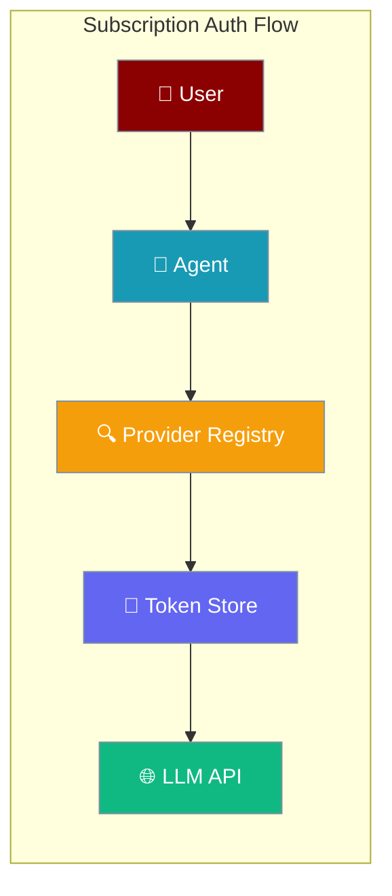
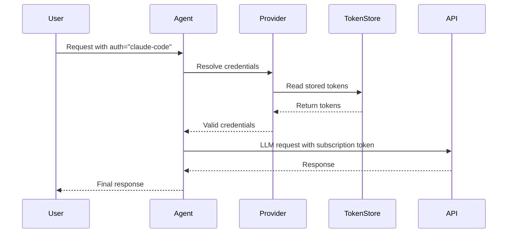
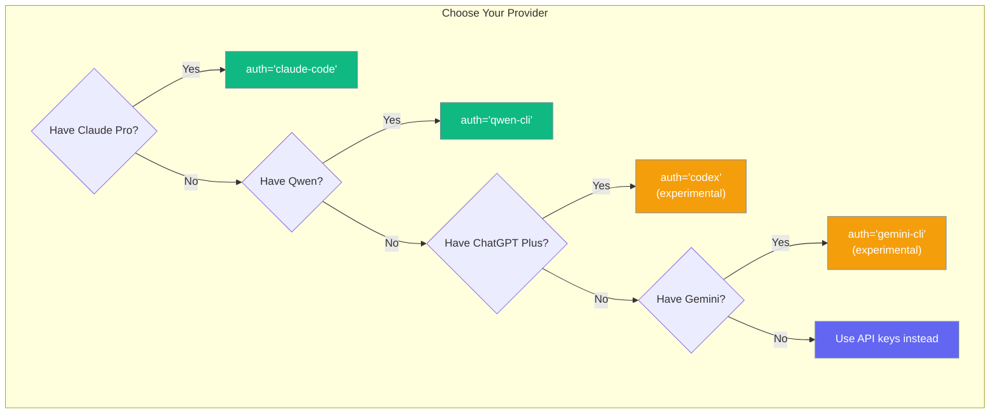

Use the subscription you already pay for — Claude Pro, Qwen CLI, etc. — to power your Agent without a separate API key.

```python
from praisonaiagents import Agent

agent = Agent(
    name="assistant",
    instructions="You are helpful.",
    llm="claude-haiku-4-5",
    auth="claude-code",
)
agent.start("Hello")
```



## Quick Start

<Steps>
  <Step title="Login to CLI">
    `claude /login` (Claude Pro) — or `qwen login`
  </Step>
  <Step title="Use in Agent">
    ```python
    from praisonaiagents import Agent

    agent = Agent(
        name="assistant",
        instructions="You are helpful.",
        llm="claude-haiku-4-5",
        auth="claude-code",
    )
    agent.start("Hello")
    ```
  </Step>
</Steps>

## How It Works

Subscription Auth enables agents to use your existing subscriptions without requiring separate API keys.



## Supported Providers

Which subscription auth provider should you use?



| `auth=` value | Subscription | Token source | Status |
|---|---|---|---|
| `claude-code` | Claude Pro | `~/.claude/.credentials.json` or macOS Keychain | ✅ **Working** |
| `qwen-cli` | Qwen | `~/.qwen/oauth_creds.json` | ✅ **Working** |
| `codex` | ChatGPT Plus | `~/.codex/auth.json` | ⚠️ **Experimental** |
| `gemini-cli` | Gemini | `~/.gemini/oauth_creds.json` | ⚠️ **Experimental** |

<Warning>
**Experimental Status**: `codex` and `gemini-cli` providers are registered but currently raise `AuthError` because they need custom API transports. These will be supported in future releases once proper transport layers are implemented.
</Warning>

## Common Patterns

### Telegram bot using your Claude subscription

```python
from praisonaiagents import Agent
from praisonai.bots import Bot

agent = Agent(
    name="claude-bot",
    instructions="You are a helpful Telegram bot.",
    llm="claude-haiku-4-5",
    auth="claude-code",
)

bot = Bot("telegram", agent=agent)
bot.run()
```

### Switching between API key and subscription

```python
from praisonaiagents import Agent

# Use your Claude Pro subscription
agent_subscription = Agent(
    name="claude-subscription",
    llm="claude-haiku-4-5",
    auth="claude-code",  # Uses your subscription
)

# Use API key (traditional method — set ANTHROPIC_API_KEY)
agent_api_key = Agent(
    name="claude-api",
    llm="claude-haiku-4-5",
)

# Both work identically
response1 = agent_subscription.start("Hello")
response2 = agent_api_key.start("Hello")
```

### Custom provider (advanced)

```python
from praisonaiagents.auth import register_subscription_provider, SubscriptionCredentials

class MyAuth:
    def resolve_credentials(self) -> SubscriptionCredentials:
        return SubscriptionCredentials(
            api_key="my-token",
            base_url="https://my-provider.com/v1",
            headers={"x-custom": "value"},
        )
    
    def refresh(self) -> SubscriptionCredentials:
        return self.resolve_credentials()
    
    def headers_for(self, base_url: str, model: str) -> dict:
        return {"user-agent": "my-provider/1.0.0"}

register_subscription_provider("mine", lambda: MyAuth())
```

## Configuration Options

<Card title="SubscriptionCredentials API Reference" icon="code" href="/docs/sdk/reference/typescript/classes/AuthProfile">
  Configuration options and types for subscription credentials
</Card>

## Best Practices

<AccordionGroup>
  <Accordion title="Token Security">
    Tokens are read locally from your CLI tools and never persisted by PraisonAI. They stay in memory only during agent execution and are automatically refreshed when needed.
  </Accordion>
  
  <Accordion title="Backward Compatibility">
    Existing agents using API keys continue to work unchanged. Setting `auth=` is completely optional and doesn't affect agents that don't use it.
  </Accordion>
  
  <Accordion title="Auto-Refresh Behavior">
    Claude Pro tokens are automatically refreshed when they expire within 60 seconds. The refresh happens transparently without user intervention using stored refresh tokens.
  </Accordion>
  
  <Accordion title="Don't commit token files">
    Never commit `~/.claude/.credentials.json`, `~/.qwen/oauth_creds.json`, or similar files to version control. These contain sensitive authentication data.
  </Accordion>
</AccordionGroup>

## Troubleshooting

### "No Claude Code credentials found"

**Solution**: Install Claude Code CLI and run `claude /login` to authenticate with your Claude Pro account.

```bash
# Install Claude Code (if not already installed)
# Then login with your Claude Pro account
claude /login
```

### macOS Keychain prompt every run

**Solution**: Grant `security` command access to avoid repeated prompts. This is handled automatically by the system after first access.

### Anthropic 500 errors

**Issue**: OAuth tokens require specific headers that are automatically included.

**What PraisonAI does**: Automatically sends required headers:
- `user-agent: claude-cli/<version> (external, cli)`
- `x-app: cli`
- `anthropic-beta: interleaved-thinking-2025-05-14,fine-grained-tool-streaming-2025-05-14,context-1m-2025-08-07,claude-code-20250219`

### Codex / Gemini raise `AuthError`

**Expected behavior**: These providers are experimental and not yet usable. They're registered for future use but currently raise `AuthError` with messages about needing custom transports.

### Token Detection Priority (Claude Pro)

Tokens are resolved in this exact order:

1. `ANTHROPIC_TOKEN` environment variable
2. `CLAUDE_CODE_OAUTH_TOKEN` environment variable  
3. macOS Keychain (`Claude Code-credentials`)
4. `~/.claude/.credentials.json` file

### Environment Variable Override

You can disable subscription auth entirely (planned):

```bash
export PRAISONAI_DISABLE_SUBSCRIPTION_AUTH=1
```

## Related

<CardGroup cols={2}>
  <Card title="Agent Configuration" icon="user" href="/docs/features/agents">
    Learn about agent configuration and setup
  </Card>
  <Card title="LLM Providers" icon="plug" href="/docs/models">
    Configure different LLM providers and endpoints
  </Card>
</CardGroup>