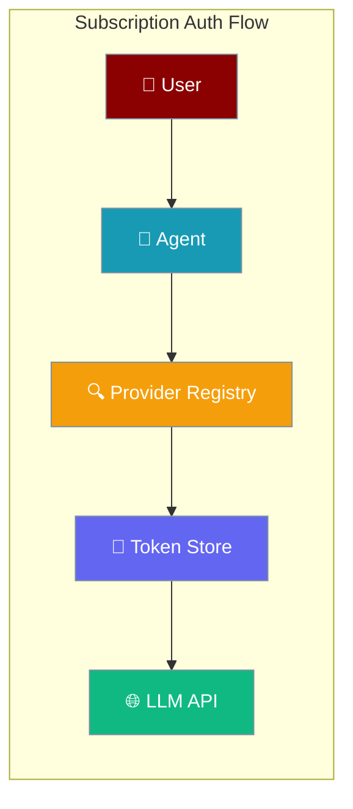
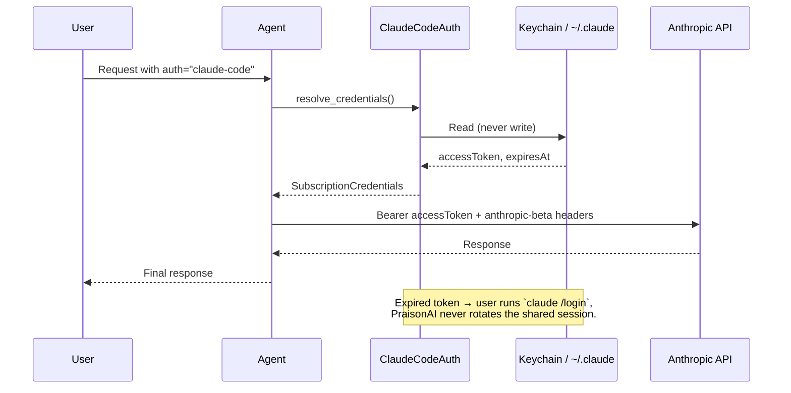
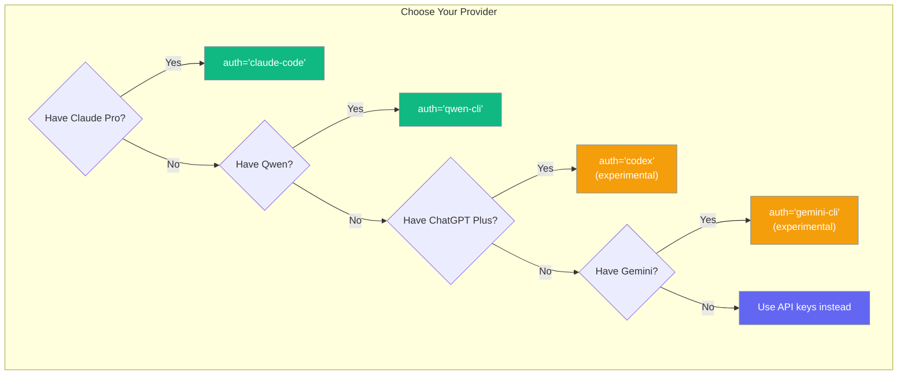
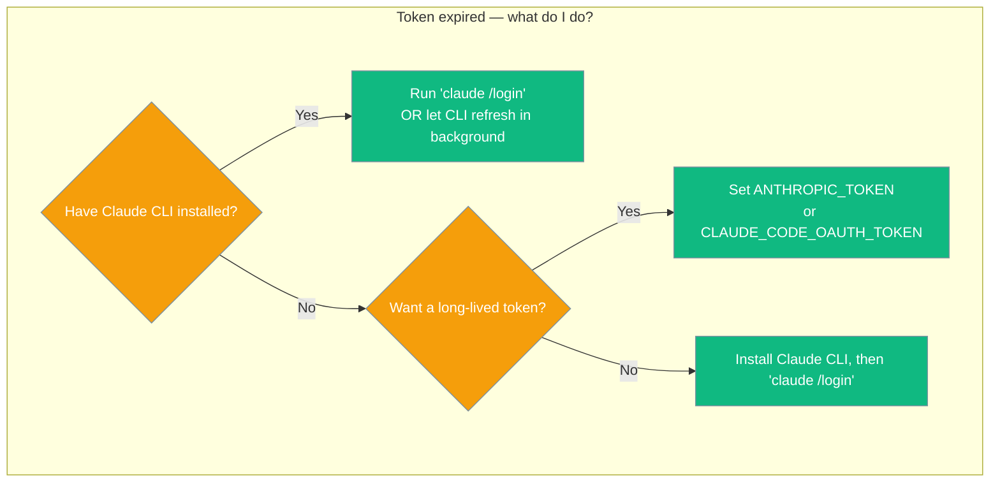

Use the subscription you already pay for — Claude Pro, Qwen CLI, etc. — to power your Agent without a separate API key.

```python
from praisonaiagents import Agent

agent = Agent(
    name="assistant",
    instructions="You are helpful.",
    llm="claude-haiku-4-5",
    auth="claude-code",
)
agent.start("Hello")
```

The user chats via the agent; subscription auth supplies credentials instead of a raw API key.

<Info>
PraisonAI reads Claude Code credentials in **read-only** mode. Token refresh is handled by the Claude CLI, not PraisonAI — this avoids rotating the shared refresh token and breaking `claude` (or any other tool on the same subscription). If your token has expired, run `claude /login` to re-authenticate; PraisonAI will not refresh it for you.
</Info>



## Quick Start

<Steps>
  <Step title="Login to CLI">
    `claude /login` (Claude Pro) — or `qwen login`
  </Step>
  <Step title="Use in Agent">
    ```python
    from praisonaiagents import Agent

    agent = Agent(
        name="assistant",
        instructions="You are helpful.",
        llm="claude-haiku-4-5",
        auth="claude-code",
    )
    agent.start("Hello")
    ```
  </Step>
</Steps>

## How It Works

Subscription Auth enables agents to use your existing subscriptions without requiring separate API keys.

<Warning>
`auth="claude-code"` shares your Claude subscription with any other tool on the same machine that reads the same Keychain entry or `~/.claude/.credentials.json` — the `claude` CLI itself, other agent frameworks, etc. PraisonAI does not write to that shared credential store. If your token expires, refresh it once via `claude /login` (or let Claude CLI keep it fresh) — do not expect PraisonAI to rotate it for you.
</Warning>



## Supported Providers

Which subscription auth provider should you use?



| `auth=` value | Subscription | Token source | Status |
|---|---|---|---|
| `claude-code` | Claude Pro | `~/.claude/.credentials.json` or macOS Keychain | ✅ **Working** |
| `qwen-cli` | Qwen | `~/.qwen/oauth_creds.json` | ✅ **Working** |
| `codex` | ChatGPT Plus | `~/.codex/auth.json` | ⚠️ **Experimental** |
| `gemini-cli` | Gemini | `~/.gemini/oauth_creds.json` | ⚠️ **Experimental** |

<Warning>
**Experimental Status**: `codex` and `gemini-cli` providers are registered but currently raise `AuthError` because they need custom API transports. These will be supported in future releases once proper transport layers are implemented.
</Warning>

## Common Patterns

### Choose your refresh path

When a `claude-code` token expires, pick the action that matches your setup — PraisonAI never rotates it for you.



### Telegram bot using your Claude subscription

```python
from praisonaiagents import Agent
from praisonai.bots import Bot

agent = Agent(
    name="claude-bot",
    instructions="You are a helpful Telegram bot.",
    llm="claude-haiku-4-5",
    auth="claude-code",
)

bot = Bot("telegram", agent=agent)
bot.run()
```

### Switching between API key and subscription

```python
from praisonaiagents import Agent

# Use your Claude Pro subscription
agent_subscription = Agent(
    name="claude-subscription",
    llm="claude-haiku-4-5",
    auth="claude-code",  # Uses your subscription
)

# Use API key (traditional method — set ANTHROPIC_API_KEY)
agent_api_key = Agent(
    name="claude-api",
    llm="claude-haiku-4-5",
)

# Both work identically
response1 = agent_subscription.start("Hello")
response2 = agent_api_key.start("Hello")
```

### Custom provider (advanced)

```python
from praisonaiagents.auth import register_subscription_provider, SubscriptionCredentials

class MyAuth:
    def resolve_credentials(self) -> SubscriptionCredentials:
        return SubscriptionCredentials(
            api_key="my-token",
            base_url="https://my-provider.com/v1",
            headers={"x-custom": "value"},
        )
    
    def refresh(self) -> SubscriptionCredentials:
        return self.resolve_credentials()
    
    def headers_for(self, base_url: str, model: str) -> dict:
        return {"user-agent": "my-provider/1.0.0"}

register_subscription_provider("mine", lambda: MyAuth())
```

## Configuration Options

<Card title="SubscriptionCredentials API Reference" icon="code" href="/docs/sdk/reference/typescript/classes/AuthProfile">
  Configuration options and types for subscription credentials
</Card>

## Best Practices

<AccordionGroup>
  <Accordion title="Token Security">
    Tokens are read locally from your CLI tools and never persisted by PraisonAI. They stay in memory only during agent execution. PraisonAI does not refresh or write them back — see "Read-only for claude-code" below.
  </Accordion>
  
  <Accordion title="Backward Compatibility">
    Existing agents using API keys continue to work unchanged. Setting `auth=` is completely optional and doesn't affect agents that don't use it.
  </Accordion>
  
  <Accordion title="Read-only for claude-code">
    PraisonAI reads Claude Code OAuth credentials from macOS Keychain, `~/.claude/.credentials.json`, or the `ANTHROPIC_TOKEN` / `CLAUDE_CODE_OAUTH_TOKEN` env vars, and uses them as-is. It **never** refreshes or persists tokens for `auth="claude-code"`.

    This is deliberate. Anthropic rotates OAuth refresh tokens on every use. If PraisonAI refreshed in-memory without writing back to the Keychain, it would silently invalidate the shared session used by the Claude CLI and any other tool on the same machine.

    When your Keychain token expires, refresh it once via one of these paths — Claude CLI will keep it fresh from then on:
    - Run `claude /login` (interactive), OR
    - Let the Claude CLI run in the background — its own refresh keeps the Keychain entry valid, OR
    - Set `ANTHROPIC_TOKEN` (or `CLAUDE_CODE_OAUTH_TOKEN`) to a long-lived token — env vars take precedence over Keychain/file.

    Programmatic `provider.refresh()` for `claude-code` raises `AuthError` with a message telling you exactly what to do next. This is not a bug — it's the guard that keeps shared sessions safe.
  </Accordion>
  
  <Accordion title="Don't commit token files">
    Never commit `~/.claude/.credentials.json`, `~/.qwen/oauth_creds.json`, or similar files to version control. These contain sensitive authentication data.
  </Accordion>
</AccordionGroup>

## Troubleshooting

### "No Claude Code credentials found"

**Solution**: Install Claude Code CLI and run `claude /login` to authenticate with your Claude Pro account.

```bash
# Install Claude Code (if not already installed)
# Then login with your Claude Pro account
claude /login
```

### `invalid_request_error` on a Claude Code request

**What it means**: This is a genuine client-side error (a malformed request), **not** a retryable auth failure. PraisonAI no longer misclassifies it as an expired-token error, so it surfaces directly instead of being silently retried.

**Solution**: Check the request itself — model name, message shape, or parameters. If you also see auth failures, re-authenticate the shared session:

```bash
claude /login
```

### macOS Keychain prompt every run

**Solution**: Grant `security` command access to avoid repeated prompts. This is handled automatically by the system after first access.

### Anthropic 500 errors

**Issue**: OAuth tokens require specific headers that are automatically included.

**What PraisonAI does**: Automatically sends required headers:
- `user-agent: claude-cli/<version> (external, cli)`
- `x-app: cli`
- `anthropic-beta: interleaved-thinking-2025-05-14,fine-grained-tool-streaming-2025-05-14,claude-code-20250219`

<Note>
`oauth-2025-04-20` is added by `litellm` automatically for OAuth tokens. `context-1m-2025-08-07` was removed in [PR #3332](https://github.com/MervinPraison/PraisonAI/pull/3332) because it is unsupported on many Claude Pro plans and triggered subscription API failures. If you previously relied on it, use a standard API key instead — don't add it back yourself.
</Note>

### Codex / Gemini raise `AuthError`

**Expected behavior**: These providers are experimental and not yet usable. They're registered for future use but currently raise `AuthError` with messages about needing custom transports.

### Token Detection Priority (Claude Pro)

Tokens are resolved in this exact order:

1. `ANTHROPIC_TOKEN` environment variable
2. `CLAUDE_CODE_OAUTH_TOKEN` environment variable  
3. macOS Keychain (`Claude Code-credentials`)
4. `~/.claude/.credentials.json` file

### Environment Variable Override

You can disable subscription auth entirely (planned):

```bash
export PRAISONAI_DISABLE_SUBSCRIPTION_AUTH=1
```

## Related

<CardGroup cols={2}>
  <Card title="Agent Configuration" icon="user" href="/docs/features/agents">
    Learn about agent configuration and setup
  </Card>
  <Card title="LLM Providers" icon="plug" href="/docs/models">
    Configure different LLM providers and endpoints
  </Card>
</CardGroup>