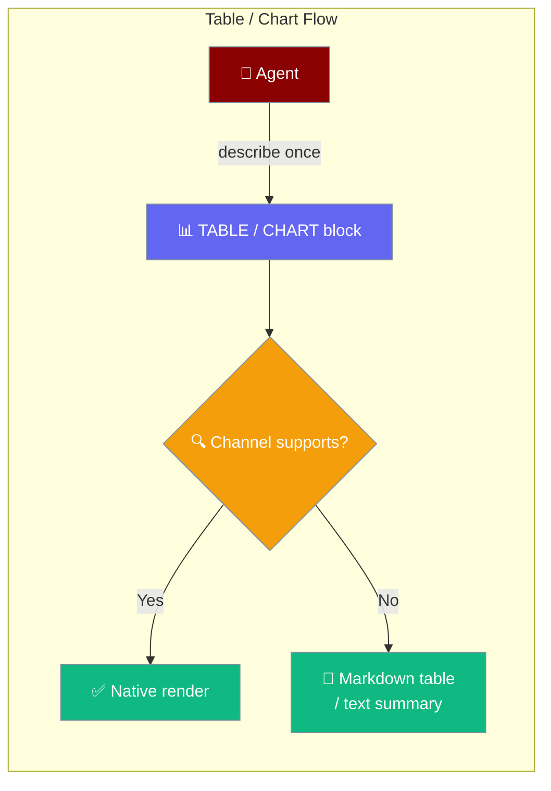
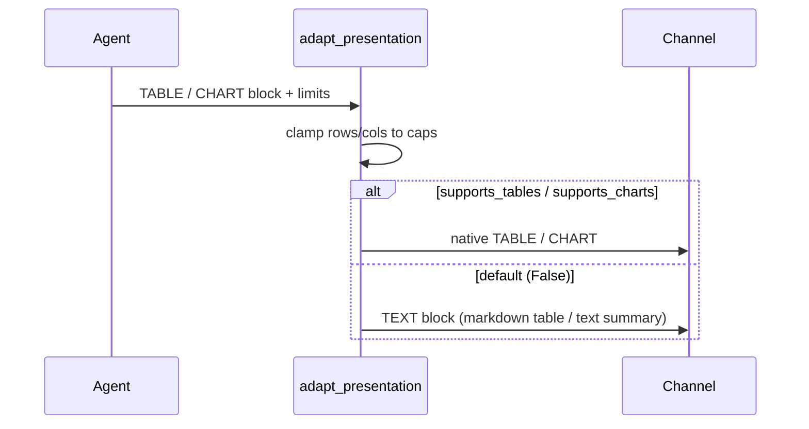

Agents describe tabular or chart data once with a TABLE or CHART block, and every channel renders it natively where supported or degrades deterministically to a markdown table or text summary everywhere else.



## Quick Start

<Steps>
<Step title="Agent returns a table">
An agent returns a `MessagePresentation` with a TABLE block from a tool — pass numbers or ints freely, cells are stringified for you:

```python
from praisonaiagents import Agent
from praisonaiagents.bots import MessagePresentation, PresentationBlock

def sales_table():
    return MessagePresentation(blocks=[
        PresentationBlock.make_text("Weekly sales:"),
        PresentationBlock.make_table(
            columns=["Product", "Units", "Revenue"],
            rows=[
                ["Widget",  120,  1440],
                ["Gadget",   85,  2550],
                ["Gizmo",    42,   630],
            ],
        ),
    ])

agent = Agent(
    name="Sales Reporter",
    instructions="Summarise weekly sales as a table.",
    tools=[sales_table],
)
agent.start("Show me this week's sales")
```
</Step>

<Step title="Add a chart">
A CHART block carries a `chart_kind` and one or more `series`; each series is a `label` plus a list of numeric `points`:

```python
from praisonaiagents.bots import PresentationBlock

PresentationBlock.make_chart(
    chart_kind="bar",
    series=[
        {"label": "Revenue", "points": [1440, 2550, 630]},
        {"label": "Target",  "points": [1500, 2000, 1000]},
    ],
    text="Weekly revenue vs target",
)
```
</Step>
</Steps>

---

## How It Works

A TABLE block clamps to the channel's row and column caps, then either stays a native table or degrades to a markdown table inside a TEXT block. A CHART block stays native where charts are supported, or degrades to a one-line-per-series text summary.



| Block | Native path | Degrade path |
|-------|-------------|--------------|
| TABLE | Native table widget (clamped to `max_table_rows` / `max_table_cols`) | Markdown table via `table_to_markdown`, clamped to `max_text_length` |
| CHART | Native chart/visualisation | Text summary via `chart_to_text`, clamped to `max_text_length` |

**Every channel defaults to off** — Slack, Telegram, Discord, and WhatsApp preset `supports_tables=False` / `supports_charts=False`, so behaviour today is a deterministic markdown/text degrade until a channel opts in.

---

## Configuration Options

### `BlockType` — new members

| Member | Value | Use for |
|--------|-------|---------|
| `TABLE` | `"table"` | Tabular data (columns + rows) |
| `CHART` | `"chart"` | Chart/visualisation (kind + series) |

### `PresentationBlock` — new fields

| Field | Type | Default | Used by |
|-------|------|---------|---------|
| `columns` | `Optional[List[str]]` | `None` | TABLE |
| `rows` | `Optional[List[List[str]]]` | `None` | TABLE |
| `chart_kind` | `Optional[str]` | `None` | CHART |
| `series` | `Optional[List[Dict[str, Any]]]` | `None` | CHART |

### Factories

```python
PresentationBlock.make_table(
    columns: List[str],
    rows: List[List[str]],
) -> PresentationBlock

PresentationBlock.make_chart(
    chart_kind: str,              # "bar" | "line" | "pie" | "area"
    series: List[Dict[str, Any]], # [{"label": str, "points": list[float]}, ...]
    text: Optional[str] = None,   # optional caption/title
) -> PresentationBlock
```

`make_table` coerces every column and cell to `str`, so agents pass numbers or ints freely. Chart `series` items are dicts with `label` (str) and `points` (list of numbers); any extra keys round-trip through `to_dict()` / `from_dict()`.

### `PresentationLimits` — new capability flags

| Field | Type | Default | Description |
|-------|------|---------|-------------|
| `supports_tables` | `bool` | `False` | Channel has a native table widget |
| `supports_charts` | `bool` | `False` | Channel has native chart/visualisation |
| `max_table_rows` | `int` | `50` | Maximum rows in a native TABLE block |
| `max_table_cols` | `int` | `10` | Maximum columns in a native TABLE block |

### Helpers

```python
from praisonaiagents.bots import table_to_markdown, chart_to_text

table_to_markdown(columns: List[str], rows: List[List[str]]) -> str
chart_to_text(chart_kind: Optional[str], series: List[Dict[str, Any]], caption: Optional[str] = None) -> str
```

`table_to_markdown` produces GitHub-flavoured markdown with `|` cells escaped and short rows padded to header width. `chart_to_text` renders `"<Caption or Kind chart>\n<label>: p1, p2, p3\n..."` — deterministic, one line per series.

---

## Common Patterns

**Agent returns a table from a tool** — describe the data once and let the channel pick the best rendering:

```python
from praisonaiagents import Agent
from praisonaiagents.bots import MessagePresentation, PresentationBlock

def sales_table():
    return MessagePresentation(blocks=[
        PresentationBlock.make_table(
            columns=["Product", "Units", "Revenue"],
            rows=[["Widget", 120, 1440], ["Gadget", 85, 2550]],
        ),
    ])

agent = Agent(name="Sales Reporter", instructions="Report sales.", tools=[sales_table])
agent.start("This week's sales")
```

**Chart with caption** — the caption becomes the title on native renders and the first line of the text summary elsewhere:

```python
from praisonaiagents.bots import PresentationBlock

PresentationBlock.make_chart(
    "line",
    series=[{"label": "p95", "points": [120, 118, 130, 125]}],
    text="Latency last 24h",
)
```

**Opt a custom channel into native tables** — return an updated `PresentationLimits` from your channel's capability method:

```python
from praisonaiagents.bots import PresentationLimits

def get_limits() -> PresentationLimits:
    return PresentationLimits(
        supports_tables=True,
        max_table_rows=200,
        max_table_cols=12,
    )
```

---

## Best Practices

<AccordionGroup>
<Accordion title="Keep tables small">
Native widgets typically cap rows well below 50 — set `max_table_rows` on your channel to reflect the true limit so `adapt_presentation` clamps before rendering.
</Accordion>

<Accordion title="Describe data once">
Do not pre-format a markdown table in a TEXT block. Send TABLE / CHART blocks and let each channel pick the best rendering.
</Accordion>

<Accordion title="Charts degrade to summaries, not silence">
Any chart is always readable as text via `chart_to_text`, so you never lose data on plain-text channels.
</Accordion>

<Accordion title="Cells are stringified">
Numbers and booleans are coerced to `str`. For a specific format (currency, %), format the value in your tool before passing it in.
</Accordion>
</AccordionGroup>

---

## Related

<CardGroup cols={2}>
<Card title="Message Presentation" icon="layout" href="/features/message-presentation">
  Attach buttons, menus, and blocks to agent replies
</Card>
<Card title="Channel Capabilities" icon="sliders" href="/features/channel-capabilities">
  What each channel can render natively
</Card>
</CardGroup>
