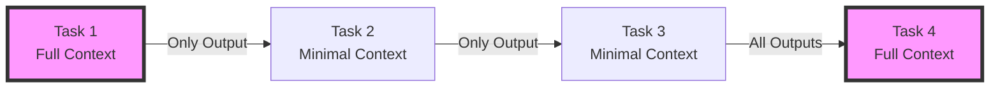

## Overview

Task Context Control allows you to manage how information flows between tasks in your workflows. In long workflows with many steps, passing the entire context forward can lead to token limit issues and irrelevant information cluttering the context. This feature gives you fine-grained control over what information each task receives.



## Quick Start


<Steps>
<Step title="Quick Start">
Control context flow between tasks using the `retain_full_context` parameter:

```python
from praisonaiagents import Agent, Task, AgentTeam

# Create an agent
processor = Agent(
    name="DataProcessor",
    role="Data analysis expert",
    goal="Process and analyze data efficiently"
)

# Task with minimal context (only passes its output)
task1 = Task(
    name="extract_data",
    description="Extract data from source files",
    expected_output="Extracted data in JSON format",
    agent=processor,
    retain_full_context=False  # Only pass this task's output forward
)

# Task that needs full historical context
task2 = Task(
    name="analyze_trends",
    description="Analyze trends across all previous data",
    expected_output="Comprehensive trend analysis",
    agent=processor,
    retain_full_context=True  # Include all previous outputs
)

# Create and run workflow
agents = AgentTeam(
    agents=[processor],
    tasks=[task1, task2],
    process="sequential"
)

result = agents.start()
```
</Step>
</Steps>


## Best Practices

<AccordionGroup>
  <Accordion title="Start simple">
    Enable the feature with a single parameter before adding configuration. Verify it works, then layer in options.
  </Accordion>
  <Accordion title="Use environment variables for secrets">
    Never hardcode API keys or tokens. Use `os.getenv("KEY_NAME")` to read from environment variables.
  </Accordion>
  <Accordion title="Test with minimal examples first">
    Copy the Quick Start example, run it, then extend it. This confirms your environment is set up correctly.
  </Accordion>
  <Accordion title="Check the logs">
    Set `verbose=True` on your agent to see detailed execution logs when debugging unexpected behavior.
  </Accordion>
</AccordionGroup>

## Related

<CardGroup cols={2}>
  <Card title="Features Overview" icon="grid-2" href="/docs/features">
    Browse all PraisonAI features
  </Card>
  <Card title="Quick Start" icon="rocket" href="/docs/introduction">
    Get started with PraisonAI agents
  </Card>
</CardGroup>
