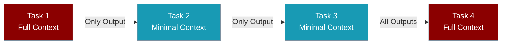

Control how much prior task output each step receives — pass only what the next task needs instead of the full conversation history.

```python
from praisonaiagents import Agent, Task, AgentTeam

processor = Agent(name="Processor", instructions="Process data efficiently")

extract = Task(
    name="extract",
    description="Extract data from source files",
    expected_output="Extracted data summary",
    agent=processor,
    retain_full_context=False,  # Only this task's output flows forward
)

analyse = Task(
    name="analyse",
    description="Analyse trends across all previous outputs",
    expected_output="Trend analysis",
    agent=processor,
    retain_full_context=True,  # Include all prior task outputs
)

team = AgentTeam(agents=[processor], tasks=[extract, analyse], process="sequential")
team.start()
```



## Quick Start

<Steps>
<Step title="Create tasks with context control">
```python
from praisonaiagents import Agent, Task, AgentTeam

processor = Agent(
    name="DataProcessor",
    instructions="Process and analyse data efficiently",
)

task1 = Task(
    name="extract_data",
    description="Extract data from source files",
    expected_output="Extracted data in JSON format",
    agent=processor,
    retain_full_context=False,
)

task2 = Task(
    name="analyse_trends",
    description="Analyse trends across all previous data",
    expected_output="Comprehensive trend analysis",
    agent=processor,
    retain_full_context=True,
)

team = AgentTeam(agents=[processor], tasks=[task1, task2], process="sequential")
team.start()
```
</Step>
</Steps>

## Configuration Options

| Option | Type | Default | Description |
|--------|------|---------|-------------|
| `retain_full_context` | `bool` | `False` | When `True`, pass all prior task outputs; when `False`, pass only the immediate predecessor's output |

## Common Patterns

### Pipeline pattern

Each step passes only its own output forward — ideal for large intermediate data:

```python
pipeline_tasks = [
    Task(name="fetch", description="Fetch data", agent=fetcher, retain_full_context=False),
    Task(name="validate", description="Validate format", agent=validator, retain_full_context=False),
    Task(name="transform", description="Transform data", agent=transformer, retain_full_context=False),
    Task(name="store", description="Store in database", agent=storer, retain_full_context=False),
]
```

### Checkpoint pattern

Periodically retain full context so a later task can see the full history:

```python
checkpoint_interval = 5
tasks = []

for i in range(20):
    is_checkpoint = (i % checkpoint_interval == 0)
    tasks.append(Task(
        name=f"task_{i}",
        description=f"Process item {i}",
        agent=processor,
        retain_full_context=is_checkpoint,
    ))
```

### Summarisation checkpoints

Insert a summary task that reads full context, then continue with minimal context:

```python
summary_task = Task(
    name="summarise_progress",
    description="Summarise all previous outputs concisely",
    agent=summariser,
    retain_full_context=True,
)

next_task = Task(
    name="continue",
    description="Continue from the summary",
    agent=processor,
    retain_full_context=False,
)
```

## Best Practices

<AccordionGroup>
<Accordion title="Plan context flow upfront">
Map which tasks need full history versus only the previous output before running long workflows. Data-loading steps usually need `retain_full_context=False`; final synthesis steps often need `True`.
</Accordion>

<Accordion title="Use checkpoints in long pipelines">
For workflows with many steps, add periodic summary or checkpoint tasks with `retain_full_context=True` so downstream tasks can recover context without carrying every intermediate payload.
</Accordion>

<Accordion title="Avoid token limit errors">
If later tasks hit context limits, set `retain_full_context=False` on early heavy tasks and pass summaries instead of raw data.
</Accordion>

<Accordion title="Combine with context compaction">
Pair selective retention with [Context Window Management](/docs/features/context-window-management) for automatic overflow protection on agents.
</Accordion>
</AccordionGroup>

## Related

<CardGroup cols={2}>
<Card title="Context Window Management" icon="window-maximize" href="/docs/features/context-window-management">
  Automatic token management for agents
</Card>
<Card title="Workflow Validation" icon="circle-check" href="/docs/features/workflow-validation">
  Validation loops with controlled context
</Card>
</CardGroup>
