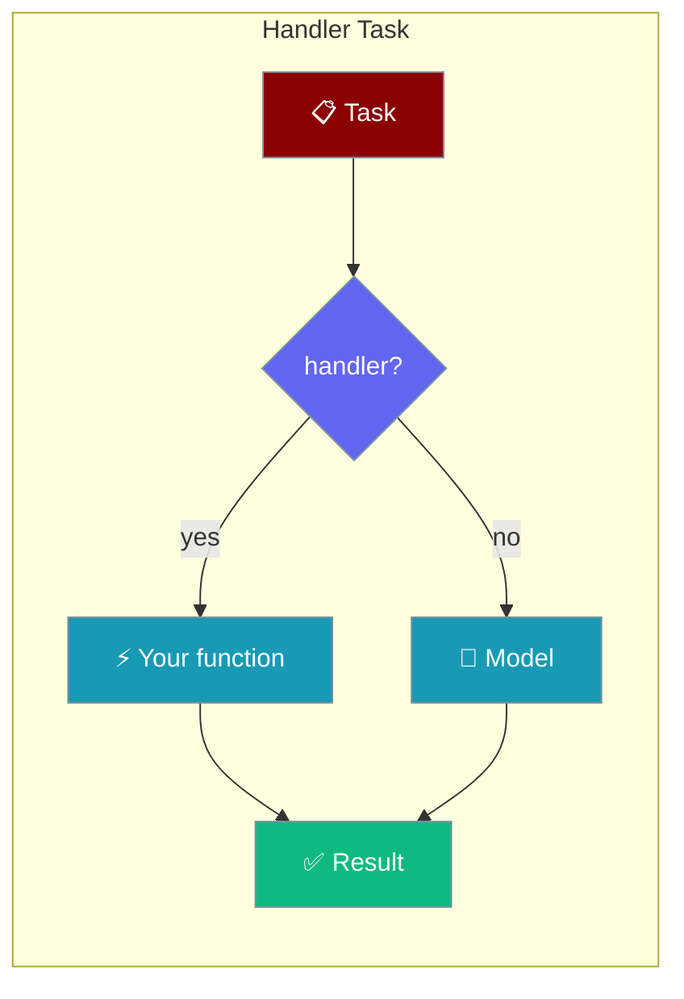
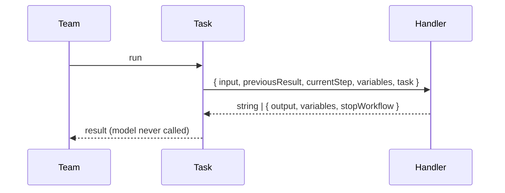

A task `handler` runs your own function in place of the model — for math, lookups, or calling existing code.



## Quick Start

<Steps>

<Step title="Run a function instead of the model">
```typescript
import { Agent, Team, Task } from 'praisonai';

const team = new Team({
  agents: [new Agent({ instructions: 'help' })],
  tasks: [new Task({
    name: 'compute',
    description: 'add the numbers',
    handler: () => 'computed without an LLM'
  })]
});

const results = await team.start();
console.log(results[0]); // "computed without an LLM" — the model was never called
```
</Step>

<Step title="Read the workflow context">
```typescript
new Task({
  name: 'compute',
  description: 'add the numbers',
  handler: ({ input, previousResult, currentStep, variables, task }) => {
    return `step ${currentStep} saw ${previousResult ?? 'nothing yet'}`;
  }
});
```
</Step>

</Steps>

---

## What the Handler Receives

The handler is called with one object.

| Field | Description |
|-------|-------------|
| `input` | The prompt this task would have sent the model. |
| `previousResult` | The output of the task before this one. |
| `currentStep` | The current task's name. |
| `variables` | Run variables, including any a handler published earlier. |
| `task` | The `Task` instance itself. |

---

## What the Handler Returns

Return a string, or an object for more control.

| Return | Effect |
|--------|--------|
| `string` | Used as the task output. Publishes no variables. |
| `{ output }` | The task output. |
| `{ variables }` | Merged into run variables for later `{{placeholder}}` substitution. |
| `{ stopWorkflow: true }` | Ends the run after this task. |
| `{ success, error }` | Marks the task failed. |

### Publish variables for later prompts

Variables a handler publishes fill `{{placeholder}}` slots in later tasks.

```typescript
const team = new Team({
  agents: [member],
  tasks: [
    new Task({
      name: 'gather',
      description: 'gather',
      handler: () => ({ output: 'raw data', variables: { topic: 'whales' } })
    }),
    new Task({ name: 'write', description: 'write about {{topic}}' })
  ]
});

await team.start();
// The second task's prompt becomes "write about whales"
```

<Note>
A handler that returns a plain **string** publishes nothing — `{{topic}}` stays unfilled. Return `{ output, variables }` to publish.
</Note>

### Stop the workflow

```typescript
new Task({
  name: 'halt',
  description: 'halt',
  handler: () => ({ output: 'stopping', stopWorkflow: true })
});
// Any task after this one never starts.
```

### A throwing handler fails only its task

```typescript
new Task({
  name: 'boom',
  description: 'boom',
  handler: () => { throw new Error('handler exploded'); }
});
// This task is marked failed; unrelated tasks still run.
```

---

## How It Works



---

## Best Practices

<AccordionGroup>
  <Accordion title="Use handlers for deterministic work">
    Math, database lookups, and API calls belong in a handler, not a prompt.
  </Accordion>

  <Accordion title="Publish variables to steer later prompts">
    Return `{ output, variables }` so downstream `{{placeholder}}` slots fill in.
  </Accordion>

  <Accordion title="Fail loudly, stop deliberately">
    Throw to fail one task; return `{ stopWorkflow: true }` to end the whole run.
  </Accordion>
</AccordionGroup>

---

## Related

<CardGroup cols={2}>
  <Card title="Tasks" icon="list-check" href="/js/tasks">
    All task options
  </Card>
  <Card title="Routing" icon="route" href="/js/routing">
    Branch between tasks
  </Card>
</CardGroup>
